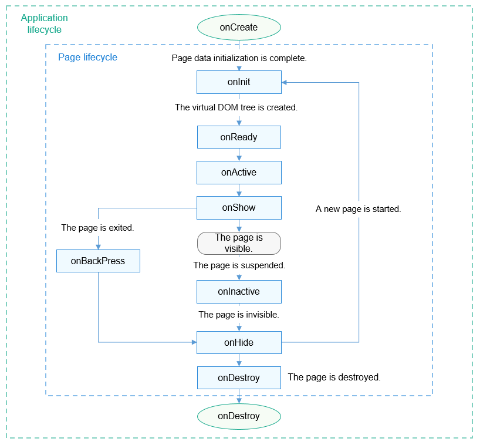

# Lifecycle

## Application lifecycle

You can define the following application lifecycle methods in the **app.js** file.

| Attribute     | Type      | Description    | Called When          |
| --------- | ---------- | -------- | ------------------ |
| onCreate  | () => void | Listens for application creation.| The application is created.|
| onDestroy | () => void | Listens for application destruction.| The application exits.|

## Page Lifecycle

You can define the following page lifecycle functions in the **.js** file of the page.

> **NOTE**
>
> To avoid affecting the page switching performance, do not perform complex, time-consuming operations in a lifecycle function.

| Attribute     | Type      | Description        | Called When                              |
| --------- | ---------- | ------------ | -------------------------------------- |
| onInit    | () => void | Listens for page initialization.  | Page initialization is complete. This function is called only once in the page lifecycle.|
| onReady   | () => void | Listens for page creation.| A page is created. This function is called only once in the page lifecycle.      |
| onShow    | () => void | Listens for page display.    | The page is displayed.                      |
| onHide    | () => void | Listens for page hiding.    | The page is hidden.                      |
| onDestroy | () => void | Listens for page destruction.    | The page is destroyed.                      |

The lifecycle functions of page A are called in the following sequence:

- Open page A: Call onInit(), onReady(), and onShow() in sequence.
- Open page B on page A: onHide() -> onDestroy()
- Go back to page A from page B: onInit() -> onReady() -> onShow()
- Exit page A: onHide() -> onDestroy()
- Hide page A: onHide()
- Show background page A on the foreground: onShow()

