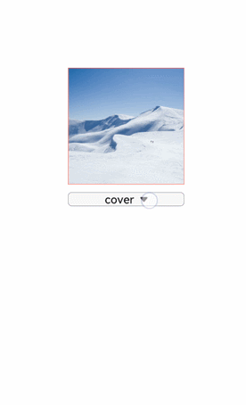

# image<a name="EN-US_TOPIC_0000001173164699"></a>

The  **<image\>**  component is used to render and display images.

## Child Component<a name="section9288143101012"></a>

Not supported

## Attributes<a name="section2907183951110"></a>

In addition to the attributes in  [Universal Attributes](js-components-common-attributes.md), the following attributes are supported.

<a name="table20633101642315"></a>
<table><thead align="left"><tr id="row663331618238"><th class="cellrowborder" valign="top" width="23.119999999999997%" id="mcps1.1.6.1.1"><p id="aa872998ac2d84843a3c5161889afffef"><a name="aa872998ac2d84843a3c5161889afffef"></a><a name="aa872998ac2d84843a3c5161889afffef"></a>Name</p>
</th>
<th class="cellrowborder" valign="top" width="23.119999999999997%" id="mcps1.1.6.1.2"><p id="ab2111648ee0e4f6d881be8954e7acaab"><a name="ab2111648ee0e4f6d881be8954e7acaab"></a><a name="ab2111648ee0e4f6d881be8954e7acaab"></a>Type</p>
</th>
<th class="cellrowborder" valign="top" width="10.48%" id="mcps1.1.6.1.3"><p id="ab377d1c90900478ea4ecab51e9a058af"><a name="ab377d1c90900478ea4ecab51e9a058af"></a><a name="ab377d1c90900478ea4ecab51e9a058af"></a>Default Value</p>
</th>
<th class="cellrowborder" valign="top" width="7.5200000000000005%" id="mcps1.1.6.1.4"><p id="p824610360217"><a name="p824610360217"></a><a name="p824610360217"></a>Mandatory</p>
</th>
<th class="cellrowborder" valign="top" width="35.76%" id="mcps1.1.6.1.5"><p id="a1d574a0044ed42ec8a2603bc82734232"><a name="a1d574a0044ed42ec8a2603bc82734232"></a><a name="a1d574a0044ed42ec8a2603bc82734232"></a>Description</p>
</th>
</tr>
</thead>
<tbody><tr id="row10711153415392"><td class="cellrowborder" valign="top" width="23.119999999999997%" headers="mcps1.1.6.1.1 "><p id="p13851942163912"><a name="p13851942163912"></a><a name="p13851942163912"></a>src</p>
</td>
<td class="cellrowborder" valign="top" width="23.119999999999997%" headers="mcps1.1.6.1.2 "><p id="p53851422390"><a name="p53851422390"></a><a name="p53851422390"></a>string</p>
</td>
<td class="cellrowborder" valign="top" width="10.48%" headers="mcps1.1.6.1.3 "><p id="p193856420395"><a name="p193856420395"></a><a name="p193856420395"></a>-</p>
</td>
<td class="cellrowborder" valign="top" width="7.5200000000000005%" headers="mcps1.1.6.1.4 "><p id="p23851942103915"><a name="p23851942103915"></a><a name="p23851942103915"></a>No</p>
</td>
<td class="cellrowborder" valign="top" width="35.76%" headers="mcps1.1.6.1.5 "><p id="p4386542163913"><a name="p4386542163913"></a><a name="p4386542163913"></a><span id="ph1386114233917"><a name="ph1386114233917"></a><a name="ph1386114233917"></a>Image path, which supports local paths. The supported image formats include PNG, JPG, BMP, SVG, and GIF.</span></p>
<p id="p2020265093811"><a name="p2020265093811"></a><a name="p2020265093811"></a>Base64 string<sup id="sup792414482411"><a name="sup792414482411"></a><a name="sup792414482411"></a>6+</sup> is supported. The format is data:image/[png | jpeg | bmp | webp];base64, [base64 data],, where [base64 data] is a Base64 string.</p>
<p id="p158689315419"><a name="p158689315419"></a><a name="p158689315419"></a>The path prefix of <strong id="b48648261193"><a name="b48648261193"></a><a name="b48648261193"></a>dataability://</strong> is supported, which allows access to the image path provided by the Data ability.</p>
</td>
</tr>
<tr id="row871123253917"><td class="cellrowborder" valign="top" width="23.119999999999997%" headers="mcps1.1.6.1.1 "><p id="p11386134218396"><a name="p11386134218396"></a><a name="p11386134218396"></a>alt</p>
</td>
<td class="cellrowborder" valign="top" width="23.119999999999997%" headers="mcps1.1.6.1.2 "><p id="p338613422396"><a name="p338613422396"></a><a name="p338613422396"></a>string</p>
</td>
<td class="cellrowborder" valign="top" width="10.48%" headers="mcps1.1.6.1.3 "><p id="p9386142203914"><a name="p9386142203914"></a><a name="p9386142203914"></a>-</p>
</td>
<td class="cellrowborder" valign="top" width="7.5200000000000005%" headers="mcps1.1.6.1.4 "><p id="p18386124213913"><a name="p18386124213913"></a><a name="p18386124213913"></a>No</p>
</td>
<td class="cellrowborder" valign="top" width="35.76%" headers="mcps1.1.6.1.5 "><p id="p8386194283917"><a name="p8386194283917"></a><a name="p8386194283917"></a>Placeholder image displayed during image loading.</p>
</td>
</tr>
</tbody>
</table>

## Styles<a name="section45171131134215"></a>

In addition to the styles in  [Universal Styles](js-components-common-styles.md), the following style attributes are supported.

<a name="table3635337165618"></a>
<table><thead align="left"><tr id="row163523745618"><th class="cellrowborder" valign="top" width="23.16768323167683%" id="mcps1.1.6.1.1"><p id="p763583711569"><a name="p763583711569"></a><a name="p763583711569"></a>Name</p>
</th>
<th class="cellrowborder" valign="top" width="20.427957204279572%" id="mcps1.1.6.1.2"><p id="p76351837135618"><a name="p76351837135618"></a><a name="p76351837135618"></a>Type</p>
</th>
<th class="cellrowborder" valign="top" width="8.869113088691131%" id="mcps1.1.6.1.3"><p id="p1963543714562"><a name="p1963543714562"></a><a name="p1963543714562"></a>Default Value</p>
</th>
<th class="cellrowborder" valign="top" width="7.519248075192481%" id="mcps1.1.6.1.4"><p id="p163513712567"><a name="p163513712567"></a><a name="p163513712567"></a>Mandatory</p>
</th>
<th class="cellrowborder" valign="top" width="40.01599840015999%" id="mcps1.1.6.1.5"><p id="p16635113735617"><a name="p16635113735617"></a><a name="p16635113735617"></a>Description</p>
</th>
</tr>
</thead>
<tbody><tr id="row13635143745613"><td class="cellrowborder" valign="top" width="23.16768323167683%" headers="mcps1.1.6.1.1 "><p id="p063616375563"><a name="p063616375563"></a><a name="p063616375563"></a>object-fit</p>
</td>
<td class="cellrowborder" valign="top" width="20.427957204279572%" headers="mcps1.1.6.1.2 "><p id="p563673711568"><a name="p563673711568"></a><a name="p563673711568"></a>string</p>
</td>
<td class="cellrowborder" valign="top" width="8.869113088691131%" headers="mcps1.1.6.1.3 "><p id="p1763616378564"><a name="p1763616378564"></a><a name="p1763616378564"></a>cover</p>
</td>
<td class="cellrowborder" valign="top" width="7.519248075192481%" headers="mcps1.1.6.1.4 "><p id="p1636537105617"><a name="p1636537105617"></a><a name="p1636537105617"></a>No</p>
</td>
<td class="cellrowborder" valign="top" width="40.01599840015999%" headers="mcps1.1.6.1.5 "><p id="p186361237165612"><a name="p186361237165612"></a><a name="p186361237165612"></a>Image scale type. For details about available values, see <a href="#table175851535113711">Types of the object-fit style</a>. The SVG format is not supported.</p>
</td>
</tr>
<tr id="row10636173719564"><td class="cellrowborder" valign="top" width="23.16768323167683%" headers="mcps1.1.6.1.1 "><p id="p26361237195610"><a name="p26361237195610"></a><a name="p26361237195610"></a>match-text-direction</p>
</td>
<td class="cellrowborder" valign="top" width="20.427957204279572%" headers="mcps1.1.6.1.2 "><p id="p563653795612"><a name="p563653795612"></a><a name="p563653795612"></a>boolean</p>
</td>
<td class="cellrowborder" valign="top" width="8.869113088691131%" headers="mcps1.1.6.1.3 "><p id="p1636193725615"><a name="p1636193725615"></a><a name="p1636193725615"></a>false</p>
</td>
<td class="cellrowborder" valign="top" width="7.519248075192481%" headers="mcps1.1.6.1.4 "><p id="p10636203725617"><a name="p10636203725617"></a><a name="p10636203725617"></a>No</p>
</td>
<td class="cellrowborder" valign="top" width="40.01599840015999%" headers="mcps1.1.6.1.5 "><p id="p176361037175612"><a name="p176361037175612"></a><a name="p176361037175612"></a>Whether image orientation changes with the text direction. The SVG format is not supported.</p>
</td>
</tr>
<tr id="row17636037135618"><td class="cellrowborder" valign="top" width="23.16768323167683%" headers="mcps1.1.6.1.1 "><p id="p763614376564"><a name="p763614376564"></a><a name="p763614376564"></a>fit-original-size</p>
</td>
<td class="cellrowborder" valign="top" width="20.427957204279572%" headers="mcps1.1.6.1.2 "><p id="p18636103795617"><a name="p18636103795617"></a><a name="p18636103795617"></a>boolean</p>
</td>
<td class="cellrowborder" valign="top" width="8.869113088691131%" headers="mcps1.1.6.1.3 "><p id="p14636143719565"><a name="p14636143719565"></a><a name="p14636143719565"></a>false</p>
</td>
<td class="cellrowborder" valign="top" width="7.519248075192481%" headers="mcps1.1.6.1.4 "><p id="p196362371564"><a name="p196362371564"></a><a name="p196362371564"></a>No</p>
</td>
<td class="cellrowborder" valign="top" width="40.01599840015999%" headers="mcps1.1.6.1.5 "><p id="p166364377563"><a name="p166364377563"></a><a name="p166364377563"></a>Whether the <strong id="b130129182317"><a name="b130129182317"></a><a name="b130129182317"></a>&lt;image&gt;</strong> component adapts to the image source size when the width and height are not set. If this attribute is set to <strong id="b93812952317"><a name="b93812952317"></a><a name="b93812952317"></a>true</strong>, the <strong id="b14391910238"><a name="b14391910238"></a><a name="b14391910238"></a>object-fit</strong> attribute does not take effect. SVG images do not support this attribute.</p>
</td>
</tr>
<tr id="row12824651173817"><td class="cellrowborder" valign="top" width="23.16768323167683%" headers="mcps1.1.6.1.1 "><p id="p782418514382"><a name="p782418514382"></a><a name="p782418514382"></a>object-position<sup id="sup2034121882110"><a name="sup2034121882110"></a><a name="sup2034121882110"></a>7+</sup></p>
</td>
<td class="cellrowborder" valign="top" width="20.427957204279572%" headers="mcps1.1.6.1.2 "><p id="p15824185112385"><a name="p15824185112385"></a><a name="p15824185112385"></a>string</p>
</td>
<td class="cellrowborder" valign="top" width="8.869113088691131%" headers="mcps1.1.6.1.3 "><p id="p178241651103815"><a name="p178241651103815"></a><a name="p178241651103815"></a>0px 0px</p>
</td>
<td class="cellrowborder" valign="top" width="7.519248075192481%" headers="mcps1.1.6.1.4 "><p id="p8824165110385"><a name="p8824165110385"></a><a name="p8824165110385"></a>No</p>
</td>
<td class="cellrowborder" valign="top" width="40.01599840015999%" headers="mcps1.1.6.1.5 "><p id="p1582420513383"><a name="p1582420513383"></a><a name="p1582420513383"></a>Position of an image in the component.</p>
<p id="p8751515174019"><a name="p8751515174019"></a><a name="p8751515174019"></a>There are two setting types:</p>
<p id="p19751111518408"><a name="p19751111518408"></a><a name="p19751111518408"></a>1. Pixels. For example, <strong id="b556573313565"><a name="b556573313565"></a><a name="b556573313565"></a>15px 15px</strong> indicates the moving position along the x-axis or y-axis.</p>
<p id="p119413158218"><a name="p119413158218"></a><a name="p119413158218"></a>2. Characters. Optional values are as follows:</p>
<a name="ul1815918338215"></a><a name="ul1815918338215"></a><ul id="ul1815918338215"><li><strong id="b3821337205612"><a name="b3821337205612"></a><a name="b3821337205612"></a>left</strong>: The image is displayed on the left of the component.</li><li><strong id="b15293940115610"><a name="b15293940115610"></a><a name="b15293940115610"></a>top</strong> The image is displayed on the top of the component.</li><li><strong id="b7691642165610"><a name="b7691642165610"></a><a name="b7691642165610"></a>right</strong> The image is displayed on the right of the component.</li><li><strong id="b1347220437562"><a name="b1347220437562"></a><a name="b1347220437562"></a>bottom</strong> The image is displayed at the bottom of the component.</li></ul>
</td>
</tr>
</tbody>
</table>

**Table  1**  Types of the object-fit style

<a name="table175851535113711"></a>
<table><thead align="left"><tr id="row9585183516376"><th class="cellrowborder" valign="top" width="15.02%" id="mcps1.2.3.1.1"><p id="p25851835163714"><a name="p25851835163714"></a><a name="p25851835163714"></a>Type</p>
</th>
<th class="cellrowborder" valign="top" width="84.98%" id="mcps1.2.3.1.2"><p id="p1058583583717"><a name="p1058583583717"></a><a name="p1058583583717"></a>Description</p>
</th>
</tr>
</thead>
<tbody><tr id="row658523520377"><td class="cellrowborder" valign="top" width="15.02%" headers="mcps1.2.3.1.1 "><p id="p1558553553710"><a name="p1558553553710"></a><a name="p1558553553710"></a>cover</p>
</td>
<td class="cellrowborder" valign="top" width="84.98%" headers="mcps1.2.3.1.2 "><p id="p4585103573718"><a name="p4585103573718"></a><a name="p4585103573718"></a>The image is scaled with its aspect ratio retained for both sides to be greater than or equal to the display boundaries and displayed in the middle.</p>
</td>
</tr>
<tr id="row8585133543716"><td class="cellrowborder" valign="top" width="15.02%" headers="mcps1.2.3.1.1 "><p id="p20585735123718"><a name="p20585735123718"></a><a name="p20585735123718"></a>contain</p>
</td>
<td class="cellrowborder" valign="top" width="84.98%" headers="mcps1.2.3.1.2 "><p id="p5585153523711"><a name="p5585153523711"></a><a name="p5585153523711"></a>The image is scaled with the aspect ratio retained for the image to be completely displayed within the display boundaries and displayed in the middle.</p>
</td>
</tr>
<tr id="row1758511351377"><td class="cellrowborder" valign="top" width="15.02%" headers="mcps1.2.3.1.1 "><p id="p11586163511379"><a name="p11586163511379"></a><a name="p11586163511379"></a>fill</p>
</td>
<td class="cellrowborder" valign="top" width="84.98%" headers="mcps1.2.3.1.2 "><p id="p958611356373"><a name="p958611356373"></a><a name="p958611356373"></a>The image is resized to fill the display area and its aspect ratio is not retained.</p>
</td>
</tr>
<tr id="row15586143520371"><td class="cellrowborder" valign="top" width="15.02%" headers="mcps1.2.3.1.1 "><p id="p195866353376"><a name="p195866353376"></a><a name="p195866353376"></a>none</p>
</td>
<td class="cellrowborder" valign="top" width="84.98%" headers="mcps1.2.3.1.2 "><p id="p2586735113716"><a name="p2586735113716"></a><a name="p2586735113716"></a>The image is displayed in the middle with its aspect ratio and size retained.</p>
</td>
</tr>
<tr id="row165861035133718"><td class="cellrowborder" valign="top" width="15.02%" headers="mcps1.2.3.1.1 "><p id="p195861435173720"><a name="p195861435173720"></a><a name="p195861435173720"></a>scale-down</p>
</td>
<td class="cellrowborder" valign="top" width="84.98%" headers="mcps1.2.3.1.2 "><p id="p5586835173713"><a name="p5586835173713"></a><a name="p5586835173713"></a>The image is displayed in the middle with its aspect ratio retained. The size is equal to or smaller than the original size.</p>
</td>
</tr>
</tbody>
</table>

> **NOTE:** 
>When using an SVG image, note that:
>-   The SVG image will not be drawn if the length or width of the  **<image\>**  component is infinity.
>-   If the image length and width are not specified in the SVG description, the SVG fills the  **<image\>**  component area.
>-   If the image length and width are specified in the SVG description, the following rules are adopted to decide the final display effect:
>1.  If the  **<image\>**  component is too small to afford the SVG image, the SVG image is cropped and only its upper left part is displayed in the component.
>2.  If the  **<image\>**  component is big enough to afford the SVG image, this SVG image is displayed in the upper left corner of the component.

## Events<a name="section3892191911214"></a>

In addition to the events in  [Universal Events](js-components-common-events.md), the following events are supported.

<a name="table341925115454"></a>
<table><thead align="left"><tr id="row94208515453"><th class="cellrowborder" valign="top" width="24.91249124912491%" id="mcps1.1.4.1.1"><p id="a426b8903842d48fa8012a24ff3c997eb"><a name="a426b8903842d48fa8012a24ff3c997eb"></a><a name="a426b8903842d48fa8012a24ff3c997eb"></a>Name</p>
</th>
<th class="cellrowborder" valign="top" width="29.492949294929495%" id="mcps1.1.4.1.2"><p id="a53448ba47e5e4ae9bf7774c90820e970"><a name="a53448ba47e5e4ae9bf7774c90820e970"></a><a name="a53448ba47e5e4ae9bf7774c90820e970"></a>Parameter</p>
</th>
<th class="cellrowborder" valign="top" width="45.5945594559456%" id="mcps1.1.4.1.3"><p id="add489ff50c444f24b759162c7f4bad9a"><a name="add489ff50c444f24b759162c7f4bad9a"></a><a name="add489ff50c444f24b759162c7f4bad9a"></a>Description</p>
</th>
</tr>
</thead>
<tbody><tr id="row370317364612"><td class="cellrowborder" valign="top" width="24.91249124912491%" headers="mcps1.1.4.1.1 "><p id="p1177515914469"><a name="p1177515914469"></a><a name="p1177515914469"></a>complete(Rich)</p>
</td>
<td class="cellrowborder" valign="top" width="29.492949294929495%" headers="mcps1.1.4.1.2 "><p id="p4775139144612"><a name="p4775139144612"></a><a name="p4775139144612"></a>{ width: width, height: height }</p>
</td>
<td class="cellrowborder" valign="top" width="45.5945594559456%" headers="mcps1.1.4.1.3 "><p id="p1577514934614"><a name="p1577514934614"></a><a name="p1577514934614"></a>Triggered when an image is successfully loaded. The loaded image is returned.</p>
</td>
</tr>
<tr id="row8120201134610"><td class="cellrowborder" valign="top" width="24.91249124912491%" headers="mcps1.1.4.1.1 "><p id="p8775992468"><a name="p8775992468"></a><a name="p8775992468"></a>error(Rich)</p>
</td>
<td class="cellrowborder" valign="top" width="29.492949294929495%" headers="mcps1.1.4.1.2 "><p id="p107755934612"><a name="p107755934612"></a><a name="p107755934612"></a>{ width: width, height: height }</p>
</td>
<td class="cellrowborder" valign="top" width="45.5945594559456%" headers="mcps1.1.4.1.3 "><p id="p277510954617"><a name="p277510954617"></a><a name="p277510954617"></a>Triggered when an exception occurs during image loading. In this case, the width and height are <strong id="b3579103124317"><a name="b3579103124317"></a><a name="b3579103124317"></a>0</strong>.</p>
</td>
</tr>
</tbody>
</table>

## Methods<a name="section2279124532420"></a>

Methods in  [Universal Methods](js-components-common-methods.md)  are supported.

## Example Code<a name="section321147145519"></a>

```
<!-- xxx.hml -->
<div class="container">
  <image src="common/images/example.png" style="width: 300px; height: 300px; object-fit:{{fit}}; object-position: center center; border: 1px solid red; ">
  </image>
  <select class="selects" onchange="change_fit">
    <option for="{{fits}}" value="{{$item}}">{{$item}}</option>
  </select>
</div>
```

```
/* xxx.css */
.container {
  justify-content: center;
  align-items: center;
  flex-direction: column;
  
  
}
.selects{
  margin-top: 20px;
  width:300px;
  border:1px solid #808080;
  border-radius: 10px;
}
```

```
// xxx.js
export default {
  data: {
    fit:"cover",
    fits: ["cover", "contain", "fill", "none", "scale-down"],
  },
  change_fit(e) {
    this.fit = e.newValue;
  },
}
```



