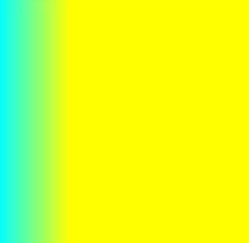

# CanvasGradient

>  **NOTE**
>
>  This component is supported since API version 4. Updates will be marked with a superscript to indicate their earliest API version.

**CanvasGradient** provides a gradient object.

## addColorStop

addColorStop(offset: number, color: string): void

Adds a color stop for the **CanvasGradient** object based on the specified offset and gradient color.

**Parameters**

| Name   | Type   | Description                                                  |
| ------ | ------ | ------------------------------------------------------------ |
| offset | number | Proportion of the distance between the color stop and the start point to the total length. The value ranges from 0 to 1. |
| color   | string | Gradient color to set.                                       |

**Example** 

  ```html
<!-- xxx.hml -->
<div>
  <canvas ref="canvas" style="width: 500px; height: 500px; background-color: #ffff00;"></canvas>
</div>
  ```

  ```js
// xxx.js
export default {
  onShow() {
    const el =this.$refs.canvas;
    const ctx = el.getContext('2d');
    const gradient = ctx.createLinearGradient(50,0,300,100);
    gradient.addColorStop(0.0, 'red')
    gradient.addColorStop(0.5, 'white')
    gradient.addColorStop(1.0, 'green')
    ctx.fillStyle = gradient
    ctx.fillRect(0, 0, 300, 300)
  }
}
  ```

  
