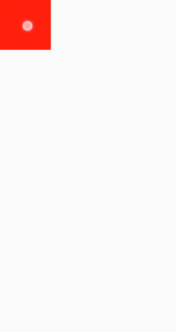

# div<a name="EN-US_TOPIC_0000001127125106"></a>

The  **<div\>**  component is a basic container that is used as the root node of the page structure or is used to group the content.

## Permission List<a name="section11257113618419"></a>

None

## Child Component<a name="section9288143101012"></a>

Supported

## Attribute<a name="section2907183951110"></a>

Attributes in  [Universal Attributes](js-components-common-attributes.md)  are supported.

## Style<a name="section10683162023215"></a>

In addition to the styles in  [Universal Styles](js-components-common-styles.md), the following styles are supported.

<a name="table268312017326"></a>
<table><thead align="left"><tr id="row1268413205327"><th class="cellrowborder" valign="top" width="21.18788121187881%" id="mcps1.1.6.1.1"><p id="p76841320163214"><a name="p76841320163214"></a><a name="p76841320163214"></a>Name</p>
</th>
<th class="cellrowborder" valign="top" width="16.648335166483353%" id="mcps1.1.6.1.2"><p id="p1068492019329"><a name="p1068492019329"></a><a name="p1068492019329"></a>Type</p>
</th>
<th class="cellrowborder" valign="top" width="13.618638136186382%" id="mcps1.1.6.1.3"><p id="p1468462043218"><a name="p1468462043218"></a><a name="p1468462043218"></a>Default Value</p>
</th>
<th class="cellrowborder" valign="top" width="7.329267073292671%" id="mcps1.1.6.1.4"><p id="p968416201324"><a name="p968416201324"></a><a name="p968416201324"></a>Mandatory</p>
</th>
<th class="cellrowborder" valign="top" width="41.21587841215879%" id="mcps1.1.6.1.5"><p id="p1068412019321"><a name="p1068412019321"></a><a name="p1068412019321"></a>Description</p>
</th>
</tr>
</thead>
<tbody><tr id="row1768452033213"><td class="cellrowborder" valign="top" width="21.18788121187881%" headers="mcps1.1.6.1.1 "><p id="p1868410208328"><a name="p1868410208328"></a><a name="p1868410208328"></a>flex-direction</p>
</td>
<td class="cellrowborder" valign="top" width="16.648335166483353%" headers="mcps1.1.6.1.2 "><p id="p16684720193210"><a name="p16684720193210"></a><a name="p16684720193210"></a>string</p>
</td>
<td class="cellrowborder" valign="top" width="13.618638136186382%" headers="mcps1.1.6.1.3 "><p id="p168432083216"><a name="p168432083216"></a><a name="p168432083216"></a>row</p>
</td>
<td class="cellrowborder" valign="top" width="7.329267073292671%" headers="mcps1.1.6.1.4 "><p id="p26841120163215"><a name="p26841120163215"></a><a name="p26841120163215"></a>No</p>
</td>
<td class="cellrowborder" valign="top" width="41.21587841215879%" headers="mcps1.1.6.1.5 "><p id="p9684162011326"><a name="p9684162011326"></a><a name="p9684162011326"></a>Main axis direction of the flex container. Available values are as follows:</p>
<a name="ul166842020123216"></a><a name="ul166842020123216"></a><ul id="ul166842020123216"><li><strong id="b6448132113155"><a name="b6448132113155"></a><a name="b6448132113155"></a>column</strong>: Items are placed vertically from top to bottom.</li><li><strong id="b1655362851511"><a name="b1655362851511"></a><a name="b1655362851511"></a>row</strong>: Items are placed horizontally from left to right.</li></ul>
</td>
</tr>
<tr id="row1568472073219"><td class="cellrowborder" valign="top" width="21.18788121187881%" headers="mcps1.1.6.1.1 "><p id="p156841120203210"><a name="p156841120203210"></a><a name="p156841120203210"></a>flex-wrap</p>
</td>
<td class="cellrowborder" valign="top" width="16.648335166483353%" headers="mcps1.1.6.1.2 "><p id="p668422017329"><a name="p668422017329"></a><a name="p668422017329"></a>string</p>
</td>
<td class="cellrowborder" valign="top" width="13.618638136186382%" headers="mcps1.1.6.1.3 "><p id="p176841220203217"><a name="p176841220203217"></a><a name="p176841220203217"></a>nowrap</p>
</td>
<td class="cellrowborder" valign="top" width="7.329267073292671%" headers="mcps1.1.6.1.4 "><p id="p16851520143211"><a name="p16851520143211"></a><a name="p16851520143211"></a>No</p>
</td>
<td class="cellrowborder" valign="top" width="41.21587841215879%" headers="mcps1.1.6.1.5 "><p id="p9685102083216"><a name="p9685102083216"></a><a name="p9685102083216"></a>Whether flex items in the container are displayed in a single line or multiple lines. Currently, dynamic modification is not supported. Available values are as follows:</p>
<a name="ul2685520133215"></a><a name="ul2685520133215"></a><ul id="ul2685520133215"><li><strong id="b17130154919435"><a name="b17130154919435"></a><a name="b17130154919435"></a>nowrap</strong>: Items are displayed on a single axis.</li><li><strong id="b9317903440"><a name="b9317903440"></a><a name="b9317903440"></a>wrap</strong>: Items are displayed on multiple axes.</li></ul>
</td>
</tr>
<tr id="row56851920123213"><td class="cellrowborder" valign="top" width="21.18788121187881%" headers="mcps1.1.6.1.1 "><p id="p56857201320"><a name="p56857201320"></a><a name="p56857201320"></a>justify-content</p>
</td>
<td class="cellrowborder" valign="top" width="16.648335166483353%" headers="mcps1.1.6.1.2 "><p id="p268572015329"><a name="p268572015329"></a><a name="p268572015329"></a>string</p>
</td>
<td class="cellrowborder" valign="top" width="13.618638136186382%" headers="mcps1.1.6.1.3 "><p id="p96851220103216"><a name="p96851220103216"></a><a name="p96851220103216"></a>flex-start</p>
</td>
<td class="cellrowborder" valign="top" width="7.329267073292671%" headers="mcps1.1.6.1.4 "><p id="p1368522019327"><a name="p1368522019327"></a><a name="p1368522019327"></a>No</p>
</td>
<td class="cellrowborder" valign="top" width="41.21587841215879%" headers="mcps1.1.6.1.5 "><p id="p2685520183214"><a name="p2685520183214"></a><a name="p2685520183214"></a>How items are aligned along the main axis of the current line in a flex container. Available values are as follows:</p>
<a name="ul10685142083220"></a><a name="ul10685142083220"></a><ul id="ul10685142083220"><li><strong id="b1501318300"><a name="b1501318300"></a><a name="b1501318300"></a>flex-start</strong>: Items are packed towards the start line.</li><li><strong id="b44838392915"><a name="b44838392915"></a><a name="b44838392915"></a>flex-end</strong>: Items are packed towards the end line.</li><li><strong id="b1427203684411"><a name="b1427203684411"></a><a name="b1427203684411"></a>center</strong>: Items are centered along the line.</li><li><strong id="b22154711448"><a name="b22154711448"></a><a name="b22154711448"></a>space-between</strong>: Items are positioned with space between the lines.</li><li><strong id="b233020014456"><a name="b233020014456"></a><a name="b233020014456"></a>space-around</strong>: Items are positioned with space before, between, and after the lines.</li><li><strong id="b93731646175116"><a name="b93731646175116"></a><a name="b93731646175116"></a>space-evenly</strong><sup id="sup7995448141310"><a name="sup7995448141310"></a><a name="sup7995448141310"></a>5+</sup>: Items are arranged with even space between each two.</li></ul>
</td>
</tr>
<tr id="row1268518207327"><td class="cellrowborder" valign="top" width="21.18788121187881%" headers="mcps1.1.6.1.1 "><p id="p16685172073216"><a name="p16685172073216"></a><a name="p16685172073216"></a>align-items</p>
</td>
<td class="cellrowborder" valign="top" width="16.648335166483353%" headers="mcps1.1.6.1.2 "><p id="p14686102043215"><a name="p14686102043215"></a><a name="p14686102043215"></a>string</p>
</td>
<td class="cellrowborder" valign="top" width="13.618638136186382%" headers="mcps1.1.6.1.3 "><p id="p12686192073219"><a name="p12686192073219"></a><a name="p12686192073219"></a>stretch</p>
</td>
<td class="cellrowborder" valign="top" width="7.329267073292671%" headers="mcps1.1.6.1.4 "><p id="p968619206323"><a name="p968619206323"></a><a name="p968619206323"></a>No</p>
</td>
<td class="cellrowborder" valign="top" width="41.21587841215879%" headers="mcps1.1.6.1.5 "><p id="p968612093212"><a name="p968612093212"></a><a name="p968612093212"></a>How items are aligned along the cross axis of the current line in a flex container. Available values are as follows:</p>
<a name="ul1668642083219"></a><a name="ul1668642083219"></a><ul id="ul1668642083219"><li><strong id="b11551451152410"><a name="b11551451152410"></a><a name="b11551451152410"></a>stretch</strong>: Items are stretched to the same height or width as the container in the cross axis direction. </li><li><strong id="b121104330341"><a name="b121104330341"></a><a name="b121104330341"></a>flex-start</strong>: Items are aligned to the start of the cross axis.</li><li><strong id="b475319397428"><a name="b475319397428"></a><a name="b475319397428"></a>flex-end</strong>: Items are aligned to the end of the cross axis.</li><li><strong id="b29371949171513"><a name="b29371949171513"></a><a name="b29371949171513"></a>center</strong>: Items are aligned in the middle of the cross axis.</li></ul>
</td>
</tr>
<tr id="row13686520193219"><td class="cellrowborder" valign="top" width="21.18788121187881%" headers="mcps1.1.6.1.1 "><p id="p18686620103213"><a name="p18686620103213"></a><a name="p18686620103213"></a>align-content</p>
</td>
<td class="cellrowborder" valign="top" width="16.648335166483353%" headers="mcps1.1.6.1.2 "><p id="p368682043219"><a name="p368682043219"></a><a name="p368682043219"></a>string</p>
</td>
<td class="cellrowborder" valign="top" width="13.618638136186382%" headers="mcps1.1.6.1.3 "><p id="p76864208322"><a name="p76864208322"></a><a name="p76864208322"></a>flex-start</p>
</td>
<td class="cellrowborder" valign="top" width="7.329267073292671%" headers="mcps1.1.6.1.4 "><p id="p17687720143219"><a name="p17687720143219"></a><a name="p17687720143219"></a>No</p>
</td>
<td class="cellrowborder" valign="top" width="41.21587841215879%" headers="mcps1.1.6.1.5 "><p id="p10687112023210"><a name="p10687112023210"></a><a name="p10687112023210"></a>Multi-line alignment mode when there is extra space in the cross axis. Available values are as follows:</p>
<a name="ul156878209329"></a><a name="ul156878209329"></a><ul id="ul156878209329"><li><strong id="b136621415154616"><a name="b136621415154616"></a><a name="b136621415154616"></a>flex-start</strong>: All lines are packed towards the start of the cross axis. The start edge of the cross axis of the first line is aligned with the start edge of the cross axis of the container. All subsequent lines are aligned with the previous line.</li><li><strong id="b597516158475"><a name="b597516158475"></a><a name="b597516158475"></a>flex-end</strong>: All lines are packed towards the end of the cross axis. The end of the cross axis of the last line is aligned with the end of the cross axis of the container. All subsequent lines are aligned with the previous line.</li><li><strong id="b13497201184810"><a name="b13497201184810"></a><a name="b13497201184810"></a>center</strong>: All lines are packed towards the center of the container. Lines are close to each other and aligned with the center of the container. The spacing between the start of the container's cross axis and the first line is equal to the spacing between the end of the container's cross axis and the last line.</li><li><strong id="b1679416397492"><a name="b1679416397492"></a><a name="b1679416397492"></a>space-between</strong>: All lines are evenly distributed in the container. The spacing between two adjacent lines is the same. The start and end edges of the container's cross axis are aligned with the edges of the first and last lines, respectively.</li><li><strong id="b190019665015"><a name="b190019665015"></a><a name="b190019665015"></a>space-around</strong>: All lines are evenly distributed in the container, and the spacing between two adjacent lines is the same. The spacing between the start edge of the container's cross axis and the first line and that between the end edge and the last line are half of the spacing between two adjacent lines.</li></ul>
</td>
</tr>
<tr id="row668711200324"><td class="cellrowborder" valign="top" width="21.18788121187881%" headers="mcps1.1.6.1.1 "><p id="p1368732083214"><a name="p1368732083214"></a><a name="p1368732083214"></a>display</p>
</td>
<td class="cellrowborder" valign="top" width="16.648335166483353%" headers="mcps1.1.6.1.2 "><p id="p8687320183211"><a name="p8687320183211"></a><a name="p8687320183211"></a>string</p>
</td>
<td class="cellrowborder" valign="top" width="13.618638136186382%" headers="mcps1.1.6.1.3 "><p id="p168742043213"><a name="p168742043213"></a><a name="p168742043213"></a>flex</p>
</td>
<td class="cellrowborder" valign="top" width="7.329267073292671%" headers="mcps1.1.6.1.4 "><p id="p36871820113217"><a name="p36871820113217"></a><a name="p36871820113217"></a>No</p>
</td>
<td class="cellrowborder" valign="top" width="41.21587841215879%" headers="mcps1.1.6.1.5 "><p id="p7687920123212"><a name="p7687920123212"></a><a name="p7687920123212"></a>Type of the view box of the element. Currently, dynamic modification is not supported. Available values are as follows:</p>
<a name="ul168702017322"></a><a name="ul168702017322"></a><ul id="ul168702017322"><li><strong id="b1723224655016"><a name="b1723224655016"></a><a name="b1723224655016"></a>flex</strong>: flexible layout</li><li><strong id="b15510348175010"><a name="b15510348175010"></a><a name="b15510348175010"></a>grid</strong>: grid layout</li><li><strong id="b102151023161"><a name="b102151023161"></a><a name="b102151023161"></a>none</strong>: not rendered</li></ul>
</td>
</tr>
<tr id="row136872020123214"><td class="cellrowborder" valign="top" width="21.18788121187881%" headers="mcps1.1.6.1.1 "><p id="p126872208322"><a name="p126872208322"></a><a name="p126872208322"></a>grid-template-[columns|rows]</p>
</td>
<td class="cellrowborder" valign="top" width="16.648335166483353%" headers="mcps1.1.6.1.2 "><p id="p9687142016324"><a name="p9687142016324"></a><a name="p9687142016324"></a>string</p>
</td>
<td class="cellrowborder" valign="top" width="13.618638136186382%" headers="mcps1.1.6.1.3 "><p id="p9688112033216"><a name="p9688112033216"></a><a name="p9688112033216"></a>1 row, 1 column</p>
</td>
<td class="cellrowborder" valign="top" width="7.329267073292671%" headers="mcps1.1.6.1.4 "><p id="p1068812003213"><a name="p1068812003213"></a><a name="p1068812003213"></a>No</p>
</td>
<td class="cellrowborder" valign="top" width="41.21587841215879%" headers="mcps1.1.6.1.5 "><p id="p186883207326"><a name="p186883207326"></a><a name="p186883207326"></a>Number of rows and columns in the current grid layout. If this attribute is not set, one row and one column are displayed by default. This attribute is valid only when <strong id="b4125132113216"><a name="b4125132113216"></a><a name="b4125132113216"></a>display</strong> is set to <strong id="b12191152318329"><a name="b12191152318329"></a><a name="b12191152318329"></a>grid</strong>.</p>
<p id="p7688172013211"><a name="p7688172013211"></a><a name="p7688172013211"></a>For example, set <strong id="b1023814188516"><a name="b1023814188516"></a><a name="b1023814188516"></a>grid-template-columns</strong> to:</p>
<a name="ul3688920133220"></a><a name="ul3688920133220"></a><ul id="ul3688920133220"><li><strong id="b112413913347"><a name="b112413913347"></a><a name="b112413913347"></a>50px 100px 60px</strong>: There are three columns. The first column is 50 px, the second column is 100 px, and the third column is 60 px.</li><li><strong id="b6967342153412"><a name="b6967342153412"></a><a name="b6967342153412"></a>1fr 1fr 2fr</strong>: There are three columns, and the width allowed by the parent component is divided into four equal shares. The first column occupies one share, the second column occupies one share, and the third column occupies two shares.</li><li><strong id="b869516133514"><a name="b869516133514"></a><a name="b869516133514"></a>30% 20% 50%</strong>: There are three columns. The first column occupies 30% of the total width allowed by the parent component, the second column occupies 20%, and the third column occupies 50%.</li><li><strong id="b2099416428352"><a name="b2099416428352"></a><a name="b2099416428352"></a>repeat (2,100px)</strong>: There are two columns. The first column is 100 px, and the second column is 100 px.</li><li><strong id="b1528612819366"><a name="b1528612819366"></a><a name="b1528612819366"></a>repeat(auto-fill,100px)</strong><sup id="sup126181292519"><a name="sup126181292519"></a><a name="sup126181292519"></a>5+</sup>: Each column is 100 px and repeats to fill the cross axis. The number of columns is calculated based on the column size and the cross axis size.</li><li><strong id="b02617531161"><a name="b02617531161"></a><a name="b02617531161"></a>auto 1fr 1fr</strong>: There are three columns. The first column is adaptive to the width required by its child components. The remaining space is divided into two equal shares, one share occupied by each of the rest two columns.</li></ul>
</td>
</tr>
<tr id="row106881920143218"><td class="cellrowborder" valign="top" width="21.18788121187881%" headers="mcps1.1.6.1.1 "><p id="p66881020173213"><a name="p66881020173213"></a><a name="p66881020173213"></a>grid-[columns|rows]-gap</p>
</td>
<td class="cellrowborder" valign="top" width="16.648335166483353%" headers="mcps1.1.6.1.2 "><p id="p16688192063214"><a name="p16688192063214"></a><a name="p16688192063214"></a>&lt;length&gt;</p>
</td>
<td class="cellrowborder" valign="top" width="13.618638136186382%" headers="mcps1.1.6.1.3 "><p id="p15688920143215"><a name="p15688920143215"></a><a name="p15688920143215"></a>0</p>
</td>
<td class="cellrowborder" valign="top" width="7.329267073292671%" headers="mcps1.1.6.1.4 "><p id="p16688162003215"><a name="p16688162003215"></a><a name="p16688162003215"></a>No</p>
</td>
<td class="cellrowborder" valign="top" width="41.21587841215879%" headers="mcps1.1.6.1.5 "><p id="p96881920183213"><a name="p96881920183213"></a><a name="p96881920183213"></a>Size of the gap between two consecutive rows or columns in a grid layout. You can also use <strong id="b39881232191618"><a name="b39881232191618"></a><a name="b39881232191618"></a>grid-gap</strong> to set the same size of the gap between rows and columns. This attribute is valid only when <strong id="b49951732201611"><a name="b49951732201611"></a><a name="b49951732201611"></a>display</strong> is set to <strong id="b189964324166"><a name="b189964324166"></a><a name="b189964324166"></a>grid</strong>.</p>
</td>
</tr>
<tr id="row1268882053219"><td class="cellrowborder" valign="top" width="21.18788121187881%" headers="mcps1.1.6.1.1 "><p id="p1668942011327"><a name="p1668942011327"></a><a name="p1668942011327"></a>grid-row-[start|end]</p>
</td>
<td class="cellrowborder" valign="top" width="16.648335166483353%" headers="mcps1.1.6.1.2 "><p id="p11689620143210"><a name="p11689620143210"></a><a name="p11689620143210"></a>number</p>
</td>
<td class="cellrowborder" valign="top" width="13.618638136186382%" headers="mcps1.1.6.1.3 "><p id="p66891920143215"><a name="p66891920143215"></a><a name="p66891920143215"></a>-</p>
</td>
<td class="cellrowborder" valign="top" width="7.329267073292671%" headers="mcps1.1.6.1.4 "><p id="p17689152083218"><a name="p17689152083218"></a><a name="p17689152083218"></a>No</p>
</td>
<td class="cellrowborder" valign="top" width="41.21587841215879%" headers="mcps1.1.6.1.5 "><p id="p16689132033212"><a name="p16689132033212"></a><a name="p16689132033212"></a>Start and end row numbers of the current item in the grid layout. This attribute is valid only when <strong id="b1966015213323"><a name="b1966015213323"></a><a name="b1966015213323"></a>display</strong> of the parent component is <strong id="b116675210328"><a name="b116675210328"></a><a name="b116675210328"></a>grid</strong>. (The <strong id="b266720217326"><a name="b266720217326"></a><a name="b266720217326"></a>display</strong> attribute of the parent component can be set to <strong id="b1866713218329"><a name="b1866713218329"></a><a name="b1866713218329"></a>grid</strong> only for the <strong id="b136678243216"><a name="b136678243216"></a><a name="b136678243216"></a>&lt;div&gt;</strong> container.)</p>
</td>
</tr>
<tr id="row1968942013212"><td class="cellrowborder" valign="top" width="21.18788121187881%" headers="mcps1.1.6.1.1 "><p id="p26894201323"><a name="p26894201323"></a><a name="p26894201323"></a>grid-column-[start|end]</p>
</td>
<td class="cellrowborder" valign="top" width="16.648335166483353%" headers="mcps1.1.6.1.2 "><p id="p18689122018329"><a name="p18689122018329"></a><a name="p18689122018329"></a>number</p>
</td>
<td class="cellrowborder" valign="top" width="13.618638136186382%" headers="mcps1.1.6.1.3 "><p id="p26894206327"><a name="p26894206327"></a><a name="p26894206327"></a>-</p>
</td>
<td class="cellrowborder" valign="top" width="7.329267073292671%" headers="mcps1.1.6.1.4 "><p id="p668914203321"><a name="p668914203321"></a><a name="p668914203321"></a>No</p>
</td>
<td class="cellrowborder" valign="top" width="41.21587841215879%" headers="mcps1.1.6.1.5 "><p id="p1168942083212"><a name="p1168942083212"></a><a name="p1168942083212"></a>Start and end column numbers of the current item in the grid layout. This attribute is valid only when <strong id="b826524911361"><a name="b826524911361"></a><a name="b826524911361"></a>display</strong> of the parent component is <strong id="b1527010493361"><a name="b1527010493361"></a><a name="b1527010493361"></a>grid</strong>. (The <strong id="b22701449123614"><a name="b22701449123614"></a><a name="b22701449123614"></a>display</strong> attribute of the parent component can be set to <strong id="b1327011499366"><a name="b1327011499366"></a><a name="b1327011499366"></a>grid</strong> only for the <strong id="b122717491366"><a name="b122717491366"></a><a name="b122717491366"></a>&lt;div&gt;</strong> container.)</p>
</td>
</tr>
<tr id="row1689120153217"><td class="cellrowborder" valign="top" width="21.18788121187881%" headers="mcps1.1.6.1.1 "><p id="p368912011325"><a name="p368912011325"></a><a name="p368912011325"></a>grid-auto-flow<sup id="sup26892020153214"><a name="sup26892020153214"></a><a name="sup26892020153214"></a>5+</sup></p>
</td>
<td class="cellrowborder" valign="top" width="16.648335166483353%" headers="mcps1.1.6.1.2 "><p id="p20689112043215"><a name="p20689112043215"></a><a name="p20689112043215"></a>string</p>
</td>
<td class="cellrowborder" valign="top" width="13.618638136186382%" headers="mcps1.1.6.1.3 "><p id="p186893207322"><a name="p186893207322"></a><a name="p186893207322"></a>-</p>
</td>
<td class="cellrowborder" valign="top" width="7.329267073292671%" headers="mcps1.1.6.1.4 "><p id="p20689182003216"><a name="p20689182003216"></a><a name="p20689182003216"></a>No</p>
</td>
<td class="cellrowborder" valign="top" width="41.21587841215879%" headers="mcps1.1.6.1.5 "><p id="p176891320123210"><a name="p176891320123210"></a><a name="p176891320123210"></a>Using an algorithm to lay out the grid automatically. Available values are as follows:</p>
<a name="ul12689152083220"></a><a name="ul12689152083220"></a><ul id="ul12689152083220"><li><strong id="b193611954113620"><a name="b193611954113620"></a><a name="b193611954113620"></a>row</strong>: Elements are filled row by row. When there is no horizontal space in a row, a new row is added.</li><li><strong id="b5155845153318"><a name="b5155845153318"></a><a name="b5155845153318"></a>column</strong>: Elements are filled column by column. When there is no vertical space in a column, a new column is added.</li></ul>
</td>
</tr>
<tr id="row8465152118595"><td class="cellrowborder" valign="top" width="21.18788121187881%" headers="mcps1.1.6.1.1 "><p id="p446513211597"><a name="p446513211597"></a><a name="p446513211597"></a>overflow<sup id="sup14860336125911"><a name="sup14860336125911"></a><a name="sup14860336125911"></a>6+</sup></p>
</td>
<td class="cellrowborder" valign="top" width="16.648335166483353%" headers="mcps1.1.6.1.2 "><p id="p6465172105918"><a name="p6465172105918"></a><a name="p6465172105918"></a>string</p>
</td>
<td class="cellrowborder" valign="top" width="13.618638136186382%" headers="mcps1.1.6.1.3 "><p id="p1546592111596"><a name="p1546592111596"></a><a name="p1546592111596"></a>visible</p>
</td>
<td class="cellrowborder" valign="top" width="7.329267073292671%" headers="mcps1.1.6.1.4 "><p id="p18465221125911"><a name="p18465221125911"></a><a name="p18465221125911"></a>No</p>
</td>
<td class="cellrowborder" valign="top" width="41.21587841215879%" headers="mcps1.1.6.1.5 "><p id="p146532175915"><a name="p146532175915"></a><a name="p146532175915"></a>Display mode when the content exceeds the container size. Available values are as follows:</p>
<a name="ul531213221202"></a><a name="ul531213221202"></a><ul id="ul531213221202"><li><strong id="b420312341347"><a name="b420312341347"></a><a name="b420312341347"></a>visible</strong>: Displays the extra content outside the container.</li><li><strong id="b648994483617"><a name="b648994483617"></a><a name="b648994483617"></a>hidden</strong>: Truncates the extra content.</li><li><strong id="b320136134115"><a name="b320136134115"></a><a name="b320136134115"></a>scroll</strong>: Scrolls the content vertically, with a scrollbar provided.</li></ul>
<div class="note" id="note1571135818019"><a name="note1571135818019"></a><a name="note1571135818019"></a><span class="notetitle"> NOTE: </span><div class="notebody"><a name="ul8327981218"></a><a name="ul8327981218"></a><ul id="ul8327981218"><li><strong id="b559885611111"><a name="b559885611111"></a><a name="b559885611111"></a>overflow</strong> works for elements whose size is fixed.</li></ul>
</div></div>
</td>
</tr>
<tr id="row83713507010"><td class="cellrowborder" valign="top" width="21.18788121187881%" headers="mcps1.1.6.1.1 "><p id="p2037105016016"><a name="p2037105016016"></a><a name="p2037105016016"></a>align-items<sup id="sup1453123611119"><a name="sup1453123611119"></a><a name="sup1453123611119"></a>6+</sup></p>
</td>
<td class="cellrowborder" valign="top" width="16.648335166483353%" headers="mcps1.1.6.1.2 "><p id="p183721550309"><a name="p183721550309"></a><a name="p183721550309"></a>string</p>
</td>
<td class="cellrowborder" valign="top" width="13.618638136186382%" headers="mcps1.1.6.1.3 "><p id="p5372165019019"><a name="p5372165019019"></a><a name="p5372165019019"></a>-</p>
</td>
<td class="cellrowborder" valign="top" width="7.329267073292671%" headers="mcps1.1.6.1.4 "><p id="p93721501701"><a name="p93721501701"></a><a name="p93721501701"></a>No</p>
</td>
<td class="cellrowborder" valign="top" width="41.21587841215879%" headers="mcps1.1.6.1.5 "><p id="p17372155018015"><a name="p17372155018015"></a><a name="p17372155018015"></a>How items are aligned along the cross axis in a flex container. Available values are as follows:</p>
<a name="ul7910135512514"></a><a name="ul7910135512514"></a><ul id="ul7910135512514"><li><strong id="b11631827184414"><a name="b11631827184414"></a><a name="b11631827184414"></a>stretch</strong>: Items are stretched to the same height or width as the container in the cross axis direction.</li><li><strong id="b4742287552"><a name="b4742287552"></a><a name="b4742287552"></a>flex-start</strong>: Items are aligned to the start of the cross axis.</li><li><strong id="b17873175319556"><a name="b17873175319556"></a><a name="b17873175319556"></a>flex-end</strong>: Items are aligned to the end of the cross axis.</li><li><strong id="b10117111010566"><a name="b10117111010566"></a><a name="b10117111010566"></a>center</strong>: Items are aligned in the middle of the cross axis.</li><li><strong id="b122386256568"><a name="b122386256568"></a><a name="b122386256568"></a>baseline</strong>: In a vertical layout, items are aligned to the start of the cross axis, which means that this value is equivalent of <strong id="b15990123312581"><a name="b15990123312581"></a><a name="b15990123312581"></a>flex-start</strong>. In a horizontal layout, items are aligned with the text baseline if there is text involved, and aligned to the bottom otherwise.</li></ul>
</td>
</tr>
<tr id="row1629945313212"><td class="cellrowborder" valign="top" width="21.18788121187881%" headers="mcps1.1.6.1.1 "><p id="p829911534213"><a name="p829911534213"></a><a name="p829911534213"></a>scrollbar-color<sup id="sup843916381239"><a name="sup843916381239"></a><a name="sup843916381239"></a>6+</sup></p>
</td>
<td class="cellrowborder" valign="top" width="16.648335166483353%" headers="mcps1.1.6.1.2 "><p id="p122991553112113"><a name="p122991553112113"></a><a name="p122991553112113"></a>&lt;color&gt;</p>
</td>
<td class="cellrowborder" valign="top" width="13.618638136186382%" headers="mcps1.1.6.1.3 "><p id="p17299253132120"><a name="p17299253132120"></a><a name="p17299253132120"></a>-</p>
</td>
<td class="cellrowborder" valign="top" width="7.329267073292671%" headers="mcps1.1.6.1.4 "><p id="p9299135342110"><a name="p9299135342110"></a><a name="p9299135342110"></a>No</p>
</td>
<td class="cellrowborder" valign="top" width="41.21587841215879%" headers="mcps1.1.6.1.5 "><p id="p14300165317215"><a name="p14300165317215"></a><a name="p14300165317215"></a>Color of the scrollbar.</p>
</td>
</tr>
<tr id="row17334859142112"><td class="cellrowborder" valign="top" width="21.18788121187881%" headers="mcps1.1.6.1.1 "><p id="p1433575912212"><a name="p1433575912212"></a><a name="p1433575912212"></a>scrollbar-width<sup id="sup10700174022317"><a name="sup10700174022317"></a><a name="sup10700174022317"></a>6+</sup></p>
</td>
<td class="cellrowborder" valign="top" width="16.648335166483353%" headers="mcps1.1.6.1.2 "><p id="p3335165919217"><a name="p3335165919217"></a><a name="p3335165919217"></a>&lt;length&gt;</p>
</td>
<td class="cellrowborder" valign="top" width="13.618638136186382%" headers="mcps1.1.6.1.3 "><p id="p6335175914219"><a name="p6335175914219"></a><a name="p6335175914219"></a>-</p>
</td>
<td class="cellrowborder" valign="top" width="7.329267073292671%" headers="mcps1.1.6.1.4 "><p id="p13335759172115"><a name="p13335759172115"></a><a name="p13335759172115"></a>No</p>
</td>
<td class="cellrowborder" valign="top" width="41.21587841215879%" headers="mcps1.1.6.1.5 "><p id="p533510595217"><a name="p533510595217"></a><a name="p533510595217"></a>Width of the scrollbar.</p>
</td>
</tr>
<tr id="row103571044227"><td class="cellrowborder" valign="top" width="21.18788121187881%" headers="mcps1.1.6.1.1 "><p id="p23581146229"><a name="p23581146229"></a><a name="p23581146229"></a>overscroll-effect<sup id="sup8319241142311"><a name="sup8319241142311"></a><a name="sup8319241142311"></a>6+</sup></p>
</td>
<td class="cellrowborder" valign="top" width="16.648335166483353%" headers="mcps1.1.6.1.2 "><p id="p17358204182217"><a name="p17358204182217"></a><a name="p17358204182217"></a>string</p>
</td>
<td class="cellrowborder" valign="top" width="13.618638136186382%" headers="mcps1.1.6.1.3 "><p id="p4358124122211"><a name="p4358124122211"></a><a name="p4358124122211"></a>-</p>
</td>
<td class="cellrowborder" valign="top" width="7.329267073292671%" headers="mcps1.1.6.1.4 "><p id="p1835816422213"><a name="p1835816422213"></a><a name="p1835816422213"></a>No</p>
</td>
<td class="cellrowborder" valign="top" width="41.21587841215879%" headers="mcps1.1.6.1.5 "><p id="p153581140221"><a name="p153581140221"></a><a name="p153581140221"></a>Scrolling edge effect. Available values are as follows:</p>
<a name="ul2660123592519"></a><a name="ul2660123592519"></a><ul id="ul2660123592519"><li><strong id="b1881111011411"><a name="b1881111011411"></a><a name="b1881111011411"></a>spring</strong>: Similar to the physical dynamic effect of a spring. After scrolling to the edge, you can continue to scroll for a distance based on the initial speed or by touching the knob of the scrollbar. After you release your hand, the knob is rebounded.</li><li><strong id="b11178953147"><a name="b11178953147"></a><a name="b11178953147"></a>fade</strong>: Similar to the physical dynamic effect of fade. When you scroll to the edge, a wave shape fades. The fade changes according to the speed and scrolling distance.</li><li><strong id="b42622051181418"><a name="b42622051181418"></a><a name="b42622051181418"></a>none</strong>: No effect after the scroll bar is moved to the edge.</li></ul>
</td>
</tr>
</tbody>
</table>

## Event<a name="section77341431152917"></a>

In addition to the events in  [Universal Events](js-components-common-events.md), the following events are supported.

<a name="tf7a840896dc848b5ab17a18b50036601"></a>
<table><thead align="left"><tr id="rf3d0da15d2f64cd492dfa1e7d98890a5"><th class="cellrowborder" valign="top" width="16.18%" id="mcps1.1.4.1.1"><p id="a487aa1c493e84ca68567b4b65051674d"><a name="a487aa1c493e84ca68567b4b65051674d"></a><a name="a487aa1c493e84ca68567b4b65051674d"></a>Name</p>
</th>
<th class="cellrowborder" valign="top" width="21.89%" id="mcps1.1.4.1.2"><p id="adc4b506cda3043508da6ee7649c12ca4"><a name="adc4b506cda3043508da6ee7649c12ca4"></a><a name="adc4b506cda3043508da6ee7649c12ca4"></a>Parameters</p>
</th>
<th class="cellrowborder" valign="top" width="61.92999999999999%" id="mcps1.1.4.1.3"><p id="a59e4cbe58a5c42a7a4585bc8365783bc"><a name="a59e4cbe58a5c42a7a4585bc8365783bc"></a><a name="a59e4cbe58a5c42a7a4585bc8365783bc"></a>Description</p>
</th>
</tr>
</thead>
<tbody><tr id="row19193181433116"><td class="cellrowborder" valign="top" width="16.18%" headers="mcps1.1.4.1.1 "><p id="p919321419315"><a name="p919321419315"></a><a name="p919321419315"></a>reachstart<sup id="sup18542427173112"><a name="sup18542427173112"></a><a name="sup18542427173112"></a>6+</sup></p>
</td>
<td class="cellrowborder" valign="top" width="21.89%" headers="mcps1.1.4.1.2 "><p id="p11805161217520"><a name="p11805161217520"></a><a name="p11805161217520"></a>-</p>
</td>
<td class="cellrowborder" valign="top" width="61.92999999999999%" headers="mcps1.1.4.1.3 "><p id="p617863613413"><a name="p617863613413"></a><a name="p617863613413"></a>Triggered when the page scrolls to the beginning. This event is triggered only when <strong id="b1088811149010"><a name="b1088811149010"></a><a name="b1088811149010"></a>flex-direction</strong> is <strong id="b79661241501"><a name="b79661241501"></a><a name="b79661241501"></a>row</strong>.</p>
</td>
</tr>
<tr id="row1812350173410"><td class="cellrowborder" valign="top" width="16.18%" headers="mcps1.1.4.1.1 "><p id="p3812150173411"><a name="p3812150173411"></a><a name="p3812150173411"></a>reachend<sup id="sup1959668163514"><a name="sup1959668163514"></a><a name="sup1959668163514"></a>6+</sup></p>
</td>
<td class="cellrowborder" valign="top" width="21.89%" headers="mcps1.1.4.1.2 "><p id="p173576151454"><a name="p173576151454"></a><a name="p173576151454"></a>-</p>
</td>
<td class="cellrowborder" valign="top" width="61.92999999999999%" headers="mcps1.1.4.1.3 "><p id="p1480216408412"><a name="p1480216408412"></a><a name="p1480216408412"></a>Triggered when the page scrolls to the end. This event is triggered only when <strong id="b1284214010015"><a name="b1284214010015"></a><a name="b1284214010015"></a>flex-direction</strong> is <strong id="b14843124010014"><a name="b14843124010014"></a><a name="b14843124010014"></a>row</strong>.</p>
</td>
</tr>
<tr id="row177991024193516"><td class="cellrowborder" valign="top" width="16.18%" headers="mcps1.1.4.1.1 "><p id="p1799132411359"><a name="p1799132411359"></a><a name="p1799132411359"></a>reachtop<sup id="sup126311239153512"><a name="sup126311239153512"></a><a name="sup126311239153512"></a>6+</sup></p>
</td>
<td class="cellrowborder" valign="top" width="21.89%" headers="mcps1.1.4.1.2 "><p id="p93757171511"><a name="p93757171511"></a><a name="p93757171511"></a>-</p>
</td>
<td class="cellrowborder" valign="top" width="61.92999999999999%" headers="mcps1.1.4.1.3 "><p id="p1841194517415"><a name="p1841194517415"></a><a name="p1841194517415"></a>Triggered when the page scrolls to the top. This event is triggered only when <strong id="b2338124611015"><a name="b2338124611015"></a><a name="b2338124611015"></a>flex-direction</strong> is <strong id="b16345194616011"><a name="b16345194616011"></a><a name="b16345194616011"></a>column</strong>.</p>
</td>
</tr>
<tr id="row2849452153619"><td class="cellrowborder" valign="top" width="16.18%" headers="mcps1.1.4.1.1 "><p id="p11850135219366"><a name="p11850135219366"></a><a name="p11850135219366"></a>reachbottom<sup id="sup66531160375"><a name="sup66531160375"></a><a name="sup66531160375"></a>6+</sup></p>
</td>
<td class="cellrowborder" valign="top" width="21.89%" headers="mcps1.1.4.1.2 "><p id="p798910191353"><a name="p798910191353"></a><a name="p798910191353"></a>-</p>
</td>
<td class="cellrowborder" valign="top" width="61.92999999999999%" headers="mcps1.1.4.1.3 "><p id="p1885010522361"><a name="p1885010522361"></a><a name="p1885010522361"></a>Triggered when the page scrolls to the bottom. This event is triggered only when <strong id="b1437611571905"><a name="b1437611571905"></a><a name="b1437611571905"></a>flex-direction</strong> is <strong id="b4377195716016"><a name="b4377195716016"></a><a name="b4377195716016"></a>column</strong>.</p>
</td>
</tr>
</tbody>
</table>

## Method<a name="section2279124532420"></a>

In addition to the methods in  [Universal Methods](js-components-common-methods.md), the following events are supported.

<a name="table20753173210251"></a>
<table><thead align="left"><tr id="row575363214257"><th class="cellrowborder" valign="top" width="17.07%" id="mcps1.1.5.1.1"><p id="p157531032112517"><a name="p157531032112517"></a><a name="p157531032112517"></a>Name</p>
</th>
<th class="cellrowborder" valign="top" width="11.84%" id="mcps1.1.5.1.2"><p id="p77531632132518"><a name="p77531632132518"></a><a name="p77531632132518"></a>Parameters</p>
</th>
<th class="cellrowborder" valign="top" width="13.66%" id="mcps1.1.5.1.3"><p id="p817515404414"><a name="p817515404414"></a><a name="p817515404414"></a>Return values</p>
</th>
<th class="cellrowborder" valign="top" width="57.43000000000001%" id="mcps1.1.5.1.4"><p id="p147531232132512"><a name="p147531232132512"></a><a name="p147531232132512"></a>Description</p>
</th>
</tr>
</thead>
<tbody><tr id="row15753113210251"><td class="cellrowborder" valign="top" width="17.07%" headers="mcps1.1.5.1.1 "><p id="p2314135812511"><a name="p2314135812511"></a><a name="p2314135812511"></a>getScrollOffset<sup id="sup663342216185"><a name="sup663342216185"></a><a name="sup663342216185"></a>6+</sup></p>
</td>
<td class="cellrowborder" valign="top" width="11.84%" headers="mcps1.1.5.1.2 "><p id="p7314115819256"><a name="p7314115819256"></a><a name="p7314115819256"></a>-</p>
</td>
<td class="cellrowborder" valign="top" width="13.66%" headers="mcps1.1.5.1.3 "><p id="p2017514401045"><a name="p2017514401045"></a><a name="p2017514401045"></a><a href="#table154011838131719">ScrollOffset</a></p>
</td>
<td class="cellrowborder" valign="top" width="57.43000000000001%" headers="mcps1.1.5.1.4 "><p id="p0314958162512"><a name="p0314958162512"></a><a name="p0314958162512"></a>Obtains the scrolling offset of the element content.</p>
<div class="note" id="note18321919610"><a name="note18321919610"></a><a name="note18321919610"></a><span class="notetitle"> NOTE: </span><div class="notebody"><a name="ul873964691316"></a><a name="ul873964691316"></a><ul id="ul873964691316"><li>To use this method, <strong id="b711552521"><a name="b711552521"></a><a name="b711552521"></a>overflow</strong> must be set to <strong id="b13595202212"><a name="b13595202212"></a><a name="b13595202212"></a>scroll</strong>.</li></ul>
</div></div>
</td>
</tr>
<tr id="row393410526251"><td class="cellrowborder" valign="top" width="17.07%" headers="mcps1.1.5.1.1 "><p id="p6171185561413"><a name="p6171185561413"></a><a name="p6171185561413"></a>scrollBy<sup id="sup188191223181818"><a name="sup188191223181818"></a><a name="sup188191223181818"></a>6+</sup></p>
</td>
<td class="cellrowborder" valign="top" width="11.84%" headers="mcps1.1.5.1.2 "><p id="p1231455814253"><a name="p1231455814253"></a><a name="p1231455814253"></a><a href="#table1139175871819">ScrollParam</a></p>
</td>
<td class="cellrowborder" valign="top" width="13.66%" headers="mcps1.1.5.1.3 "><p id="p121756404410"><a name="p121756404410"></a><a name="p121756404410"></a>-</p>
</td>
<td class="cellrowborder" valign="top" width="57.43000000000001%" headers="mcps1.1.5.1.4 "><p id="p10314105842512"><a name="p10314105842512"></a><a name="p10314105842512"></a>Indicates the scrolling offset of the element content.</p>
<div class="note" id="note3227027181713"><a name="note3227027181713"></a><a name="note3227027181713"></a><span class="notetitle"> NOTE: </span><div class="notebody"><a name="ul11227027181717"></a><a name="ul11227027181717"></a><ul id="ul11227027181717"><li>To use this method, <strong id="b516712319210"><a name="b516712319210"></a><a name="b516712319210"></a>overflow</strong> must be set to <strong id="b101751823523"><a name="b101751823523"></a><a name="b101751823523"></a>scroll</strong>.</li></ul>
</div></div>
</td>
</tr>
</tbody>
</table>

**Table  1**  ScrollOffset<sup>6+</sup>

<a name="table154011838131719"></a>
<table><thead align="left"><tr id="row154011938191717"><th class="cellrowborder" valign="top" width="33.33333333333333%" id="mcps1.2.4.1.1"><p id="p0401153814174"><a name="p0401153814174"></a><a name="p0401153814174"></a>Name</p>
</th>
<th class="cellrowborder" valign="top" width="33.33333333333333%" id="mcps1.2.4.1.2"><p id="p19401038111719"><a name="p19401038111719"></a><a name="p19401038111719"></a>Type</p>
</th>
<th class="cellrowborder" valign="top" width="33.33333333333333%" id="mcps1.2.4.1.3"><p id="p104011438181716"><a name="p104011438181716"></a><a name="p104011438181716"></a>Description</p>
</th>
</tr>
</thead>
<tbody><tr id="row6401133811715"><td class="cellrowborder" valign="top" width="33.33333333333333%" headers="mcps1.2.4.1.1 "><p id="p0401153816171"><a name="p0401153816171"></a><a name="p0401153816171"></a>x</p>
</td>
<td class="cellrowborder" valign="top" width="33.33333333333333%" headers="mcps1.2.4.1.2 "><p id="p17401183819172"><a name="p17401183819172"></a><a name="p17401183819172"></a>number</p>
</td>
<td class="cellrowborder" valign="top" width="33.33333333333333%" headers="mcps1.2.4.1.3 "><p id="p1840123811176"><a name="p1840123811176"></a><a name="p1840123811176"></a>Offset in the x-axis direction, in px.</p>
</td>
</tr>
<tr id="row540103815174"><td class="cellrowborder" valign="top" width="33.33333333333333%" headers="mcps1.2.4.1.1 "><p id="p1240133811713"><a name="p1240133811713"></a><a name="p1240133811713"></a>y</p>
</td>
<td class="cellrowborder" valign="top" width="33.33333333333333%" headers="mcps1.2.4.1.2 "><p id="p4402153816174"><a name="p4402153816174"></a><a name="p4402153816174"></a>number</p>
</td>
<td class="cellrowborder" valign="top" width="33.33333333333333%" headers="mcps1.2.4.1.3 "><p id="p94021838121713"><a name="p94021838121713"></a><a name="p94021838121713"></a>Offset in the y-axis direction, in px.</p>
</td>
</tr>
</tbody>
</table>

**Table  2**  ScrollParam<sup>6+</sup>

<a name="table1139175871819"></a>
<table><thead align="left"><tr id="row161391758201815"><th class="cellrowborder" valign="top" width="33.33333333333333%" id="mcps1.2.4.1.1"><p id="p161396585187"><a name="p161396585187"></a><a name="p161396585187"></a>Name</p>
</th>
<th class="cellrowborder" valign="top" width="33.33333333333333%" id="mcps1.2.4.1.2"><p id="p613975815186"><a name="p613975815186"></a><a name="p613975815186"></a>Type</p>
</th>
<th class="cellrowborder" valign="top" width="33.33333333333333%" id="mcps1.2.4.1.3"><p id="p18140145861817"><a name="p18140145861817"></a><a name="p18140145861817"></a>Description</p>
</th>
</tr>
</thead>
<tbody><tr id="row41401258181817"><td class="cellrowborder" valign="top" width="33.33333333333333%" headers="mcps1.2.4.1.1 "><p id="p1140858101811"><a name="p1140858101811"></a><a name="p1140858101811"></a>dx</p>
</td>
<td class="cellrowborder" valign="top" width="33.33333333333333%" headers="mcps1.2.4.1.2 "><p id="p1014085831819"><a name="p1014085831819"></a><a name="p1014085831819"></a>number</p>
</td>
<td class="cellrowborder" valign="top" width="33.33333333333333%" headers="mcps1.2.4.1.3 "><p id="p8140458111815"><a name="p8140458111815"></a><a name="p8140458111815"></a>Offset for scrolling the list in the horizontal direction, in px.</p>
</td>
</tr>
<tr id="row101401584185"><td class="cellrowborder" valign="top" width="33.33333333333333%" headers="mcps1.2.4.1.1 "><p id="p1314055819184"><a name="p1314055819184"></a><a name="p1314055819184"></a>dy</p>
</td>
<td class="cellrowborder" valign="top" width="33.33333333333333%" headers="mcps1.2.4.1.2 "><p id="p614035881816"><a name="p614035881816"></a><a name="p614035881816"></a>number</p>
</td>
<td class="cellrowborder" valign="top" width="33.33333333333333%" headers="mcps1.2.4.1.3 "><p id="p214075831810"><a name="p214075831810"></a><a name="p214075831810"></a>Offset for scrolling the list in the vertical direction, in px.</p>
</td>
</tr>
<tr id="row1414025811820"><td class="cellrowborder" valign="top" width="33.33333333333333%" headers="mcps1.2.4.1.1 "><p id="p814014580180"><a name="p814014580180"></a><a name="p814014580180"></a>smooth</p>
</td>
<td class="cellrowborder" valign="top" width="33.33333333333333%" headers="mcps1.2.4.1.2 "><p id="p17140155818186"><a name="p17140155818186"></a><a name="p17140155818186"></a>boolean</p>
</td>
<td class="cellrowborder" valign="top" width="33.33333333333333%" headers="mcps1.2.4.1.3 "><p id="p21401584187"><a name="p21401584187"></a><a name="p21401584187"></a>Whether to perform smooth processing.</p>
</td>
</tr>
</tbody>
</table>

## Example Code<a name="section1241545010391"></a>

1.  Flex style

    ```
    <!-- xxx.hml -->
    <div class="container">
      <div class="flex-box">
        <div class="flex-item color-primary"></div>
        <div class="flex-item color-warning"></div>
        <div class="flex-item color-success"></div>
      </div>
    </div>
    ```

    ```
    /* xxx.css */
    .container {
      flex-direction: column;
      justify-content: center;
      align-items: center;
      width: 454px;
      height: 454px;
    }
    .flex-box {
      justify-content: space-around;
      align-items: center;
      width: 400px;
      height: 140px;
      background-color: #ffffff;
    }
    .flex-item {
      width: 120px;
      height: 120px;
      border-radius: 16px;
    }
    .color-primary {
      background-color: #007dff;
    }
    .color-warning {
      background-color: #ff7500;
    }
    .color-success {
      background-color: #41ba41;
    }
    ```

    

2.  Flex wrap style

    ```
    <!-- xxx.hml -->
    <div class="container">
      <div class="flex-box">
        <div class="flex-item color-primary"></div>
        <div class="flex-item color-warning"></div>
        <div class="flex-item color-success"></div>
      </div>
    </div>
    ```

    ```
    /* xxx.css */
    .container {
      flex-direction: column;
      justify-content: center;
      align-items: center;
      width: 454px;
      height: 454px;
    }
    .flex-box {
      justify-content: space-around;
      align-items: center;
      flex-wrap: wrap;
      width: 300px;
      height: 250px;
      background-color: #ffffff;
    }
    .flex-item {
      width: 120px;
      height: 120px;
      border-radius: 16px;
    }
    .color-primary {
      background-color: #007dff;
    }
    .color-warning {
      background-color: #ff7500;
    }
    .color-success {
      background-color: #41ba41;
    }
    ```

    

3.  Grid style

    ```
    <!-- xxx.hml -->
    <div class="common grid-parent">
      <div class="grid-child grid-left-top"></div>
      <div class="grid-child grid-left-bottom"></div>
      <div class="grid-child grid-right-top"></div>
      <div class="grid-child grid-right-bottom"></div>
    </div>
    ```

    ```
    /* xxx.css */
    .common {
      width: 400px;
      height: 400px;
      background-color: #ffffff;
      align-items: center;
      justify-content: center;
      margin: 24px;
    }
    .grid-parent {
      display: grid;
      grid-template-columns: 35% 35%;
      grid-columns-gap: 24px;
      grid-rows-gap: 24px;
      grid-template-rows: 35% 35%;
    }
    .grid-child {
      width: 100%;
      height: 100%;
      border-radius: 8px;
    }
    .grid-left-top {
      grid-row-start: 0;
      grid-column-start: 0;
      grid-row-end: 0;
      grid-column-end: 0;
      background-color: #3f56ea;
    }
    .grid-left-bottom {
      grid-row-start: 1;
      grid-column-start: 0;
      grid-row-end: 1;
      grid-column-end: 0;
      background-color: #00aaee;
    }
    .grid-right-top {
      grid-row-start: 0;
      grid-column-start: 1;
      grid-row-end: 0;
      grid-column-end: 1;
      background-color: #00bfc9;
    }
    .grid-right-bottom {
      grid-row-start: 1;
      grid-column-start: 1;
      grid-row-end: 1;
      grid-column-end: 1;
      background-color: #47cc47;
    }
    ```

    

4.  Dragging<sup>7+</sup>

    ```
    <!-- xxx.hml -->
    <div class="container">
      <div class="content" ondragstart="dragstart" ondrag="drag" ondragend="dragend" style="position: absolute;left: {{left}};top:{{top}};">
      </div>
    </div>
    ```

    ```
    /* xxx.css */
    .container {
      flex-direction: column;
    }
    .content{
      width: 200px;
      height: 200px;
      background-color: red;
    }
    ```

    ```
    // xxx.js
    import prompt from '@system.prompt';
    export default {
      data:{
        left:0,
        top:0,
      },
      dragstart(e){
        prompt.showToast({
          message: 'Start to be dragged'
        })
      },
      drag(e){
        this.left = e.dragevent.globalX;
        this.top = e.dragevent.globalY;
      },
      dragend(e){
        prompt.showToast({
          message: 'End Drag'
        })
       },
    }
    ```

    

    ```
    <!-- xxx.hml -->
    <div class="container">
      <div class="content" ondrag="drag" style="position: absolute;left: {{left}};top: {{top}};"></div>
      <div style="width: 500px; height: 500px; background-color: yellow; position: fixed; left: 15%; top: 30%; opacity:0.3"
        ondragenter="dragenter" ondragover="dragover" ondragleave="dragleave" ondrop="drop">
      </div>
    </div>
    ```

    ```
    /* xxx.css */
    .container {
      flex-direction: column;
      width: 100%;
      position: relative;
      max-width: 100%;
    }
    .content{
      width: 200px;
      height: 200px;
      background-color: red;
      position: absolute;
    }
    ```

    ```
    // xxx.js
    import prompt from '@system.prompt';
    export default {
      data:{
        left:0,
        top:0,
      },
      drag(e){
        this.left = e.dragevent.globalX;
        this.top = e.dragevent.globalY;
      },
      dragenter(e){
        prompt.showToast({
          message: 'enter'
        })
      },
      dragover(e){
        prompt.showToast({
          message: 'over'
        })
      },
      dragleave(e){
        prompt.showToast({
          message: 'leave'
        })
      },
      drop(e){
        prompt.showToast({
          message: 'drop'
        })
      }
    }
    ```

    

5.  Pinching<sup>7+</sup>

    ```
    <!-- xxx.hml -->
    <div class="container">
      <div class="content "onpinchstart="pinchstart" onpinchend="pinchend" onpinchupdate="pinchupdate"
        onpinchcancel=" pinchcancel"> 
      </div>
    </div>
    ```

    ```
    /* xxx.css */
    .container {
      flex-direction: column;
      justify-content: center;
      align-items: center;
      width: 454px;
      height: 454px;}
    .content{
      width: 400px;
      height: 400px;
      background-color: aqua;
      margin:30px
    }
    ```

    ```
    // xxx.js
    import prompt from '@system.prompt';
    export default {
      pinchstart(e){
        prompt.showToast({
          message: 'pinchstart!!!'
        })
      },
      pinchupdate(e){
        prompt.showToast({
          message: 'Two-finger pinch update'
        })
      },
      pinchend(e){
        prompt.showToast({
          message: 'Finished with two fingers pinching'
        })
      },
      pinchcancel(e){
        prompt.showToast({
          message: 'Finger pinching is interrupted'
        })
      }
    }
    ```

    


