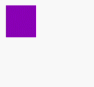
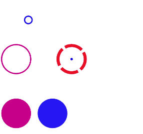

# animate


>  **NOTE**
>
>  This component is supported since API version 7. Updates will be marked with a superscript to indicate their earliest API version.

The **\<animate>** component is used to apply animation to an **\<svg>** component.

## Required Permissions

None


## Child Components

Not supported


## Attributes

| Name| Type| Default Value| Mandatory| Description|
| -------- | -------- | -------- | -------- | -------- |
| id | string | - | No| Unique ID of the component.|
| attributeName | string | - | No| Name of the component to which the animation is applied.|
| begin | &lt;time&gt; | 0 | No| Delay time of the animation.<br>The value can be ms (ms), s (second), or m (minute). The default value is s (second). Other formats are not supported.|
| dur | &lt;time&gt; | 0 | No| Animation duration. If **dur** is not set, the value of **end**-**begin** is used as the duration. If the value is less than or equal to 0, the animation is not triggered.<br>The value can be ms (ms), s (second), or m (minute). The default value is s (second). Other formats are not supported.|
| end | &lt;time&gt; | 0 | No| Duration after which the animation ends. The value can be ms (ms), s (second), or m (minute). The default value is s (second). Other formats are not supported.|
| repeatCount | &lt;number \| indefinite&gt; | 1 | No| Number of times the animation is played. The default value is indefinite. You can set the value to **1** to play the animation only once.|
| fill | &lt;freeze \| remove&gt; | remove | No| State when the animation ends.|
| calcMode | &lt;discrete \| linear \| paced \| spline&gt; | linear | No| Interpolation mode of the animation.<br>**discrete**: The animation directly jumps from the value specified by **from** to the value specified by **to**.<br>**linear**: Linear interpolation between values is used.<br>**paced**: Interpolation that produces an even paced change is used. If this value is set, the values of **keyTimes** and **keyPoints** will not take effect.<br>**spline**: Interpolation is implemented based on a custom Bezier spline. The spline points are defined in the **keyTimes** attribute, and the control points of each interval are defined in the **keySplines** attribute.|
| keyTimes | string | - | No| Start time of the key frame animation. The value is a semicolon-separated list of values ranging from 0 to 1, for example, **0;0.3;0.8;1**. **keyTimes**, **keySplines**, and **values** are combined to set the key frame animation. The number of values defined for **keyTimes** is the same as that for **values**. The number of values defined for **keySplines** is the number of values defined for **keyTimes** minus 1.|
| keySplines | string | - | No| A set of Bezier control points associated with **keyTimes**. You can define the Bezier curves for each key frame, separating them with semicolons (;). The format of the two control points in the curve is x1 y1 x2 y2, for example, **0.5 0 0.5 1; 0.5 0 0.5 1;0.5 0 0.5 1**.|
| by | number | - | No| Relative offset value to add to a specified attribute in the animation. The default value of **from** is the original attribute value.|
| from | string | - | No| Start value of the attribute to which the animation is applied.<br>If the **values** attribute has been set, the **from** attribute is invalid.|
| to | string | - | No| End value of the attribute to which the animation is applied.<br>If the **values** attribute has been set, the **to** attribute is invalid.|
| values | string | - | No| Change value of a group of animations. The format is value1;value2;value3.|


## Example

```html
<!-- xxx.hml -->
<div class="container">
  <svg width="400" height="400">
    <rect x="20" y="20" width="100" height="100" fill="red" rx="0" ry="20">
      <animate attributeName="rx" values="0;10;30;0" keyTimes="0;0.25;0.75;1" keySplines="0.5 0 0.5 1; 0.5 0 0.5 1; 0.5 0 0.5 1" dur="1000" repeatCount="indefinite">
      </animate>
    </rect>
  </svg>
</div>
```


```html
<!-- xxx.hml -->
<div class="container">
  <svg width="400" height="400">
    <rect x="20" y="20" width="100" height="100" fill="red" rx="0" ry="20">
      <animate attributeName="fill" from="red" to="blue" dur="1000" repeatCount="indefinite"></animate>
      <animate attributeName="height" from="50" to="150" begin="500" end="1000" repeatCount="indefinite">  </animate>
    </rect>
  </svg>
</div>
```





```html
<!-- xxx.hml -->
<div class="container">
  <svg width="400" height="400">
    <rect x="20" y="20" width="100" height="100" fill="red" rx="0" ry="20">
      <animate attributeName="rx" values="0;30" dur="1000" repeatCount="indefinite" fill="freeze" calcMode="linear"></animate>
    </rect>
  </svg>
</div>
```


```html
<!-- xxx.hml -->
<div class="container">
  <svg fill="white" width="600" height="600">
    <circle cx="60" cy="70" r="50" stroke-width="4" fill="white" stroke="blue">
      <animate attributeName="r" from="0" to="50" dur="2000" repeatCount="indefinite"></animate>
      <animate attributeName="cx" from="60" to="200" dur="2000" repeatCount="indefinite"></animate>
    </circle>
    <circle cx="60" cy="200" r="50" stroke-width="4" fill="white" stroke="blue">
      <animate attributeName="stroke-width" from="4" to="10" calcMode="discrete" dur="2000" repeatCount="indefinite"></animate>
      <animate attributeName="stroke" values="red;blue" dur="2000" repeatCount="indefinite"></animate>
    </circle>
    <circle cx="180" cy="200" r="50" stroke-width="10" stroke="red" stroke-dasharray="60 10" stroke-dashoffset="3">
      <animate attributeName="stroke-opacity" from="1.0" to="0.5" dur="2000" repeatCount="indefinite"></animate>
      <animate attributeName="stroke-dashoffset" values="30;0;30" dur="500" repeatCount="indefinite"></animate>
     <animate attributeName="cx" from="180" to="400" dur="2000" repeatCount="indefinite"></animate>
    </circle>
    <circle cx="180" cy="200" r="5" fill="blue">
      <animate attributeName="cx" from="180" to="400" dur="2000" repeatCount="indefinite"></animate>
    </circle>
    <circle cx="60" cy="380" r="50"  fill="blue">
      <animate attributeName="fill" values="red;blue" dur="2000" repeatCount="indefinite"></animate>
    </circle>
    <circle cx="180" cy="380" r="50"  fill="blue">
      <animate attributeName="fill-opacity" from="1.0" to="0.5" dur="2000" repeatCount="indefinite"></animate>
    </circle>
    </svg>
</div>
```



