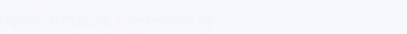

# tspan

> **NOTE:** 
>-   This component is supported since API version 7. Updates will be marked with a superscript to indicate their earliest API version.
>-   The text content must be written in the content area. The  **<tspan\>**  child component can be nested.
>-   **<tspan\>**  can be nested only by the parent element label  **svg**.

## Required Permissions

None

## Child Components

Tspan is supported.

The attributes in the following table are supported.

| Name           | Type                     | Default Value | Mandatory | Description                                                  |
| -------------- | ------------------------ | ------------- | --------- | ------------------------------------------------------------ |
| id             | string                   | -             | No        | Unique ID of the component.                                  |
| x              | \<length>\|\<percentage> | 0             | No        | X-coordinate of the upper left corner of the component.      |
| y              | \<length>\|\<percentage> | 0             | No        | Y-coordinate of the upper left corner of the component. This parameter is invalid for the **textpath** child component. |
| dx             | \<length>\|\<percentage> | 0             | No        | Offset of the text on the x-axis.                            |
| dy             | \<length>\|\<percentage> | 0             | No        | Offset of the text on the y-axis. This parameter is invalid for the **textpath** child component. |
| rotate         | number                   | 0             | No        | Rotates the lower left corner of the font based on the circle center. A positive number indicates clockwise rotation, and a negative number indicates counterclockwise rotation. |
| font-size      | \<length>                | 30px          | No        | Font size.                                                   |
| fill           | \<color>                 | black         | No        | Font fill color.                                             |
| opacity        | number                   | 1             | No        | Opacity of an element. The value ranges from **0** to **1**. The value **1** means opaque, and **0** means completely transparent. Attribute animations are supported. |
| fill-opacity   | number                   | 1.0           | No        | Font fill opacity.                                           |
| stroke         | \<color>                 | black         | No        | Stroke and stroke color.                                     |
| stroke-width   | number                   | 1px           | No        | Stroke width.                                                |
| stroke-opacity | number                   | 1.0           | No        | Stroke opacity.                                              |


## Example

```
/* xxx.css */
.container {    
    flex-direction: row;
    justify-content: flex-start;
    align-items: flex-start;
    height: 1000px;
    width: 1080px;
}
```

```
<!-- xxx.hml -->
<div class="container">
  <svg >
    <text x="20" y="500" fill="#D2691E" font-size="20">
      zero text.
      <tspan>first span.</tspan>
      <tspan fill="red" font-size="35">second span.</tspan>
      <tspan fill="#D2691E" font-size="40" rotate="10">third span.</tspan>
    </text>
    <text x="20" y="550" fill="#D2691E" font-size="20">
      <tspan dx="-5" fill-opacity="0.2">first span.</tspan>
      <tspan dx="5" fill="red" font-size="25" fill-opacity="0.4">second span.</tspan>
      <tspan dy="-5" fill="#D2691E" font-size="35" rotate="-10" fill-opacity="0.6">third span.</tspan>
      <tspan fill="#blue" font-size="40" rotate="10" fill-opacity="0.8" stroke="#00FF00" stroke-width="1px">forth span.</tspan>
    </text>
  </svg>
</div>
```


Attribute animation example

```
/* xxx.css */
.container {
    flex-direction: row;
    justify-content: flex-start;
    align-items: flex-start;
    height: 3000px;
    width: 1080px;
}
```

```
<!-- xxx.hml -->
<div class="container">
  <svg>
    <text y="300" font-size="30" fill="blue">
      <tspan>
        tspan attribute x|opacity|rotate
        <animate attributeName="x" from="-100" to="400" dur="3s" repeatCount="indefinite"></animate>
        <animate attributeName="opacity" from="0.01" to="0.99" dur="3s" repeatCount="indefinite"></animate>
        <animate attributeName="rotate" from="0" to="360" dur="3s" repeatCount="indefinite"></animate>
      </tspan>
    </text>

    <text y="350" font-size="30" fill="blue">
      <tspan>
        tspan attribute dx
        <animate attributeName="dx" from="-100" to="400" dur="3s" repeatCount="indefinite"></animate>
      </tspan>
    </text>
  </svg>
</div>
```


```
<!-- xxx.hml -->
<div class="container">
  <svg>
    <text>
      <tspan x="0" y="550" font-size="30">
        tspan attribute fill|fill-opacity
        <animate attributeName="fill" from="blue" to="red" dur="3s" repeatCount="indefinite"></animate>
        <animate attributeName="fill-opacity" from="0.01" to="0.99" dur="3s" repeatCount="indefinite"></animate>
      </tspan>
    </text>
  </svg>
</div>
```



```
<!-- xxx.hml -->
<div class="container">
  <svg>
     <text>
       <tspan x="20" y="600" fill="red">
         tspan attribute font-size
         <animate attributeName="font-size" from="10" to="50" dur="3s" repeatCount="indefinite"></animate>
       </tspan>
    </text>
  </svg>
</div>
```


```
<!-- xxx.hml -->
<div class="container">
  <svg>
    <text>
      <tspan x="20" y="650" font-size="25" fill="blue" stroke="red">
        tspan attribute stroke
        <animate attributeName="stroke" from="red" to="#00FF00" dur="3s" repeatCount="indefinite"></animate>
      </tspan>
    </text>
    <text>
      <tspan x="300" y="650" font-size="25" fill="white" stroke="red">
        tspan attribute stroke-width-opacity
        <animate attributeName="stroke-width" from="1" to="5" dur="3s" repeatCount="indefinite"></animate>
        <animate attributeName="stroke-opacity" from="0.01" to="0.99" dur="3s" repeatCount="indefinite"></animate>
      </tspan>
    </text>
  </svg>
</div>
```


