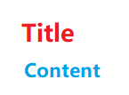

# CSS<a name="EN-US_TOPIC_0000001127125112"></a>

Cascading Style Sheets \(CSS\) is a language used to describe the HML page structure. All HML components have default styles. You can customize styles for these components using CSS to design various pages.

## Size Unit<a name="section81638230913"></a>

1.  Logical px set by  **<length\>**:
    1.  The default logical screen width is 720 px \(for details, see the  **"window"**  section in  [config.json](js-framework-js-tag.md)\). Your page will be scaled to fit the actual width of the screen. For example, on a screen with the actual width of 1440 physical px, 100 px is displayed on 200 physical px, with all sizes doubled from 720 px to 1440 px.
    2.  If you set  **autoDesignWidth**  to  **true**  \(for details, see the  **"window"**  section in  [config.json](js-framework-js-tag.md)\), the logical px are scaled based on the screen density. For example, if the screen density is 3x, 100 px will be rendered on 300 physical px. This approach is recommended when your application needs to adapt to multiple devices.

2.  Percentage set by  **<percentage\>**: The component size is represented by its percentage of the parent component size. For example, if the width  **<percentage\>**  of a component is set to  **50%**, the width of the component is half of its parent component's width.

## Style Import<a name="section890312411592"></a>

CSS files can be imported using the  **@import**  statement. This facilitates module management and code reuse.

## Style Declaration<a name="section197695604215"></a>

The  **.css**  file with the same name as the  **.hml**  file in each page directory describes the styles of components on the HML page, determining how the components will be displayed.

1.  Internal style: The  **style**  and  **class**  attributes can be used to specify the component style. Example:

    ```
    <!-- index.hml -->
    <div class="container">
      <text style="color: red">Hello World</text>
    </div>
    ```

    ```
    /* index.css */
    .container {
      justify-content: center;
    }
    ```

2.  External style files: You need to import the files. For example, create a  **style.css**  file in the  **common**  directory and import the file at the beginning of  **index.css**.

    ```
    /* style.css */
    .title {
      font-size: 50px;
    }
    ```

    ```
    /* index.css */
    @import '../../common/style.css';
    .container {
      justify-content: center;
    }
    ```


## Selectors<a name="section381741144310"></a>

A CSS selector is used to select elements for which styles need to be added to. The following table lists the supported selectors.

<a name="table8917183413489"></a>
<table><thead align="left"><tr id="row1291753412489"><th class="cellrowborder" valign="top" width="15.341534153415342%" id="mcps1.1.4.1.1"><p id="p291763474818"><a name="p291763474818"></a><a name="p291763474818"></a>Selector</p>
</th>
<th class="cellrowborder" valign="top" width="24.852485248524854%" id="mcps1.1.4.1.2"><p id="p1491783412488"><a name="p1491783412488"></a><a name="p1491783412488"></a>Example</p>
</th>
<th class="cellrowborder" valign="top" width="59.805980598059804%" id="mcps1.1.4.1.3"><p id="p10917173404818"><a name="p10917173404818"></a><a name="p10917173404818"></a>Description</p>
</th>
</tr>
</thead>
<tbody><tr id="row2091743484810"><td class="cellrowborder" valign="top" width="15.341534153415342%" headers="mcps1.1.4.1.1 "><p id="p1891783411483"><a name="p1891783411483"></a><a name="p1891783411483"></a>.class</p>
</td>
<td class="cellrowborder" valign="top" width="24.852485248524854%" headers="mcps1.1.4.1.2 "><p id="p169174348484"><a name="p169174348484"></a><a name="p169174348484"></a>.container</p>
</td>
<td class="cellrowborder" valign="top" width="59.805980598059804%" headers="mcps1.1.4.1.3 "><p id="p991733474814"><a name="p991733474814"></a><a name="p991733474814"></a>Selects all components whose <strong id="b266804373915"><a name="b266804373915"></a><a name="b266804373915"></a>class</strong> is <strong id="b13862113914395"><a name="b13862113914395"></a><a name="b13862113914395"></a>container</strong>.</p>
</td>
</tr>
<tr id="row189178343481"><td class="cellrowborder" valign="top" width="15.341534153415342%" headers="mcps1.1.4.1.1 "><p id="p5917634124817"><a name="p5917634124817"></a><a name="p5917634124817"></a>#id</p>
</td>
<td class="cellrowborder" valign="top" width="24.852485248524854%" headers="mcps1.1.4.1.2 "><p id="p89231120496"><a name="p89231120496"></a><a name="p89231120496"></a>#titleId</p>
</td>
<td class="cellrowborder" valign="top" width="59.805980598059804%" headers="mcps1.1.4.1.3 "><p id="p132391416144917"><a name="p132391416144917"></a><a name="p132391416144917"></a>Selects all components whose <strong id="b97491740201315"><a name="b97491740201315"></a><a name="b97491740201315"></a>id</strong> is <strong id="b620774121515"><a name="b620774121515"></a><a name="b620774121515"></a>titleId</strong>.</p>
</td>
</tr>
<tr id="row12917934154811"><td class="cellrowborder" valign="top" width="15.341534153415342%" headers="mcps1.1.4.1.1 "><p id="p1041721913499"><a name="p1041721913499"></a><a name="p1041721913499"></a>tag</p>
</td>
<td class="cellrowborder" valign="top" width="24.852485248524854%" headers="mcps1.1.4.1.2 "><p id="p4917203424816"><a name="p4917203424816"></a><a name="p4917203424816"></a>text</p>
</td>
<td class="cellrowborder" valign="top" width="59.805980598059804%" headers="mcps1.1.4.1.3 "><p id="p174847365491"><a name="p174847365491"></a><a name="p174847365491"></a>Selects all <strong id="b647149104015"><a name="b647149104015"></a><a name="b647149104015"></a>&lt;text&gt;</strong> components.</p>
</td>
</tr>
<tr id="row99179340488"><td class="cellrowborder" valign="top" width="15.341534153415342%" headers="mcps1.1.4.1.1 "><p id="p19918123424819"><a name="p19918123424819"></a><a name="p19918123424819"></a>,</p>
</td>
<td class="cellrowborder" valign="top" width="24.852485248524854%" headers="mcps1.1.4.1.2 "><p id="p7918734154817"><a name="p7918734154817"></a><a name="p7918734154817"></a>.title, .content</p>
</td>
<td class="cellrowborder" valign="top" width="59.805980598059804%" headers="mcps1.1.4.1.3 "><p id="p9240140154916"><a name="p9240140154916"></a><a name="p9240140154916"></a>Selects all components whose <strong id="b1792517381411"><a name="b1792517381411"></a><a name="b1792517381411"></a>class</strong> is <strong id="b123172282411"><a name="b123172282411"></a><a name="b123172282411"></a>title</strong> or <strong id="b13169142616410"><a name="b13169142616410"></a><a name="b13169142616410"></a>content</strong>.</p>
</td>
</tr>
<tr id="row1091833418485"><td class="cellrowborder" valign="top" width="15.341534153415342%" headers="mcps1.1.4.1.1 "><p id="p27744448492"><a name="p27744448492"></a><a name="p27744448492"></a>#id .class tag</p>
</td>
<td class="cellrowborder" valign="top" width="24.852485248524854%" headers="mcps1.1.4.1.2 "><p id="p0402948154911"><a name="p0402948154911"></a><a name="p0402948154911"></a>#containerId .content text</p>
</td>
<td class="cellrowborder" valign="top" width="59.805980598059804%" headers="mcps1.1.4.1.3 "><p id="p19830323135016"><a name="p19830323135016"></a><a name="p19830323135016"></a>Selects all grandchild <strong id="b912043612213"><a name="b912043612213"></a><a name="b912043612213"></a>&lt;text&gt;</strong> components whose grandparent components are identified as <strong id="b8266185815595"><a name="b8266185815595"></a><a name="b8266185815595"></a>containerId</strong> and whose parent components are of the <strong id="b1533612295015"><a name="b1533612295015"></a><a name="b1533612295015"></a>content</strong> class. To select child components, use <strong id="b1323417618"><a name="b1323417618"></a><a name="b1323417618"></a>&gt;</strong> to replace the space between <strong id="b123221349918"><a name="b123221349918"></a><a name="b123221349918"></a>#id</strong> and <strong id="b9863851313"><a name="b9863851313"></a><a name="b9863851313"></a>.class</strong>, for example, <strong id="b32921881723"><a name="b32921881723"></a><a name="b32921881723"></a>#containerId&gt;.content</strong>.</p>
</td>
</tr>
</tbody>
</table>

The following is an example:

```
<!-- Page layoutxxx.hml -->
<div id="containerId" class="container">
  <text id="titleId" class="title">Title</text>
  <div class="content">
    <text id="contentId">Content</text>
  </div>
</div>
```

```
/* Page style xxx.css */
/* Set the style for all <div> components. */
div {
  flex-direction: column;
}
/* Set the style for the component whose class is title. */
.title {
  font-size: 30px;
}
/* Set the style for the component whose id is contentId. */
#contentId {
  font-size: 20px;
}
/* Set padding for all components of the title or content class to 5 px. */
.title, .content {
  padding: 5px;
}
/* Set the style for all texts of components whose class is container.
 */
.container text {
  color: #007dff;
}
/* Set the style for direct descendant texts of components whose class is container.
*/
.container > text {
  color: #fa2a2d;
}
```

The above style works as follows:



In the preceding example,  **.container text**  sets title and content to blue, and  **.container \> text**  sets title to red. The two styles have the same priority, but  **.container \> text**  declares the style later and overwrites the former style. \(For details about the priority, see  [Selector Specificity](#section1460102134415).\)

## Selector Specificity<a name="section1460102134415"></a>

The specificity rule of the selectors complies with the W3C rule, which is only available for inline styles,  **id**,  **class**,  **tag**, grandchild components, and child components. \(Inline styles are those declared in the  **style**  attribute.\)

When multiple selectors point to the same element, their priorities are as follows \(in descending order\): inline style \>  **id**  \>  **class**  \>  **tag**.

## Pseudo-classes<a name="section633010213458"></a>

A CSS pseudo-class is a keyword added to a selector that specifies a special state of the selected element\(s\). For example,  **:disabled**  can be used to select the element whose  **disabled**  attribute is  **true**.

In addition to a single pseudo-class, a combination of pseudo-classes is supported. For example,  **:focus:checked**  selects the element whose  **focus**  and  **checked**  attributes are both set to  **true**. The following table lists the supported single pseudo-class in descending order of priority.

<a name="table584491515455"></a>
<table><thead align="left"><tr id="row3844171516452"><th class="cellrowborder" valign="top" width="11.42114211421142%" id="mcps1.1.4.1.1"><p id="p3844151594510"><a name="p3844151594510"></a><a name="p3844151594510"></a>Pseudo-class</p>
</th>
<th class="cellrowborder" valign="top" width="26.162616261626166%" id="mcps1.1.4.1.2"><p id="p11844131512458"><a name="p11844131512458"></a><a name="p11844131512458"></a>Available Components</p>
</th>
<th class="cellrowborder" valign="top" width="62.41624162416242%" id="mcps1.1.4.1.3"><p id="p78441615184511"><a name="p78441615184511"></a><a name="p78441615184511"></a>Description</p>
</th>
</tr>
</thead>
<tbody><tr id="row104936528343"><td class="cellrowborder" valign="top" width="11.42114211421142%" headers="mcps1.1.4.1.1 "><p id="p2235059193413"><a name="p2235059193413"></a><a name="p2235059193413"></a>:disabled</p>
</td>
<td class="cellrowborder" valign="top" width="26.162616261626166%" headers="mcps1.1.4.1.2 "><p id="p1323545943417"><a name="p1323545943417"></a><a name="p1323545943417"></a>Components that support the <strong id="b774812224211"><a name="b774812224211"></a><a name="b774812224211"></a>disabled</strong> attribute</p>
</td>
<td class="cellrowborder" valign="top" width="62.41624162416242%" headers="mcps1.1.4.1.3 "><p id="p10235155912344"><a name="p10235155912344"></a><a name="p10235155912344"></a>Selects the element whose <strong id="b661616306815"><a name="b661616306815"></a><a name="b661616306815"></a>disabled</strong> attribute is changed to <strong id="b9301136081"><a name="b9301136081"></a><a name="b9301136081"></a>true</strong> (unavailable for animation attributes).</p>
</td>
</tr>
<tr id="row0844121554510"><td class="cellrowborder" valign="top" width="11.42114211421142%" headers="mcps1.1.4.1.1 "><p id="p138441015144512"><a name="p138441015144512"></a><a name="p138441015144512"></a>:active</p>
</td>
<td class="cellrowborder" valign="top" width="26.162616261626166%" headers="mcps1.1.4.1.2 "><p id="p1184441511457"><a name="p1184441511457"></a><a name="p1184441511457"></a><span id="ph32264934610"><a name="ph32264934610"></a><a name="ph32264934610"></a>Components that support the click event</span></p>
</td>
<td class="cellrowborder" valign="top" width="62.41624162416242%" headers="mcps1.1.4.1.3 "><p id="p1384471516454"><a name="p1384471516454"></a><a name="p1384471516454"></a>Selects the element activated by a user. For example, a pressed button<span id="ph1265519710112"><a name="ph1265519710112"></a><a name="ph1265519710112"></a> or a selected <strong id="b1655321419203"><a name="b1655321419203"></a><a name="b1655321419203"></a>tab-bar</strong> (unavailable for animation attributes)</span>. </p>
</td>
</tr>
<tr id="row12925340193519"><td class="cellrowborder" valign="top" width="11.42114211421142%" headers="mcps1.1.4.1.1 "><p id="p134731642153511"><a name="p134731642153511"></a><a name="p134731642153511"></a>:waiting</p>
</td>
<td class="cellrowborder" valign="top" width="26.162616261626166%" headers="mcps1.1.4.1.2 "><p id="p114732420358"><a name="p114732420358"></a><a name="p114732420358"></a>button</p>
</td>
<td class="cellrowborder" valign="top" width="62.41624162416242%" headers="mcps1.1.4.1.3 "><p id="p2473742143511"><a name="p2473742143511"></a><a name="p2473742143511"></a>Selects the element whose <strong id="b194051157192412"><a name="b194051157192412"></a><a name="b194051157192412"></a>waiting</strong> attribute is <strong id="b1621716112515"><a name="b1621716112515"></a><a name="b1621716112515"></a>true</strong><span id="ph3323185819110"><a name="ph3323185819110"></a><a name="ph3323185819110"></a> (unavailable for animation attributes)</span>.</p>
</td>
</tr>
<tr id="row1884431514452"><td class="cellrowborder" valign="top" width="11.42114211421142%" headers="mcps1.1.4.1.1 "><p id="p7844161512452"><a name="p7844161512452"></a><a name="p7844161512452"></a>:checked</p>
</td>
<td class="cellrowborder" valign="top" width="26.162616261626166%" headers="mcps1.1.4.1.2 "><p id="p198451215174516"><a name="p198451215174516"></a><a name="p198451215174516"></a>input[type="checkbox", type="radio"]<span id="ph55837371112"><a name="ph55837371112"></a><a name="ph55837371112"></a>, and switch</span></p>
</td>
<td class="cellrowborder" valign="top" width="62.41624162416242%" headers="mcps1.1.4.1.3 "><p id="p9845415164512"><a name="p9845415164512"></a><a name="p9845415164512"></a>Selects the element whose <strong id="b23456295288"><a name="b23456295288"></a><a name="b23456295288"></a>checked</strong> attribute is <strong id="b734692962814"><a name="b734692962814"></a><a name="b734692962814"></a>true</strong><span id="ph879324710523"><a name="ph879324710523"></a><a name="ph879324710523"></a> (unavailable for animation attributes)</span>. </p>
</td>
</tr>
</tbody>
</table>

The following is an example for you to use the  **:active**  pseudo-class to control the style when a user presses the button. 

```
<!-- index.hml -->
<div class="container">
  <input type="button" class="button" value="Button"></input>
</div>
```

```
/* index.css */
.button:active {
  background-color: #888888;/* After the button is activated, the background color is changed to #888888. */
}
```

> **NOTE:** 
>Pseudo-classes are not supported for the  **<popup\>**  component and its child components, including,  **<dialog\>**,  **<menu\>**,  **<option\>**, and  **<picker\>**.

## Precompiled Styles<a name="section1690162216454"></a>

Precompilation is a program that uses specific syntax to generate CSS files. It provides variables and calculation, helping you define component styles more conveniently. Currently, Less, Sass, and Scss are supported. To use precompiled styles, change the suffix of the original  **.css**  file. For example, change  **index.css**  to  **index.less**,  **index.sass**, or  **index.scss**.

-   The following  **index.less**  file is changed from  **index.css**.

    ```
    /* index.less */
    /* Define a variable. */
    @colorBackground: #000000;
    .container {
      background-color: @colorBackground; /* Use the variable defined in the .less file. */
    }
    ```


-   Reference a precompiled style file. For example, if the  **style.scss**  file is located in the  **common**  directory, change the original  **index.css**  file to  **index.scss**  and import  **style.scss**.

    ```
    /* style.scss */
    /* Define a variable. */
    $colorBackground: #000000;
    ```

    Reference the precompiled style file in  **index.scss**:

    ```
    /* index.scss */
    /* Import style.scss. */
    @import '../../common/style.scss';
    .container {
      background-color: $colorBackground; /* Use the variable defined in style.scss. */
    }
    ```

    > **NOTE:** 
    >Place precompiled style files in the  **common**  directory.


## CSS Style Inheritance<sup>6+</sup><a name="section11758912154910"></a>

CSS style inheritance enables a child node to inherit the style of its parent node. The inherited style has the lowest priority when multiple style selectors are involved. Currently, the following styles can be inherited:

-   font-family
-   font-weight
-   font-size
-   font-style
-   text-align
-   line-height
-   letter-spacing
-   color
-   visibility

