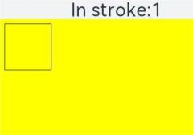
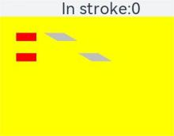

# OffscreenCanvasRenderingContext2D<a name="EN-US_TOPIC_0000001180864495"></a>


> **NOTE:** 
>**OffscreenCanvasRenderingContext2D**  is supported since API version 7. Updates will be marked with a superscript to indicate their earliest API version.

Use  **OffscreenCanvasRenderingContext2D**  to draw rectangles, images, and texts on an  **OffscreenCanvas**.

## Attributes<a name="section661391987"></a>

In addition to the attributes that are supported by  **CanvasRenderingContext2D**, the following attributes are supported.

<a name="table67211828124016"></a>
<table><thead align="left"><tr id="row108577289405"><th class="cellrowborder" valign="top" width="22.872287228722872%" id="mcps1.1.4.1.1"><p id="p385742814403"><a name="p385742814403"></a><a name="p385742814403"></a>Name</p>
</th>
<th class="cellrowborder" valign="top" width="29.352935293529352%" id="mcps1.1.4.1.2"><p id="p19857192816408"><a name="p19857192816408"></a><a name="p19857192816408"></a>Type</p>
</th>
<th class="cellrowborder" valign="top" width="47.774777477747776%" id="mcps1.1.4.1.3"><p id="p18573288402"><a name="p18573288402"></a><a name="p18573288402"></a>Description</p>
</th>
</tr>
</thead>
<tbody><tr id="row85971918336"><td class="cellrowborder" valign="top" width="22.872287228722872%" headers="mcps1.1.4.1.1 "><p id="p155980933313"><a name="p155980933313"></a><a name="p155980933313"></a>filter</p>
</td>
<td class="cellrowborder" valign="top" width="29.352935293529352%" headers="mcps1.1.4.1.2 "><p id="p735764418306"><a name="p735764418306"></a><a name="p735764418306"></a>string</p>
</td>
<td class="cellrowborder" valign="top" width="47.774777477747776%" headers="mcps1.1.4.1.3 "><p id="p1059819912335"><a name="p1059819912335"></a><a name="p1059819912335"></a>Image filter.</p>
<p id="p4505204453214"><a name="p4505204453214"></a><a name="p4505204453214"></a>Available options are as follows:</p>
<a name="ul03421175334"></a><a name="ul03421175334"></a><ul id="ul03421175334"><li><strong id="b1977553414014"><a name="b1977553414014"></a><a name="b1977553414014"></a>blur</strong>: applies the Gaussian blur for the image.</li><li><strong id="b2316102518"><a name="b2316102518"></a><a name="b2316102518"></a>brightness</strong>: applies a linear multiplication to the image to make it look brighter or darker.</li><li><strong id="b133422021012"><a name="b133422021012"></a><a name="b133422021012"></a>contrast</strong>: adjusts the image contrast.</li><li><strong id="b1132513461314"><a name="b1132513461314"></a><a name="b1132513461314"></a>drop-shadow</strong>: sets a shadow effect for the image.</li><li><strong id="b6985195518111"><a name="b6985195518111"></a><a name="b6985195518111"></a>grayscale</strong>: converts the image to a grayscale image.</li><li><strong id="b1225361013210"><a name="b1225361013210"></a><a name="b1225361013210"></a>hue-rotate</strong>: applies hue rotation to the image.</li><li><strong id="b79537247218"><a name="b79537247218"></a><a name="b79537247218"></a>invert</strong>: inverts the input image.</li><li><strong id="b15492312217"><a name="b15492312217"></a><a name="b15492312217"></a>opacity</strong>: opacity of the converted image.</li><li><strong id="b720319540212"><a name="b720319540212"></a><a name="b720319540212"></a>saturate</strong>: saturation of the converted image.</li><li><strong id="b39940155312"><a name="b39940155312"></a><a name="b39940155312"></a>sepia</strong>: converts the image to dark brown.</li></ul>
</td>
</tr>
</tbody>
</table>

-   Example

    ```
    <!-- xxx.hml -->
    <div style="width: 180px; height: 60px;">
      <canvas ref="canvasId" style="width: 500px; height: 500px; background-color: #ffff00;"></canvas>
    </div>
    ```

    ```
    //xxx.js
    export default {
      onShow(){
        var ctx = this.$refs.canvasId.getContext('2d');
        var offscreen = new OffscreenCanvas(360, 500);
        var offCanvas2 = offscreen.getContext("2d");
        var img = new Image();
        img.src = 'common/images/flower.jpg';
        offCanvas2.drawImage(img, 0, 0, 100, 100);
        offCanvas2.filter = 'blur(5px)';
        offCanvas2.drawImage(img, 100, 0, 100, 100);
    
        offCanvas2.filter = 'grayscale(50%)';
        offCanvas2.drawImage(img, 200, 0, 100, 100);
    
        offCanvas2.filter = 'hue-rotate(90deg)';
        offCanvas2.drawImage(img, 0, 100, 100, 100);
    
        offCanvas2.filter = 'invert(100%)';
        offCanvas2.drawImage(img, 100, 100, 100, 100);
    
        offCanvas2.filter = 'drop-shadow(8px 8px 10px green)';
        offCanvas2.drawImage(img, 200, 100, 100, 100);
    
        offCanvas2.filter = 'brightness(0.4)';
        offCanvas2.drawImage(img, 0, 200, 100, 100);
    
        offCanvas2.filter = 'opacity(25%)';
        offCanvas2.drawImage(img, 100, 200, 100, 100);
    
        offCanvas2.filter = 'saturate(30%)';
        offCanvas2.drawImage(img, 200, 200, 100, 100);
    
        offCanvas2.filter = 'sepia(60%)';
        offCanvas2.drawImage(img, 0, 300, 100, 100);
    
        offCanvas2.filter = 'contrast(200%)';
        offCanvas2.drawImage(img, 100, 300, 100, 100);
        var bitmap = offscreen.transferToImageBitmap();
        ctx.transferFromImageBitmap(bitmap);
      }
    }
    ```


## Methods<a name="section47669296127"></a>

In addition to the attributes that are supported by  **CanvasRenderingContext2D**, the following attributes are supported.

### isPointInPath<a name="section12576152143713"></a>

isPointInPath\(path?: Path2D, x: number, y: number\): boolean

Checks whether a specified point is in the path area.

-   Parameters

    <a name="table3592161817496"></a>
    <table><thead align="left"><tr id="row19592141864916"><th class="cellrowborder" valign="top" width="21.04%" id="mcps1.1.5.1.1"><p id="p229575610288"><a name="p229575610288"></a><a name="p229575610288"></a>Name</p>
    </th>
    <th class="cellrowborder" valign="top" width="15.260000000000002%" id="mcps1.1.5.1.2"><p id="p929585682819"><a name="p929585682819"></a><a name="p929585682819"></a>Type</p>
    </th>
    <th class="cellrowborder" valign="top" width="7.5200000000000005%" id="mcps1.1.5.1.3"><p id="p988715163459"><a name="p988715163459"></a><a name="p988715163459"></a>Mandatory</p>
    </th>
    <th class="cellrowborder" valign="top" width="56.18%" id="mcps1.1.5.1.4"><p id="p1929645618282"><a name="p1929645618282"></a><a name="p1929645618282"></a>Description</p>
    </th>
    </tr>
    </thead>
    <tbody><tr id="row1559261834915"><td class="cellrowborder" valign="top" width="21.04%" headers="mcps1.1.5.1.1 "><p id="p115927183493"><a name="p115927183493"></a><a name="p115927183493"></a>path</p>
    </td>
    <td class="cellrowborder" valign="top" width="15.260000000000002%" headers="mcps1.1.5.1.2 "><p id="p95921918114914"><a name="p95921918114914"></a><a name="p95921918114914"></a>Path2D</p>
    </td>
    <td class="cellrowborder" valign="top" width="7.5200000000000005%" headers="mcps1.1.5.1.3 "><p id="p1188716161453"><a name="p1188716161453"></a><a name="p1188716161453"></a>No</p>
    </td>
    <td class="cellrowborder" valign="top" width="56.18%" headers="mcps1.1.5.1.4 "><p id="p168291512124013"><a name="p168291512124013"></a><a name="p168291512124013"></a>Path used for checking. If this parameter is not set, the current path is used.</p>
    </td>
    </tr>
    <tr id="row195921118184916"><td class="cellrowborder" valign="top" width="21.04%" headers="mcps1.1.5.1.1 "><p id="p1622015388394"><a name="p1622015388394"></a><a name="p1622015388394"></a>x</p>
    </td>
    <td class="cellrowborder" valign="top" width="15.260000000000002%" headers="mcps1.1.5.1.2 "><p id="p1635295333919"><a name="p1635295333919"></a><a name="p1635295333919"></a>number</p>
    </td>
    <td class="cellrowborder" valign="top" width="7.5200000000000005%" headers="mcps1.1.5.1.3 "><p id="p17887616174515"><a name="p17887616174515"></a><a name="p17887616174515"></a>Yes</p>
    </td>
    <td class="cellrowborder" valign="top" width="56.18%" headers="mcps1.1.5.1.4 "><p id="p6592518124911"><a name="p6592518124911"></a><a name="p6592518124911"></a>X-coordinate of the point used for checking.</p>
    </td>
    </tr>
    <tr id="row449114413392"><td class="cellrowborder" valign="top" width="21.04%" headers="mcps1.1.5.1.1 "><p id="p1349212448390"><a name="p1349212448390"></a><a name="p1349212448390"></a>y</p>
    </td>
    <td class="cellrowborder" valign="top" width="15.260000000000002%" headers="mcps1.1.5.1.2 "><p id="p44927443396"><a name="p44927443396"></a><a name="p44927443396"></a>number</p>
    </td>
    <td class="cellrowborder" valign="top" width="7.5200000000000005%" headers="mcps1.1.5.1.3 "><p id="p18888101694519"><a name="p18888101694519"></a><a name="p18888101694519"></a>Yes</p>
    </td>
    <td class="cellrowborder" valign="top" width="56.18%" headers="mcps1.1.5.1.4 "><p id="p79061374406"><a name="p79061374406"></a><a name="p79061374406"></a>Y-coordinate of the point used for checking.</p>
    </td>
    </tr>
    </tbody>
    </table>

-   Return values

    <a name="table0782932202818"></a>
    <table><thead align="left"><tr id="row3782832172814"><th class="cellrowborder" valign="top" width="19.77%" id="mcps1.1.3.1.1"><p id="p1278314323284"><a name="p1278314323284"></a><a name="p1278314323284"></a>Type</p>
    </th>
    <th class="cellrowborder" valign="top" width="80.23%" id="mcps1.1.3.1.2"><p id="p17783153216281"><a name="p17783153216281"></a><a name="p17783153216281"></a>Description</p>
    </th>
    </tr>
    </thead>
    <tbody><tr id="row278317321285"><td class="cellrowborder" valign="top" width="19.77%" headers="mcps1.1.3.1.1 "><p id="p98384418408"><a name="p98384418408"></a><a name="p98384418408"></a>boolean</p>
    </td>
    <td class="cellrowborder" valign="top" width="80.23%" headers="mcps1.1.3.1.2 "><p id="p1537310444489"><a name="p1537310444489"></a><a name="p1537310444489"></a>Whether a specified point is in the path area.</p>
    </td>
    </tr>
    </tbody>
    </table>

-   Example

    ```
    <!-- xxx.hml -->
    <div style="width: 180px; height: 60px;">
      <text>In path:{{textValue}}</text>
      <canvas ref="canvas" style="width: 500px; height: 500px; background-color: #ffff00;"></canvas>
    </div>
    ```

    ```
    // xxx.js
    export default {
      data: {
        textValue: 0
      },
      onShow(){
        var canvas = this.$refs.canvas.getContext('2d');
        var offscreen = new OffscreenCanvas(500,500);
        var offscreenCanvasCtx = offscreen.getContext("2d");
    
        offscreenCanvasCtx.rect(10, 10, 100, 100);
        offscreenCanvasCtx.fill();
        this.textValue = offscreenCanvasCtx.isPointInPath(30, 70);
    
        var bitmap = offscreen.transferToImageBitmap();
        canvas.transferFromImageBitmap(bitmap);
      }
    }
    ```

    


### isPointInStroke<a name="section18889155054014"></a>

isPointInStroke\(path?: Path2D, x: number, y: number\): boolean

Checks whether a specified point is on the edge line of a path.

-   Parameters

    <a name="table101720539407"></a>
    <table><thead align="left"><tr id="row1317185315401"><th class="cellrowborder" valign="top" width="21.04%" id="mcps1.1.5.1.1"><p id="p71725384017"><a name="p71725384017"></a><a name="p71725384017"></a>Name</p>
    </th>
    <th class="cellrowborder" valign="top" width="15.260000000000002%" id="mcps1.1.5.1.2"><p id="p171715334016"><a name="p171715334016"></a><a name="p171715334016"></a>Type</p>
    </th>
    <th class="cellrowborder" valign="top" width="7.5200000000000005%" id="mcps1.1.5.1.3"><p id="p1182841194515"><a name="p1182841194515"></a><a name="p1182841194515"></a>Mandatory</p>
    </th>
    <th class="cellrowborder" valign="top" width="56.18%" id="mcps1.1.5.1.4"><p id="p171718539408"><a name="p171718539408"></a><a name="p171718539408"></a>Description</p>
    </th>
    </tr>
    </thead>
    <tbody><tr id="row121716534405"><td class="cellrowborder" valign="top" width="21.04%" headers="mcps1.1.5.1.1 "><p id="p1717953184014"><a name="p1717953184014"></a><a name="p1717953184014"></a>path</p>
    </td>
    <td class="cellrowborder" valign="top" width="15.260000000000002%" headers="mcps1.1.5.1.2 "><p id="p171817535409"><a name="p171817535409"></a><a name="p171817535409"></a>Path2D</p>
    </td>
    <td class="cellrowborder" valign="top" width="7.5200000000000005%" headers="mcps1.1.5.1.3 "><p id="p8822419452"><a name="p8822419452"></a><a name="p8822419452"></a>No</p>
    </td>
    <td class="cellrowborder" valign="top" width="56.18%" headers="mcps1.1.5.1.4 "><p id="p91855319403"><a name="p91855319403"></a><a name="p91855319403"></a>Path used for checking. If this parameter is not set, the current path is used.</p>
    </td>
    </tr>
    <tr id="row1181653114010"><td class="cellrowborder" valign="top" width="21.04%" headers="mcps1.1.5.1.1 "><p id="p518253104016"><a name="p518253104016"></a><a name="p518253104016"></a>x</p>
    </td>
    <td class="cellrowborder" valign="top" width="15.260000000000002%" headers="mcps1.1.5.1.2 "><p id="p17181653194010"><a name="p17181653194010"></a><a name="p17181653194010"></a>number</p>
    </td>
    <td class="cellrowborder" valign="top" width="7.5200000000000005%" headers="mcps1.1.5.1.3 "><p id="p48214116452"><a name="p48214116452"></a><a name="p48214116452"></a>Yes</p>
    </td>
    <td class="cellrowborder" valign="top" width="56.18%" headers="mcps1.1.5.1.4 "><p id="p518185344013"><a name="p518185344013"></a><a name="p518185344013"></a>X-coordinate of the point used for checking.</p>
    </td>
    </tr>
    <tr id="row118185354016"><td class="cellrowborder" valign="top" width="21.04%" headers="mcps1.1.5.1.1 "><p id="p91895354013"><a name="p91895354013"></a><a name="p91895354013"></a>y</p>
    </td>
    <td class="cellrowborder" valign="top" width="15.260000000000002%" headers="mcps1.1.5.1.2 "><p id="p1318953104011"><a name="p1318953104011"></a><a name="p1318953104011"></a>number</p>
    </td>
    <td class="cellrowborder" valign="top" width="7.5200000000000005%" headers="mcps1.1.5.1.3 "><p id="p782114119457"><a name="p782114119457"></a><a name="p782114119457"></a>Yes</p>
    </td>
    <td class="cellrowborder" valign="top" width="56.18%" headers="mcps1.1.5.1.4 "><p id="p2018195312409"><a name="p2018195312409"></a><a name="p2018195312409"></a>Y-coordinate of the point used for checking.</p>
    </td>
    </tr>
    </tbody>
    </table>

-   Return values

    <a name="table3572363195"></a>
    <table><thead align="left"><tr id="row1572669197"><th class="cellrowborder" valign="top" width="19.77%" id="mcps1.1.3.1.1"><p id="p1857211681912"><a name="p1857211681912"></a><a name="p1857211681912"></a>Type</p>
    </th>
    <th class="cellrowborder" valign="top" width="80.23%" id="mcps1.1.3.1.2"><p id="p1257216171910"><a name="p1257216171910"></a><a name="p1257216171910"></a>Description</p>
    </th>
    </tr>
    </thead>
    <tbody><tr id="row195722063190"><td class="cellrowborder" valign="top" width="19.77%" headers="mcps1.1.3.1.1 "><p id="p8572369196"><a name="p8572369196"></a><a name="p8572369196"></a>boolean</p>
    </td>
    <td class="cellrowborder" valign="top" width="80.23%" headers="mcps1.1.3.1.2 "><p id="p12572186101919"><a name="p12572186101919"></a><a name="p12572186101919"></a>Whether a specified point is in the path area.</p>
    </td>
    </tr>
    </tbody>
    </table>

-   Example

    ```
    <!-- xxx.hml -->
    <div style="width: 180px; height: 60px;">
      <text>In path:{{textValue}}</text>
      <canvas ref="canvas" style="width: 500px; height: 500px; background-color: #ffff00;"></canvas>
    </div>
    ```

    ```
    // xxx.js
    export default {
      data: {
        textValue: 0
      },
      onShow(){
        var canvas = this.$refs.canvas.getContext('2d');
        var offscreen = new OffscreenCanvas(500,500);
        var offscreenCanvasCtx = offscreen.getContext("2d");
    
        offscreenCanvasCtx.rect(10, 10, 100, 100);
        offscreenCanvasCtx.stroke();
        this.textValue = offscreenCanvasCtx.isPointInStroke(50, 10);
    
        var bitmap = offscreen.transferToImageBitmap();
        canvas.transferFromImageBitmap(bitmap);
      }
    }
    ```

    


### resetTransform<a name="section1098812560426"></a>

resetTransform\(\): void

-   Example

    ```
    <!-- xxx.hml -->
    <div style="width: 180px; height: 60px;">
      <text>In path:{{textValue}}</text>
      <canvas ref="canvas" style="width: 500px; height: 500px; background-color: #ffff00;"></canvas>
    </div>
    ```

    ```
    //xxx.js
    export default {
      data:{
       textValue:0
      },
      onShow(){
       var canvas = this.$refs.canvas.getContext('2d');
       var offscreen = new OffscreenCanvas(500,500);
       var offscreenCanvasCtx = offscreen.getContext("2d");
    
       offscreenCanvasCtx.transform(1, 0, 1.7, 1, 0, 0);
       offscreenCanvasCtx.fillStyle = 'gray';
       offscreenCanvasCtx.fillRect(40, 40, 50, 20);
       offscreenCanvasCtx.fillRect(40, 90, 50, 20);
    
       // Non-skewed rectangles
       offscreenCanvasCtx.resetTransform();
       offscreenCanvasCtx.fillStyle = 'red';
       offscreenCanvasCtx.fillRect(40, 40, 50, 20);
       offscreenCanvasCtx.fillRect(40, 90, 50, 20);
    
       var bitmap = offscreen.transferToImageBitmap();
       canvas.transferFromImageBitmap(bitmap);
      } 
    }
    ```

    

