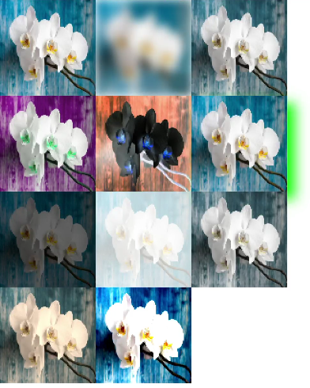

# OffscreenCanvasRenderingContext2D<a name="EN-US_TOPIC_0000001180864495"></a>

> **NOTE:** 
>The APIs of this module are supported since API version 7.

Use  **OffscreenCanvasRenderingContext2D**  to draw rectangles, images, and texts on the offscreen canvas.

## Attributes<a name="section661391987"></a>

In addition to the attributes that are supported by  **CanvasRenderingContext2D**, the following attributes are supported.

<a name="table67211828124016"></a>
<table><thead align="left"><tr id="row108577289405"><th class="cellrowborder" valign="top" width="22.872287228722872%" id="mcps1.1.4.1.1"><p id="p385742814403"><a name="p385742814403"></a><a name="p385742814403"></a>Attributes</p>
</th>
<th class="cellrowborder" valign="top" width="29.352935293529352%" id="mcps1.1.4.1.2"><p id="p19857192816408"><a name="p19857192816408"></a><a name="p19857192816408"></a>Type</p>
</th>
<th class="cellrowborder" valign="top" width="47.774777477747776%" id="mcps1.1.4.1.3"><p id="p18573288402"><a name="p18573288402"></a><a name="p18573288402"></a>Description</p>
</th>
</tr>
</thead>
<tbody><tr id="row85971918336"><td class="cellrowborder" valign="top" width="22.872287228722872%" headers="mcps1.1.4.1.1 "><p id="p155980933313"><a name="p155980933313"></a><a name="p155980933313"></a>filter</p>
</td>
<td class="cellrowborder" valign="top" width="29.352935293529352%" headers="mcps1.1.4.1.2 "><p id="p735764418306"><a name="p735764418306"></a><a name="p735764418306"></a>string</p>
</td>
<td class="cellrowborder" valign="top" width="47.774777477747776%" headers="mcps1.1.4.1.3 "><p id="p1059819912335"><a name="p1059819912335"></a><a name="p1059819912335"></a>Image filter.</p>
<p id="p4505204453214"><a name="p4505204453214"></a><a name="p4505204453214"></a>Available options are as follows:</p>
<a name="ul03421175334"></a><a name="ul03421175334"></a><ul id="ul03421175334"><li><strong id="b1977553414014"><a name="b1977553414014"></a><a name="b1977553414014"></a>blur</strong>: applies the Gaussian blur for the image.</li><li><strong id="b2316102518"><a name="b2316102518"></a><a name="b2316102518"></a>brightness</strong>: applies a linear multiplication to the image to make it look brighter or darker.</li><li><strong id="b133422021012"><a name="b133422021012"></a><a name="b133422021012"></a>contrast</strong>: adjusts the image contrast.</li><li><strong id="b1132513461314"><a name="b1132513461314"></a><a name="b1132513461314"></a>drop-shadow</strong>: sets a shadow effect for the image.</li><li><strong id="b6985195518111"><a name="b6985195518111"></a><a name="b6985195518111"></a>grayscale</strong>: converts the image to a grayscale image.</li><li><strong id="b1225361013210"><a name="b1225361013210"></a><a name="b1225361013210"></a>hue-rotate</strong>: applies hue rotation to the image.</li><li><strong id="b79537247218"><a name="b79537247218"></a><a name="b79537247218"></a>invert</strong>: inverts the input image.</li><li><strong id="b15492312217"><a name="b15492312217"></a><a name="b15492312217"></a>opacity</strong>: transparency of the converted image.</li><li><strong id="b720319540212"><a name="b720319540212"></a><a name="b720319540212"></a>saturation</strong>: saturation of the converted image.</li><li><strong id="b39940155312"><a name="b39940155312"></a><a name="b39940155312"></a>sepia</strong>: converts the image to dark brown.</li></ul>
</td>
</tr>
</tbody>
</table>

-   Example

```
var ctx = this.$refs.canvasid.getContext('2d');
var offscreen = new OffscreenCanvas(360, 500);
var offCanvas2 = offscreen.getContext("2d");
var img = new Image();
img.src = 'common/images/flower.jpg';
offCanvas2.drawImage(img, 0, 0, 100, 100);
offCanvas2.filter = 'blur(5px)';
offCanvas2.drawImage(img, 100, 0, 100, 100);

offCanvas2.filter = 'grayscale(50%)';
offCanvas2.drawImage(img, 200, 0, 100, 100);

offCanvas2.filter = 'hue-rotate(90deg)';
offCanvas2.drawImage(img, 0, 100, 100, 100);

offCanvas2.filter = 'invert(100%)';
offCanvas2.drawImage(img, 100, 100, 100, 100);

offCanvas2.filter = 'drop-shadow(8px 8px 10px green)';
offCanvas2.drawImage(img, 200, 100, 100, 100);

offCanvas2.filter = 'brightness(0.4)';
offCanvas2.drawImage(img, 0, 200, 100, 100);

offCanvas2.filter = 'opacity(25%)';
offCanvas2.drawImage(img, 100, 200, 100, 100);

offCanvas2.filter = 'saturate(30%)';
offCanvas2.drawImage(img, 200, 200, 100, 100);

offCanvas2.filter = 'sepia(60%)';
offCanvas2.drawImage(img, 0, 300, 100, 100);

offCanvas2.filter = 'contrast(200%)';
offCanvas2.drawImage(img, 100, 300, 100, 100);
var bitmap = offscreen.transferToImageBitmap();
ctx.transferFromImageBitmap(bitmap);
```



## Methods<a name="section47669296127"></a>

In addition to the attributes that are supported by  **CanvasRenderingContext2D**, the following attributes are supported.

<a name="td0f869ce272e4d90b1c7df558ad7635e"></a>
<table><thead align="left"><tr id="rf11e90428c78465b9e3a0c3ec2222a3c"><th class="cellrowborder" valign="top" width="10.81%" id="mcps1.1.4.1.1"><p id="a11b4cb4edcf14b5584841b089cbea895"><a name="a11b4cb4edcf14b5584841b089cbea895"></a><a name="a11b4cb4edcf14b5584841b089cbea895"></a>Name</p>
</th>
<th class="cellrowborder" valign="top" width="26.19%" id="mcps1.1.4.1.2"><p id="ac56fe081db8a4ddca537c39d9abfcd33"><a name="ac56fe081db8a4ddca537c39d9abfcd33"></a><a name="ac56fe081db8a4ddca537c39d9abfcd33"></a>Parameter</p>
</th>
<th class="cellrowborder" valign="top" width="63%" id="mcps1.1.4.1.3"><p id="a05cdd2c741a54fe3a44575a5b2384be3"><a name="a05cdd2c741a54fe3a44575a5b2384be3"></a><a name="a05cdd2c741a54fe3a44575a5b2384be3"></a>Description</p>
</th>
</tr>
</thead>
<tbody><tr id="r960677f8f5e64d7f9b33b8a0ae0c824f"><td class="cellrowborder" valign="top" width="10.81%" headers="mcps1.1.4.1.1 "><p id="p931916913120"><a name="p931916913120"></a><a name="p931916913120"></a>isPointInPath</p>
<p id="p11907165844810"><a name="p11907165844810"></a><a name="p11907165844810"></a></p>
</td>
<td class="cellrowborder" valign="top" width="26.19%" headers="mcps1.1.4.1.2 "><p id="p13193144905014"><a name="p13193144905014"></a><a name="p13193144905014"></a>path?: Path2D, x: number, y: number</p>
</td>
<td class="cellrowborder" valign="top" width="63%" headers="mcps1.1.4.1.3 "><p id="p16545402518"><a name="p16545402518"></a><a name="p16545402518"></a>Checks whether a specified point is in the path area.</p>
<p id="p18921037165115"><a name="p18921037165115"></a><a name="p18921037165115"></a><strong id="b15871191346"><a name="b15871191346"></a><a name="b15871191346"></a>path</strong>: optional object, which specifies the path used for checking. If this parameter is not set, the current path is used.</p>
<p id="p10885826185416"><a name="p10885826185416"></a><a name="p10885826185416"></a><strong id="b136243911520"><a name="b136243911520"></a><a name="b136243911520"></a>x</strong>: X-coordinate of the point used for checking.</p>
<p id="p17751133085419"><a name="p17751133085419"></a><a name="p17751133085419"></a><strong id="b104429474512"><a name="b104429474512"></a><a name="b104429474512"></a>y</strong>: Y-coordinate of the point used for checking.</p>
</td>
</tr>
<tr id="row13364759185512"><td class="cellrowborder" valign="top" width="10.81%" headers="mcps1.1.4.1.1 "><p id="p5364145915552"><a name="p5364145915552"></a><a name="p5364145915552"></a>isPointInStroke</p>
</td>
<td class="cellrowborder" valign="top" width="26.19%" headers="mcps1.1.4.1.2 "><p id="p162714244571"><a name="p162714244571"></a><a name="p162714244571"></a>path?: Path2D, x: number, y: number</p>
</td>
<td class="cellrowborder" valign="top" width="63%" headers="mcps1.1.4.1.3 "><p id="p1336455955512"><a name="p1336455955512"></a><a name="p1336455955512"></a>Checks whether a specified point is on the edge line of a path.</p>
<p id="p1362284019185"><a name="p1362284019185"></a><a name="p1362284019185"></a><strong id="b14219193419613"><a name="b14219193419613"></a><a name="b14219193419613"></a>path</strong>: optional object, which specifies the path used for checking. If this parameter is not set, the current path is used.</p>
<p id="p1262224011185"><a name="p1262224011185"></a><a name="p1262224011185"></a><strong id="b157954813612"><a name="b157954813612"></a><a name="b157954813612"></a>x</strong>: X-coordinate of the point used for checking.</p>
<p id="p66220409182"><a name="p66220409182"></a><a name="p66220409182"></a><strong id="b142218502066"><a name="b142218502066"></a><a name="b142218502066"></a>y</strong>: Y-coordinate of the point used for checking.</p>
</td>
</tr>
<tr id="row477613917194"><td class="cellrowborder" valign="top" width="10.81%" headers="mcps1.1.4.1.1 "><p id="p107779911916"><a name="p107779911916"></a><a name="p107779911916"></a>resetTransform</p>
</td>
<td class="cellrowborder" valign="top" width="26.19%" headers="mcps1.1.4.1.2 "><p id="p107771192192"><a name="p107771192192"></a><a name="p107771192192"></a>None</p>
</td>
<td class="cellrowborder" valign="top" width="63%" headers="mcps1.1.4.1.3 "><p id="p277714913197"><a name="p277714913197"></a><a name="p277714913197"></a>Resets the current transformation to a unit matrix.</p>
</td>
</tr>
</tbody>
</table>

-   isPointInPath example


```
<!-- xxx.hml -->
<div style="width: 180px; height: 60px;">
  <text>In path:{{textValue}}</text>
</div>
<canvas ref="canvasId" style="width: 500px; height: 500px; background-color: #ffff00;"></canvas>
```

```
// xxx.js
export default {
  data: {
    textValue: 0
  },
  onShow(){
    var canvas = this.$refs.canvas.getContext('2d');
    var offscreen = new OffscreenCanvas(500,500);
    var offscreenCanvasCtx = offscreen.getContext("2d");

    offscreenCanvasCtx.rect(10, 10, 100, 100);
    offscreenCanvasCtx.fill();
    this.textValue = offscreenCanvasCtx.isPointInPath(30, 70);

    var bitmap = offscreen.transferToImageBitmap();
    canvas.transferFromImageBitmap(bitmap);
  }
}
```

-   isPointInStroke example


```
<!-- xxx.hml -->
<div style="width: 180px; height: 60px;">
  <text>In path:{{textValue}}</text>
</div>
<canvas ref="canvasId" style="width: 500px; height: 500px; background-color: #ffff00;"></canvas>
```

```
// xxx.js
export default {
  data: {
    textValue: 0
  },
  onShow(){
    var canvas = this.$refs.canvas.getContext('2d');
    var offscreen = new OffscreenCanvas(500,500);
    var offscreenCanvasCtx = offscreen.getContext("2d");

    offscreenCanvasCtx.rect(10, 10, 100, 100);
    offscreenCanvasCtx.stroke();
    this.textValue = offscreenCanvasCtx.isPointInStroke(50, 10);

    var bitmap = offscreen.transferToImageBitmap();
    canvas.transferFromImageBitmap(bitmap);
  }
}
```

-   resetTransform example


```
var canvas = this.$refs.canvas.getContext('2d');
var offscreen = new OffscreenCanvas(500,500);
var offscreenCanvasCtx = offscreen.getContext("2d");

offscreenCanvasCtx.transform(1, 0, 1.7, 1, 0, 0);
offscreenCanvasCtx.fillStyle = 'gray';
offscreenCanvasCtx.fillRect(40, 40, 50, 20);
offscreenCanvasCtx.fillRect(40, 90, 50, 20);

// Non-skewed rectangles
offscreenCanvasCtx.resetTransform();
offscreenCanvasCtx.fillStyle = 'red';
offscreenCanvasCtx.fillRect(40, 40, 50, 20);
offscreenCanvasCtx.fillRect(40, 90, 50, 20);

var bitmap = offscreen.transferToImageBitmap();
canvas.transferFromImageBitmap(bitmap);
```

