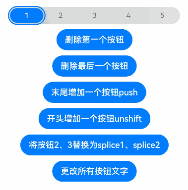

# @ohos.arkui.advanced.SegmentButton (Segment Button)

A segment button is a group of options, such as tabs, single-select options, and multi-select options.

>**NOTE**
>
>This component and its child components are supported since API version 11. Updates will be marked with a superscript to indicate their earliest API version.

## Modules to Import

```
import { SegmentButton, SegmentButtonOptions, SegmentButtonItemOptionsArray } from '@ohos.arkui.advanced.SegmentButton'
```

## Child Components

Not supported

## SegmentButton

SegmentButton({ options: SegmentButtonOptions, selectedIndexes: number[] })

**Decorator**: @Component

**System capability**: SystemCapability.ArkUI.ArkUI.Full

**Parameters**

| Name           | Type                                     | Mandatory| Decorator | Description                                                        |
| --------------- | --------------------------------------------- | ---- | ----------- | ------------------------------------------------------------ |
| options         | [SegmentButtonOptions](#segmentbuttonoptions) | Yes  | @ObjectLink | Options of the segment button.                                              |
| selectedIndexes | number[]                                      | Yes  | @Link       | Indexes of selected options of the segment button. The index starts from 0 and increments by 1.<br>**NOTE**<br>**selectedIndexes** is decorated with [@Link](../../quick-start/arkts-link.md) to implement parent-child two-way synchronization. If no options are selected, an empty array **[]** can be passed in.|

>**NOTE**
>
>The segment button does not support the universal attributes. The segment button takes up the maximum width allowed by the content area, and evenly allocates the width among its options. It adapts its height automatically to the content (text and image), the minimum height being 28 vp.

## SegmentButtonOptions

Provides initial data and custom attributes for the segment button.

### Attributes

| Name                   | Type                                                        | Description                                                        |
| ----------------------- | ------------------------------------------------------------ | ------------------------------------------------------------ |
| type                    | "tab" \| "capsule"                                           | Type of the segment button.                                            |
| multiply                | boolean                                                      | Whether multiple options can be selected.<br>**NOTE**<br>For the segment button consisting of tabs, only one option can be selected. In this case, setting **multiply** to **true** does not take effect.|
| buttons                 | [SegmentButtonItemOptionsArray](#segmentbuttonitemoptionsarray) | Button information, including the icon and text.                              |
| fontColor               | [ResourceColor](ts-types.md#resourcecolor)                   | Font color of the option when not selected.<br>Default value: **#99182431**                 |
| selectedFontColor       | [ResourceColor](ts-types.md#resourcecolor)                   | Font color of the option when selected.<br>Default value: **#ff182431**                   |
| fontSize                | [DimensionNoPercentage](#dimensionnopercentage)              | Font size of the option when not selected. It cannot be set in percentage.<br>Default value: **14.0fp**|
| selectedFontSize        | [DimensionNoPercentage](#dimensionnopercentage)              | Font size of the option when selected. It cannot be set in percentage.<br>Default value: **14.0fp**  |
| fontWeight              | [FontWeight](ts-appendix-enums.md#fontweight)                | Font weight of the option when not selected.<br>Default value: **FontWeight.Regular**        |
| selectedFontWeight      | [FontWeight](ts-appendix-enums.md#fontweight)                | Font weight of the option when selected.<br>Default value: **FontWeight.Medium**           |
| backgroundColor         | [ResourceColor](ts-types.md#resourcecolor)                   | Background color.<br>Default value: **\#0c182431** for tabs and **\#0c182431** for single-select and mult-select options|
| selectedBackgroundColor | [ResourceColor](ts-types.md#resourcecolor)                   | Background color of the option when selected.<br>Default value: **\#ffffffff** for tabs and **\#ff007dff** for single-select and mult-select options|
| imageSize               | [SizeOptions](ts-types.md#sizeoptions)                       | Image size. <br>Default value: { width: 24, height: 24 }<br>**NOTE**<br>This attribute is effective only for buttons that contain icons.|
| buttonMargin            | [Margin](ts-types.md#margin)\|[Dimension](ts-types.md#dimension10) | Button margin.<br>Default value: **{ top: 4, right: 8, bottom: 4, left: 8 }** for icon buttons and text buttons, and **{ top: 6, right: 8, bottom: 6, left: 8 }** for icon+text buttons.|
| textMargin              | [Margin](ts-types.md#margin)\|[Dimension](ts-types.md#dimension10) | Text margin.<br>Default value: **0**                                     |
| backgroundBlurStyle     | [BlurStyle](ts-appendix-enums.md#blurstyle9)                 | Background blur style applied between the content and the background.<br>Default value: **BlurStyle.NONE**                     |

### constructor

constructor(options: TabSegmentButtonOptions | CapsuleSegmentButtonOptions)

Implements a constructor.

**Parameters**


| Name   | Type                                                    | Mandatory| Description                |
| ------- | ------------------------------------------------------------ | ---- | -------------------- |
| options | [TabSegmentButtonConstructionOptions](#tabsegmentbuttonconstructionoptions) \|   [CapsuleSegmentButtonConstructionOptions](#capsulesegmentbuttonconstructionoptions) | Yes| Information about the segment button.|

### tab

static tab(options: TabSegmentButtonConstructionOptions): SegmentButtonOptions

Creates a **SegmentButtonOptions** object for the segment button consisting of tabs.

**Parameters**


| Name   | Type                                                    | Mandatory| Description                |
| ------- | ------------------------------------------------------------ | ---- | -------------------- |
| options | [TabSegmentButtonConstructionOptions](#tabsegmentbuttonconstructionoptions) | Yes  | Options of the segment button.|

**Return value**

| Type  | Description                    |
| ------ | ------------------------ |
| [SegmentButtonOptions](#segmentbuttonoptions) | **SegmentButtonOptions** object.|

### capsule

static capsule(options: CapsuleSegmentButtonConstructionOptions): SegmentButtonOptions

Creates a **SegmentButtonOptions** object for the segment button consisting of single-select or multi-select options.

**Parameters**


| Name   | Type                                                    | Mandatory| Description                       |
| ------- | ------------------------------------------------------------ | ---- | --------------------------- |
| options | [CapsuleSegmentButtonConstructionOptions](#capsulesegmentbuttonconstructionoptions) | Yes  | Options of the segment button.|

**Return value**

| Type  | Description                    |
| ------ | ------------------------ |
| [SegmentButtonOptions](#segmentbuttonoptions) | **SegmentButtonOptions** object.|

## DimensionNoPercentage

Represents the length union type that does not support values in percentage.

**System capability**: SystemCapability.ArkUI.ArkUI.Full

| Value                        | Description                                         |
| -------------------------------- | --------------------------------------------- |
| [PX](ts-types.md#px10)           | The **PX** type is used to represent a length in px. |
| [VP](ts-types.md#vp10)           | The **VP** type is used to represent a length in vp. |
| [FP](ts-types.md#fp10)           | The **FP** type is used to represent a length in fp. |
| [LPX](ts-types.md#lpx10)         | The **LPX** type is used to represent a length in lpx.|
| [Resource](ts-types.md#resource) | The **Resource** type is used to reference resources for setting component attributes.         |

## CommonSegmentButtonOptions

Defines the attributes that can be customized for the segment button.

**System capability**: SystemCapability.ArkUI.ArkUI.Full

**Attributes**

| Name                   | Type                                                        | Description                                                        |
| ----------------------- | ------------------------------------------------------------ | ------------------------------------------------------------ |
| fontColor               | [ResourceColor](ts-types.md#resourcecolor)                   | Font color of the option when not selected.<br>Default value: **#99182431**                 |
| selectedFontColor       | [ResourceColor](ts-types.md#resourcecolor)                   | Font color of the option when selected.<br>Default value: **#ff182431**                   |
| fontSize                | [DimensionNoPercentage](#dimensionnopercentage)              | Font size of the option when not selected. It cannot be set in percentage.<br>Default value: **14.0fp**|
| selectedFontSize        | [DimensionNoPercentage](#dimensionnopercentage)              | Font size of the option when selected. It cannot be set in percentage.<br>Default value: **14.0fp**  |
| fontWeight              | [FontWeight](ts-appendix-enums.md#fontweight)                | Font weight of the option when not selected.<br>Default value: **FontWeight.Regular**        |
| selectedFontWeight      | [FontWeight](ts-appendix-enums.md#fontweight)                | Font weight of the option when selected.<br>Default value: **FontWeight.Medium**           |
| backgroundColor         | [ResourceColor](ts-types.md#resourcecolor)                   | Background color.<br>Default value: **\#0c182431** for tabs and **\#0c182431** for single-select and mult-select options|
| selectedBackgroundColor | [ResourceColor](ts-types.md#resourcecolor)                   | Background color of the option when selected.<br>Default value: **\#ffffffff** for tabs and **\#ff007dff** for single-select and mult-select options|
| imageSize               | [SizeOptions](ts-types.md#sizeoptions)                       | Image size. <br>Default value: { width: 24, height: 24 }<br>**NOTE**<br>This attribute is effective only for buttons that contain icons.|
| buttonMargin            | [Margin](ts-types.md#margin)\|[Dimension](ts-types.md#dimension10) | Button margin.<br>Default value: **{ top: 4, right: 8, bottom: 4, left: 8 }** for icon buttons and text buttons, and **{ top: 6, right: 8, bottom: 6, left: 8 }** for icon+text buttons.|
| textMargin              | [Margin](ts-types.md#margin)\|[Dimension](ts-types.md#dimension10) | Text margin.<br>Default value: **0**                                     |
| backgroundBlurStyle     | [BlurStyle](ts-appendix-enums.md#blurstyle9)                 | Background blur style applied between the content and the background.<br>Default value: **BlurStyle.NONE**                     |

## TabSegmentButtonConstructionOptions

Implements a **SegmentButtonOptions** object for the segment button consisting of tabs.

It inherits [CommonSegmentButtonOptions](#commonsegmentbuttonoptions).

**System capability**: SystemCapability.ArkUI.ArkUI.Full

| Name   | Type                                                        | Mandatory| Description      |
| ------- | ------------------------------------------------------------ | ---- | ---------- |
| buttons | [ItemRestriction](#itemrestriction)\<[SegmentButtonTextItem](#segmentbuttontextitem)> | Yes  | Button information.|

## CapsuleSegmentButtonConstructionOptions

Implements a **SegmentButtonOptions** object for the segment button consisting of single-select or multi-select options.

It inherits [CommonSegmentButtonOptions](#commonsegmentbuttonoptions).

**System capability**: SystemCapability.ArkUI.ArkUI.Full

| Name    | Type                                             | Mandatory| Description                         |
| -------- | ------------------------------------------------- | ---- | ----------------------------- |
| buttons  | [SegmentButtonItemTuple](#segmentbuttonitemtuple) | Yes  | Button information.                   |
| multiply | boolean                                           | No  | Whether multiple options can be selected.<br>Default value: **false**|

## ItemRestriction

Represents a tuple used to store button information.

| Value                                 | Description                             |
| ----------------------------------------- | --------------------------------- |
| ItemRestriction\<T\> = [T, T, T?, T?, T?] | A tuple that contains two to five elements of the same type.|

>**NOTE**
>
>A segment button supports two to five options.

## SegmentButtonItemTuple

Represents the tuple union type used to store button information.

**System capability**: SystemCapability.ArkUI.ArkUI.Full

| Value                                                    | Description                     |
| ------------------------------------------------------------ | ------------------------- |
| [ItemRestriction](#itemrestriction)\<[SegmentButtonTextItem](#segmentbuttontextitem)\> | A tuple of text-only button information.   |
| [ItemRestriction](#itemrestriction)\<[SegmentButtonIconItem](#segmentbuttoniconitem)\> | A tuple of icon-only button information.   |
| [ItemRestriction](#itemrestriction)\<[SegmentButtonIconTextItem](#segmentbuttonicontextitem)\> | A tuple of icon and text button information.|

## SegmentButtonItemArray

Represents the array union type used to store button information.

**System capability**: SystemCapability.ArkUI.ArkUI.Full

| Value                                                    | Description                     |
| ------------------------------------------------------------ | ------------------------- |
| Array\<[SegmentButtonTextItem](#segmentbuttontextitem)\>     | An array of text-only button information.   |
| Array\<[SegmentButtonIconItem](#segmentbuttoniconitem)\>     | An array of icon-only button information.   |
| Array\<[SegmentButtonIconTextItem](#segmentbuttonicontextitem)\> | An array of icon and text button information.|

## SegmentButtonItemOptionsArray

Implements an array for storing button information.

>**NOTE**
>
>A segment button supports two to five options. As such, a **SegmentButtonItemOptionsArray** object stores information about only two to five button options.

### constructor

constructor(elements: SegmentButtonItemTuple)

Implements a constructor.

**Parameters**


| Name    | Type                                         | Mandatory| Description      |
| -------- | ------------------------------------------------- | ---- | ---------- |
| elements | [SegmentButtonItemTuple](#segmentbuttonitemtuple) | Yes  | Button information.|

### push

push(...items: SegmentButtonItemArray): number

Adds the specified elements to the end of this array and returns the new length of the array.

**Parameters**


| Name | Type                                         | Mandatory| Description                  |
| ----- | ------------------------------------------------- | ---- | ---------------------- |
| items | [SegmentButtonItemArray](#segmentbuttonitemarray) | Yes  | Elements to add to the end of the array.|

**Return value**

| Type  | Description                    |
| ------ | ------------------------ |
| number | Length of the array after the elements are added.|

>**NOTE**
>
>A segment button supports two to five options. As such, a **SegmentButtonItemOptionsArray** object stores information about only two to five button options. If the number limit is reached, this API will not work.

### pop

pop(): SegmentButtonItemOptions | undefined

Removes the last element from this array and returns that element.

**Return value**

| Type                                                        | Description          |
| ------------------------------------------------------------ | -------------- |
| [SegmentButtonItemOptions](#segmentbuttonitemoptions)\| undefined | Element removed from the array.|

>**NOTE**
>
>A segment button supports two to five options. As such, a **SegmentButtonItemOptionsArray** object stores information about only two to five button options. If the number limit is reached, this API will not work.

### shift

shift(): SegmentButtonItemOptions | undefined

Removes the first element from this array and returns that element.

**Return value**

| Type                                                        | Description          |
| ------------------------------------------------------------ | -------------- |
| [SegmentButtonItemOptions](#segmentbuttonitemoptions)\| undefined | Element removed from the array.|

>**NOTE**
>
>A segment button supports two to five options. As such, a **SegmentButtonItemOptionsArray** object stores information about only two to five button options. If the number limit is reached, this API will not work.

### unshift

unshift(...items: SegmentButtonItemArray): number

Adds the specified elements to the beginning of this array and returns the new length of the array.

**Parameters**


| Name | Type                                         | Mandatory| Description                |
| ----- | ------------------------------------------------- | ---- | -------------------- |
| items | [SegmentButtonItemArray](#segmentbuttonitemarray) | Yes  | Elements to add to the beginning of the array.|

**Return value**

| Type  | Description                  |
| ------ | ---------------------- |
| number | Length of the array after the elements are added.|

>**NOTE**
>
>A segment button supports two to five options. As such, a **SegmentButtonItemOptionsArray** object stores information about only two to five button options. If the number limit is reached, this API will not work.

### splice

splice(start: number, deleteCount: number, ...items: SegmentButtonItemOptions[]): SegmentButtonItemOptions[]

Changes the contents of this array by removing the specified number of elements from the specified position and adding new elements in place. This API returns an array containing the removed elements.

**Parameters**


| Name       | Type                                               | Mandatory| Description                |
| ----------- | ------------------------------------------------------- | ---- | -------------------- |
| start       | number                                                  | Yes  | Index of the position starting from which elements are to be removed.|
| deleteCount | number                                                  | Yes  | Number of elements to remove.    |
| items       | [SegmentButtonItemOptions](#segmentbuttonitemoptions)[] | No  | Elements to add to the array.      |

**Return value**

| Type                                                   | Description                          |
| ------------------------------------------------------- | ------------------------------ |
| [SegmentButtonItemOptions](#segmentbuttonitemoptions)[] | An array containing the removed elements.|

>**NOTE**
>
>A segment button supports two to five options. As such, a **SegmentButtonItemOptionsArray** object stores information about only two to five button options. If the number limit is reached, this API will not work.

### create

static create(elements: SegmentButtonItemTuple): SegmentButtonItemOptionsArray

Creates a **SegmentButtonItemOptionsArray** object.

**Parameters**


| Name    | Type                                         | Mandatory| Description      |
| -------- | ------------------------------------------------- | ---- | ---------- |
| elements | [SegmentButtonItemTuple](#segmentbuttonitemtuple) | Yes  | Button information.|

**Return value**

| Type                                                        | Description                                     |
| ------------------------------------------------------------ | ----------------------------------------- |
| [SegmentButtonItemOptionsArray](#segmentbuttonitemoptionsarray) | Created **SegmentButtonItemOptionsArray** object.|

## TabSegmentButtonOptions

Provides the options of the segment button consisting of tabs. It inherits [TabSegmentButtonConstructionOptions](#tabsegmentbuttonconstructionoptions).

**System capability**: SystemCapability.ArkUI.ArkUI.Full

| Name| Type | Mandatory| Description                  |
| ---- | ----- | ---- | ---------------------- |
| type | "tab" | No  | Segment button consisting of tabs.|

## CapsuleSegmentButtonOptions

Provides the options of the segment button consisting of single-select or multi-select options. It inherits [CapsuleSegmentButtonConstructionOptions](#capsulesegmentbuttonconstructionoptions).

**System capability**: SystemCapability.ArkUI.ArkUI.Full

| Name| Type     | Mandatory| Description                         |
| ---- | --------- | ---- | ----------------------------- |
| type | "capsule" | No  | Segment button consisting of single-select or multi-select options.|

## SegmentButtonTextItem

Provides text button information.

**System capability**: SystemCapability.ArkUI.ArkUI.Full

| Name| Type                                  | Mandatory| Description      |
| ---- | -------------------------------------- | ---- | ---------- |
| text | [ResourceStr](ts-types.md#resourcestr) | Yes  | Button text.|

## SegmentButtonIconItem

Provides icon button information.

**System capability**: SystemCapability.ArkUI.ArkUI.Full

| Name        | Type                                  | Mandatory| Description                |
| ------------ | -------------------------------------- | ---- | -------------------- |
| icon         | [ResourceStr](ts-types.md#resourcestr) | Yes  | Icon of the option when not selected.|
| selectedIcon | [ResourceStr](ts-types.md#resourcestr) | Yes  | Icon of the option when selected.  |

>**NOTE**
>
>For the settings to take effect, both **icon** and **selectedIcon** must be set.

## SegmentButtonIconTextItem

Provides icon+text button information.

**System capability**: SystemCapability.ArkUI.ArkUI.Full

| Name        | Type                                  | Mandatory| Description                |
| ------------ | -------------------------------------- | ---- | -------------------- |
| icon         | [ResourceStr](ts-types.md#resourcestr) | Yes  | Icon of the option when not selected.|
| selectedIcon | [ResourceStr](ts-types.md#resourcestr) | Yes  | Icon of the option when selected.  |
| text         | [ResourceStr](ts-types.md#resourcestr) | Yes  | Button text.          |

>**NOTE**
>
>For the settings to take effect, both **icon** and **selectedIcon** must be set.

## SegmentButtonItemOptions

Describes options of the segment button.

**Attributes**

| Name        | Type                                  | Mandatory| Description                |
| ------------ | -------------------------------------- | ---- | -------------------- |
| icon         | [ResourceStr](ts-types.md#resourcestr) | No  | Icon of the option when not selected.|
| selectedIcon | [ResourceStr](ts-types.md#resourcestr) | No  | Icon of the option when selected.  |
| text         | [ResourceStr](ts-types.md#resourcestr) | No  | Button text.          |

### constructor

constructor(options: SegmentButtonItemOptionsConstructorOptions)

Implements a constructor.

**Parameters**


| Name | Type                                                        | Mandatory| Description              |
| ------- | ------------------------------------------------------------ | ---- | ------------------ |
| options | [SegmentButtonItemOptionsConstructorOptions](#segmentbuttonitemoptionsconstructoroptions) | Yes  | Options of the segment button.|

## SegmentButtonItemOptionsConstructorOptions

Describes the constructor parameters of **SegmentButtonItemOptions**.

**System capability**: SystemCapability.ArkUI.ArkUI.Full

| Name        | Type                                  | Mandatory| Description                |
| ------------ | -------------------------------------- | ---- | -------------------- |
| icon         | [ResourceStr](ts-types.md#resourcestr) | No  | Icon of the option when not selected.|
| selectedIcon | [ResourceStr](ts-types.md#resourcestr) | No  | Icon of the option when selected.  |
| text         | [ResourceStr](ts-types.md#resourcestr) | No  | Button text.          |

## Example

### Example 1

```ts
// xxx.ets
import {
  ItemRestriction,
  SegmentButton,
  SegmentButtonItemTuple,
  SegmentButtonOptions,
  SegmentButtonTextItem
} from '@ohos.arkui.advanced.SegmentButton'

@Entry
@Component
struct Index {
  @State tabOptions: SegmentButtonOptions = SegmentButtonOptions.tab({
    buttons: [{ text: 'Tab 1' }, { text: 'Tab 2' }, {
      text: 'Tab 3'
    }] as ItemRestriction<SegmentButtonTextItem>,
    backgroundBlurStyle: BlurStyle.BACKGROUND_THICK
  })
  @State singleSelectCapsuleOptions: SegmentButtonOptions = SegmentButtonOptions.capsule({
    buttons: [{ text: 'Single-select 1' }, { text: 'Single-select 2' }, { text: 'Single-select 3' }] as SegmentButtonItemTuple,
    multiply: false,
    backgroundBlurStyle: BlurStyle.BACKGROUND_THICK
  })
  @State multiplySelectCapsuleOptions: SegmentButtonOptions = SegmentButtonOptions.capsule({
    buttons: [{ text: 'Multi-select 1' }, { text: 'Multi-select 2' }, { text: 'Multi-select 3' }] as SegmentButtonItemTuple,
    multiply: true
  })
  @State iconCapsuleOptions: SegmentButtonOptions = SegmentButtonOptions.capsule({
    buttons: [
      { icon: $r('sys.media.ohos_ic_public_email'), selectedIcon: $r('sys.media.ohos_ic_public_clock') },
      { icon: $r('sys.media.ohos_ic_public_email'), selectedIcon: $r('sys.media.ohos_ic_public_clock') },
      { icon: $r('sys.media.ohos_ic_public_email'), selectedIcon: $r('sys.media.ohos_ic_public_clock') },
      { icon: $r('sys.media.ohos_ic_public_email'), selectedIcon: $r('sys.media.ohos_ic_public_clock') }
    ] as SegmentButtonItemTuple,
    multiply: false,
    backgroundBlurStyle: BlurStyle.BACKGROUND_THICK
  })
  @State iconTextCapsuleOptions: SegmentButtonOptions = SegmentButtonOptions.capsule({
    buttons: [
      { text: 'Icon 1', icon: $r('sys.media.ohos_ic_public_email'), selectedIcon: $r('sys.media.ohos_ic_public_clock') },
      { text: 'Icon 2', icon: $r('sys.media.ohos_ic_public_email'), selectedIcon: $r('sys.media.ohos_ic_public_clock') },
      { text: 'Icon 3', icon: $r('sys.media.ohos_ic_public_email'), selectedIcon: $r('sys.media.ohos_ic_public_clock') },
      { text: 'Icon 4', icon: $r('sys.media.ohos_ic_public_email'), selectedIcon: $r('sys.media.ohos_ic_public_clock') },
      { text: 'Icon 5', icon: $r('sys.media.ohos_ic_public_email'), selectedIcon: $r('sys.media.ohos_ic_public_clock') }
    ] as SegmentButtonItemTuple,
    multiply: true
  })
  @State tabSelectedIndexes: number[] = [1]
  @State singleSelectCapsuleSelectedIndexes: number[] = [0]
  @State multiplySelectCapsuleSelectedIndexes: number[] = [0, 1]
  @State singleSelectIconCapsuleSelectedIndexes: number[] = [3]
  @State multiplySelectIconTextCapsuleSelectedIndexes: number[] = [1, 2]

  build() {
    Row() {
      Column() {
        Column({ space: 25 }) {
          SegmentButton({ options: this.tabOptions,
            selectedIndexes: $tabSelectedIndexes })
          SegmentButton({ options: this.singleSelectCapsuleOptions,
            selectedIndexes: $singleSelectCapsuleSelectedIndexes })
          SegmentButton({
            options: this.multiplySelectCapsuleOptions,
            selectedIndexes: $multiplySelectCapsuleSelectedIndexes })
          SegmentButton({ options: this.iconCapsuleOptions,
            selectedIndexes: $singleSelectIconCapsuleSelectedIndexes })
          SegmentButton({ options: this.iconTextCapsuleOptions,
            selectedIndexes: $multiplySelectIconTextCapsuleSelectedIndexes })
        }.width('90%')
      }.width('100%')
    }.height('100%')
  }
}
```


### Example 2

```ts
// xxx.ets
import {
  ItemRestriction,
  SegmentButton,
  SegmentButtonItemTuple,
  SegmentButtonOptions,
  SegmentButtonTextItem
} from '@ohos.arkui.advanced.SegmentButton'

@Entry
@Component
struct Index {
  @State tabOptions: SegmentButtonOptions = SegmentButtonOptions.tab({
    buttons: [{ text: 'Tab 1' }, { text: 'Tab 2' }, {
      text: 'Tab 3'
    }] as ItemRestriction<SegmentButtonTextItem>,
    backgroundColor: Color.Green,
    selectedBackgroundColor: Color.Orange,
    textMargin: { top: 10, right: 10, bottom: 10, left: 10 },
  })
  @State singleSelectCapsuleOptions: SegmentButtonOptions = SegmentButtonOptions.capsule({
    buttons: [{ text: 'Single-select 1' }, { text: 'Single-select 2' }, { text: 'Single-select 3' }] as SegmentButtonItemTuple,
    multiply: false,
    fontColor: Color.Black,
    selectedFontColor: Color.Yellow,
    backgroundBlurStyle: BlurStyle.BACKGROUND_THICK
  })
  @State multiplySelectCapsuleOptions: SegmentButtonOptions = SegmentButtonOptions.capsule({
    buttons: [{ text: 'Multi-select 1' }, { text: 'Multi-select 2' }, { text: 'Multi-select 3' }] as SegmentButtonItemTuple,
    multiply: true,
    fontSize: 18,
    selectedFontSize: 18,
    fontWeight: FontWeight.Bolder,
    selectedFontWeight: FontWeight.Lighter,
  })
  @State iconCapsuleOptions: SegmentButtonOptions = SegmentButtonOptions.capsule({
    buttons: [
      { icon: $r('sys.media.ohos_ic_public_email'), selectedIcon: $r('sys.media.ohos_ic_public_clock') },
      { icon: $r('sys.media.ohos_ic_public_email'), selectedIcon: $r('sys.media.ohos_ic_public_clock') },
      { icon: $r('sys.media.ohos_ic_public_email'), selectedIcon: $r('sys.media.ohos_ic_public_clock') },
      { icon: $r('sys.media.ohos_ic_public_email'), selectedIcon: $r('sys.media.ohos_ic_public_clock') }
    ] as SegmentButtonItemTuple,
    multiply: false,
    imageSize: { width: 40, height: 40 },
    buttonMargin: { top: 6, right: 10, bottom: 6, left: 10 },
    backgroundBlurStyle: BlurStyle.BACKGROUND_THICK
  })
  @State iconTextCapsuleOptions: SegmentButtonOptions = SegmentButtonOptions.capsule({
    buttons: [
      { text: 'Icon 1', icon: $r('sys.media.ohos_ic_public_email'), selectedIcon: $r('sys.media.ohos_ic_public_clock') },
      { text: 'Icon 2', icon: $r('sys.media.ohos_ic_public_email'), selectedIcon: $r('sys.media.ohos_ic_public_clock') },
      { text: 'Icon 3', icon: $r('sys.media.ohos_ic_public_email'), selectedIcon: $r('sys.media.ohos_ic_public_clock') },
      { text: 'Icon 4', icon: $r('sys.media.ohos_ic_public_email'), selectedIcon: $r('sys.media.ohos_ic_public_clock') },
      { text: 'Icon 5', icon: $r('sys.media.ohos_ic_public_email'), selectedIcon: $r('sys.media.ohos_ic_public_clock') }
    ] as SegmentButtonItemTuple,
    multiply: true,
    imageSize: { width: 10, height: 10 },
  })
  @State tabSelectedIndexes: number[] = [0]
  @State singleSelectCapsuleSelectedIndexes: number[] = [0]
  @State multiplySelectCapsuleSelectedIndexes: number[] = [0, 1]
  @State singleSelectIconCapsuleSelectedIndexes: number[] = [3]
  @State multiplySelectIconTextCapsuleSelectedIndexes: number[] = [1, 2]

  build() {
    Row() {
      Column() {
        Column({ space: 20 }) {
          SegmentButton({ options: this.tabOptions, selectedIndexes: $tabSelectedIndexes })
          SegmentButton({ options: this.singleSelectCapsuleOptions,
            selectedIndexes: $singleSelectCapsuleSelectedIndexes })
          SegmentButton({ options: this.multiplySelectCapsuleOptions,
            selectedIndexes: $multiplySelectCapsuleSelectedIndexes })
          SegmentButton({ options: this.iconCapsuleOptions,
            selectedIndexes: $singleSelectIconCapsuleSelectedIndexes })
          SegmentButton({ options: this.iconTextCapsuleOptions,
            selectedIndexes: $multiplySelectIconTextCapsuleSelectedIndexes })
        }.width('90%')
      }.width('100%')
    }.height('100%')
  }
}
```


### Example 3

```ts
import {
  SegmentButton,
  SegmentButtonOptions,
  SegmentButtonItemOptionsArray,
  SegmentButtonItemTuple,
  SegmentButtonItemOptions
} from '@ohos.arkui.advanced.SegmentButton'

@Entry
@Component
struct Index {
  @State singleSelectCapsuleOptions: SegmentButtonOptions = SegmentButtonOptions.capsule({
    buttons: [{ text: '1' }, { text: '2' }, { text: '3' },
      { text: '4' }, { text: '5' }] as SegmentButtonItemTuple,
    multiply: false,
    backgroundBlurStyle: BlurStyle.BACKGROUND_THICK
  })
  @State capsuleSelectedIndexes: number[] = [0]

  build() {
    Row() {
      Column() {
        Column({ space: 10 }) {
          SegmentButton({ options: this.singleSelectCapsuleOptions,
            selectedIndexes: $capsuleSelectedIndexes })
          Button ("Delete First Option")
            .onClick(() => {
              this.singleSelectCapsuleOptions.buttons.shift()
            })
          Button ("Delete Last Option")
            .onClick(() => {
              this.singleSelectCapsuleOptions.buttons.pop()
            })
          Button ("Add push to End")
            .onClick(() => {
              this.singleSelectCapsuleOptions.buttons.push({ text: 'push' })
            })
          Button ("Add unshift to Beginning")
            .onClick(() => {
              this.singleSelectCapsuleOptions.buttons.unshift(({ text: 'unshift' }))
            })
          Button ("Replace Options 2 and 3 with splice1 and splice2")
            .onClick(() => {
              this.singleSelectCapsuleOptions.buttons.splice(1, 2, new SegmentButtonItemOptions({
                text: 'splice1'
              }), new SegmentButtonItemOptions({ text: 'splice2' }))
            })
          Button ("Change All Button Text")
            .onClick(() => {
              this.singleSelectCapsuleOptions.buttons =
              SegmentButtonItemOptionsArray.create([{ text: 'a' }, { text: 'b' },
                { text: 'c' }, { text: 'd' }, { text: 'e' }])
            })
        }.width('90%')
      }.width('100%')
    }.height('100%')
  }
}
```


