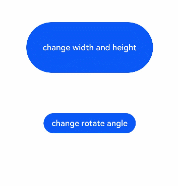

# Property Animator

You can create a property animator to animate certain universal attributes of a component, including **width**, **height**, **backgroundColor**, **opacity**, **scale**, **rotate**, and **translate**.

> **NOTE**
>
> This event is supported since API version 7. Updates will be marked with a superscript to indicate their earliest API version.

animation(value: {duration?: number, tempo?: number, curve?: string | Curve | ICurve, delay?:number, iterations: number, playMode?: PlayMode, onFinish?: () => void})

Since API version 9, this API is supported in ArkTS widgets.

**Parameters**

| Name        | Type                                      | Mandatory   | Description                                                        |
| ---------- | ------------------------------------------| ---- | ------------------------------------------------------------ |
| duration   | number                                    | No   | Animation duration, in ms.<br>Default value: **1000**<br>Unit: ms<br>Since API version 9, this API is supported in ArkTS widgets.<br>**NOTE**<br>- The maximum animation duration on an ArkTS widget is 1000 ms.<br>- A value less than 1 evaluates to the value **0**.<br>- If the value is of the floating point type, the value is rounded down. If the value is 1.2, the value **1** is used.|
| tempo      | number                                    | No   | Animation playback speed. A larger value indicates a higher animation playback speed.<br>The value **0** indicates that no animation is applied.<br>Default value: **1**<br>**NOTE**<br>A value less than 1 evaluates to the value **1**.|
| curve      | string \| [Curve](ts-appendix-enums.md#curve) \| [ICurve](../apis/js-apis-curve.md#icurve)<sup>9+</sup> | No  | Animation curve. The default curve is linear.<br>Default value: **Curve.Linear**<br>Since API version 9, this API is supported in ArkTS widgets.|
| delay      | number                                    | No   | Delay of animation playback, in ms. The value **0** indicates that the playback is not delayed.<br>Default value: **0**<br>Value range: [0, +∞)<br>**NOTE**<br>A value less than 1 evaluates to the value **0**. If the value is of the floating point type, the value is rounded down. If the value is 1.2, the value **1** is used.|
| iterations | number                                    | No   | Number of times that the animation is played.<br>Default value: **1**<br>Value range: [-1, +∞)<br>**NOTE**<br>The value **-1** indicates that the animation is played for an unlimited number of times. The value **0** indicates that no animation is applied.|
| playMode   | [PlayMode](ts-appendix-enums.md#playmode) | No   | Animation playback mode. By default, the animation is played from the beginning after the playback is complete.<br>Default value: **PlayMode.Normal**<br>Since API version 9, this API is supported in ArkTS widgets.|
| onFinish   | () => void                                | No   | Callback invoked when the animation playback is complete.<br>Since API version 9, this API is supported in ArkTS widgets.<br>**NOTE**<br>This callback is not invoked when **iterations** is set to **-1**.|


## Example

```ts
// xxx.ets
@Entry
@Component
struct AttrAnimationExample {
  @State widthSize: number = 250
  @State heightSize: number = 100
  @State rotateAngle: number = 0
  @State flag: boolean = true

  build() {
    Column() {
      Button('change size')
        .onClick(() => {
          if (this.flag) {
            this.widthSize = 150
            this.heightSize = 60
          } else {
            this.widthSize = 250
            this.heightSize = 100
          }
          this.flag = !this.flag
        })
        .margin(30)
        .width(this.widthSize)
        .height(this.heightSize)
        .animation({
          duration: 2000,
          curve: Curve.EaseOut,
          iterations: 3,
          playMode: PlayMode.Normal
        })
      Button('change rotate angle')
        .onClick(() => {
          this.rotateAngle = 90
        })
        .margin(50)
        .rotate({ angle: this.rotateAngle })
        .animation({
          duration: 1200,
          curve: Curve.Friction,
          delay: 500,
          iterations: -1, // The value -1 indicates that the animation is played for an unlimited number of times.
          playMode: PlayMode.Alternate
        })
    }.width('100%').margin({ top: 20 })
  }
}
```


