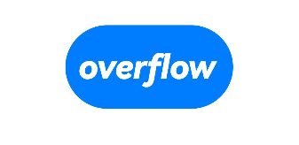

# Button

The **\<Button>** component can be used to create different types of buttons.

>  **NOTE**
>
>  This component is supported since API version 7. Updates will be marked with a superscript to indicate their earliest API version.


## Child Components

This component can contain only one child component.


## APIs

### Button

Button(options?: {type?: ButtonType, stateEffect?: boolean, buttonStyle?: ButtonStyleMode, controlSize?: ControlSize})

Since API version 9, this API is supported in ArkTS widgets.

**Parameters**

| Name        | Type      | Mandatory       | Description                             |
| ----------- | ---------- | ------| --------------------------------- |
| type        | [ButtonType](#buttontype) | No   | Button type.<br>Default value: **ButtonType.Capsule**                          |
| stateEffect | boolean    | No   | Whether to enable the pressed effect on the click of the button. The value **false** means to disable the pressed effect.<br>Default value: **true**<br>**NOTE**<br>When the pressed effect is enabled on the click of the button and the state style is set, the background color is applied based on the state style.|
| buttonStyle<sup>11+</sup> | [ButtonStyleMode](#buttonstylemode11)   | No   | Style and primacy of the button.<br>Default value: **ButtonStyleMode.EMPHASIZED**<br>**NOTE**<br>The button primacy is as follows: emphasized button (high emphasis) > normal button (medium emphasis) > text button (low emphasis).
| controlSize<sup>11+</sup>  | [ControlSize](#controlsize11)   | No   | Size of the button.<br>Default value: **ControlSize.NORMAL**

### Button

Button(label?: ResourceStr, options?: { type?: ButtonType, stateEffect?: boolean, buttonStyle?: ButtonStyleMode, controlSize?: ControlSize})

Creates a button component based on text content. In this case, the component cannot contain child components.

Since API version 9, this API is supported in ArkTS widgets.

**Parameters**

| Name    | Type                               | Mandatory  | Description         |
| ------- | ----------------------------------- | ---- | ------------- |
| label   | [ResourceStr](ts-types.md#resourcestr) | No   | Button text.|
| options | { type?: ButtonType, stateEffect?: boolean, buttonStyle<sup>11+</sup>?: ButtonStyleMode, controlSize<sup>11+</sup>?: ControlSize }   | No   | For details, see [Button](#button-1).|

## Attributes

In addition to the [universal attributes](ts-universal-attributes-size.md), the following attributes are supported.

| Name         | Type          | Description                               |
| ----------- | ----------- | --------------------------------- |
| type        | [ButtonType](#buttontype) | Button type.<br>Default value: **ButtonType.Capsule**<br>Since API version 9, this API is supported in ArkTS widgets.|
| fontSize    | [Length](ts-types.md#length) | Font size of the button.<br>Default value: **'16sp'**|
| fontColor   | [ResourceColor](ts-types.md#resourcecolor) | Font color of the button.<br>Default value: **'\#ffffff'**|
| fontWeight  | [FontWeight](ts-appendix-enums.md#fontweight) \| number \| string | Font weight. For the number type, the value ranges from 100 to 900, at an interval of 100. A larger value indicates a thicker font.<br>Default value: **400** \| FontWeight.Normal |
| fontStyle   | [FontStyle](ts-appendix-enums.md#fontstyle) | Font style of the button.<br>Default value: **FontStyle.Normal**|
| stateEffect | boolean     | Whether to enable the pressed effect on the click of the button. The value **false** means to disable the pressed effect.<br>Default value: **true**<br>Since API version 9, this API is supported in ArkTS widgets.|
| labelStyle<sup>10+</sup> | [LabelStyle](#labelstyle10) | Label style of the button.|
| buttonStyle<sup>11+</sup> | [ButtonStyleMode](#buttonstylemode11) | Style and primacy of the button.<br>Default value: **ButtonStyleMode.EMPHASIZED**|
| controlSize<sup>11+</sup> | [ControlSize](#controlsize11) | Size of the button.<br>Default value: **ControlSize.NORMAL**|

## ButtonType

Since API version 9, this API is supported in ArkTS widgets.

| Name     | Description                |
| ------- | ------------------ |
| Capsule | Capsule-type button (the round corner is half of the height by default).|
| Circle  | Circle button.             |
| Normal  | Normal button (without rounded corners by default).     |

>  **NOTE**
>  - The rounded corner of a button is set by using [borderRadius](ts-universal-attributes-border.md), rather than by using the **border** API. Only a rounded corner whose parameter is [Length](ts-types.md#length) is supported.
>  - For a button of the **Capsule** type, the **borderRadius** settings do not take effect, and the radius of its rounded corner is always half of the button height or width, whichever is smaller.
>  - For a button of the **Circle** type: (1) If both its width and height are set, **borderRadius** does not take effect, and the button radius is half of the width or height (whichever is smaller). (2) If either its width or height is set, **borderRadius** does not take effect, and the button radius is half of the set width or height. (3) If neither its width nor height is set, the button radius is as specified by **borderRadius**; if **borderRadius** is set to a negative value, the value **0** will be used.
>  - The button text is set using the [text style attributes](ts-universal-attributes-text-style.md).
>  - Before setting the [gradient color](ts-universal-attributes-gradient-color.md), you need to set [backgroundColor](ts-universal-attributes-background.md) to transparent.

## LabelStyle<sup>10+</sup>

| Name                | Type                                                    | Mandatory| Description                                                        |
| -------------------- | ------------------------------------------------------------ | ---- | ------------------------------------------------------------ |
| overflow             | [TextOverflow](ts-appendix-enums.md#textoverflow)            | No  | Display mode when the label text is too long. Text is clipped at the transition between words. To clip text in the middle of a word, add zero-width spaces between characters.<br>Default value: **TextOverflow.Ellipsis**|
| maxLines             | number                                                       | No  | Maximum number of lines in the label text. By default, text is automatically folded. If this attribute is specified, the text will not exceed the specified number of lines. If there is extra text, you can use **overflow** to specify how it is displayed.<br>Default value: **1**|
| minFontSize          | number \| [ResourceStr](ts-types.md#resourcestr)             | No  | Minimum font size of the label text. For the setting to take effect, this attribute must be used together with **maxFontSize**, **maxLines**, or layout constraint settings.|
| maxFontSize          | number \| [ResourceStr](ts-types.md#resourcestr)             | No  | Maximum font size of the label text. For the setting to take effect, this attribute must be used together with **minFontSize**, **maxLines**, or layout constraint settings.|
| heightAdaptivePolicy | [TextHeightAdaptivePolicy](ts-appendix-enums.md#textheightadaptivepolicy10) | No  | How the adaptive height is determined for the label text.                            |
| font                 | [Font](ts-types.md#font)                                     | No  | Font of the label text.<br>Default value: See [Font](ts-types.md#font).    |

## ButtonStyleMode<sup>11+</sup>

Since API version 11, this API is supported in ArkTS widgets.

| Name     | Description                |
| ------- | ------------------ |
| EMPHASIZED | Emphasized button (used to direct the user to the most important task).|
| NORMAL  | Normal button (used to direct the user to a common task).             |
| TEXTUAL  | Text button (displayed as simple text without any background color).     |

## ControlSize<sup>11+</sup>

Since API version 11, this API is supported in ArkTS widgets.

| Name     | Description                |
| ------- | ------------------ |
| SMALL | Small button.|
| NORMAL  | Normal button.             |

## Events

The [universal events](ts-universal-events-click.md) are supported.
## Example

### Example 1

```ts
// xxx.ets
@Entry
@Component
struct ButtonExample {
  build() {
    Flex({ direction: FlexDirection.Column, alignItems: ItemAlign.Start, justifyContent: FlexAlign.SpaceBetween }) {
      Text('Normal button').fontSize(9).fontColor(0xCCCCCC)
      Flex({ alignItems: ItemAlign.Center, justifyContent: FlexAlign.SpaceBetween }) {
        Button('OK', { type: ButtonType.Normal, stateEffect: true })
          .borderRadius(8)
          .backgroundColor(0x317aff)
          .width(90)
          .onClick(() => {
            console.log('ButtonType.Normal')
          })
        Button({ type: ButtonType.Normal, stateEffect: true }) {
          Row() {
            LoadingProgress().width(20).height(20).margin({ left: 12 }).color(0xFFFFFF)
            Text('loading').fontSize(12).fontColor(0xffffff).margin({ left: 5, right: 12 })
          }.alignItems(VerticalAlign.Center)
        }.borderRadius(8).backgroundColor(0x317aff).width(90).height(40)

        Button('Disable', { type: ButtonType.Normal, stateEffect: false }).opacity(0.4)
          .borderRadius(8).backgroundColor(0x317aff).width(90)
      }

      Text('Capsule button').fontSize(9).fontColor(0xCCCCCC)
      Flex({ alignItems: ItemAlign.Center, justifyContent: FlexAlign.SpaceBetween }) {
        Button('OK', { type: ButtonType.Capsule, stateEffect: true }).backgroundColor(0x317aff).width(90)
        Button({ type: ButtonType.Capsule, stateEffect: true }) {
          Row() {
            LoadingProgress().width(20).height(20).margin({ left: 12 }).color(0xFFFFFF)
            Text('loading').fontSize(12).fontColor(0xffffff).margin({ left: 5, right: 12 })
          }.alignItems(VerticalAlign.Center).width(90).height(40)
        }.backgroundColor(0x317aff)

        Button('Disable', { type: ButtonType.Capsule, stateEffect: false }).opacity(0.4)
          .backgroundColor(0x317aff).width(90)
      }

      Text('Circle button').fontSize(9).fontColor(0xCCCCCC)
      Flex({ alignItems: ItemAlign.Center, wrap: FlexWrap.Wrap }) {
        Button({ type: ButtonType.Circle, stateEffect: true }) {
          LoadingProgress().width(20).height(20).color(0xFFFFFF)
        }.width(55).height(55).backgroundColor(0x317aff)

        Button({ type: ButtonType.Circle, stateEffect: true }) {
          LoadingProgress().width(20).height(20).color(0xFFFFFF)
        }.width(55).height(55).margin({ left: 20 }).backgroundColor(0xF55A42)
      }
    }.height(400).padding({ left: 35, right: 35, top: 35 })
  }
}
```


### Example 2

```ts
// xxx.ets
@Entry
@Component
struct SwipeGestureExample {
  @State count: number = 0

  build() {
    Column() {
      Text(`${this.count}`)
        .fontSize(30)
        .onClick(() => {
          this.count++
        })
      if (this.count <= 0) {
        Button('count is negative').fontSize(30).height(50)
      } else if (this.count % 2 === 0) {
        Button('count is even').fontSize(30).height(50)
      } else {
        Button('count is odd').fontSize(30).height(50)
      }
    }.height('100%').width('100%').justifyContent(FlexAlign.Center)
  }
}
```


### Example 3

```ts
// xxx.ets
@Entry
@Component
struct buttonTestDemo {
  @State txt: string = 'overflowTextOverlengthTextOverflow.Clip';
  @State widthShortSize: number = 200;

  build() {
    Row() {
      Column() {
        Button(this.txt)
          .width(this.widthShortSize)
          .height(100)
          .labelStyle({ overflow: TextOverflow.Clip,
            maxLines: 1,
            minFontSize: 20,
            maxFontSize: 20,
            font: {
              size: 20,
              weight: FontWeight.Bolder,
              family: 'cursive',
              style: FontStyle.Italic
            }
          })
          .fontSize(40)
      }
      .width('100%')
    }
    .height('100%')
  }
}
```



### Example 4
```ts
// xxx.ets
@Entry
@Component
struct ButtonExample {
  build() {
    Flex({ direction: FlexDirection.Column, alignItems: ItemAlign.Start, justifyContent: FlexAlign.SpaceBetween }) {
      Text('Normal size button').fontSize(9).fontColor(0xCCCCCC)
      Flex({ alignItems: ItemAlign.Center, justifyContent: FlexAlign.SpaceBetween }) {
        Button('Emphasized', { buttonStyle: ButtonStyleMode.EMPHASIZED });
        Button('Normal', { buttonStyle: ButtonStyleMode.NORMAL });
        Button('Textual', { buttonStyle: ButtonStyleMode.TEXTUAL });
      }

      Text('Small size button').fontSize(9).fontColor(0xCCCCCC)
      Flex({ alignItems: ItemAlign.Center, justifyContent: FlexAlign.SpaceBetween }) {
        Button('Emphasized', { controlSize: ControlSize.SMALL, buttonStyle: ButtonStyleMode.EMPHASIZED });
        Button('Normal', { controlSize: ControlSize.SMALL, buttonStyle: ButtonStyleMode.NORMAL });
        Button('Textual', { controlSize: ControlSize.SMALL, buttonStyle: ButtonStyleMode.TEXTUAL });
      }

      Text('Small size button').fontSize(9).fontColor(0xCCCCCC)
      Flex({ alignItems: ItemAlign.Center, justifyContent: FlexAlign.SpaceBetween }) {
        Button('Emphasized').controlSize(ControlSize.SMALL).buttonStyle(ButtonStyleMode.EMPHASIZED);
        Button('Normal').controlSize(ControlSize.SMALL).buttonStyle(ButtonStyleMode.NORMAL);
        Button('Textual').controlSize(ControlSize.SMALL).buttonStyle(ButtonStyleMode.TEXTUAL);
      }

    }.height(400).padding({ left: 35, right: 35, top: 35 })
  }
}
```

