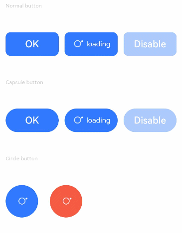

# Button

The **\<Button>** component can be used to create different types of buttons.

>  **NOTE**
>
>  This component is supported since API version 7. Updates will be marked with a superscript to indicate their earliest API version.


## Child Components

This component can contain only one child component.


## APIs

**API 1:** Button(options?: {type?: ButtonType, stateEffect?: boolean})

Since API version 9, this API is supported in ArkTS widgets.

**Parameters**

| Name        | Type      | Mandatory       | Description                             |
| ----------- | ---------- | ------| --------------------------------- |
| type        | ButtonType | No   | Button type.<br>Default value: **ButtonType.Capsule**                          |
| stateEffect | boolean    | No   | Whether to enable the pressed effect on the click of the button. The value **false** means to disable the pressed effect.<br>Default value: **true**<br>**NOTE**<br>When the pressed effect is enabled on the click of the button and the state style is set, the background color is aaplied based on the state style.|

**API 2:** Button(label?: ResourceStr, options?: { type?: ButtonType, stateEffect?: boolean })

Creates a button component based on text content. In this case, the component cannot contain child components.

Since API version 9, this API is supported in ArkTS widgets.

**Parameters**

| Name    | Type                               | Mandatory  | Description         |
| ------- | ----------------------------------- | ---- | ------------- |
| label   | [ResourceStr](ts-types.md#resourcestr) | No   | Button text.|
| options | { type?: ButtonType, stateEffect?: boolean }   | No   | See parameters of API 1.|

## Attributes

In addition to the [universal attributes](ts-universal-attributes-size.md), the following attributes are supported.

| Name         | Type          | Description                               |
| ----------- | ----------- | --------------------------------- |
| type        | ButtonType  | Button type.<br>Default value: **ButtonType.Capsule**<br>Since API version 9, this API is supported in ArkTS widgets.|
| stateEffect | boolean     | Whether to enable the pressed effect on the click of the button. The value **false** means to disable the pressed effect.<br>Default value: **true**<br>Since API version 9, this API is supported in ArkTS widgets.|
| labelStyle<sup>10+</sup> | [LabelStyle](#labelstyle10) | Label style of the button.|

## ButtonType

Since API version 9, this API is supported in ArkTS widgets.

| Name     | Description                |
| ------- | ------------------ |
| Capsule | Capsule-type button (the round corner is half of the height by default).|
| Circle  | Circle button.             |
| Normal  | Normal button (without rounded corners by default).     |

>  **NOTE**
>  - The rounded corner of a button is set by using [borderRadius](ts-universal-attributes-border.md), rather than by using the **border** API. Only a rounded corner whose parameter is [Length](ts-types.md#length) is supported.
>  - For a button of the **Capsule** type, the **borderRadius** settings do not take effect, and the radius of its rounded corner is always half of the button height or width, whichever is smaller.
>  - For a button of the **Circle** type, its radius is the value of **borderRadius** (if set) or the width or height (whichever is smaller).
>  - The button text is set using the [text style attributes](ts-universal-attributes-text-style.md).
>  - Before setting the [gradient color](ts-universal-attributes-gradient-color.md), you need to set [backgroundColor](ts-universal-attributes-background.md) to transparent.

## LabelStyle<sup>10+</sup>

| Name                | Type                                                    | Mandatory| Description                                                        |
| -------------------- | ------------------------------------------------------------ | ---- | ------------------------------------------------------------ |
| overflow             | [TextOverflow](ts-appendix-enums.md#textoverflow)            | No  | Display mode when the label text is too long. Text is clipped at the transition between words. To clip text in the middle of a word, add zero-width spaces between characters.|
| maxLines             | number                                                       | No  | Maximum number of lines in the label text. By default, text is automatically folded. If this attribute is specified, the text will not exceed the specified number of lines. If there is extra text, you can use **textOverflow** to specify how it is displayed.|
| minFontSize          | number \| [ResourceStr](ts-types.md#resourcestr)             | No  | Minimum font size of the label text. For the setting to take effect, this attribute must be used together with **maxFontSize**, **maxLines**, or layout constraint settings.|
| maxFontSize          | number \| [ResourceStr](ts-types.md#resourcestr)             | No  | Maximum font size of the label text. For the setting to take effect, this attribute must be used together with **minFontSize**, **maxLines**, or layout constraint settings.|
| heightAdaptivePolicy | [TextHeightAdaptivePolicy](ts-appendix-enums.md#TextHeightAdaptivePolicy10) | No  | How the adaptive height is determined for the label text.                             |
| font                 | [Font](ts-types.md#Font)                                     | No  | Font of the label text.                                     |
## Events

The [universal events](ts-universal-events-click.md) are supported.
## Example

### Example 1

```ts
// xxx.ets
@Entry
@Component
struct ButtonExample {
  build() {
    Flex({ direction: FlexDirection.Column, alignItems: ItemAlign.Start, justifyContent: FlexAlign.SpaceBetween }) {
      Text('Normal button').fontSize(9).fontColor(0xCCCCCC)
      Flex({ alignItems: ItemAlign.Center, justifyContent: FlexAlign.SpaceBetween }) {
        Button('OK', { type: ButtonType.Normal, stateEffect: true })
          .borderRadius(8)
          .backgroundColor(0x317aff)
          .width(90)
          .onClick(() => {
            console.log('ButtonType.Normal')
          })
        Button({ type: ButtonType.Normal, stateEffect: true }) {
          Row() {
            LoadingProgress().width(20).height(20).margin({ left: 12 }).color(0xFFFFFF)
            Text('loading').fontSize(12).fontColor(0xffffff).margin({ left: 5, right: 12 })
          }.alignItems(VerticalAlign.Center)
        }.borderRadius(8).backgroundColor(0x317aff).width(90).height(40)

        Button('Disable', { type: ButtonType.Normal, stateEffect: false }).opacity(0.4)
          .borderRadius(8).backgroundColor(0x317aff).width(90)
      }

      Text('Capsule button').fontSize(9).fontColor(0xCCCCCC)
      Flex({ alignItems: ItemAlign.Center, justifyContent: FlexAlign.SpaceBetween }) {
        Button('OK', { type: ButtonType.Capsule, stateEffect: true }).backgroundColor(0x317aff).width(90)
        Button({ type: ButtonType.Capsule, stateEffect: true }) {
          Row() {
            LoadingProgress().width(20).height(20).margin({ left: 12 }).color(0xFFFFFF)
            Text('loading').fontSize(12).fontColor(0xffffff).margin({ left: 5, right: 12 })
          }.alignItems(VerticalAlign.Center).width(90).height(40)
        }.backgroundColor(0x317aff)

        Button('Disable', { type: ButtonType.Capsule, stateEffect: false }).opacity(0.4)
          .backgroundColor(0x317aff).width(90)
      }

      Text('Circle button').fontSize(9).fontColor(0xCCCCCC)
      Flex({ alignItems: ItemAlign.Center, wrap: FlexWrap.Wrap }) {
        Button({ type: ButtonType.Circle, stateEffect: true }) {
          LoadingProgress().width(20).height(20).color(0xFFFFFF)
        }.width(55).height(55).backgroundColor(0x317aff)

        Button({ type: ButtonType.Circle, stateEffect: true }) {
          LoadingProgress().width(20).height(20).color(0xFFFFFF)
        }.width(55).height(55).margin({ left: 20 }).backgroundColor(0xF55A42)
      }
    }.height(400).padding({ left: 35, right: 35, top: 35 })
  }
}
```



### Example 2

```ts
// xxx.ets
@Entry
@Component
struct SwipeGestureExample {
  @State count: number = 0

  build() {
    Column() {
      Text(`${this.count}`)
        .fontSize(30)
        .onClick(() => {
          this.count++
        })
      if (this.count <= 0) {
        Button('count is negative').fontSize(30).height(50)
      } else if (this.count % 2 === 0) {
        Button('count is even').fontSize(30).height(50)
      } else {
        Button('count is odd').fontSize(30).height(50)
      }
    }.height('100%').width('100%').justifyContent(FlexAlign.Center)
  }
}
```


