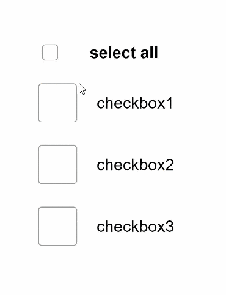

# CheckboxGroup

The **\<CheckboxGroup>** component is used to select or deselect all check boxes in a group.

>  **NOTE**
>
>  This component is supported since API version 8. Updates will be marked with a superscript to indicate their earliest API version.

## Child Components

Not supported

## APIs

CheckboxGroup(options?: { group?: string })

Creates a check box group so that you can select or deselect all check boxes in the group at the same time. Check boxes and the check box group that share a group name belong to the same group.

Since API version 9, this API is supported in ArkTS widgets.

**Parameters**

| Name| Type| Mandatory| Description|
| -------- | -------- | -------- | -------- |
| group | string | No| Group name.|

## Attributes

In addition to the [universal attributes](ts-universal-attributes-size.md), the following attributes are supported.

| Name| Type| Description|
| -------- | -------- | -------- |
| selectAll | boolean | Whether to select all.<br>Default value: **false**<br>Since API version 9, this API is supported in ArkTS widgets.<br>**NOTE**<br>If the **select** attribute is set for a [\<Checkbox>](ts-basic-components-checkbox.md) component in the same group, the setting of the **\<Checkbox>** has a higher priority.<br>Since API version 10, this attribute supports [$$](../../quick-start/arkts-two-way-sync.md) for two-way binding of variables.|
| selectedColor | [ResourceColor](ts-types.md#resourcecolor) | Color of the selected check box.<br>Since API version 9, this API is supported in ArkTS widgets.|
| unselectedColor<sup>10+</sup> | [ResourceColor](ts-types.md#resourcecolor) | Border color of the check box when it is not selected.|
| mark<sup>10+</sup> | [MarkStyle](#markstyle10) | Internal icon style of the check box.|

## Events

In addition to the [universal events](ts-universal-events-click.md), the following events are supported.

| Name| Description|
| -------- | -------- |
| onChange (callback: (event: [CheckboxGroupResult](#checkboxgroupresult)) => void ) |Triggered when the selected status of the check box group or any check box wherein changes.<br>Since API version 9, this API is supported in ArkTS widgets.|

## CheckboxGroupResult

Since API version 9, this API is supported in ArkTS widgets.

| Name    | Type  | Description     |
| ------ | ------ | ------- |
| name   | Array&lt;string&gt; | Names of all the selected check boxes in the group.|
| status | [SelectStatus](#selectstatus) | Selected status.|

## SelectStatus

Since API version 9, this API is supported in ArkTS widgets.

| Name | Description|
| ----- | -------------------- |
| All   | All check boxes in the group are selected.|
| Part  | Some check boxes in the group are selected.|
| None  | None of the check boxes in the group are selected.|

## MarkStyle<sup>10+</sup>

| Name       | Type                                      | Mandatory| Default Value     | Description                                                        |
| ----------- | ------------------------------------------ | ---- | ----------- | ------------------------------------------------------------ |
| strokeColor | [ResourceColor](ts-types.md#resourcecolor) | No  | Color.White | Color of the internal mark.                                              |
| size        | number \| string                 | No  | -           | Size of the internal mark, in vp. The default size is the same as the width of the check box group component.<br>This parameter cannot be set in percentage. If it is set to an invalid value, the default value is used.|
| strokeWidth | number \| string                 | No  | 2           | Stroke width of the internal mark, in vp. This parameter cannot be set in percentage. If it is set to an invalid value, the default value is used.|

## Example

```ts
// xxx.ets
@Entry
@Component
struct CheckboxExample {
  build() {
    Scroll() {
      Column() {
        // Select All button
        Flex({ justifyContent: FlexAlign.Start, alignItems: ItemAlign.Center }) {
          CheckboxGroup({ group: 'checkboxGroup' })
            .selectedColor('#007DFF')
            .onChange((itemName: CheckboxGroupResult) => {
              console.info("checkbox group content" + JSON.stringify(itemName))
            })
          Text('Select All').fontSize(14).lineHeight(20).fontColor('#182431').fontWeight(500)
        }

        // Option 1
        Flex({ justifyContent: FlexAlign.Start, alignItems: ItemAlign.Center }) {
          Checkbox({ name: 'checkbox1', group: 'checkboxGroup' })
            .selectedColor('#007DFF')
            .onChange((value: boolean) => {
              console.info('Checkbox1 change is' + value)
            })
          Text('Checkbox1').fontSize(14).lineHeight(20).fontColor('#182431').fontWeight(500)
        }.margin({ left: 36 })

        // Option 2
        Flex({ justifyContent: FlexAlign.Start, alignItems: ItemAlign.Center }) {
          Checkbox({ name: 'checkbox2', group: 'checkboxGroup' })
            .selectedColor('#007DFF')
            .onChange((value: boolean) => {
              console.info('Checkbox2 change is' + value)
            })
          Text('Checkbox2').fontSize(14).lineHeight(20).fontColor('#182431').fontWeight(500)
        }.margin({ left: 36 })

        // Option 3
        Flex({ justifyContent: FlexAlign.Start, alignItems: ItemAlign.Center }) {
          Checkbox({ name: 'checkbox3', group: 'checkboxGroup' })
            .selectedColor('#007DFF')
            .onChange((value: boolean) => {
              console.info('Checkbox3 change is' + value)
            })
          Text('Checkbox3').fontSize(14).lineHeight(20).fontColor('#182431').fontWeight(500)
        }.margin({ left: 36 })
      }
    }
  }
}
```

