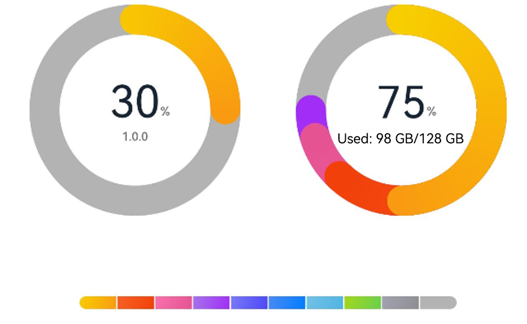
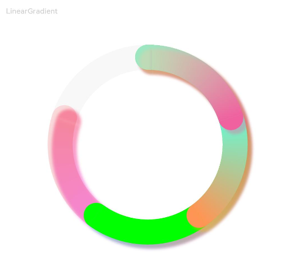

# DataPanel

The **\<DataPanel>** component displays proportions in a chart.

>  **NOTE**
>
> This component is supported since API version 7. Updates will be marked with a superscript to indicate their earliest API version.


## Child Components

Not supported


## APIs

DataPanel(options:{values: number[], max?: number, type?: DataPanelType})

Since API version 9, this API is supported in ArkTS widgets.

**Parameters**

| Name           | Type  | Mandatory | Description|
| ----------------- | -------- | ----- | -------- |
| values            | number[]   | Yes   | Data value list. A maximum of nine values are supported. If more than nine values are set, only the first nine ones are used. A value less than 0 evaluates to the value **0**.|
| max               | number     | No   |   - When set to a value greater than 0, this parameter indicates the maximum value in the **values** list.<br>- When set to a value equal to or smaller than 0, this parameter indicates the sum of values in the **values** list. The values are displayed in proportion.<br>Default value: **100**|
| type<sup>8+</sup> | [DataPanelType](#datapaneltype) | No| Type of the data panel (dynamic modification is not supported).<br>Default value: **DataPanelType.Circle**|


## DataPanelType

Since API version 9, this API is supported in ArkTS widgets.

| Name| Description|
| -------| ------------ |
| Line   | Line data panel.|
| Circle | Circle data panel.|


## Attributes

In addition to the [universal attributes](ts-universal-attributes-size.md), the following attributes are supported.


| Name         | Type| Description|
| ------------- | ------- | -------- |
| closeEffect | boolean | Whether to disable the rotation and shadow effects for the component.<br>Default value: **false**<br>**NOTE**<br> This attribute enables or disables the shadow effect only when **trackShadow** is not set.<br> The shadow effect enabled through this attribute is in the default style.|
| valueColors<sup>10+</sup>   | Array<[ResourceColor](ts-types.md#resourcecolor) \| [LinearGradient](#lineargradient10)> | Array of data segment colors. A value of the **ResourceColor** type indicates a solid color, and A value of the **LinearGradient** type indicates a color gradient.|
| trackBackgroundColor<sup>10+</sup> | [ResourceColor](ts-types.md#resourcecolor) | Background color.<br>The value is in hexadecimal ARGB notation. The first two digits indicate opacity.<br>Default value: **'#08182431'**|
| strokeWidth<sup>10+</sup> | [Length](ts-types.md#length) | Stroke width of the border.<br>Default value: **24**<br>Unit: vp<br>**NOTE**<br>A value less than 0 evaluates to the default value.<br>This attribute does not take effect when the data panel type is **DataPanelType.Line**.|
| trackShadow<sup>10+</sup> | [DataPanelShadowOptions](#datapanelshadowoptions10) | Shadow style.<br>**NOTE**<br>If this attribute is set to **null**, the shadow effect is disabled.|


## DataPanelShadowOptions<sup>10+</sup>
| Name         | Type| Mandatory| Description|
| ------------- | ------- | ---- | -------- |
| radius | number \| [Resource](ts-types.md#resource)| No| Shadow blur radius.<br>Default value: **5**<br>Unit: vp<br>**NOTE**<br>A value less than or equal to 0 evaluates to the default value.|
| colors | Array<[ResourceColor](ts-types.md#resourcecolor) \| [LinearGradient](#lineargradient10)> | No| Array of shadow colors for data segments.<br>Default value: same as the value of **valueColors**<br>**NOTE**<br>If the number of the set shadow colors is less than that of the data segments, the number of the displayed shadow colors is the same as the former.<br>If the number of the set shadow colors is greater than that of the data segments, the number of the displayed shadow colors is the same as the latter.|
| offsetX | number \| [Resource](ts-types.md#resource)| No| Offset on the x-axis.<br>Default value: **5**<br>Unit: vp|
| offsetY | number \| [Resource](ts-types.md#resource)| No| Offset on the y-axis.<br>Default value: **5**<br>Unit: vp|

## LinearGradient<sup>10+</sup>

Describes the linear gradient.

LinearGradient(colorStops: ColorStop[])

| Name         | Type| Mandatory| Description|
| ------------- | ------- | ---- | -------- |
| colorStops | [ColorStop](#colorstop10)[] | Yes| Gradient colors and color stops.|


## ColorStop<sup>10+</sup>

Describes the gradient color stop.

| Name         | Type| Mandatory| Description|
| ------------- | ------- | ---- | -------- |
| color | [ResourceColor](ts-types.md#resourcecolor) | Yes| Color value.|
| offset | [Length](ts-types.md#length) | Yes| Gradient color stop (proportion value between 0 and 1). A value less than 0 evaluates to the value **0**. A value greater than 1 evaluates to the value **1**.|


## Example

### Example 1

```ts
// xxx.ets
@Entry
@Component
struct DataPanelExample {
  public valueArr: number[] = [10, 10, 10, 10, 10, 10, 10, 10, 10]

  build() {
    Column({ space: 5 }) {
      Row() {
        Stack() {
          DataPanel({ values: [25], max: 100, type: DataPanelType.Circle }).width(168).height(168)
          Column() {
            Text('30').fontSize(35).fontColor('#182431')
            Text('1.0.0').fontSize(9.33).lineHeight(12.83).fontWeight(500).opacity(0.6)
          }

          Text('%')
            .fontSize(9.33)
            .lineHeight(12.83)
            .fontWeight(500)
            .opacity(0.6)
            .position({ x: 104.42, y: 78.17 })
        }.margin({ right: 44 })

        Stack() {
          DataPanel({ values: [50, 12, 8, 5], max: 100, type: DataPanelType.Circle }).width(168).height(168)
          Column() {
            Text('75').fontSize(35).fontColor('#182431')
            Text('Used: 98 GB/128 GB') .fontSize(8.17).lineHeight(11.08).fontWeight(500).opacity(0.6)
          }

          Text('%')
            .fontSize(9.33)
            .lineHeight(12.83)
            .fontWeight(500)
            .opacity(0.6)
            .position({ x: 104.42, y: 78.17 })
        }
      }.margin({ bottom: 59 })

      DataPanel({ values: this.valueArr, max: 100, type: DataPanelType.Line }).width(300).height(10)
    }.width('100%').margin({ top: 5 })
  }
}
```



### Example 2

```ts
// xxx.ets
@Entry
@Component
struct LinearGradientDataPanelExample {
  public values1: number[] = [20, 20, 20, 20]
  public color1: LinearGradient = new LinearGradient([{ color: "#65EEC9A3", offset: 0 }, { color: "#FFEF629F", offset: 1 }])
  public color2: LinearGradient = new LinearGradient([{ color: "#FF67F9D4", offset: 0 }, { color: "#FFFF9554", offset: 1 }])
  public colorShadow1: LinearGradient = new LinearGradient([{ color: "#65EEC9A3", offset: 0 }, { color: "#65EF629F", offset: 1 }])
  public colorShadow2: LinearGradient = new LinearGradient([{ color: "#65e26709", offset: 0 }, { color: "#65efbd08", offset: 1 }])
  public colorShadow3: LinearGradient = new LinearGradient([{ color: "#6572B513", offset: 0 }, { color: "#6508efa6", offset: 1 }])
  public colorShadow4: LinearGradient = new LinearGradient([{ color: "#65ed08f5", offset: 0 }, { color: "#65ef0849", offset: 1 }])
  @State color3: string = '#00FF00'
  @State color4: string = '#20FF0000'
  @State bgColor: string = '#08182431'
  @State offsetX: number = 15
  @State offsetY: number = 15
  @State radius: number = 5
  @State colorArray: Array<LinearGradient | ResourceColor> = [this.color1, this.color2, this.color3, this.color4]
  @State shadowColorArray: Array<LinearGradient | ResourceColor> = [this.colorShadow1, this.colorShadow2, this.colorShadow3, this.colorShadow4]

  build() {
    Column({ space: 5 }) {
      Text('LinearGradient').fontSize(9).fontColor(0xCCCCCC).textAlign(TextAlign.Start).width('100%').margin({ top: 20, left: 20})
      DataPanel({ values: this.values1, max: 100, type: DataPanelType.Circle })
        .width(300)
        .height(300)
        .valueColors(this.colorArray)
        .trackShadow({
          radius: this.radius,
          colors: this.shadowColorArray,
          offsetX: this.offsetX,
          offsetY: this.offsetY
        })
        .strokeWidth(30)
        .trackBackgroundColor(this.bgColor)
    }.width('100%').margin({ top: 5 })
  }
}
```


