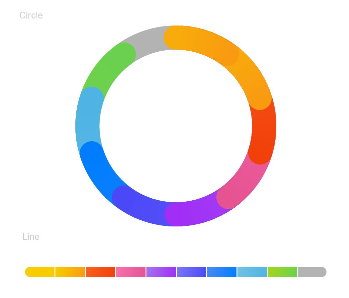

# DataPanel


> **NOTE**<br>
> This component is supported since API version 8. Updates will be marked with a superscript to indicate their earliest API version.


The **&lt;DataPanel&gt;** component displays proportions in a chart.


## Required Permissions

None


## Child Components

None


## APIs

DataPanel(value:{values: number[], max?: number, type?: DataPanelType})

- Parameters
    | Name | Type | Mandatory | Default Value | Description |
  | -------- | -------- | -------- | -------- | -------- |
  | values | number[] | Yes | - | Value list. A maximum of nine values are supported. |
  | max | number | No | 100 | - When set to a value greater than 0, this parameter indicates the maximum value in the **values** list.<br/>- When set to a value equal to or smaller than 0, this parameter indicates the sum of values in the **values** list. The values are displayed in proportion. |
  | type<sup>8+</sup> | DataPanelType | No | DataPanelType.Circle | Type of the data panel. |


- DataPanelType enums
    | Name | Description |
  | -------- | -------- |
  | Line | Line data panel. |
  | Circle | Circle data panel. |


## Example


```
@Entry
@Component
struct DataPanelExample {
  public values1: number[] = [10, 10, 10, 10, 10, 10, 10, 10, 10]

  build() {
    Column({ space: 5 }) {
      Text('Circle').fontSize(9).fontColor(0xCCCCCC).margin({ top: 20, right: '80%' })
      DataPanel({ values: this.values1, max: 100, type: DataPanelType.Circle }).width(200).height(200)

      Text('Line').fontSize(9).fontColor(0xCCCCCC).margin({ bottom: 20, right: '80%' })
      DataPanel({ values: this.values1, max: 100, type: DataPanelType.Line }).width(300).height(10)
    }.width('100%').margin({ top: 5 })
  }
}
```


