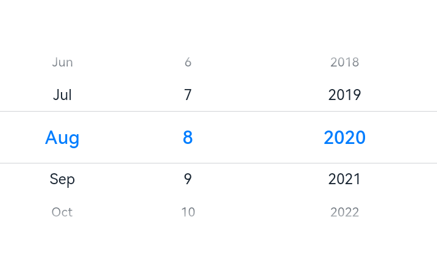

# DatePicker

The **\<DatePicker>** component allows users to select a date from the given range.

>  **NOTE**
>
> This component is supported since API version 8. Updates will be marked with a superscript to indicate their earliest API version.


## Child Components

Not supported


## APIs

DatePicker(options?: {start?: Date, end?: Date, selected?: Date})

Creates a date picker in the given date range.

**Parameters**
| Name| Type| Mandatory | Description|
| -------- | -------- | ------------- | -------- |
| start    | Date | No | Start date of the picker.<br>Default value: **Date('1970-1-1')**|
| end      | Date | No |   End date of the picker.<br>Default value: **Date('2100-12-31')**|
| selected | Date | No | Date of the selected item.<br>Default value: current system date |


## Attributes

| Name   | Type       | Description           |
| ------| -------------- | -------- |
| lunar | boolean  | Whether to display the lunar calendar.<br>-&nbsp;**true**: Display the lunar calendar.<br>-&nbsp;**false**: Do not display the lunar calendar.<br>Default value: **false**|


## Events

| Name| Description|
| -------- | -------- |
| onChange(callback:&nbsp;(value:&nbsp;DatePickerResult)&nbsp;=&gt;&nbsp;void) | Triggered when a date is selected.|

## DatePickerResult

| Name| Type| Description|
| -------- | -------- | -------- |
| year | number | Year of the selected date.|
| month | number | Month of the selected date. The value ranges from 0 to 11. The value **0** indicates January, and **11** indicates December.|
| day | number | Day of the selected date.|


## Example


### Date Picker Sample Code (With Lunar Calendar)

```ts
// xxx.ets
@Entry
@Component
struct DatePickerExample01 {
  private selectedDate: Date = new Date('2021-08-08')

  build() {
    Column() {
      DatePicker({
        start: new Date('1970-1-1'),
        end: new Date('2100-1-1'),
        selected: this.selectedDate,
      })
      .lunar(true)
      .onChange((date: DatePickerResult) => {
        console.info('select current date is: ' + JSON.stringify(date))
      })
    }.width('100%')
  }
}
```


### Date Picker Sample Code (No Lunar Calendar)

```ts
// xxx.ets
@Entry
@Component
struct DatePickerExample02 {
  private selectedDate: Date = new Date('2021-08-08')

  build() {
    Column() {
      DatePicker({
        start: new Date('1970-1-1'),
        end: new Date('2100-1-1'),
        selected: this.selectedDate,
      })
      .lunar(false)
      .onChange((date: DatePickerResult) => {
        console.info('select current date is: ' + JSON.stringify(date))
      })
    }.width('100%')
  }
}
```


