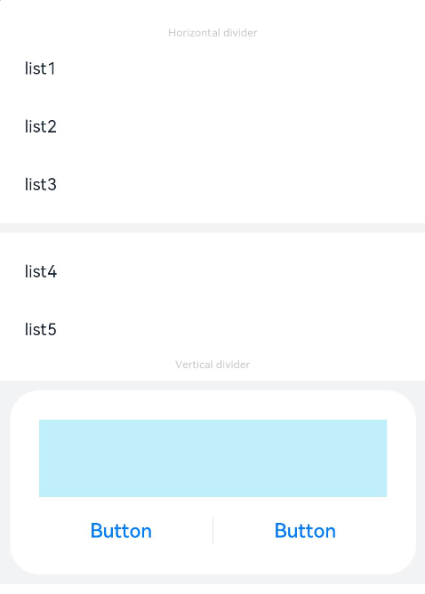

# Divider

The **\<Divider>** component is used to separate content blocks and elements.

>  **NOTE**
>
>  This component is supported since API version 7. Updates will be marked with a superscript to indicate their earliest API version.


## Child Components

Not supported


## APIs

Divider()

Since API version 9, this API is supported in ArkTS widgets.

## Attributes

In addition to the [universal attributes](ts-universal-attributes-size.md), the following attributes are supported.

| Name     | Type        | Description       |
| ----------- | ---------- | ------------------ |
| vertical    | boolean | Whether a vertical divider is used. **false**: A horizontal divider is used.<br>**true**: A vertical divider is used.<br>Default value: **false**<br>Since API version 9, this API is supported in ArkTS widgets.|
| color       | [ResourceColor](ts-types.md#resourcecolor) | Color of the divider.<br>Default value: **'\#33182431'**<br>Since API version 9, this API is supported in ArkTS widgets.|
| strokeWidth | number \| string | Width of the divider.<br>Default value: **1px**<br>Unit: vp<br>Since API version 9, this API is supported in ArkTS widgets.<br>**NOTE**<br>This attribute cannot be set to a percentage. The priority of this attribute is lower than that of the universal attribute [height](ts-universal-attributes-size.md). If the value of this attribute is greater than that of the universal attribute, cropping is performed based on the universal attribute settings.|
| lineCap     | [LineCapStyle](ts-appendix-enums.md#linecapstyle) | Cap style of the divider.<br>Default value: **LineCapStyle.Butt**<br>Since API version 9, this API is supported in ArkTS widgets.|


## Example

```ts
// xxx.ets
@Entry
@Component
struct DividerExample {
  build() {
    Column() {
      // Use horizontal dividers.
      Text('Horizontal divider').fontSize(9).fontColor(0xCCCCCC)
      List() {
        ForEach([1, 2, 3], (item) => {
          ListItem() {
            Text('list' + item).width('100%').fontSize(14).fontColor('#182431').textAlign(TextAlign.Start)
          }.width(244).height(48)
        }, item => item.toString())
      }.padding({ left: 24, bottom: 8 })

      Divider().strokeWidth(8).color('#F1F3F5')
      List() {
        ForEach([4, 5], (item) => {
          ListItem() {
            Text('list' + item).width('100%').fontSize(14).fontColor('#182431').textAlign(TextAlign.Start)
          }.width(244).height(48)
        }, item => item.toString())
      }.padding({ left: 24, top: 8 })

      // Use vertical dividers.
      Text('Vertical divider').fontSize(9).fontColor(0xCCCCCC)
      Column() {
        Column() {
          Row().width(288).height(64).backgroundColor('#30C9F0').opacity(0.3)
          Row() {
            Button('Button')
              .width(136)
              .height(22)
              .fontSize(16)
              .fontColor('#007DFF')
              .fontWeight(500)
              .backgroundColor(Color.Transparent)
            Divider().vertical(true).height(22).color('#182431').opacity(0.6).margin({ left: 8, right: 8 })
            Button('Button')
              .width(136)
              .height(22)
              .fontSize(16)
              .fontColor('#007DFF')
              .fontWeight(500)
              .backgroundColor(Color.Transparent)
          }.margin({ top: 17 })
        }
        .width(336)
        .height(152)
        .backgroundColor('#FFFFFF')
        .borderRadius(24)
        .padding(24)
      }
      .width('100%')
      .height(168)
      .backgroundColor('#F1F3F5')
      .justifyContent(FlexAlign.Center)
      .margin({ top: 8 })
    }.width('100%').padding({ top: 24 })
  }
}
```


