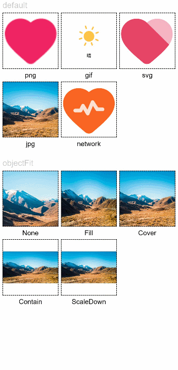

# Image

The **\<Image>** component is used to render and display local and online images.

> **NOTE**
>
> This component is supported since API version 7. Updates will be marked with a superscript to indicate their earliest API version.


## Required Permissions

To use online images, the application must have the **ohos.permission.INTERNET** permission. For details about how to apply for a permission, see [Declaring Permissions](../../security/accesstoken-guidelines.md).


## Child Components

Not supported


## APIs

Image(src: string | PixelMap | Resource)

Obtains an image from the specified source for subsequent rendering and display.

**Parameters**

| Name| Type                                                    | Mandatory| Description                                                    |
| ------ | ------------------------------------------------------------ | ---- | ------------------------------------------------------------ |
| src    | string \| [PixelMap](../apis/js-apis-image.md#pixelmap7) \| [Resource](ts-types.md#resource) | Yes  | Image source. Both local and online images are supported.<br>When using an image referenced using a relative path, for example, `Image("common/test.jpg")`, the **\<Image>** component cannot be called across bundles or modules. Therefore, you are advised to use `$r` to reference image resources that need to be used globally.<br>- The following image formats are supported: PNG, JPG, BMP, SVG, GIF.<br>\- Base64 strings are supported. The value format is data:image/[png\|jpeg\|bmp\|webp];base64,[base64 data], where [base64 data] is a Base64 string.<br/>\- Strings with the **datashare://path** prefix are supported, which are used to access the image path provided by a data ability.<br>\- Strings with the `file:///data/storage` prefix are supported, which are used to read image resources in the **files** folder in the installation directory of the application. Ensure that the files in the directory package path have the read permission.|

## Attributes

In addition to the [universal attributes](ts-universal-attributes-size.md), the following attributes are supported.

| Name                 | Type                                               | Description                                                        |
| --------------------- | ------------------------------------------------------- | ------------------------------------------------------------ |
| alt                   | string \| [Resource](ts-types.md#resource)| Placeholder image displayed during loading. Local images are supported.                |
| objectFit             | [ImageFit](ts-appendix-enums.md#imagefit)                           | Image scale mode.<br>Default value: **ImageFit.Cover**                 |
| objectRepeat          | [ImageRepeat](ts-appendix-enums.md#imagerepeat)         | Whether the image is repeated.<br>Default value: **NoRepeat**<br>**NOTE**<br>This attribute is not applicable to SVG images.|
| interpolation         | [ImageInterpolation](#imageinterpolation)               | Interpolation effect of the image. This attribute is intended to alleviate aliasing that occurs when a low-definition image is zoomed in.<br>Default value: **ImageInterpolation.None**<br>**NOTE**<br>This attribute is not applicable to SVG images and **PixelMap** objects. |
| renderMode            | [ImageRenderMode](#imagerendermode)                     | Rendering mode of the image.<br>Default value: **ImageRenderMode.Original**<br>**NOTE**<br>This attribute is not applicable to SVG images.|
| sourceSize            | {<br>width: number,<br>height: number<br>} | Size of the decoded image. The original image is decoded into a **pixelMap** of the specified size, in px.<br>**NOTE**<br>This attribute is not applicable to **PixelMap** objects.|
| matchTextDirection     | boolean | Whether to display the image in the system language direction. When this parameter is set to true, the image is horizontally flipped in the right-to-left (RTL) language context.<br>Default value: **false**  |
| fitOriginalSize        | boolean | Whether to fit the component to the original size of the image source when the component size is not set.<br>Default value: **false**   |
| fillColor              | [ResourceColor](ts-types.md#resourcecolor) | Fill color. This attribute only applies to an SVG image. Once set, the fill color will replace that of the SVG image.|
| autoResize             | boolean | Whether to resize the image source used for drawing based on the size of the display area during image decoding. This resizing can help reduce the memory usage.<br>Default value: **true**|
| syncLoad<sup>8+</sup> | boolean                                  | Whether to load the image synchronously. By default, the image is loaded asynchronously. During synchronous loading, the UI thread is blocked and the placeholder diagram is not displayed.<br>Default value: **false**|
| copyOption<sup>9+</sup> | [CopyOptions](ts-appendix-enums.md#copyoptions9)  | Whether the image can be copied. (SVG images cannot be copied.)<br>When **copyOption** is set to a value other than **CopyOptions.None**, the image can be copied in various manners, such as long pressing, right-clicking, or pressing Ctrl+C.<br>Default value: **CopyOptions.None**|
| colorFilter<sup>9+</sup> | [ColorFilter](ts-types.md#colorfilter9) | Color filter of the image.|

>  **NOTE**
>
>  To use shortcut keys to copy the image, the image must be in focus. To enable the image to gain focus, set both the **focusable** and **focusOnTouch** attributes to **true**.
>  For SVG images, only the following tags are included in the supported list: **svg**, **rect**, **circle**, **ellipse**, **path**, **line**, **polyline**, **polygon**, **animate**, **animateMotion**, and **animateTransform**.

### ImageInterpolation

| Name    | Description                       |
| ------ | ------------------------- |
| None   | Interpolation image data is not used.               |
| High   | The interpolation image data is used at the high level, which may affect the image rendering speed.|
| Medium | The interpolation image data is used at the medium level.             |
| Low    | The interpolation image data is used at the low level.             |

### ImageRenderMode

| Name      | Description                   |
| -------- | --------------------- |
| Original | The image is rendered based on the original image, including the color.       |
| Template | The image is rendered as a template image, and its color is ignored.|

## Events

In addition to the [universal events](ts-universal-events-click.md), the following events are supported.

| Name                                                         | Description                                                  |
| ------------------------------------------------------------ | ------------------------------------------------------------ |
| onComplete(callback: (event?: { width: number, height: number, componentWidth: number,<br> componentHeight: number, loadingStatus: number }) =&gt; void) | Triggered when an image is successfully loaded. The size of the loaded image is returned.<br>- **width**: width of the image, in pixels.<br>- **height**: height of the image, in pixels.<br>- **componentWidth**: width of the container component, in pixels.<br>- **componentHeight**: height of the container component, in pixels.<br>- **loadingStatus**: image loading status. |
| onError(callback: (event?: { componentWidth: number, componentHeight: number , message<sup>9+</sup>: string }) =&gt; void) | Triggered when an exception occurs during image loading.<br>- **componentWidth**: width of the container component, in pixels.<br>- **componentHeight**: height of the container component, in pixels. |
| onFinish(event: () =&gt; void)                               | Triggered when the animation playback in the loaded SVG image is complete. If the animation is an infinite loop, this callback is not triggered. |

## Example

### Loading Images

Load and display different types of images and set the scale mode of the images.

```ts
@Entry
@Component
struct ImageExample1 {
  private on: string = 'www.example.com' 
  @State src: string = this.on

  build() {
    Column() {
      Flex({ direction: FlexDirection.Column, alignItems: ItemAlign.Start }) {
        Text('default').fontSize(16).fontColor(0xcccccc).height(30)
        Row({ space: 5 }) {
          Image($r('app.media.ic_png'))
            .width(110).height(110).border({ width: 1 }).borderStyle(BorderStyle.Dashed)
            .overlay('png', { align: Alignment.Bottom, offset: { x: 0, y: 20 } })
          Image($r('app.media.ic_gif'))
            .width(110).height(110).border({ width: 1 }).borderStyle(BorderStyle.Dashed)
            .overlay('gif', { align: Alignment.Bottom, offset: { x: 0, y: 20 } })
          Image($r('app.media.ic_svg'))
            .width(110).height(110).border({ width: 1 }).borderStyle(BorderStyle.Dashed)
            .overlay('svg', { align: Alignment.Bottom, offset: { x: 0, y: 20 } })
        }
        Row({ space: 5 }) {
          Image($r('app.media.img_example'))
            .width(110).height(110).border({ width: 1 }).borderStyle(BorderStyle.Dashed)
            .overlay('jpg', { align: Alignment.Bottom, offset: { x: 0, y: 20 } })
          Image(this.src)
            .width(110).height(110).border({ width: 1 }).borderStyle(BorderStyle.Dashed)
            .overlay('network', { align: Alignment.Bottom, offset: { x: 0, y: 20 } })
        }.margin({ top: 25, bottom: 10 })
      }

      Flex({ direction: FlexDirection.Column, alignItems: ItemAlign.Start }) {
        Text('objectFit').fontSize(16).fontColor(0xcccccc).height(30)
        Row({ space: 5 }) {
          Image($r('app.media.img_example'))
            .border({ width: 1 }).borderStyle(BorderStyle.Dashed)
            .objectFit(ImageFit.None).width(110).height(110)
            .overlay('None', { align: Alignment.Bottom, offset: { x: 0, y: 20 } })
          Image($r('app.media.img_example'))
            .border({ width: 1 }).borderStyle(BorderStyle.Dashed)
            .objectFit(ImageFit.Fill).width(110).height(110)
            .overlay('Fill', { align: Alignment.Bottom, offset: { x: 0, y: 20 } })
          Image($r('app.media.img_example'))
            .border({ width: 1 }).borderStyle(BorderStyle.Dashed)
            .objectFit(ImageFit.Cover).width(110).height(110)
            .overlay('Cover', { align: Alignment.Bottom, offset: { x: 0, y: 20 } })
        }
        Row({ space: 5 }) {
          Image($r('app.media.img_example_w250'))
            .border({ width: 1 }).borderStyle(BorderStyle.Dashed)
            .objectFit(ImageFit.Contain).width(110).height(110)
            .overlay('Contain', { align: Alignment.Bottom, offset: { x: 0, y: 20 } })
          Image($r('app.media.img_example_w250'))
            .border({ width: 1 }).borderStyle(BorderStyle.Dashed)
            .objectFit(ImageFit.ScaleDown).width(110).height(110)
            .overlay('ScaleDown', { align: Alignment.Bottom, offset: { x: 0, y: 20 } })
        }.margin({ top: 25 })
      }
    }.height(320).width(360).padding({ right: 10, top: 10 })
  }
}
```




### Loading Online Images

The default network timeout period is 5 minutes for loading online images. When using an online image, you are advised to use **alt** to configure the placeholder image displayed during loading. If more flexible network configuration is required, use the [HTTP](../../connectivity/http-request.md) module in the SDK to send a network request, and then decode the returned data into a `PixelMap` in the **\<Image>** component. For details about image development, see [Image Development](../../media/image.md). The code snippet is as follows:

```tsx
// @ts-nocheck
import http from '@ohos.net.http';
import ResponseCode from '@ohos.net.http';
import image from '@ohos.multimedia.image'


@Entry 
@Component 
struct Index {
    
  // Create a PixelMap state variable to receive online images.
  @State image: PixelMap = undefined

  build() {
    Column({space: 10}) {
      Button ("Get Online Image")
        .onClick(() => {
          this.httpRequest();
        })
      Image(this.image).height(100).width(100)
    }
    .width('100%')
    .height('100%')
    .padding(10)
  }

  // Request an online image.
  private httpRequest() {
    let httpRequest = http.createHttp();
	
    httpRequest.request(
      "https://www.example.com/xxx.png",   // Enter a specific URL of the online image.
      (error, data) => {
        if(error) {
          console.log("error code: " + error.code + ", msg: " + error.message)
        } else {
          let code = data.responseCode
          if(ResponseCode.ResponseCode.OK == code) {
            let imageSource = image.createImageSource(data.result)
            let options = {alphaType: 0,                     // Transparency
                           editable: false,                  // Whether the image is editable
                           pixelFormat: 3,                   // Pixel format
                           scaleMode: 1,                     // Scale mode
                           size: {height: 100, width: 100}} // Image size
            imageSource.createPixelMap(options).then((pixelMap) => {
              this.image = pixelMap
            })
          } else {
            console.log("response code: " + code);
          }
        }
      }
    )
  }
}
```

>  **NOTE**
>  
>  For details about the request mode, timeout, and additional request parameters for loading online images, see [`request()`](../../reference/apis/js-apis-http.md) in the HTTP module.

### Setting Attributes

```ts
@Entry
@Component
struct ImageExample2 {

  build() {
    Column({ space: 10 }) {
      Text('renderMode').fontSize(12).fontColor(0xcccccc).width('96%').height(30)
      Row({ space: 50 }) {
        Image($r('app.media.img_example'))
          .renderMode(ImageRenderMode.Original).width(100).height(100)
          .border({ width: 1 }).borderStyle(BorderStyle.Dashed)
          .overlay('Original', { align: Alignment.Bottom, offset: { x: 0, y: 20 } })
        Image($r('app.media.img_example'))
          .renderMode(ImageRenderMode.Template).width(100).height(100)
          .border({ width: 1 }).borderStyle(BorderStyle.Dashed)
          .overlay('Template', { align: Alignment.Bottom, offset: { x: 0, y: 20 } })
      }
      
      Text('alt').fontSize(12).fontColor(0xcccccc).width('96%').height(30)
      Image('')
        .alt($r('app.media.Image_none'))
        .width(100).height(100).border({ width: 1 }).borderStyle(BorderStyle.Dashed)
        
      Text('sourceSize').fontSize(12).fontColor(0xcccccc).width('96%')
      Row({ space: 50 }) {
        Image($r('app.media.img_example'))
          .sourceSize({
            width: 150,
            height: 150
          })
          .objectFit(ImageFit.ScaleDown).width('25%').aspectRatio(1)
          .border({ width: 1 }).borderStyle(BorderStyle.Dashed)
          .overlay('w:150 h:150', { align: Alignment.Bottom, offset: { x: 0, y: 20 } })
        Image($r('app.media.img_example'))
          .sourceSize({
            width: 200,
            height: 200
          })
          .objectFit(ImageFit.ScaleDown).width('25%').aspectRatio(1)
          .border({ width: 1 }).borderStyle(BorderStyle.Dashed)
          .overlay('w:200 h:200', { align: Alignment.Bottom, offset: { x: 0, y: 20 } })
      }
      
      Text('objectRepeat').fontSize(12).fontColor(0xcccccc).width('96%').height(30)
      Row({ space: 5 }) {
        Image($r('app.media.ic_health_heart'))
          .width(120).height(125).border({ width: 1 }).borderStyle(BorderStyle.Dashed)
          .objectRepeat(ImageRepeat.XY).objectFit(ImageFit.ScaleDown)
          .overlay('ImageRepeat.XY', { align: Alignment.Bottom, offset: { x: 0, y: 20 } })
        Image($r('app.media.ic_health_heart'))
          .width(110).height(125).border({ width: 1 }).borderStyle(BorderStyle.Dashed)
          .objectRepeat(ImageRepeat.Y).objectFit(ImageFit.ScaleDown)
          .overlay('ImageRepeat.Y', { align: Alignment.Bottom, offset: { x: 0, y: 20 } })
        Image($r('app.media.ic_health_heart'))
          .width(110).height(125).border({ width: 1 }).borderStyle(BorderStyle.Dashed)
          .objectRepeat(ImageRepeat.X).objectFit(ImageFit.ScaleDown)
          .overlay('ImageRepeat.X', { align: Alignment.Bottom, offset: { x: 0, y: 20 } })
      }
    }.height(150).width('100%').padding({ right: 10 })
  }
}
```


### Invoking Events

```ts
@Entry
@Component
struct ImageExample3 {
  @State widthValue: number = 0
  @State heightValue: number = 0
  private on: Resource = $r('app.media.image_on')
  private off: Resource = $r('app.media.image_off')
  private on2off: Resource = $r('app.media.image_on2off')
  private off2on: Resource = $r('app.media.image_off2on')
  @State src: Resource = this.on

  build() {
    Column() {
      Row({ space: 20 }) {
        Column() {
          Image($r('app.media.img_example1'))
            .alt($r('app.media.ic_public_picture'))
            .sourceSize({
              width: 900,
              height: 900
            })
            .objectFit(ImageFit.Cover)
            .height(180).width(180)
            // Obtain the size of an image after the image loading is complete.
            .onComplete((msg: { width: number,height: number }) => {
              this.widthValue = msg.width
              this.heightValue = msg.height
            })
            .onError(() => {
              console.log('load image fail')
            })
            .overlay('\nwidth: ' + String(this.widthValue) + ' height: ' + String(this.heightValue), {
              align: Alignment.Bottom,
              offset: { x: 0, y: 20 }
            })
        }
        // Add a click event so that a specific image is loaded upon clicking.
        Image(this.src)
          .width(120).height(120)
          .onClick(() => {
            if (this.src == this.on || this.src == this.off2on) {
              this.src = this.on2off
            } else {
              this.src = this.off2on
            }
          })
          .onFinish(() => {
            if (this.src == this.off2on) {
              this.src = this.on
            } else {
              this.src = this.off
            }
          })
      }
    }.width('100%')
  }
}
```


###  Rendering Sandbox Images

```ts
import fileio from '@ohos.fileio'
import context from '@ohos.application.context'

@Entry
@Component
struct LoadImageExample {
  @State resourcesPath: string = ''
  @State sandboxPath: string = ''
  context: context.AbilityContext

  aboutToAppear() {
    this.context = getContext(this) as context.AbilityContext
  }

  build() {
    Column() {
      Button ('Read Sandbox Image')
        .margin({ bottom: 10, top: 10 })
        .onClick(() => {
          this.sandboxPath = this.context.getApplicationContext().filesDir + '/icon.png'
          console.log(`Read the sandbox image=========>${this.sandboxPath}`)
          let fd = fileio.openSync(this.sandboxPath, 0o100, 0o666)
          console.log(`create file========>${fd}`)
          let srcPath = this.context.bundleCodeDir + '/entry/resources/base/media/icon.png'
          console.log('mySrcpath' + srcPath)
          fileio.copyFileSync(srcPath, this.sandboxPath) // Copy the image to the sandbox path.
          this.sandboxPath = 'file://' + this.context.getApplicationContext().filesDir + '/icon.png'
        })
      Button ('Read Image')
        .margin({ bottom: 10 })
        .onClick(() => {
          this.resourcesPath = 'file://' + this.context.bundleCodeDir + '/entry/resources/base/media/icon.png'
        })
      Text(`Image path: ${this.resourcesPath}`)
        .fontSize(20)
        .margin({ bottom: 10 })
      Image(this.resourcesPath)
        .width(100)
        .height(100)
      Text(`Sandbox image path: ${this.sandboxPath}`)
        .fontSize(20)
        .margin({ bottom: 10 })
      Image(this.sandboxPath)
        .width(100)
        .height(100)
    }
    .width('100%').height('100%')
  }
}
```
