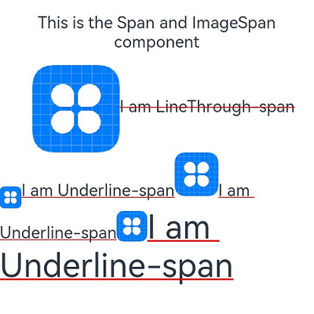

# ImageSpan

**\<ImageSpan>** is a child component of the [\<Text>](ts-basic-components-text.md) component and is used to display inline images.

>  **NOTE**
>
>  This component is supported since API version 10. Updates will be marked with a superscript to indicate their earliest API version.


## Child Components

Not supported


## APIs

ImageSpan(value: ResourceStr | PixelMap)

**Parameters**

| Name| Type| Mandatory| Description|
| -------- | -------- | -------- | -------- |
| value | [ResourceStr](ts-types.md#ResourceStr) \| [PixelMap](../apis/js-apis-image.md#pixelmap7)  | Yes| Image source. Both local and online images are supported.<br>When using an image referenced using a relative path, for example, **ImageSpan("common/test.jpg")**, the **\<ImageSpan>** component cannot be called across bundles or modules. Therefore, you are advised to use **\$r** to reference image resources that need to be used globally.<br>\- The following image formats are supported: PNG, JPG, BMP, SVG, GIF.<br>\- Base64 strings are supported. The value format is data:image/[png\|jpeg\|bmp\|webp];base64,[base64 data], where [base64 data] is a Base64 string.<br>\- Strings with the **file:///data/storage** prefix are supported, which are used to read image resources in the **files** folder in the installation directory of the application. Ensure that the application has the read permission to the files in the specified path.|


## Attributes

Among all the [universal events](ts-universal-attributes-size.md), only **width**, **height**, and **size** are supported.

| Name| Type| Description|
| -------- | -------- | -------- |
| verticalAlign | [ImageSpanAlignment](#imagespanalignment) | Alignment mode of the image with the text.|
| objectFit | [ImageFit](ts-appendix-enums.md#imagefit) | Image scale type.<br>Default value: **ImageFit.Cover**|

## ImageSpanAlignment

| Name    | Description                          |
| -------- | ------------------------------ |
| TOP      | The image is top aligned with the text.  |
| CENTER   | The image is centered aligned with the text.      |
| BOTTOM   | The image is bottom aligned with the text.  |
| BASELINE | The image is bottom aligned with the text baseline.|

## Events

Among all the universal events, only the [click event](ts-universal-attributes-click.md) is supported.

## Example

```ts
// xxx.ets
@Entry
@Component
struct SpanExample {
  build() {
    Flex({ direction: FlexDirection.Column, alignItems: ItemAlign.Start}) {
      Text() {
        Span('This is the Span and ImageSpan component').fontSize(25).textCase(TextCase.Normal)
          .decoration({ type: TextDecorationType.None, color: Color.Pink })
      }.width('100%')
      Text() {
        ImageSpan($r('app.media.icon'))
          .width('200px')
          .height('200px')
          .objectFit(ImageFit.Fill)
          .verticalAlign(ImageSpanAlignment.CENTER)
        Span('I am LineThrough-span')
          .decoration({ type: TextDecorationType.LineThrough, color: Color.Red }).fontSize(25)
        ImageSpan($r('app.media.icon'))
          .width('50px')
          .height('50px')
          .verticalAlign(ImageSpanAlignment.TOP)
        Span('I am Underline-span')
          .decoration({ type: TextDecorationType.Underline, color: Color.Red }).fontSize(25)
        ImageSpan($r('app.media.icon'))
          .size({width:'100px', height:'100px'})
          .verticalAlign(ImageSpanAlignment.BASELINE)
        Span('I am Underline-span')
          .decoration({ type: TextDecorationType.Underline, color: Color.Red }).fontSize(25)
        ImageSpan($r('app.media.icon'))
          .width('70px')
          .height('70px')
          .verticalAlign(ImageSpanAlignment.BOTTOM)
        Span('I am Underline-span')
          .decoration({ type: TextDecorationType.Underline, color: Color.Red }).fontSize(50)
      }
      .width('100%')
      .backgroundColor(Color.Orange)
      .textIndent(50)
    }.width('100%').height('100%').padding({ left: 0, right: 0, top: 0 })
  }
}
```


