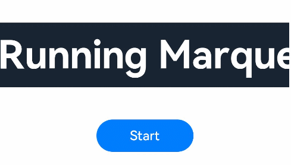

# Marquee

The **\<Marquee>** component is used to display a scrolling piece of text. The text is scrolled only when its width exceeds the width of the **\<Marquee>** component.


>  **NOTE**
>
>  This component is supported since API version 8. Updates will be marked with a superscript to indicate their earliest API version.


## Child Components

Not supported


## APIs

Marquee(value: { start: boolean, step?: number, loop?: number, fromStart?: boolean, src: string })

Since API version 9, this API is supported in ArkTS widgets.

**Parameters**

| Name| Type| Mandatory| Description|
| -------- | -------- | -------- | -------- |
| start | boolean | Yes| Whether to start scrolling.|
| step | number | No| Scrolling step.<br>Default value: **6**, in vp|
| loop | number | No| Number of times the marquee will scroll. If the value is less than or equal to **0**, the marquee will scroll continuously.<br>Default value: **-1**<br>**NOTE**<br>Regardless of the value, the marquee scrolls only once on an ArkTS widget.|
| fromStart | boolean | No| Whether the text scrolls from the start.<br>Default value: **true**|
| src | string | Yes| Text to scroll.|

## Attributes

| Name      | Type| Description                                                        |
| ---------- | -------- | ------------------------------------------------------------ |
| allowScale | boolean  | Whether to allow text to scale.<br>This attribute is not supported currently.<br>Default value: **false** |

## Events

| Name| Description|
| -------- | -------- |
| onStart(event: () =&gt; void) | Triggered when the marquee starts scrolling.<br>Since API version 9, this API is supported in ArkTS widgets.|
| onBounce(event: () =&gt; void) | Triggered when the marquee has reached the end. This event will be triggered for multiple times if the **loop** attribute is not set to **1**.<br>Since API version 9, this API is supported in ArkTS widgets.|
| onFinish(event: () =&gt; void) | Triggered when the marquee has finished the number of scrolling times set by the **loop** attribute.<br>Since API version 9, this API is supported in ArkTS widgets.|


## Example


```ts
// xxx.ets
@Entry
@Component
struct MarqueeExample {
  @State start: boolean = false
  private fromStart: boolean = true
  private step: number = 50
  private loop: number = Infinity
  private src: string = "Running Marquee starts rolling"

  build() {
    Flex({ direction: FlexDirection.Column, alignItems: ItemAlign.Center, justifyContent: FlexAlign.Center }) {
      Marquee({
        start: this.start,
        step: this.step,
        loop: this.loop,
        fromStart: this.fromStart,
        src: this.src
      })
        .width(360)
        .height(80)
        .fontColor('#FFFFFF')
        .fontSize(48)
        .fontWeight(700)
        .backgroundColor('#182431')
        .margin({ bottom: 40 })
        .onStart(() => {
          console.info('Marquee animation complete onStart')
        })
        .onBounce(() => {
          console.info('Marquee animation complete onBounce')
        })
        .onFinish(() => {
          console.info('Marquee animation complete onFinish')
        })
      Button('Start')
        .onClick(() => {
          this.start = true
        })
        .width(120)
        .height(40)
        .fontSize(16)
        .fontWeight(500)
        .backgroundColor('#007DFF')
    }
    .width('100%')
    .height('100%')
  }
}
```


