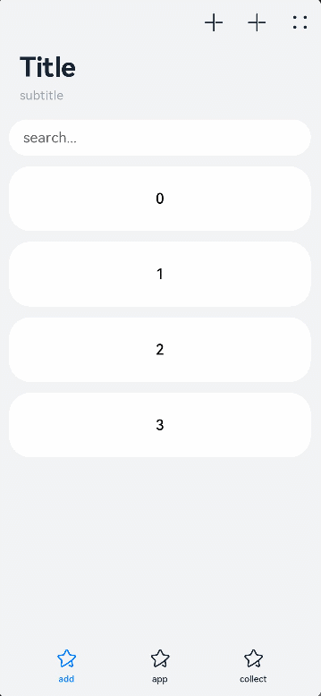

# Navigation

The **\<Navigation>** component typically functions as the root container of a page and displays the title bar, toolbar, and navigation bar based on the attribute settings.

> **NOTE**
>
> This component is supported since API version 8. Updates will be marked with a superscript to indicate their earliest API version.


## Child Components

Supported

Since API version 9, it is recommended that this component be used together with the **[\<NavRouter>](ts-basic-components-navrouter.md)** component.


## APIs

Navigation()


## Attributes

In addition to the [universal attributes](ts-universal-attributes-size.md), the following attributes are supported.

| Name            | Type                                    | Description                                      |
| -------------- | ---------------------------------------- | ---------------------------------------- |
| title          | string \| [CustomBuilder](ts-types.md#custombuilder8)<sup>8+</sup> \| [NavigationCommonTitle](#navigationcommontitle)<sup>9+</sup> \| [NavigationCustomTitle](#navigationcustomtitle)<sup>9+</sup> | Page title.                                   |
| subTitle<sup>deprecated</sup>       | string                                   | Subtitle of the page. This attribute is deprecated since API version 9. You are advised to use **title** instead.                                  |
| menus          | Array<[NavigationMenuItem](#navigationmenuitem)&gt; \| [CustomBuilder](ts-types.md#custombuilder8)<sup>8+</sup> | Menu items in the upper right corner of the page. When the value type is Array\<[NavigationMenuItem](#navigationmenuitem)>, the menu shows a maximum of three icons in portrait mode and a maximum of five icons in landscape mode, plus excess icons (if any) under the automatically generated **More** icon.     |
| titleMode      | [NavigationTitleMode](#navigationtitlemode)                      | Display mode of the page title bar.<br>Default value: **NavigationTitleMode.Free**|
| toolBar        | [object](#object) \| [CustomBuilder](ts-types.md#custombuilder8)<sup>8+</sup> | Content of the toolbar.<br>**items**: items on the toolbar.    |
| hideToolBar    | boolean                                  | Whether to hide the toolbar.<br>Default value: **false**<br>**true**: Hide the toolbar.<br>**false**: Display the toolbar.|
| hideTitleBar   | boolean                                  | Whether to hide the title bar.<br>Default value: **false**<br>**true**: Hide the title bar.<br>**false**: Display the title bar.|
| hideBackButton | boolean                                  | Whether to hide the Back key.<br>Default value: **false**<br>**true**: Hide the Back key.<br>**false**: Display the Back key.|
| navBarWidth<sup>9+</sup> | [Length](ts-types.md#length)                         | Width of the navigation bar.<br>Default value: **200vp**|
| navBarPosition<sup>9+</sup> | [NavBarPosition](#navbarposition)             | Position of the navigation bar.<br>Default value: **NavBarPosition.Start**|
| mode<sup>9+</sup> | [NavigationMode](#navigationmode)                       | Display mode of the navigation bar.<br>Default value: **NavigationMode.Auto**|
| backButtonIcon<sup>9+</sup> | string \| [PixelMap](../apis/js-apis-image.md#pixelmap7) \| [Resource](ts-types.md#resource)   | Back icon on the navigation bar.|
| hideNavBar<sup>9+</sup> | boolean                         | Whether to hide the navigation bar. This attribute is valid only when **mode** is set to **NavigationMode.Split**.|


## NavigationMenuItem

| Name  | Type                   | Mandatory| Description                          |
| ------ | ----------------------- | ---- | ------------------------------ |
| value  | string                  | Yes  | Text of a menu item.    |
| icon   | string                  | No  | Icon path of a menu item.|
| action | () =&gt; void | No  | Callback invoked when a menu item is selected.    |

## object

| Name  | Type                   | Mandatory| Description                          |
| ------ | ----------------------- | ---- | ------------------------------ |
| value  | string                  | Yes  | Text of an option on the toolbar.    |
| icon   | string                  | No  | Icon path of an option on the toolbar.|
| action | () =&gt; void | No  | Callback invoked when an option is selected.    |

## NavigationTitleMode

| Name  | Description                                      |
| ---- | ---------------------------------------- |
| Free | When the content is a scrollable component, the main title shrinks as the content scrolls down (the subtitle fades out with its size remaining unchanged) and restores when the content scrolls up to the top.|
| Mini | The title is fixed at mini mode.                      |
| Full | The title is fixed at full mode.                         |

## NavigationCommonTitle

| Name  | Type      | Mandatory| Description     |
| ------ | --------- | ---- | -------- |
| main | string | Yes| Main title.|
| sub | string | Yes| Subtitle.|

## NavigationCustomTitle

| Name  | Type                   | Mandatory| Description                          |
| ------ | ----------------------- | ---- | ------------------------------ |
| builder | [CustomBuilder](ts-types.md#custombuilder8) | Yes| Content of the title bar.|
| height | [TitleHeight](#titleheight) \| [Length](ts-types.md#length) | Yes| Height of the title bar.|

## NavBarPosition

| Name| Description                                      |
| ---- | ---------------------------------------- |
| Start | When two columns are displayed, the main column is at the start of the main axis.|
| End   | When two columns are displayed, the main column is at the end of the main axis. |

## NavigationMode

| Name| Description                                      |
| ---- | ---------------------------------------- |
| Stack | The navigation bar and content area are displayed independently of each other, which are equivalent to two pages.|
| Split | The navigation bar and content area are displayed in different columns.|
| Auto | When the window width is greater than or equal to 520 vp, Split mode is used. Otherwise, Stack mode is used.|

## TitleHeight

| Name| Description                                      |
| ---- | ---------------------------------------- |
| MainOnly | Recommended height (56 vp) of the title bar when only the main title is available.|
| MainWithSub | Recommended height (82 vp) of the title bar when both the main title and subtitle exist.|


>  **NOTE**
>
>  The scrollable component can only be **\<List>**.


## Events

| Name                                      | Description                                    |
| ---------------------------------------- | ---------------------------------------- |
| onTitleModeChange(callback: (titleMode: NavigationTitleMode) =&gt; void) | Triggered when **titleMode** is set to **NavigationTitleMode.Free** and the title bar mode changes as content scrolls.|
| onNavBarStateChange(callback: (isVisible: boolean) =&gt; void) | Triggered when the navigation bar visibility status changes. The value **true** means that the navigation bar is displayed, and **false** means the opposite.|


## Example

```ts
// xxx.ets
@Entry
@Component
struct NavigationExample {
  private arr: number[] = [0, 1, 2, 3, 4, 5, 6, 7, 8, 9]
  @State currentIndex: number = 0
  @State Build: Array<Object> = [
    {
      text: 'add',
      num: 0
    },
    {
      text: 'app',
      num: 1
    },
    {
      text: 'collect',
      num: 2
    }
  ]

  @Builder NavigationTitle() {
    Column() {
      Text('Title')
        .fontColor('#182431')
        .fontSize(30)
        .lineHeight(41)
        .fontWeight(700)
      Text('subtitle')
        .fontColor('#182431')
        .fontSize(14)
        .lineHeight(19)
        .opacity(0.4)
        .margin({ top: 2 })
    }.alignItems(HorizontalAlign.Start)
  }

  @Builder NavigationMenus() {
    Row() {
      Image('common/navigation_icon1.svg')
        .width(24)
        .height(24)
      Image('common/navigation_icon1.svg')
        .width(24)
        .height(24)
        .margin({ left: 24 })
      Image('common/navigation_icon2.svg')
        .width(24)
        .height(24)
        .margin({ left: 24 })
    }
  }

  @Builder NavigationToolbar() {
    Row() {
      ForEach(this.Build, item => {
        Column() {
          Image(this.currentIndex == item.num ? 'common/public_icon_selected.svg' : 'common/public_icon.svg')
            .width(24)
            .height(24)
          Text(item.text)
            .fontColor(this.currentIndex == item.num ? '#007DFF' : '#182431')
            .fontSize(10)
            .lineHeight(14)
            .fontWeight(500)
            .margin({ top: 3 })
        }.width(104).height(56)
        .onClick(() => {
          this.currentIndex = item.num
        })
      })
    }.margin({ left: 24 })
  }

  build() {
    Column() {
      Navigation() {
        TextInput({ placeholder: 'search...' })
          .width(336)
          .height(40)
          .backgroundColor('#FFFFFF')
          .margin({ top: 8, left: 12 })

        List({ space: 12, initialIndex: 0 }) {
          ForEach(this.arr, (item) => {
            ListItem() {
              Text('' + item)
                .width(336)
                .height(72)
                .backgroundColor('#FFFFFF')
                .borderRadius(24)
                .fontSize(16)
                .fontWeight(500)
                .textAlign(TextAlign.Center)
            }.editable(true)
          }, item => item)
        }
        .height(324)
        .width('100%')
        .margin({ top: 12, left: 12 })
      }
      .title(this.NavigationTitle)
      .menus(this.NavigationMenus)
      .titleMode(NavigationTitleMode.Full)
      .toolBar(this.NavigationToolbar)
      .hideTitleBar(false)
      .hideToolBar(false)
      .onTitleModeChange((titleModel: NavigationTitleMode) => {
        console.info('titleMode' + titleModel)
      })
    }.width('100%').height('100%').backgroundColor('#F1F3F5')
  }
}
```


