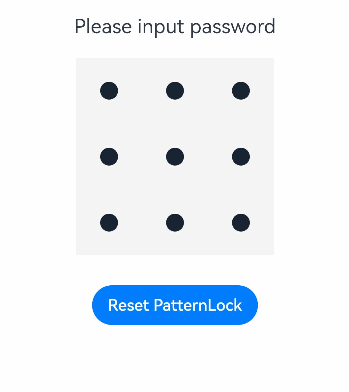

# PatternLock

The **\<PatternLock>** component allows users to use a pattern password for authentication. It enters the input state once a finger is pressed against it, and exits the input state and completes the input once the finger leaves the screen.

>  **NOTE**
>
> This component is supported since API version 9. Updates will be marked with a superscript to indicate their earliest API version.

## Child Components

Not supported

##  APIs

PatternLock(controller?: PatternLockController)

**Parameters**

| Name    | Type                                       | Mandatory| Description                                                        |
| ---------- | ----------------------------------------------- | ---- | ------------------------------------------------------------ |
| controller | [PatternLockController](#patternlockcontroller) | No  | Controller of a component to reset the component status.      |

## Attributes

Except for **backgroundColor**, the universal attributes are not supported.

| Name           | Type                             | Description                                                        |
| --------------- | ------------------------------------- | ------------------------------------------------------------ |
| sideLength      | [Length](ts-types.md#length)        | Width and height (same value) of the component. If this attribute is set to 0 or a negative value, the component is not displayed.<br>Default value: **300vp**|
| circleRadius    | [Length](ts-types.md#length)        | Radius of the grid dot.<br>Default value: **14vp**                       |
| regularColor    | [ResourceColor](ts-types.md#resourcecolor) | Fill color of the grid dot in unselected state.<br>Default value: **Color.Black**|
| selectedColor   | [ResourceColor](ts-types.md#resourcecolor) | Fill color of the grid dot in selected state.<br>Default value: **Color.Black**|
| activeColor     | [ResourceColor](ts-types.md#resourcecolor) | Fill color of the grid dot in activated state, which is when the dot is highlighted but not selected.<br>Default value: **Color.Black**|
| pathColor       | [ResourceColor](ts-types.md#resourcecolor) | Path color.<br>Default value: **Color.Blue**                     |
| pathStrokeWidth | number \| string            | Width of the path stroke. If this attribute is set to 0 or a negative value, the path stroke is not displayed.<br>Default value: **34vp**          |
| autoReset       | boolean                               | Whether to allow the user to reset the component status (that is, clear the input) by touching the component again after the input is complete. The value **true** means that the user can reset the component status by touching the component again after the input is complete, and **false** means the opposite.<br>Default value: **true**|

## Events

In addition to the [universal events](ts-universal-events-click.md), the following events are supported.

| Name                                      | Description                                      |
| ---------------------------------------- | ---------------------------------------- |
| onPatternComplete(callback: (input: Array\<number\>) => void) | Invoked when the pattern password input is complete.<br>**input**: an array of digits that are the indexes of the connected grid dots and are arranged in the same sequence as the dots are connected. The indexes of the grid dots are as follows: 0 to 2 for the dots in the first row from left to right, 3–5 for the dots in the second row, and 6–8 for the dots in the third row.|

## PatternLockController

Implements the controller bound to the **\<PatternLock>** component for resetting the component status.

### Objects to Import

```typescript
patternLockController: PatternLockController = new PatternLockController()
```

### reset

reset(): void

Resets the component status.

##  Example

```ts
// xxx.ets
@Entry
@Component
struct PatternLockExample {
  @State passwords: Number[] = []
  @State message: string = 'please input password!'
  private patternLockController: PatternLockController = new PatternLockController()

  build() {
    Column() {
      Text(this.message).textAlign(TextAlign.Center).margin(20).fontSize(20)
      PatternLock(this.patternLockController)
        .sideLength(200)
        .circleRadius(9)
        .pathStrokeWidth(18)
        .activeColor('#B0C4DE')
        .selectedColor('#228B22')
        .pathColor('#90EE90')
        .backgroundColor('#F5F5F5')
        .autoReset(true)
        .onPatternComplete((input: Array<number>) => {
          // If the length of the entered password is less than 5, the system prompts the user to enter the password again.
          if (input === null || input === undefined || input.length < 5) {
            this.message = 'The password length needs to be greater than 5, please enter again.'
            return
          }
          // Check whether the password length is greater than 0.
          if (this.passwords.length > 0) {
            // Check whether the two passwords are the same. If yes, the system displays a message indicating that the password is set successfully. If no, the system prompts the user to enter the password again.
            if (this.passwords.toString() === input.toString()) {
              this.passwords = input
              this.message = 'Set password successfully: ' + this.passwords.toString()
            } else {
              this.message = 'Inconsistent passwords, please enter again.'
            }
          } else {
            // The system prompts the user to enter the password again.
            this.passwords = input
            this.message = "Please enter again."
          }
        })
      Button('Reset PatternLock').margin(30).onClick(() => {
        // Reset the pattern lock.
        this.patternLockController.reset()
        this.passwords = []
        this.message = 'Please input password'
      })
    }.width('100%').height('100%')
  }
}
```


