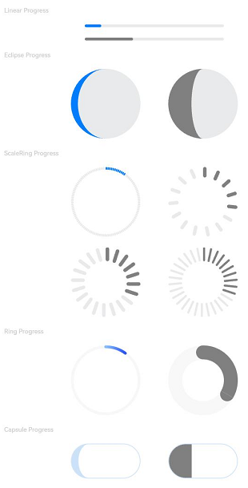

# Progress

The **\<Progress>** component represents a progress indicator that displays the progress of content loading or an operation.

>  **NOTE**
>
>  This component is supported since API version 7. Updates will be marked with a superscript to indicate their earliest API version.


## Child Components

Not supported


## APIs

Progress(options: {value: number, total?: number, type?: ProgressType})

Creates a progress indicator.

Since API version 9, this API is supported in ArkTS widgets.

**Parameters**

| Name                       | Type                               | Mandatory  | Description                                    |
| -------------------------- | ----------------------------------- | ---- | ---------------------------------------- |
| value                      | number                              | Yes   | Current progress. If the value is less than 0, the value **0** is used. If the value is greater than that of **total**, the value of **total** is used.<br>Since API version 9, this API is supported in ArkTS widgets.|
| total                      | number                              | No   | Total progress.<br>Default value: **100**<br>Since API version 9, this API is supported in ArkTS widgets.|
| type<sup>8+</sup>          | [ProgressType](#progresstype)   | No   | Style of the progress indicator.<br>Default value: **ProgressType.Linear**<br>Since API version 9, this API is supported in ArkTS widgets.|
| style<sup>deprecated</sup> | [ProgressStyle](#progressstyle) | No   | Style of the progress indicator.<br>This parameter is deprecated since API version 8. You are advised to use **type** instead.<br>Default value: **ProgressStyle.Linear**|

## ProgressType

Since API version 9, this API is supported in ArkTS widgets.

| Name                    | Description                                      |
| ---------------------- | ---------------------------------------- |
| Linear                 | Linear style. Since API version 9, the progress indicator adaptively switches to vertical layout if the height is greater than the width.  |
| Ring<sup>8+</sup>      | Indeterminate ring style. The ring fills up as the progress increases.                |
| Eclipse<sup>8+</sup>   | Eclipse style, which visualizes the progress in a way similar to the moon waxing from new to full.        |
| ScaleRing<sup>8+</sup> | Determinate ring style, which is similar to the clock scale. Since API version 9, when the outer circles of scales overlap, the progress indicator is automatically converted to the **Ring** style.|
| Capsule<sup>8+</sup>   | Capsule style. At both ends, the progress indicator works in a same manner as the eclipse style. In the middle part of the capsule, the progress indicator works in a same manner as the linear style. If the height is greater than the width, the progress indicator adaptively switches to vertical layout.|

##  ProgressStyle

Since API version 9, this API is supported in ArkTS widgets.

| Name       | Description                                      |
| --------- | ---------------------------------------- |
| Linear    | Linear style.                                   |
| Ring      | Indeterminate ring style. The ring fills up as the progress increases.                |
| Eclipse   | Eclipse style, which visualizes the progress in a way similar to the moon waxing from new to full.        |
| ScaleRing | Determinate ring style, which is similar to the clock scale.              |
| Capsule   | Capsule style. At both ends, the progress indicator works in a same manner as the eclipse style. In the middle part of the capsule, the progress indicator works in a same manner as the linear style. If the height is greater than the width, the progress indicator adaptively switches to vertical layout.|

## Attributes

In addition to the [universal attributes](ts-universal-attributes-size.md), the following attributes are supported.

| Name              | Type                                                    | Description                                                        |
| ------------------ | ------------------------------------------------------------ | ------------------------------------------------------------ |
| value              | number                                                       | Current progress. If the value is less than 0, the value **0** is used. If the value is greater than that of **total**, the value of **total** is used. Invalid values do not take effect.<br>Since API version 9, this API is supported in ArkTS widgets.|
| color              | [ResourceColor](ts-types.md#resourcecolor)    \| [LinearGradient<sup>10+</sup>](ts-basic-components-datapanel.md#lineargradient10) | Background color of the progress indicator. Since API version 10, this attribute can be set to **LinearGradient** for the **Ring** style.<br>Default value (API version 9): **'\#ff007dff'**<br>Default value (API version 10):<br>- Capsule: **'\#33006cde'**<br>- Ring: starting point: **'\#ff3b61f7'**, ending point: **'\#ff6591bf'**<br>- Other styles: **'\#ff007dff'**<br>Since API version 9, this API is supported in ArkTS widgets, except that **LinearGradient** is not supported.|
| backgroundColor    | [ResourceColor](ts-types.md#resourcecolor)                   | Background color of the progress indicator.<br>Default value (API version 9): **'\#19182431'**<br>Default value (API version 10):<br>- Capsule: **'\#33ffffff'**<br>- Ring: **'\#08182431'**<br>- Other styles: **'\#19182431'**<br>Since API version 9, this API is supported in ArkTS widgets.<br>**NOTE**<br>The settings of the universal attribute [backgroundColor](./ts-universal-attributes-background.md) applies to the progress indicator instead of the entire **\<Progress>** component.|
| style<sup>8+</sup> | [ProgressStyleOptions](#progressstyleoptions) \| [CapsuleStyleOptions<sup>10+</sup>](#capsulestyleoptions10) \| [RingStyleOptions<sup>10+</sup>](#ringstyleoptions10) | Component style. Since API version 10, this attribute can be set to **CapsuleStyleOptions** or **RingStyleOptions**.<br>- **CapsuleStyleOptions** is available for the **Capsule** style.<br>- **RingStyleOptions** is available for the **Ring** style.<br>- **ProgressStyleOptions** is available for other styles.<br>Since API version 9, this API is supported in ArkTS widgets, except that **CapsuleStyleOptions** and **RingStyleOptions** are not supported.|

## ProgressStyleOptions
| Name         | Type                     | Mandatory| Description                                                                                       |
| ------------ | ---------------------------- | ---- | ------------------------------------------------------------------------------------------ |
| strokeWidth  | [Length](ts-types.md#length) | No  | Stroke width of the progress indicator. It cannot be set in percentage.<br>Default value: **4.0Vp**                                           |
| scaleCount   | number                       | No  | Number of divisions on the ring-style process indicator.<br>Default value: **120**                                                       |
| scaleWidth   | [Length](ts-types.md#length) | No  | Scale width of the ring-style progress bar. It cannot be set in percentage. If it is greater than the value of **strokeWidth**, the default scale width is used.<br>Default value: **2.0Vp**|

## CapsuleStyleOptions<sup>10+</sup>
| Name         | Type| Mandatory| Description|
| ------------- | ------- | ---- | -------- |
| borderColor | [ResourceColor](ts-types.md#resourcecolor) | No| Border color.<br>Default value: **'\#33006cde'**|
| borderWidth | [Length](ts-types.md#length) | No| Border width. It cannot be set in percentage.<br>Default value: **1 Vp**|
| content | string | No| Text content, which can be customized .|
| font | [Font](ts-types.md#font) | No| Text style.<br>Default value:<br>- Font size (cannot be set in percentage): **12Fp**<br>- Other attributes: following the settings of the **\<Text>** component.|
| fontColor | [ResourceColor](ts-types.md#resourcecolor) | No| Font color.<br>Default value: **'\#ff182431'**|
| enableScanEffect | boolean | No| Whether to enable the scan effect.<br>Default value: **false**|

## RingStyleOptions<sup>10+</sup>
| Name          | Type                     | Mandatory| Description                                                                                       |
| ------------- | ---------------------------- | ---- | ------------------------------------------------------------------------------------------ |
| strokeWidth   | [Length](ts-types.md#length) | No  | Stroke width of the progress indicator. It cannot be set in percentage. A value greater than or equal to the radius evaluates to half of the radius.<br>Default value: **4Vp**|
| shadow        | boolean                      | No  | Whether to enable the shadow effect.<br>Default value: **false**                                                            |
| status        | [ProgressStatus<sup>10+</sup>](#progressstatus10) | No| Status of the progress indicator. When this parameter is set to **LOADING**, the **value** settings do not take effect.<br>Default value: **ProgressStatus.PROGRESSING**|

## ProgressStatus<sup>10+</sup>
| Name                   | Description            |
| ----------------------- | ---------------- |
| LOADING<sup>10+</sup>  | Loading.|
| PROGRESSING<sup>10+</sup>  | The progress is being updated.|

## Events

The [universal events](ts-universal-events-click.md) are supported.

## Example

```ts
// xxx.ets
@Entry
@Component
struct ProgressExample {
  build() {
    Column({ space: 15 }) {
      Text('Linear Progress').fontSize(9).fontColor(0xCCCCCC).width('90%')
      Progress({ value: 10, type: ProgressType.Linear }).width(200)
      Progress({ value: 20, total: 150, type: ProgressType.Linear }).color(Color.Grey).value(50).width(200)


      Text('Eclipse Progress').fontSize(9).fontColor(0xCCCCCC).width('90%')
      Row({ space: 40 }) {
        Progress({ value: 10, type: ProgressType.Eclipse }).width(100)
        Progress({ value: 20, total: 150, type: ProgressType.Eclipse }).color(Color.Grey).value(50).width(100)
      }

      Text('ScaleRing Progress').fontSize(9).fontColor(0xCCCCCC).width('90%')
      Row({ space: 40 }) {
        Progress({ value: 10, type: ProgressType.ScaleRing }).width(100)
        Progress({ value: 20, total: 150, type: ProgressType.ScaleRing })
          .color(Color.Grey).value(50).width(100)
          .style({ strokeWidth: 15, scaleCount: 15, scaleWidth: 5 })
      }

      // scaleCount vs. scaleWidth
      Row({ space: 40 }) {
        Progress({ value: 20, total: 150, type: ProgressType.ScaleRing })
          .color(Color.Grey).value(50).width(100)
          .style({ strokeWidth: 20, scaleCount: 20, scaleWidth: 5 })
        Progress({ value: 20, total: 150, type: ProgressType.ScaleRing })
          .color(Color.Grey).value(50).width(100)
          .style({ strokeWidth: 20, scaleCount: 30, scaleWidth: 3 })
      }

      Text('Ring Progress').fontSize(9).fontColor(0xCCCCCC).width('90%')
      Row({ space: 40 }) {
        Progress({ value: 10, type: ProgressType.Ring }).width(100)
        Progress({ value: 20, total: 150, type: ProgressType.Ring })
          .color(Color.Grey).value(50).width(100)
          .style({ strokeWidth: 20 })
      }

      Text('Capsule Progress').fontSize(9).fontColor(0xCCCCCC).width('90%')
      Row({ space: 40 }) {
        Progress({ value: 10, type: ProgressType.Capsule }).width(100).height(50)
        Progress({ value: 20, total: 150, type: ProgressType.Capsule })
          .color(Color.Grey)
          .value(50)
          .width(100)
          .height(50)
      }
    }.width('100%').margin({ top: 30 })
  }
}
```


