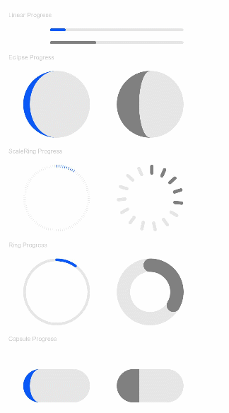

# Progress

The **\<Progress>** component is used to provide a progress indicator that displays the progress of content loading or an operation.

>  **NOTE**
>
>  This component is supported since API version 7. Updates will be marked with a superscript to indicate their earliest API version.


## Child Components

Not supported


## APIs

Progress(options: {value: number, total?: number, style?: ProgressStyle, type?: ProgressType})

Creates a progress indicator.

**Parameters**

| Name| Type| Mandatory| Description|
| -------- | -------- | -------- | -------- |
| value | number | Yes| Current progress.|
| total | number | No| Total progress.<br>Default value: **100**|
| type<sup>8+</sup> | ProgressType | No| Type of the progress indicator.<br>Default value: **ProgressType.Linear**|
| style<sup>deprecated</sup> | ProgressStyle | No| Style the progress indicator.<br>This parameter is deprecated since API version 8. You are advised to use **type** instead.<br>Default value: **ProgressStyle.Linear**|

## ProgressType

| Name| Description|
| -------- | -------- |
| Linear | Linear type.|
| Ring<sup>8+</sup> | Indeterminate ring type. The ring fills up as the progress increases.|
| Eclipse | Eclipse type, which visualizes the progress in a way similar to the moon waxing from new to full.|
| ScaleRing<sup>8+</sup> | Determinate ring type, which is similar to the clock scale.|
| Capsule<sup>8+</sup> | Capsule type. At both ends, the progress indicator works in a same manner as the eclipse type. In the middle part of the capsule, the progress indicator works in a same manner as the linear type.|

##  ProgressStyle

| Name     | Description                                                        |
| --------- | ------------------------------------------------------------ |
| Linear    | Linear type.                                                  |
| Ring      | Indeterminate ring type. The ring fills up as the progress increases.            |
| Eclipse   | Eclipse type, which visualizes the progress in a way similar to the moon waxing from new to full.|
| ScaleRing | Determinate ring type, which is similar to the clock scale.        |
| Capsule   | Capsule type. At both ends, the progress indicator works in a same manner as the eclipse type. In the middle part of the capsule, the progress indicator works in a same manner as the linear type.|

## Attributes

| Name| Type| Description|
| -------- | -------- | -------- |
| value | number | Current progress.|
| color | [ResourceColor](ts-types.md#resourcecolor8) | Background color of the progress indicator.|
| style<sup>8+</sup> | {<br>strokeWidth?: [Length](ts-types.md#length),<br>scaleCount?: number,<br>scaleWidth?: [Length](ts-types.md#length)<br>} | Component style.<br>- **strokeWidth**: stroke width of the progress indicator.<br>- **scaleCount**: number of divisions on the determinate ring-type process indicator.<br>- **scaleWidth**: scale bar width of the determinate ring-type process indicator. If it is greater than the progress indicator width, the default value is used instead.|


## Example

```ts
// xxx.ets
@Entry
@Component
struct ProgressExample {
  build() {
    Column({ space: 15 }) {
      Text('Linear Progress').fontSize(9).fontColor(0xCCCCCC).width('90%')
      Progress({ value: 10, type: ProgressType.Linear }).width(200)
      Progress({ value: 20, total: 150, type: ProgressType.Linear }).color(Color.Grey).value(50).width(200)

      Text('Eclipse Progress').fontSize(9).fontColor(0xCCCCCC).width('90%')
      Row({ space: 40 }) {
        Progress({ value: 10, type: ProgressType.Eclipse }).width(100)
        Progress({ value: 20, total: 150, type: ProgressType.Eclipse }).color(Color.Grey).value(50).width(100)
      }

      Text('ScaleRing Progress').fontSize(9).fontColor(0xCCCCCC).width('90%')
      Row({ space: 40 }) {
        Progress({ value: 10, type: ProgressType.ScaleRing }).width(100)
        Progress({ value: 20, total: 150, type: ProgressType.ScaleRing })
          .color(Color.Grey).value(50).width(100)
          .style({ strokeWidth: 15, scaleCount: 15, scaleWidth: 5 })
      }

      Text('Ring Progress').fontSize(9).fontColor(0xCCCCCC).width('90%')
      Row({ space: 40 }) {
        Progress({ value: 10, type: ProgressType.Ring }).width(100)
        Progress({ value: 20, total: 150, type: ProgressType.Ring })
          .color(Color.Grey).value(50).width(100)
          .style({ strokeWidth: 20, scaleCount: 30, scaleWidth: 20 })
      }

      Text('Capsule Progress').fontSize(9).fontColor(0xCCCCCC).width('90%')
      Row({ space: 40 }) {
        Progress({ value: 10, type: ProgressType.Capsule }).width(100).height(50)
        Progress({ value: 20, total: 150, type: ProgressType.Capsule })
          .color(Color.Grey)
          .value(50)
          .width(100)
          .height(50)
      }
    }.width('100%').margin({ top: 30 })
  }
}
```


