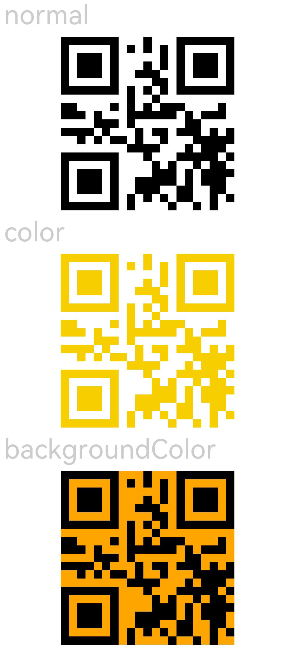

# QRCode

The **\<QRCode>** component is used to display a QR code.

> **NOTE**
>
> This component is supported since API version 7. Updates will be marked with a superscript to indicate their earliest API version.
> 
> The number of pixels of the **\<QRCode>** component is subject to the content. If the component size is not large enough, the content may fail to be displayed. In this case, you need to resize the component.


## Child Components

Not supported


## APIs

QRCode(value: string)

Since API version 9, this API is supported in ArkTS widgets.

**Parameters**

| Name| Type| Mandatory| Description|
| -------- | -------- | -------- | -------- |
| value | string | Yes| Content of the QR code. A maximum of 256 characters are supported. If the number of characters exceeds 256, the first 256 characters are used.<br>**NOTE**<br>The string cannot be **null**, **undefined**, or empty.|

## Attributes

In addition to the [universal attributes](ts-universal-attributes-size.md), the following attributes are supported.

| Name| Type| Description|
| -------- | -------- | -------- |
| color | [ResourceColor](ts-types.md#resourcecolor) | Color of the QR code.<br>Default value: **Color.Black**<br>Since API version 9, this API is supported in ArkTS widgets.|
| backgroundColor | [ResourceColor](ts-types.md#resourcecolor) | Background color of the QR code.<br>Default value: **Color.White**<br>Since API version 9, this API is supported in ArkTS widgets.|


## Events

Among the universal events, the [click event](ts-universal-events-click.md), [touch event](ts-universal-events-touch.md), and [show/hide event](ts-universal-events-show-hide.md) are supported.


## Example

```ts
// xxx.ets
@Entry
@Component
struct QRCodeExample {
  private value: string = 'hello world'
  build() {
    Column({ space: 5 }) {
      Text('normal').fontSize(9).width('90%').fontColor(0xCCCCCC).fontSize(30)
      QRCode(this.value).width(200).height(200)

      // Set the color for the QR code.
      Text('color').fontSize(9).width('90%').fontColor(0xCCCCCC).fontSize(30)
      QRCode(this.value).color(0xF7CE00).width(200).height(200)

      // Set the background color for the QR code.
      Text('backgroundColor').fontSize(9).width('90%').fontColor(0xCCCCCC).fontSize(30)
      QRCode(this.value).width(200).height(200).backgroundColor(Color.Orange)
    }.width('100%').margin({ top: 5 })
  }
}
```


