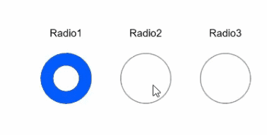

# Radio

The **\<Radio>** component allows users to select from a set of mutually exclusive options.

>  **NOTE**
>
>  This component is supported since API version 8. Updates will be marked with a superscript to indicate their earliest API version.


## Child Components

Not supported


## APIs

Radio(options: {value: string, group: string})

Since API version 9, this API is supported in ArkTS widgets.

**Parameters**

| Name| Type| Mandatory| Description|
| -------- | -------- | -------- | -------- |
| value | string | Yes| Value of the current radio button.|
| group | string | Yes| Name of the group to which the radio button belongs. Only one radio button in a given group can be selected at a time.|

## Attributes

In addition to the [universal attributes](ts-universal-attributes-size.md), the following attributes are supported.

| Name| Type| Description|
| -------- | -------- | -------- |
| checked | boolean | Whether the radio button is selected.<br>Default value: **false**<br>Since API version 9, this API is supported in ArkTS widgets.<br>Since API version 10, this attribute supports [$$](../../quick-start/arkts-two-way-sync.md) for two-way binding of variables.|
| radioStyle<sup>10+</sup> | [RadioStyle](#radiostyle) | Style of the radio button in selected or deselected state.<br>Since API version 10, this API is supported in ArkTS widgets.|

## Events

In addition to the [universal events](ts-universal-events-click.md), the following events are supported.

| Name| Description|
| -------- | -------- |
| onChange(callback: (isChecked: boolean) => void) | Triggered when the selected state of the radio button changes.<br> - If **isChecked** is **true**, it indicates that the radio button changes from unselected to selected.<br> - If **isChecked** is **false**, it indicates that the radio button changes from selected to unselected.<br>Since API version 9, this API is supported in ArkTS widgets.|

## RadioStyle

| Name                  | Type                                      | Mandatory| Default Value | Description                  |
| ---------------------- | ------------------------------------------ | ---- | ------- | ---------------------- |
| checkedBackgroundColor | [ResourceColor](ts-types.md#resourcecolor) | No  | #007DFF | Color of the background when the radio button is selected.    |
| uncheckedBorderColor   | [ResourceColor](ts-types.md#resourcecolor) | No  | #182431 | Color of the border when the radio button is deselected.    |
| indicatorColor         | [ResourceColor](ts-types.md#resourcecolor) | No  | #FFFFFF | Color of the indicator when the radio button is selected.|

## Example

```ts
// xxx.ets
@Entry
@Component
struct RadioExample {
  build() {
    Flex({ direction: FlexDirection.Row, justifyContent: FlexAlign.Center, alignItems: ItemAlign.Center }) {
      Column() {
        Text('Radio1')
        Radio({ value: 'Radio1', group: 'radioGroup' }).checked(true)
          .height(50)
          .width(50)
          .onChange((isChecked: boolean) => {
            console.log('Radio1 status is ' + isChecked)
          })
      }
      Column() {
        Text('Radio2')
        Radio({ value: 'Radio2', group: 'radioGroup' }).checked(false)
          .height(50)
          .width(50)
          .onChange((isChecked: boolean) => {
            console.log('Radio2 status is ' + isChecked)
          })
      }
      Column() {
        Text('Radio3')
        Radio({ value: 'Radio3', group: 'radioGroup' }).checked(false)
          .height(50)
          .width(50)
          .onChange((isChecked: boolean) => {
            console.log('Radio3 status is ' + isChecked)
          })
      }
    }.padding({ top: 30 })
  }
}
```

