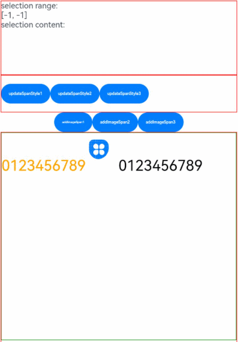

# RichEditor

The **\<RichEditor>** is a component that supports interactive text editing and mixture of text and imagery.

>  **NOTE**
>
>  This component is supported since API version 10. Updates will be marked with a superscript to indicate their earliest API version.
>
>  Drag effects such as floating for the **\<RichEditor>** component can only be implemented through the [onDragStart](ts-universal-events-drag-drop.md) event.


## Child Components

This component can contain the [\<Span>](ts-basic-components-span.md) and [\<ImageSpan>](ts-basic-components-imagespan.md) child components.


## APIs

RichEditor(value: RichEditorOptions)

**Parameters**

| Name| Type| Mandatory| Description|
| -------- | -------- | -------- | -------- |
| value | [RichEditorOptions](#richeditoroptions)  | Yes| Options for initializing the component.|


## Attributes

The [universal attributes](ts-universal-attributes-size.md) are supported.

>  **NOTE**
>
>  The default value of the **clip** attribute is **true**.
>
>  The **align** attribute supports only the start, center, and end options.

| Name                     | Type                                                    | Description                                                        |
| ------------------------- | ------------------------------------------------------------ | ------------------------------------------------------------ |
| customKeyboard | [CustomBuilder](ts-types.md#custombuilder8) | Custom keyboard.<br>**NOTE**<br>When a custom keyboard is set, activating the text box opens the specified custom component, instead of the system input method.<br>The custom keyboard's height can be set through the **height** attribute of the custom component's root node, and its width is fixed at the default value.<br>The custom keyboard is displayed on top of the current page, without compressing or raising the page.<br>The custom keyboard cannot obtain the focus, but it blocks gesture events.<br>By default, the custom keyboard is closed when the input component loses the focus.|
| bindSelectionMenu | {<br>spantype: [RichEditorSpanType](#richeditorspantype),<br>content: [CustomBuilder](ts-types.md#custombuilder8),<br>responseType: [ResponseType](ts-appendix-enums.md#responsetype8) \| [RichEditorResponseType<sup>11+</sup>](ts-appendix-enums.md#richeditorresponsetype11),<br>options?: [SelectionMenuOptions](#selectionmenuoptions11)<br>} | Custom context menu on text selection.<br> Default value: {<br>  spanType: RichEditorSpanType:TEXT<br>responseType: ResponseType.LongPress<br>Other: null<br>}|
| copyOptions | [CopyOptions](ts-appendix-enums.md#copyoptions9) | Whether copy and paste is allowed for text content.<br>Default value: **CopyOptions.LocalDevice**<br>**NOTE**<br>If **copyOptions** is not set to **CopyOptions.None**, long-pressing the text content displays the context menu. If a custom context menu is defined through **bindSelectionMenu** or other approaches, it will be displayed.<br>If **copyOptions** is set to **CopyOptions.None**, copy and paste is not allowed. |
## Events

In addition to the [universal events](ts-universal-events-click.md), the following events are supported.

| Name                                                        | Description                                                    |
| ------------------------------------------------------------ | ------------------------------------------------------------ |
| onReady(callback: () =&gt; void)              | Triggered when initialization of the component is completed.                          |
| onSelect(callback: (value: [RichEditorSelection](#richeditorselection)) =&gt; void) | Triggered when content is selected.<br>If a mouse device is used for selection, this event is triggered when the mouse button is released. If a finger is used for selection, this event is triggered when the finger is released.<br>- **value**: information about all selected spans.|
| aboutToIMEInput(callback: (value: [RichEditorInsertValue](#richeditorinsertvalue)) =&gt; boolean) | Triggered when content is about to be entered in the input method.<br>- **value**: content to be entered in the input method.|
| onIMEInputComplete(callback: (value: [RichEditorTextSpanResult](#richeditortextspanresult)) =&gt; void) | Triggered when text input in the input method is complete.<br>- **value**: text span information after text input is completed.|
| aboutToDelete(callback: (value: [RichEditorDeleteValue](#richeditordeletevalue)) =&gt; boolean) | Triggered when content is about to be deleted in the input method.<br>- **value**: information about the text span where the content to be deleted is located.|
| onDeleteComplete(callback: () =&gt; void)     | Triggered when deletion in the input method is completed.                                |
| onPaste<sup>11+</sup>(callback: (event?: [PasteEvent](#pasteevent11)) => void) | Triggered when the paste is about to be completed.<br>**NOTE**<br>The default system paste and drag behaviors are available for text only.<br>You can use this API to overwrite the default system behaviors so that both images and text can be pasted.|

## RichEditorInsertValue

Describes the text to be inserted.

| Name| Type| Mandatory| Description|
| -------- | -------- | -------- | -------- |
| insertOffset | number  | Yes| Offset of the text to be inserted.|
| insertValue | string  | Yes| Content of the text to be inserted.|


## RichEditorDeleteValue

| Name| Type| Mandatory| Description|
| -------- | -------- | -------- | -------- |
| offset | number  | Yes| Offset of the text to be deleted.|
| direction | [RichEditorDeleteDirection](#richeditordeletedirection)  | Yes| Direction of the delete operation.|
| length | number | Yes| Length of the content to be deleted.|
| richEditorDeleteSpans | Array<[RichEditorTextSpanResult](#richeditortextspanresult) \| [RichEditorImageSpanResult](#richeditorimagespanresult)> | Yes| Information about the text or image spans to be deleted.|


## RichEditorDeleteDirection

Enumerates the directions of the delete operation.

| Name   | Description                         |
| -------- | ------------------------------ |
| BACKWARD      | Backward. |
| FORWARD   | Forward.     |


## RichEditorTextSpanResult

Provides the text span information.

| Name| Type| Mandatory| Description|
| -------- | -------- | -------- | -------- |
| spanPosition | [RichEditorSpanPosition](#richeditorspanposition)  | Yes| Span position.|
| value | string | Yes| Text span content.|
| textStyle | [RichEditorTextStyleResult](#richeditortextstyleresult) | Yes| Text span style.|
| offsetInSpan | [number, number] | Yes| Start and end positions of the valid content in the text span.|


## RichEditorSpanPosition

Provides the span position information.

| Name| Type| Mandatory| Description|
| -------- | -------- | -------- | -------- |
| spanIndex | number  | Yes| Span index.|
| spanRange | [number, number]  | Yes| Start and end positions of the span content in the **\<RichEditor>** component.|

## RichEditorSpanType

Provides the span type information.

| Name| Type| Mandatory| Description|
| -------- | -------- | -------- | -------- |
| TEXT | number  | Yes| Text span.|
| IMAGE | number  | Yes| Image span.|
| MIXED | number  | Yes| Mixed span, which contains both text and imagery.|

## RichEditorTextStyleResult

Provides the text span style information returned by the backend.

| Name| Type| Mandatory| Description                              |
| ------ | -------- | ---- | -------------------------------------- |
| fontColor | [ResourceColor](ts-types.md#resourcecolor) | Yes| Font color.|
| fontSize |  number   | Yes| Font size.|
| fontStyle | [FontStyle](ts-appendix-enums.md#fontstyle) | Yes| Font style.|
| fontWeight |  number | Yes| Font weight.|
| fontFamily  |  string | Yes| Font family.|
| decoration  | {<br>type: [TextDecorationType](ts-appendix-enums.md#textdecorationtype),<br>color?: [ResourceColor](ts-types.md#resourcecolor)<br>} | Yes| Style and color of the text decorative line.|

## RichEditorImageSpanResult

Provides the image span style information returned by the backend.

| Name| Type| Mandatory| Description                              |
| ------ | -------- | ---- | -------------------------------------- |
| size | [number, number] | Yes| Width and height of the image.|
| verticalAlign  | [ImageSpanAlignment](ts-basic-components-imagespan.md#imagespanalignment) | Yes | Vertical alignment mode of the image.|
| objectFit  | [ImageFit](ts-appendix-enums.md#imagefit) | Yes| Scale mode of the image.|


## RichEditorOptions

Defines the options for initializing the **\<RichEditor>** component.

| Name| Type| Mandatory| Description|
| -------- | -------- | -------- | -------- |
| controller | [RichEditorController](#richeditorcontroller)  | Yes| Controller for the **\<RichEditor>** component.|


## RichEditorController

Implements the controller for the **\<RichEditor>** component.

### Objects to Import

```
controller: RichEditorController = new RichEditorController()
```

### getCaretOffset

getCaretOffset(): number

Obtains the current cursor position.

**Return value**

| Type                     | Description              |
| ----------------------- | ---------------- |
| number | Cursor position.|

### setCaretOffset

setCaretOffset(offset: number): boolean

Sets the cursor position.

**Parameters**

| Name| Type| Mandatory| Description                              |
| ------ | -------- | ---- | -------------------------------------- |
| offset | number | Yes| Offset of the cursor. If the value is out of the text range, the setting fails.|

**Return value**

| Type                     | Description              |
| ----------------------- | ---------------- |
| boolean | Whether the cursor position is set successfully.|

### addTextSpan

addTextSpan(value: string, options?: RichEditorTextSpanOptions): number

Adds a text span.

**Parameters**

| Name| Type| Mandatory| Description                              |
| ------ | -------- | ---- | -------------------------------------- |
| value  | string   | Yes  | Text content.|
| options  | [RichEditorTextSpanOptions](#richeditortextspanoptions)   | No  | Text options.|

**Return value**

| Type                     | Description              |
| ----------------------- | ---------------- |
| number | Position of the added text span.|

### addImageSpan

addImageSpan(value: PixelMap | ResourceStr, options?: RichEditorImageSpanOptions): number

Adds an image span.

**Parameters**

| Name| Type| Mandatory| Description                              |
| ------ | -------- | ---- | -------------------------------------- |
| value  | [PixelMap](../apis/js-apis-image.md#pixelmap7)\|[ResourceStr](ts-types.md#resourcestr) | Yes  | Image content.|
| options  | [RichEditorImageSpanOptions](#richeditorimagespanoptions)   | No  | Image options.|

**Return value**

| Type                     | Description              |
| ----------------------- | ---------------- |
| number | Position of the added image span.|

### addBuilderSpan<sup>11+</sup>

addBuilderSpan(value: CustomBuilder, options?: RichEditorBuilderSpanOptions): number

Adds a builder span. This type of span cannot be obtained through [getSpans](#getspans).

**Parameters**

| Name| Type| Mandatory| Description                              |
| ------ | -------- | ---- | -------------------------------------- |
| value  | [CustomBuilder](ts-types.md#custombuilder8)  | Yes  | Custom component.|
| options  | [RichEditorBuilderSpanOptions](#richeditorbuilderspanoptions11)   | No  | Builder options.|

**Return value**

| Type                     | Description              |
| ----------------------- | ---------------- |
| number | Position of the added builder span.|

### getTypingStyle<sup>11+</sup>

getTypingStyle(): RichEditorTextStyle

Obtains the preset typing style.

**Return value**

| Type                     | Description              |
| ----------------------- | ---------------- |
| [RichEditorTextStyle](#richeditortextstyle) | Preset typing style.|

### setTypingStyle<sup>11+</sup>

setTypingStyle(value: RichEditorTextStyle): void

Sets the typing style.

**Parameters**

| Name| Type| Mandatory| Description                              |
| ------ | -------- | ---- | -------------------------------------- |
| value  | [RichEditorTextStyle](#richeditortextstyle) | Yes| Typing style to set.|

### updateSpanStyle

updateSpanStyle(value: RichEditorUpdateTextSpanStyleOptions | RichEditorUpdateImageSpanStyleOptions): void

Updates the text or image span style.<br>If only part of a span is updated, the span is split into multiple spans based on the updated part and the non-updated part.

Calling this API will not close the custom context menu on selection by default.

**Parameters**

| Name| Type| Mandatory| Description                              |
| ------ | -------- | ---- | -------------------------------------- |
| value | [RichEditorUpdateTextSpanStyleOptions](#richeditorupdatetextspanstyleoptions) \| [RichEditorUpdateImageSpanStyleOptions](#richeditorupdatetextspanstyleoptions) | Yes| Text or image span style options.|

### updateParagraphStyle<sup>11+</sup>

updateParagraphStyle(value: RichEditorParagraphStyleOptions): void

Updates the paragraph style.

**Parameters**

| Name| Type| Mandatory| Description                              |
| ------ | -------- | ---- | -------------------------------------- |
| value | [RichEditorParagraphStyleOptions](#richeditorparagraphstyleoptions11) | Yes| Information about the paragraph style.|

### getSpans

getSpans(value?: RichEditorRange): Array<RichEditorTextSpanResult| RichEditorImageSpanResult>

Obtains span information.

**Parameters**

| Name| Type                           | Mandatory| Description        |
| ------ | ----------------------------------- | ---- | ---------------- |
| value  | [RichEditorRange](#richeditorrange) | No  | Range of the target span.|

**Return value**

| Type                     | Description              |
| ----------------------- | ---------------- |
| Array<[RichEditorTextSpanResult](#richeditortextspanresult) \| [RichEditorImageSpanResult](#richeditorimagespanresult)> | Text and image span information.|

### deleteSpans

deleteSpans(value?: RichEditorRange): void

Deletes the text and image spans in a specified range.

**Parameters**

| Name| Type| Mandatory| Description                              |
| ------ | -------- | ---- | -------------------------------------- |
| value | [RichEditorRange](#richeditorrange) | No| Range of the target spans. If this parameter is left empty, all text and image spans will be deleted.|

### getParagraphs<sup>11+</sup>

getParagraphs(value?: RichEditorRange): Array\<RichEditorParagraphResult>

Obtains the specified paragraphs.

**Parameters**

| Name| Type| Mandatory| Description                              |
| ------ | -------- | ---- | -------------------------------------- |
| value | [RichEditorRange](#richeditorrange) | No| Range of the paragraphs to obtain.|

**Return value**

| Type                     | Description              |
| ----------------------- | ---------------- |
| Array\<[RichEditorParagraphResult](#richeditorparagraphresult11)> | Information about the selected paragraphs.|

### closeSelectionMenu

closeSelectionMenu(): void

Closes the custom or default context menu on selection.

### setSelection<sup>11+</sup>

setSelection(selectionStart: number, selectionEnd: number)

Sets the range of the current text selection. The selected text is highlighted.

If both **selectionStart** and **selectionEnd** are set to **-1**, all text is selected.

If the context menu with a handle is displayed before this API is called, calling this API will change the menu position, without closing the menu.

If the context menu without a selection handle is displayed before this API is called, calling this API will not close the context menu, nor change the menu position.

If no context menu is displayed before the API is called, calling this API will not display the context menu.

If this API is called when the text box is not focused, the selected effect is not displayed.

[Example](ts-composite-components-selectionmenu.md#example)

**Parameters**

| Name| Type                           | Mandatory| Description        |
| ------ | ----------------------------------- | ---- | ---------------- |
| selectionStart  | number | Yes  | Start position of the text selection.|
| selectionEnd  | number | Yes  | End position of the text selection.|

### getSelection<sup>11+</sup>

getSelection(): RichEditorSelection

Obtains the current text selection.

[Example](ts-composite-components-selectionmenu.md#example)

**Return value**

| Type                     | Description              |
| ----------------------- | ---------------- |
| [RichEditorSelection](#richeditorselection) | Provides information about the selected content.|

## RichEditorSelection

Provides information about the selected content.

| Name     | Type                                                        | Mandatory| Description      |
| --------- | ------------------------------------------------------------ | ---- | ---------- |
| selection | [number, number]                                             | Yes  | Range of the selected.|
| spans     | Array<[RichEditorTextSpanResult](#richeditortextspanresult)\| [RichEditorImageSpanResult](#richeditorimagespanresult)> | Yes  | Span information.  |


## RichEditorUpdateTextSpanStyleOptions

Defines the text span style options.

| Name| Type| Mandatory| Description                              |
| ------ | -------- | ---- | -------------------------------------- |
| start | number   | No| Start position of the text span whose style needs to be updated. If this parameter is left empty or set to a negative value, the value **0** will be used.|
| end | number | No| End position of the text span whose style needs to be updated. If this parameter is left empty or set to a value beyond the text range, it indicates the end of the text span.|
| textStyle | [RichEditorTextStyle](#richeditortextstyle) | Yes| Text style.|


## RichEditorUpdateImageSpanStyleOptions

Defines the image span style options.

| Name| Type| Mandatory| Description                              |
| ------ | -------- | ---- | -------------------------------------- |
| start | number   | No| Start position of the image span whose style needs to be updated. If this parameter is left empty or set to a negative value, the value **0** will be used.|
| end | number | No| End position of the image span whose style needs to be updated. If this parameter is left empty or set to a value beyond the text range, it indicates the end of the image span.|
| imageStyle | [RichEditorImageSpanStyle](#richeditorimagespanstyle) | Yes| Image style.|

## RichEditorParagraphStyleOptions<sup>11+</sup>

Describes the paragraph style options.

| Name| Type| Mandatory| Description                              |
| ------ | -------- | ---- | -------------------------------------- |
| start | number   | No| Start position of the paragraph whose style needs to be updated. If this parameter is left empty or set to a negative value, the value **0** will be used.|
| end | number | No| End position of the paragraph whose style needs to be updated. If this parameter is left empty or set to a negative value or any value beyond the text range, it indicates the end of the paragraph.|
| style | [RichEditorParagraphStyle](#richeditorparagraphstyle11) | Yes| Paragraph style.|

## RichEditorParagraphStyle<sup>11+</sup>

Describes the paragraph style.

| Name| Type| Mandatory| Description                              |
| ------ | -------- | ---- | -------------------------------------- |
| textAlign | [TextAlign](ts-appendix-enums.md#textalign) | No| Horizontal alignment mode of the text.|
| leadingMargin | [Dimension](ts-types.md#dimension10) \| [LeadingMarginPlaceholder](#leadingmarginplaceholder11) | No| Indent of the paragraph.|

## LeadingMarginPlaceholder<sup>11+</sup>

Describes the leading margin placeholder.

| Name| Type| Mandatory| Description                              |
| ------ | -------- | ---- | -------------------------------------- |
| pixelMap | [PixelMap](../apis/js-apis-image.md#pixelmap7) | Yes| Image content.|
| size | \[[Dimension](ts-types.md#dimension10), [Dimension](ts-types.md#dimension10)\] | Yes| Image size.|

## RichEditorParagraphResult<sup>11+</sup>

Describes the returned paragraph information.

| Name| Type| Mandatory| Description                              |
| ------ | -------- | ---- | -------------------------------------- |
| style | [RichEditorParagraphStyle](#richeditorparagraphstyle11) | Yes| Paragraph style.|
| range | \[number, number\] | Yes| Range of the paragraph.|

## RichEditorTextSpanOptions

Describes the options for adding a text span.

| Name| Type| Mandatory| Description                              |
| ------ | -------- | ---- | -------------------------------------- |
| offset  | number   | No  | Position of the text span to be added. If this parameter is left empty, the text span will be added to the end of all text strings.|
| style  | [RichEditorTextStyle](#richeditortextstyle)   | No  | Style of the text span to be added. If this parameter is left empty, the default text style will be used.|
| paragraphStyle<sup>11+</sup>  | [RichEditorParagraphStyle](#richeditorparagraphstyle11)   | No  | Paragraph style.|
| gesture<sup>11+</sup> | [RichEditorGesture](#richeditorgesture11) | No  | Behavior-triggered callback. If this parameter is left empty, only the default system behavior is supported.|

## RichEditorTextStyle

Provides the text style information.

| Name| Type| Mandatory| Description                              |
| ------ | -------- | ---- | -------------------------------------- |
| fontColor | [ResourceColor](ts-types.md#resourcecolor) | No| Font color.<br> Default value: **Color.Black**|
| fontSize | [Length](ts-types.md#length) | No| Font size. If **Length** is of the number type, the unit fp is used. The default value is **16**. The value cannot be a percentage.<br>Since API version 9, this API is supported in ArkTS widgets.|
| fontStyle | [FontStyle](ts-appendix-enums.md#fontstyle) | No| Font style.<br>Default value: **FontStyle.Normal**|
| fontWeight | [FontWeight](ts-appendix-enums.md#fontweight) \| number \| string | No| Font weight.<br>For the number type, the value ranges from 100 to 900, at an interval of 100. A larger value indicates a heavier font weight. The default value is **400**.<br>For the string type, only strings of the number type are supported, for example, **"400"**, **"bold"**, **"bolder"**, **"lighter"**, **"regular"**, and **"medium"**, which correspond to the enumerated values in **FontWeight**.<br>Default value: **FontWeight.Normal**|
| fontFamily  | [ResourceStr](ts-types.md#resourcestr) \| number \| string | No| Font family. The HarmonyOS Sans font and [register custom fonts](../apis/js-apis-font.md) are supported.<br>Default font: **'HarmonyOS Sans'**|
| decoration  | {<br>type: [TextDecorationType](ts-appendix-enums.md#textdecorationtype),<br>color?: [ResourceColor](ts-types.md#resourcecolor)<br>} | No| Style and color of the text decorative line.<br>Default value: {<br>type: TextDecorationType.None,<br>color: Color.Black<br>}|
| textShadow<sup>11+</sup>  |  [ShadowOptions](ts-universal-attributes-image-effect.md#shadowoptions) \| Array&lt;[ShadowOptions](ts-universal-attributes-image-effect.md#shadowoptions)> | Yes| Text shadow. It supports input parameters in an array to implement multiple text shadows.<br>**NOTE**<br>This API does not work with the **fill** attribute or coloring strategy.|


## RichEditorImageSpanOptions

Defines the options for adding an image span.

| Name| Type| Mandatory| Description                              |
| ------ | -------- | ---- | -------------------------------------- |
| offset  | number   | No  | Position of the image span to be added. If this parameter is left empty, the image span will be added to the end of all text strings.|
| imageStyle  | [RichEditorImageSpanStyle](#richeditorimagespanstyle)   | No  | Image style. If this parameter is left empty, the default image style will be used.|
| gesture<sup>11+</sup> | [RichEditorGesture](#richeditorgesture11) | No  | Behavior-triggered callback. If this parameter is left empty, only the default system behavior is supported.|

## RichEditorImageSpanStyle

Provides the image span style information.

| Name| Type| Mandatory| Description                              |
| ------ | -------- | ---- | -------------------------------------- |
| size  | [[Dimension](ts-types.md#dimension10), [Dimension](ts-types.md#dimension10)]  | No| Width and height of the image.|
| verticalAlign  | [ImageSpanAlignment](ts-basic-components-imagespan.md#imagespanalignment) | No  | Vertical alignment mode of the image.<br>Default value: **ImageSpanAlignment.BASELINE**|
| objectFit  | [ImageFit](ts-appendix-enums.md#imagefit) | No| Scale mode of the image.<br> Default value: **ImageFit.Cover**|
| layoutStyle<sup>11+</sup>  |{<br>margin ?: [Dimension](ts-types.md#dimension10) \| [Margin](ts-types.md#margin),<br> borderRadius ?: [Dimension](ts-types.md#dimension10) \| [BorderRadiuses](ts-types.md#borderradiuses9)<br>}| No| Image layout style.<br>|

## RichEditorBuilderSpanOptions<sup>11+</sup>

Defines the options for adding an image span.

| Name| Type| Mandatory| Description                              |
| ------ | -------- | ---- | -------------------------------------- |
| offset  | number   | No  | Position of the builder span to be added. If this parameter is left empty, the builder span will be added to the end of all text strings.rings.|

## RichEditorRange

Provides the span range information.

| Name| Type| Mandatory| Description                              |
| ------ | -------- | ---- | -------------------------------------- |
| start | number   | No| Start position. If this parameter is left empty or set to a negative value, the value **0** will be used.|
| end | number | No| End position of the span whose style needs to be updated. If this parameter is left empty or set to a value beyond the text range, it indicates the very end.|

## SelectionMenuOptions<sup>11+</sup>

Provides the span range information.

| Name| Type| Mandatory| Description                              |
| ------ | -------- | ---- | -------------------------------------- |
| onAppear | ?(() => void) | No| Callback invoked when the custom selection menu is displayed.|
| onDisappear | ?(() => void) | No| Callback invoked when the custom selection menu is closed.|

## PasteEvent<sup>11+</sup>

Defines the custom paste event.

| Name| Type| Mandatory| Description                              |
| ------ | -------- | ---- | -------------------------------------- |
| preventDefault | ?(() => void) | No| Custom paste event.<br> When set, it will overwrite the system paste event.|

## RichEditorGesture<sup>11+</sup>

Defines the behavior-triggered callbacks.

### onClick<sup>11+</sup>

onClick(callback: (event?: ClickEvent) => void)

Called when a click is complete.

**Parameters**

| Name  | Type  | Mandatory  | Description                           |
| ----- | ------ | ---- | ---------------------------------------- |
| event | [ClickEvent](ts-universal-events-click.md#clickevent) | No   | Click event.|

### onLongPress<sup>11+</sup>

onLongPress(callback: (event?: GestureEvent) => void )

Called when a long press is complete.

**Parameters**

| Name  | Type  | Mandatory  | Description                           |
| ----- | ------ | ---- | ---------------------------------------- |
| event | [GestureEvent](ts-gesture-settings.md#gestureevent) | No   | Long press event.|

## Example

### Example 1

```ts
// xxx.ets
@Entry
@Component
struct Index {
  controller: RichEditorController = new RichEditorController();
  options: RichEditorOptions = { controller: this.controller };
  private start: number = -1;
  private end: number = -1;
  @State message: string = "[-1, -1]"
  @State content: string = ""

  build() {
    Column() {
      Column() {
        Text("selection range:").width("100%")
        Text() {
          Span(this.message)
        }.width("100%")
        Text("selection content:").width("100%")
        Text() {
          Span(this.content)
        }.width("100%")
      }
      .borderWidth(1)
      .borderColor(Color.Red)
      .width("100%")
      .height("20%")

      Row() {
        Button ("Update Style: Bold").onClick(() => {
          this.controller.updateSpanStyle({
            start: this.start,
            end: this.end,
            textStyle:
            {
              fontWeight: FontWeight.Bolder
            }
          })
        })
        Button("Obtain Selection").onClick(() => {
          this.content = "";
          this.controller.getSpans({
            start: this.start,
            end: this.end
          }).forEach(item => {
            if(typeof(item as RichEditorImageSpanResult)['imageStyle'] != 'undefined'){
              this.content += (item as RichEditorImageSpanResult).valueResourceStr;
              this.content += "\n"
            } else {
              this.content += (item as RichEditorTextSpanResult).value;
              this.content += "\n"
            }
          })
        })
        Button("Delete Selection").onClick(() => {
          this.controller.deleteSpans({
            start: this.start,
            end: this.end
          })
          this.start = -1;
          this.end = -1;
          this.message = "[" + this.start + ", " + this.end + "]"
        })
      }
      .borderWidth(1)
      .borderColor(Color.Red)
      .width("100%")
      .height("10%")

      Column() {
        RichEditor(this.options)
          .onReady(() => {
            this.controller.addTextSpan("0123456789",
              {
                style:
                {
                  fontColor: Color.Orange,
                  fontSize: 30
                }
              })
            this.controller.addImageSpan($r("app.media.icon"),
              {
                imageStyle:
                {
                  size: ["57px", "57px"]
                }
              })
            this.controller.addTextSpan("0123456789",
              {
                style:
                {
                  fontColor: Color.Black,
                  fontSize: 30
                }
              })
          })
          .onSelect((value: RichEditorSelection) => {
            this.start = value.selection[0];
            this.end = value.selection[1];
            this.message = "[" + this.start + ", " + this.end + "]"
          })
          .aboutToIMEInput((value: RichEditorInsertValue) => {
            console.log("---------------------- aboutToIMEInput ----------------------")
            console.log("insertOffset:" + value.insertOffset)
            console.log("insertValue:" + value.insertValue)
            return true;
          })
          .onIMEInputComplete((value: RichEditorTextSpanResult) => {
            console.log("---------------------- onIMEInputComplete ---------------------")
            console.log("spanIndex:" + value.spanPosition.spanIndex)
            console.log("spanRange:[" + value.spanPosition.spanRange[0] + "," + value.spanPosition.spanRange[1] + "]")
            console.log("offsetInSpan:[" + value.offsetInSpan[0] + "," + value.offsetInSpan[1] + "]")
            console.log("value:" + value.value)
          })
          .aboutToDelete((value: RichEditorDeleteValue) => {
            console.log("---------------------- aboutToDelete --------------------------")
            console.log("offset:" + value.offset)
            console.log("direction:" + value.direction)
            console.log("length:" + value.length)
            value.richEditorDeleteSpans.forEach(item => {
              console.log("---------------------- item --------------------------")
              console.log("spanIndex:" + item.spanPosition.spanIndex)
              console.log("spanRange:[" + item.spanPosition.spanRange[0] + "," + item.spanPosition.spanRange[1] + "]")
              console.log("offsetInSpan:[" + item.offsetInSpan[0] + "," + item.offsetInSpan[1] + "]")
              if (typeof(item as RichEditorImageSpanResult)['imageStyle'] != 'undefined') {
                console.log("image:" + (item as RichEditorImageSpanResult).valueResourceStr)
              } else {
                console.log("text:" + (item as RichEditorTextSpanResult).value)
              }
            })
            return true;
          })
          .onDeleteComplete(() => {
            console.log("---------------------- onDeleteComplete ------------------------")
          })
          .borderWidth(1)
          .borderColor(Color.Green)
          .width("100%")
          .height("30%")
      }
      .borderWidth(1)
      .borderColor(Color.Red)
      .width("100%")
      .height("70%")
    }
  }
}
```


### Example 2

```ts
// xxx.ets
@Entry
@Component
struct RichEditorExample {
  controller: RichEditorController = new RichEditorController()

  // Create a custom keyboard component.
  @Builder CustomKeyboardBuilder() {
    Column() {
      Grid() {
        ForEach([1, 2, 3, 4, 5, 6, 7, 8, 9, '*', 0, '#'], (item: number | string) => {
          GridItem() {
            Button(item + "")
              .width(110).onClick(() => {
              this.controller.addTextSpan(item + '', {
                offset: this.controller.getCaretOffset(),
                style:
                {
                  fontColor: Color.Orange,
                  fontSize: 30
                }
              })
              this.controller.setCaretOffset(this.controller.getCaretOffset() + item.toString().length)
            })
          }
        })
      }.maxCount(3).columnsGap(10).rowsGap(10).padding(5)
    }.backgroundColor(Color.Gray)
  }

  build() {
    Column() {
      RichEditor({ controller: this.controller })
        // Bind the custom keyboard.
        .customKeyboard(this.CustomKeyboardBuilder()).margin(10).border({ width: 1 })
        .height(200)
        .borderWidth(1)
        .borderColor(Color.Red)
        .width("100%")
    }
  }
}
```


### Example 3

```ts
// xxx.ets
import pasteboard from '@ohos.pasteboard'
import { BusinessError } from '@ohos.base';

export interface SelectionMenuTheme {
  imageSize: number;
  buttonSize: number;
  menuSpacing: number;
  editorOptionMargin: number;
  expandedOptionPadding: number;
  defaultMenuWidth: number;
  imageFillColor: Resource;
  backGroundColor: Resource;
  iconBorderRadius: Resource;
  containerBorderRadius: Resource;
  cutIcon: Resource;
  copyIcon: Resource;
  pasteIcon: Resource;
  selectAllIcon: Resource;
  shareIcon: Resource;
  translateIcon: Resource;
  searchIcon: Resource;
  arrowDownIcon: Resource;
  iconPanelShadowStyle: ShadowStyle;
  iconFocusBorderColor: Resource;
}

export const defaultTheme: SelectionMenuTheme = {
  imageSize: 24,
  buttonSize: 48,
  menuSpacing: 8,
  editorOptionMargin: 1,
  expandedOptionPadding: 3,
  defaultMenuWidth: 256,
  imageFillColor: $r('sys.color.ohos_id_color_primary'),
  backGroundColor: $r('sys.color.ohos_id_color_dialog_bg'),
  iconBorderRadius: $r('sys.float.ohos_id_corner_radius_default_m'),
  containerBorderRadius: $r('sys.float.ohos_id_corner_radius_card'),
  cutIcon: $r("sys.media.ohos_ic_public_cut"),
  copyIcon: $r("sys.media.ohos_ic_public_copy"),
  pasteIcon: $r("sys.media.ohos_ic_public_paste"),
  selectAllIcon: $r("sys.media.ohos_ic_public_select_all"),
  shareIcon: $r("sys.media.ohos_ic_public_share"),
  translateIcon: $r("sys.media.ohos_ic_public_translate_c2e"),
  searchIcon: $r("sys.media.ohos_ic_public_search_filled"),
  arrowDownIcon: $r("sys.media.ohos_ic_public_arrow_down"),
  iconPanelShadowStyle: ShadowStyle.OUTER_DEFAULT_MD,
  iconFocusBorderColor: $r('sys.color.ohos_id_color_focused_outline'),
}

@Entry
@Component
struct SelectionMenu {
  @State message: string = 'Hello World'
  @State textSize: number = 40
  @State sliderShow: boolean = false
  @State start: number = -1
  @State end: number = -1
  @State colorTransparent: Color = Color.Transparent
  controller: RichEditorController = new RichEditorController();
  options: RichEditorOptions = { controller: this.controller }
  private iconArr: Array<Resource> =
    [$r('app.media.icon'), $r("app.media.icon"), $r('app.media.icon'),
    $r("app.media.icon"), $r('app.media.icon')]
  @State iconBgColor: ResourceColor[] = new Array(this.iconArr.length).fill(this.colorTransparent)
  @State pasteEnable: boolean = false
  @State visibilityValue: Visibility = Visibility.Visible
  @State textStyle: RichEditorTextStyle = {}
  private fontWeightTable: string[] = ["100", "200", "300", "400", "500", "600", "700", "800", "900", "bold", "normal", "bolder", "lighter", "medium", "regular"]
  private theme: SelectionMenuTheme = defaultTheme;

  aboutToAppear() {
    if (this.controller) {
      let richEditorSelection = this.controller.getSelection()
      if (richEditorSelection) {
        let start = richEditorSelection.selection[0]
        let end = richEditorSelection.selection[1]
        if (start === 0 && this.controller.getSpans({ start: end + 1, end: end + 1 }).length === 0) {
          this.visibilityValue = Visibility.None
        } else {
          this.visibilityValue = Visibility.Visible
        }
      }
    }
    let sysBoard = pasteboard.getSystemPasteboard()
    if (sysBoard && sysBoard.hasDataSync()) {
      this.pasteEnable = true
    } else {
      this.pasteEnable = false
    }
  }

  build() {
    Column() {
      Column() {
        RichEditor(this.options)
          .onReady(() => {
            this.controller.addTextSpan(this.message, { style: { fontColor: Color.Orange, fontSize: 30 } })
          })
          .onSelect((value: RichEditorSelection) => {
            if (value.selection[0] == -1 && value.selection[1] == -1) {
              return
            }
            this.start = value.selection[0]
            this.end = value.selection[1]
          })
          .bindSelectionMenu(RichEditorSpanType.TEXT, this.panel, ResponseType.LongPress, { onDisappear: () => {
            this.sliderShow = false
          }})
          .bindSelectionMenu(RichEditorSpanType.TEXT, this.panel, ResponseType.RightClick, { onDisappear: () => {
            this.sliderShow = false
          }})
          .borderWidth(1)
          .borderColor(Color.Red)
          .width(200)
          .height(200)
      }.width('100%').backgroundColor(Color.White)
    }.height('100%')
  }

  PushDataToPasteboard(richEditorSelection: RichEditorSelection) {
    let sysBoard = pasteboard.getSystemPasteboard()
    let pasteData = pasteboard.createData(pasteboard.MIMETYPE_TEXT_PLAIN, '')
    if (richEditorSelection.spans && richEditorSelection.spans.length > 0) {
      let count = richEditorSelection.spans.length
      for (let i = count - 1; i >= 0; i--) {
        let item = richEditorSelection.spans[i]
        if ((item as RichEditorTextSpanResult)?.textStyle) {
          let span = item as RichEditorTextSpanResult
          let style = span.textStyle
          let data = pasteboard.createRecord(pasteboard.MIMETYPE_TEXT_PLAIN, span.value.substring(span.offsetInSpan[0], span.offsetInSpan[1]))
          let prop = pasteData.getProperty()
          let temp: Record<string, Object> = {
            'color': style.fontColor,
            'size': style.fontSize,
            'style': style.fontStyle,
            'weight': this.fontWeightTable[style.fontWeight],
            'fontFamily': style.fontFamily,
            'decorationType': style.decoration.type,
            'decorationColor': style.decoration.color
          }
          prop.additions[i] = temp;
          pasteData.addRecord(data)
          pasteData.setProperty(prop)
        }
      }
    }
    sysBoard.clearData()
    sysBoard.setData(pasteData).then(() => {
      console.info('SelectionMenu copy option, Succeeded in setting PasteData.');
      this.pasteEnable = true;
    }).catch((err: BusinessError) => {
      console.error('SelectionMenu copy option, Failed to set PasteData. Cause:' + err.message);
    })
  }

  PopDataFromPasteboard(richEditorSelection: RichEditorSelection) {
    let start = richEditorSelection.selection[0]
    let end = richEditorSelection.selection[1]
    if (start == end && this.controller) {
      start = this.controller.getCaretOffset()
      end = this.controller.getCaretOffset()
    }
    let moveOffset = 0
    let sysBoard = pasteboard.getSystemPasteboard()
    sysBoard.getData((err, data) => {
      if (err) {
        return
      }
      let count = data.getRecordCount()
      for (let i = 0; i < count; i++) {
        const element = data.getRecord(i);
        let tex: RichEditorTextStyle = {
          fontSize: 16,
          fontColor: Color.Black,
          fontWeight: FontWeight.Normal,
          fontFamily: "HarmonyOS Sans",
          fontStyle: FontStyle.Normal,
          decoration: { type: TextDecorationType.None, color: "#FF000000" }
        }
        if (data.getProperty() && data.getProperty().additions[i]) {
          const tmp = data.getProperty().additions[i] as Record<string, Object | undefined>;
          if (tmp.color) {
            tex.fontColor = tmp.color as ResourceColor;
          }
          if (tmp.size) {
            tex.fontSize = tmp.size as Length | number;
          }
          if (tmp.style) {
            tex.fontStyle = tmp.style as FontStyle;
          }
          if (tmp.weight) {
            tex.fontWeight = tmp.weight as number | FontWeight | string;
          }
          if (tmp.fontFamily) {
            tex.fontFamily = tmp.fontFamily as ResourceStr;
          }
          if (tmp.decorationType && tex.decoration) {
            tex.decoration.type = tmp.decorationType as TextDecorationType;
          }
          if (tmp.decorationColor && tex.decoration) {
            tex.decoration.color = tmp.decorationColor as ResourceColor;
          }
          if (tex.decoration) {
            tex.decoration = { type: tex.decoration.type, color: tex.decoration.color }
          }
        }
        if (element && element.plainText && element.mimeType === pasteboard.MIMETYPE_TEXT_PLAIN && this.controller) {
          this.controller.addTextSpan(element.plainText,
            {
              style: tex,
              offset: start + moveOffset
            }
          )
          moveOffset += element.plainText.length
        }
      }
      if (this.controller) {
        this.controller.setCaretOffset(start + moveOffset)
        this.controller.closeSelectionMenu()
      }
      if (start != end && this.controller) {
        this.controller.deleteSpans({ start: start + moveOffset, end: end + moveOffset })
      }
    })
  }

  @Builder
  panel() {
    Column() {
      this.iconPanel()
      if (!this.sliderShow) {
        this.SystemMenu()
      } else {
        this.sliderPanel()
      }
    }.width(256)
  }

  @Builder iconPanel() {
    Column() {
      Row({ space: 2 }) {
        ForEach(this.iconArr, (item:Resource, index ?: number) => {
          Flex({ justifyContent: FlexAlign.Center, alignItems: ItemAlign.Center }) {
            Image(item).fillColor(this.theme.imageFillColor).width(24).height(24).focusable(true).draggable(false)
          }
          .borderRadius(this.theme.iconBorderRadius)
          .width(this.theme.buttonSize)
          .height(this.theme.buttonSize)
          .onClick(() => {
            if (index as number == 0) {
              this.sliderShow = false
              if (this.controller) {
                let selection = this.controller.getSelection();
                let spans = selection.spans
                spans.forEach((item: RichEditorTextSpanResult | RichEditorImageSpanResult, index) => {
                  if (typeof (item as RichEditorTextSpanResult)['textStyle'] != 'undefined') {
                    let span = item as RichEditorTextSpanResult
                    this.textStyle = span.textStyle
                    let start = span.offsetInSpan[0]
                    let end = span.offsetInSpan[1]
                    let offset = span.spanPosition.spanRange[0]
                    if (this.textStyle.fontWeight != 11) {
                      this.textStyle.fontWeight = FontWeight.Bolder
                    } else {
                      this.textStyle.fontWeight = FontWeight.Normal
                    }
                    this.controller.updateSpanStyle({
                      start: offset + start,
                      end: offset + end,
                      textStyle: this.textStyle
                    })
                  }
                })
              }
            } else if (index as number == 1) {
              this.sliderShow = false
              if (this.controller) {
                let selection = this.controller.getSelection();
                let spans = selection.spans
                spans.forEach((item: RichEditorTextSpanResult | RichEditorImageSpanResult, index) => {
                  if (typeof (item as RichEditorTextSpanResult)['textStyle'] != 'undefined') {
                    let span = item as RichEditorTextSpanResult
                    this.textStyle = span.textStyle
                    let start = span.offsetInSpan[0]
                    let end = span.offsetInSpan[1]
                    let offset = span.spanPosition.spanRange[0]
                    if (this.textStyle.fontStyle == FontStyle.Italic) {
                      this.textStyle.fontStyle = FontStyle.Normal
                    } else {
                      this.textStyle.fontStyle = FontStyle.Italic
                    }
                    this.controller.updateSpanStyle({
                      start: offset + start,
                      end: offset + end,
                      textStyle: this.textStyle
                    })
                  }
                })
              }
            } else if (index as number == 2) {
              this.sliderShow = false
              if (this.controller) {
                let selection = this.controller.getSelection();
                let spans = selection.spans
                spans.forEach((item: RichEditorTextSpanResult | RichEditorImageSpanResult, index) => {
                  if (typeof (item as RichEditorTextSpanResult)['textStyle'] != 'undefined') {
                    let span = item as RichEditorTextSpanResult
                    this.textStyle = span.textStyle
                    let start = span.offsetInSpan[0]
                    let end = span.offsetInSpan[1]
                    let offset = span.spanPosition.spanRange[0]
                    if (this.textStyle.decoration) {
                      if (this.textStyle.decoration.type == TextDecorationType.Underline) {
                        this.textStyle.decoration.type = TextDecorationType.None
                      } else {
                        this.textStyle.decoration.type = TextDecorationType.Underline
                      }
                    } else {
                      this.textStyle.decoration = { type: TextDecorationType.Underline, color: Color.Black }
                    }
                    this.controller.updateSpanStyle({
                      start: offset + start,
                      end: offset + end,
                      textStyle: this.textStyle
                    })
                  }
                })
              }
            } else if (index as number == 3) {
              this.sliderShow = !this.sliderShow
            } else if (index as number == 4) {
              this.sliderShow = false
              if (this.controller) {
                let selection = this.controller.getSelection();
                let spans = selection.spans
                spans.forEach((item: RichEditorTextSpanResult | RichEditorImageSpanResult, index) => {
                  if (typeof (item as RichEditorTextSpanResult)['textStyle'] != 'undefined') {
                    let span = item as RichEditorTextSpanResult
                    this.textStyle = span.textStyle
                    let start = span.offsetInSpan[0]
                    let end = span.offsetInSpan[1]
                    let offset = span.spanPosition.spanRange[0]
                    if (this.textStyle.fontColor == Color.Orange || this.textStyle.fontColor == '#FFFFA500') {
                      this.textStyle.fontColor = Color.Black
                    } else {
                      this.textStyle.fontColor = Color.Orange
                    }
                    this.controller.updateSpanStyle({
                      start: offset + start,
                      end: offset + end,
                      textStyle: this.textStyle
                    })
                  }
                })
              }
            }
          })
          .onTouch((event?: TouchEvent | undefined) => {
            if(event != undefined){
              if (event.type === TouchType.Down) {
                this.iconBgColor[index as number] = $r('sys.color.ohos_id_color_click_effect')
              }
              if (event.type === TouchType.Up) {
                this.iconBgColor[index as number] = this.colorTransparent
              }
            }
          })
          .onHover((isHover?: boolean, event?: HoverEvent) => {
            this.iconBgColor.forEach((icon:ResourceColor, index1) => {
              this.iconBgColor[index1] = this.colorTransparent
            })
            if(isHover != undefined) {
              this.iconBgColor[index as number] = $r('sys.color.ohos_id_color_hover')
            }
          })
          .backgroundColor(this.iconBgColor[index as number])
        })
      }
    }
    .clip(true)
    .width(this.theme.defaultMenuWidth)
    .padding(this.theme.expandedOptionPadding)
    .borderRadius(this.theme.containerBorderRadius)
    .margin({ bottom: this.theme.menuSpacing })
    .backgroundColor(this.theme.backGroundColor)
    .shadow(this.theme.iconPanelShadowStyle)
  }

  @Builder
  SystemMenu() {
    Column() {
      Menu() {
        if (this.controller) {
          MenuItemGroup() {
            MenuItem({ startIcon: this.theme.cutIcon, content: "Cut", labelInfo: "Ctrl+X" })
              .onClick(() => {
                if (!this.controller) {
                  return
                }
                let richEditorSelection = this.controller.getSelection()
                this.PushDataToPasteboard(richEditorSelection);
                this.controller.deleteSpans({
                  start: richEditorSelection.selection[0],
                  end: richEditorSelection.selection[1]
                })
              })
            MenuItem({ startIcon: this.theme.copyIcon, content: "Copy", labelInfo: "Ctrl+C" })
              .onClick(() => {
                if (!this.controller) {
                  return
                }
                let richEditorSelection = this.controller.getSelection()
                this.PushDataToPasteboard(richEditorSelection);
                this.controller.closeSelectionMenu()
              })
            MenuItem({ startIcon: this.theme.pasteIcon, content: "Paste", labelInfo: "Ctrl+V" })
              .enabled(this.pasteEnable)
              .onClick(() => {
                if (!this.controller) {
                  return
                }
                let richEditorSelection = this.controller.getSelection()
                this.PopDataFromPasteboard(richEditorSelection)
              })
            MenuItem({ startIcon: this.theme.selectAllIcon, content: "Select all", labelInfo: "Ctrl+A" })
              .visibility(this.visibilityValue)
              .onClick(() => {
                if (!this.controller) {
                  return
                }
                this.controller.setSelection(-1, -1)
                this.visibilityValue = Visibility.None
              })
            MenuItem({ startIcon: this.theme.shareIcon, content: "Share", labelInfo: "" })
              .enabled(false)
            MenuItem({ startIcon: this.theme.translateIcon, content: "Translate", labelInfo: "" })
              .enabled(false)
            MenuItem({ startIcon: this.theme.searchIcon, content: "Search", labelInfo: "" })
              .enabled(false)
          }
        }
      }
      .onVisibleAreaChange([0.0, 1.0], () => {
        if (!this.controller) {
          return
        }
        let richEditorSelection = this.controller.getSelection()
        let start = richEditorSelection.selection[0]
        let end = richEditorSelection.selection[1]
        if (start === 0 && this.controller.getSpans({ start: end + 1, end: end + 1 }).length === 0) {
          this.visibilityValue = Visibility.None
        } else {
          this.visibilityValue = Visibility.Visible
        }
      })
      .radius(this.theme.containerBorderRadius)
      .clip(true)
      .backgroundColor(Color.White)
      .width(this.theme.defaultMenuWidth)
    }
    .width(this.theme.defaultMenuWidth)
  }

  @Builder sliderPanel() {
    Column() {
      Flex({ justifyContent: FlexAlign.SpaceBetween, alignItems: ItemAlign.Center }) {
        Text('A').fontSize(15)
        Slider({ value: this.textSize, step: 10, style: SliderStyle.InSet })
          .width(210)
          .onChange((value: number, mode: SliderChangeMode) => {
            if (this.controller) {
              let selection = this.controller.getSelection();
              if (mode == SliderChangeMode.End) {
                if (this.textSize == undefined) {
                  this.textSize = 0
                }
                let spans = selection.spans
                spans.forEach((item: RichEditorTextSpanResult | RichEditorImageSpanResult, index) => {
                  if (typeof (item as RichEditorTextSpanResult)['textStyle'] != 'undefined') {
                    this.textSize = Math.max(this.textSize, (item as RichEditorTextSpanResult).textStyle.fontSize)
                  }
                })
              }
              if (mode == SliderChangeMode.Moving || mode == SliderChangeMode.Click) {
                this.start = selection.selection[0]
                this.end = selection.selection[1]
                this.textSize = value
                this.controller.updateSpanStyle({
                  start: this.start,
                  end: this.end,
                  textStyle: { fontSize: this.textSize }
                })
              }
            }
          })
        Text('A').fontSize(20).fontWeight(FontWeight.Medium)
      }.borderRadius(this.theme.containerBorderRadius)
    }
    .shadow(ShadowStyle.OUTER_DEFAULT_MD)
    .backgroundColor(Color.White)
    .borderRadius(this.theme.containerBorderRadius)
    .padding(15)
    .height(48)
  }
}
```
> **NOTE**
>
> Icons in bold and italics are not preset in the system. The sample code uses the default icons. You need to replace the icons in **iconArr** with the desired icons.


### Example 4

```ts
// xxx.ets
@Entry
@Component
struct Index {
  controller: RichEditorController = new RichEditorController();
  options: RichEditorOptions = { controller: this.controller };
  private start: number = -1;
  private end: number = -1;
  @State message: string = "[-1, -1]"
  @State content: string = ""
  @State paddingVal: number = 5
  @State borderRad: number = 4

  build() {
    Column() {
      Column() {
        Text("selection range:").width("100%")
        Text() {
          Span(this.message)
        }.width("100%")
        Text("selection content:").width("100%")
        Text() {
          Span(this.content)
        }.width("100%")
      }
      .borderWidth(1)
      .borderColor(Color.Red)
      .width("100%")
      .height("20%")

      Row() {
        Button("updateSpanStyle1")
          .fontSize(12)
          .onClick(() => {
            this.controller.updateSpanStyle({
              start: this.start,
              textStyle:
              {
                fontWeight: FontWeight.Bolder
              },
              imageStyle: {
                size: ["80px", "80px"],
                layoutStyle: {
                  borderRadius: undefined,
                  margin: undefined
                }
              }
            })
          })

        Button("updateSpanStyle2")
          .fontSize(12)
          .onClick(() => {
            this.controller.updateSpanStyle({
              start: this.start,
              textStyle:
              {
                fontWeight: FontWeight.Bolder
              },
              imageStyle: {
                size: ["70px", "70px"],
                layoutStyle: {
                  borderRadius: { topLeft: '100px', topRight: '20px', bottomLeft: '100px', bottomRight: '20px' },
                  margin: { left: '30px', top: '20px', right: '20px', bottom: '20px' }
                }
              }
            })
          })

        Button("updateSpanStyle3")
          .fontSize(12)
          .onClick(() => {
            this.controller.updateSpanStyle({
              start: this.start,
              textStyle:
              {
                fontWeight: FontWeight.Bolder
              },
              imageStyle: {
                size: ["60px", "60px"],
                layoutStyle: {
                  borderRadius: '-10px',
                  margin: '-10px'
                }
              }
            })
          })
      }
      .borderWidth(1)
      .borderColor(Color.Red)
      .width("100%")
      .height("10%")

      Row() {
        Button('addImageSpan1')
          .fontSize(12)
          .onClick(() => {
            this.controller.addImageSpan($r('app.media.app_icon'), {
              imageStyle: {
                size: ["80px", "80px"],
                layoutStyle: {
                  borderRadius: '50px',
                  margin: '40px'
                }
              }
            })
          })

        Button('addImageSpan2')
          .fontSize(12)
          .onClick(() => {
            this.controller.addImageSpan($r('app.media.app_icon'), {
              imageStyle: {
                size: ["100px", "100px"],
                verticalAlign: ImageSpanAlignment.BOTTOM,
                layoutStyle: {
                  borderRadius: undefined,
                  margin: undefined
                }
              }
            })
          })

        Button('addImageSpan3')
          .fontSize(12)
          .onClick(() => {
            this.controller.addImageSpan($r('app.media.app_icon'), {
              imageStyle: {
                size: ["60px", "60px"],
                verticalAlign: ImageSpanAlignment.BOTTOM,
                layoutStyle: {
                  borderRadius: { topLeft: '10px', topRight: '20px', bottomLeft: '30px', bottomRight: '40px' },
                  margin: { left: '10px', top: '20px', right: '30px', bottom: '40px' }
                }
              }
            })
          })
      }
      .borderWidth(1)
      .borderColor(Color.Red)
      .width("100%")
      .height("10%")

      Column() {
        RichEditor(this.options)
          .onReady(() => {
            this.controller.addTextSpan("0123456789",
              {
                style:
                {
                  fontColor: Color.Orange,
                  fontSize: 30
                }
              })

            this.controller.addImageSpan($r("app.media.app_icon"),
              {
                imageStyle:
                {
                  size: ["60px", "60px"],
                  verticalAlign: ImageSpanAlignment.BOTTOM,
                  layoutStyle: {
                    borderRadius: { topLeft: '10px', topRight: '20px', bottomLeft: '30px', bottomRight: '40px' },
                    margin: { left: '10px', top: '20px', right: '30px', bottom: '40px' }
                  }
                }
              })

            this.controller.addTextSpan("0123456789",
              {
                style:
                {
                  fontColor: Color.Black,
                  fontSize: 30
                }
              })
          })
          .onSelect((value: RichEditorSelection) => {
            this.start = value.selection[0];
            this.end = value.selection[1];
            this.message = "[" + this.start + ", " + this.end + "]"
          })
          .aboutToIMEInput((value: RichEditorInsertValue) => {
            console.log("---------------------- aboutToIMEInput ----------------------")
            console.log("insertOffset:" + value.insertOffset)
            console.log("insertValue:" + value.insertValue)
            return true;
          })
          .onIMEInputComplete((value: RichEditorTextSpanResult) => {
            console.log("---------------------- onIMEInputComplete ---------------------")
            console.log("spanIndex:" + value.spanPosition.spanIndex)
            console.log("spanRange:[" + value.spanPosition.spanRange[0] + "," + value.spanPosition.spanRange[1] + "]")
            console.log("offsetInSpan:[" + value.offsetInSpan[0] + "," + value.offsetInSpan[1] + "]")
            console.log("value:" + value.value)
          })
          .aboutToDelete((value: RichEditorDeleteValue) => {
            console.log("---------------------- aboutToDelete --------------------------")
            console.log("offset:" + value.offset)
            console.log("direction:" + value.direction)
            console.log("length:" + value.length)
            value.richEditorDeleteSpans.forEach(item => {
              console.log("---------------------- item --------------------------")
              console.log("spanIndex:" + item.spanPosition.spanIndex)
              console.log("spanRange:[" + item.spanPosition.spanRange[0] + "," + item.spanPosition.spanRange[1] + "]")
              console.log("offsetInSpan:[" + item.offsetInSpan[0] + "," + item.offsetInSpan[1] + "]")
              if (typeof (item as RichEditorImageSpanResult)['imageStyle'] != 'undefined') {
                console.log("image:" + (item as RichEditorImageSpanResult).valueResourceStr)
              } else {
                console.log("text:" + (item as RichEditorTextSpanResult).value)
              }
            })
            return true;
          })
          .onDeleteComplete(() => {
            console.log("---------------------- onDeleteComplete ------------------------")
          })
          .borderWidth(1)
          .borderColor(Color.Green)
          .width("100%")
          .height('80.00%')
      }
      .borderWidth(1)
      .borderColor(Color.Red)
      .width("100%")
      .height("70%")
    }
  }
}
```


### Example 5

```ts
// xxx.ets
@Entry
@Component
struct Index {
  controller: RichEditorController = new RichEditorController()
  options: RichEditorOptions = { controller: this.controller };
  @State textFlag: string = "TextFlag";

  build() {
    Column() {
      Column() {
        Text(this.textFlag)
          .copyOption(CopyOptions.InApp)
          .fontSize(50)
      }
      Divider()
      Column() {
        RichEditor(this.options)
          .onReady(() => {
            this.controller.addTextSpan('Area1\n', {
              style:
              {
                fontColor: Color.Orange,
                fontSize: 50
              },
              gesture:
              {
                onClick: () => {
                  this.textFlag = "Area1 is onClick."
                },
                onLongPress: () => {
                  this.textFlag = "Area1 is onLongPress."
                }
              }
            })

            this.controller.addTextSpan('Area2\n', {
              style:
              {
                fontColor: Color.Blue,
                fontSize: 50
              },
              gesture:
              {
                onClick: () => {
                  this.textFlag = "Area2 is onClick."
                },
                onLongPress: () => {
                  this.textFlag = "Area2 is onLongPress."
                }
              }
            })

            this.controller.addImageSpan($r("app.media.icon"),
              {
                imageStyle:
                {
                  size: ["100px", "100px"],
                  layoutStyle: {
                    margin: 5,
                    borderRadius: 15
                  }
                },
                gesture:
                {
                  onClick: () => {
                    this.textFlag = "ImageSpan is onClick."
                  },
                  onLongPress: () => {
                    this.textFlag = "ImageSpan is onLongPress."
                  }
                }
              })
          })
      }
      .borderWidth(1)
      .borderColor(Color.Red)
      .width("100%")
      .height("70%")
    }
  }
}
```


### Example 6

```ts
// xxx.ets
@Entry
@Component
struct Index {
  controller: RichEditorController = new RichEditorController();
  private spanParagraphs: RichEditorParagraphResult[] = [];

  build() {
    Column() {
      RichEditor({ controller: this.controller })
        .onReady(() => {
          this.controller.addTextSpan("0123456789\n", {
            style: {
              fontColor: Color.Pink,
              fontSize: "32",
            },
            paragraphStyle: {
              textAlign: TextAlign.Start,
              leadingMargin: 16
            }
          })
          this.controller.addTextSpan("0123456789")
        })
        .width("80%")
        .height("30%")
        .border({ width: 1, radius: 5 })
        .draggable(false)

      Column({ space: 5 }) {
        Button ("Align left").onClick () => {
          this.controller.updateParagraphStyle({ start: -1, end: -1,
            style: {
              textAlign: TextAlign.Start,
            }
          })
        })

        Button ("Align right").onClick(() => {
          this.controller.updateParagraphStyle({ start: -1, end: -1,
            style: {
              textAlign: TextAlign.End,
            }
          })
        })

        Button ("Center").onClick ((). => {
          this.controller.updateParagraphStyle({ start: -1, end: -1,
            style: {
              textAlign: TextAlign.Center,
            }
          })
        })
        Divider()
        Button("getParagraphs").onClick(() => {
          this.spanParagraphs = this.controller.getParagraphs({ start: -1, end: -1 })
          console.log("RichEditor getParagraphs:" + JSON.stringify(this.spanParagraphs))
        })

        Button("UpdateSpanStyle1").onClick(() => {
          this.controller.updateSpanStyle({ start: -1, end: -1,
            textStyle: {
              fontColor: Color.Brown,
              fontSize: 20
            }
          })
        })

        Button("UpdateSpanStyle2").onClick(() => {
          this.controller.updateSpanStyle({ start: -1, end: -1,
            textStyle: {
              fontColor: Color.Green,
              fontSize: 30
            }
          })
        })
      }
    }
  }
}
```


### Example 7

```ts
// xxx.ets
import font from '@ohos.font'
const canvasWidth = 1000
const canvasHeight = 100
const Indentation = 10
class LeadingMarginCreator {
  private settings: RenderingContextSettings = new RenderingContextSettings(true);
  private offscreenCanvas: OffscreenCanvas = new OffscreenCanvas(canvasWidth, canvasHeight);
  private offContext: OffscreenCanvasRenderingContext2D = this.offscreenCanvas.getContext("2d", this.settings);
  public static instance: LeadingMarginCreator = new LeadingMarginCreator();

  public genStrMark(fontSize: number, str: string): PixelMap {
    this.offContext = this.offscreenCanvas.getContext("2d", this.settings);
    this.clearCanvas();
    this.offContext.font = fontSize + 'vp sans-serif';
    this.offContext.fillText(str + '.', 0, fontSize * 0.9);
    return this.offContext.getPixelMap(0, 0, fontSize * (str.length + 1) / 1.75, fontSize);
  }

  public genSquareMark(fontSize: number): PixelMap {
    this.offContext = this.offscreenCanvas.getContext("2d", this.settings);
    this.clearCanvas();
    const coordinate = fontSize * (1 - 1 / 1.5) / 2;
    const sideLength = fontSize / 1.5;
    this.offContext.fillRect(coordinate, coordinate, sideLength, sideLength);
    return this.offContext.getPixelMap(0, 0, fontSize, fontSize);
  }

  public genCircleMark(fontSize: number): PixelMap {
    this.offContext = this.offscreenCanvas.getContext("2d", this.settings);
    this.clearCanvas();
    const centerCoordinate = fontSize / 2;
    const radius = fontSize / 3;
    this.offContext.ellipse(centerCoordinate, centerCoordinate, radius, radius, 0, 0, 2 * Math.PI);
    this.offContext.fillStyle = Color.Black;
    this.offContext.fill();
    return this.offContext.getPixelMap(0, 0, fontSize, fontSize);
  }

  private clearCanvas() {
    this.offContext.clearRect(0, 0, canvasWidth, canvasHeight);
  }
}

@Entry
@Component
struct Index {
  controller: RichEditorController = new RichEditorController();
  options: RichEditorOptions = { controller: this.controller };
  private leadingMarkCreatorInstance = LeadingMarginCreator.instance;
  private fontNameRawFile: string = 'MiSans-Bold'
  @State fs: number = 30
  @State cl: number = Color.Black
  private leftMargin: Dimension = 0;
  private richEditorTextStyle: RichEditorTextStyle = {};

  aboutToAppear() {
    font.registerFont({
      familyName: 'MiSans-Bold',
      familySrc: '/font/MiSans-Bold.ttf'
    })
  }

  build() {
    Scroll() {
      Column() {
        RichEditor(this.options)
          .onReady(() => {
            this.controller.addTextSpan("0123456789\n",
              {
                style:
                {
                  fontWeight: 'medium',
                  fontFamily: this.fontNameRawFile,
                  fontColor: Color.Red,
                  fontSize: 50,
                  fontStyle: FontStyle.Italic,
                  decoration: { type: TextDecorationType.Underline, color: Color.Green }
                }
              })

            this.controller.addTextSpan("abcdefg",
              {
                style:
                {
                  fontWeight: FontWeight.Lighter,
                  fontFamily: 'HarmonyOS Sans',
                  fontColor: 'rgba(0,128,0,0.5)',
                  fontSize: 30,
                  fontStyle: FontStyle.Normal,
                  decoration: { type: TextDecorationType.Overline, color: 'rgba(169, 26, 246, 0.50)' }
                }
              })
          })
          .borderWidth(1)
          .borderColor(Color.Green)
          .width("100%")
          .height("50%")

        Row({ space: 5 }) {
          Button('setTypingStyle1')
            .fontSize(10)
            .onClick(() => {
              this.controller.setTypingStyle(
                {
                  fontWeight: 'medium',
                  fontFamily: this.fontNameRawFile,
                  fontColor: Color.Blue,
                  fontSize: 50,
                  fontStyle: FontStyle.Italic,
                  decoration: { type: TextDecorationType.Underline, color: Color.Green }
                })
            })

          Button('setTypingStyle2')
            .fontSize(10)
            .onClick(() => {
              this.controller.setTypingStyle(
                {
                  fontWeight: FontWeight.Lighter,
                  fontFamily: 'HarmonyOS Sans',
                  fontColor: Color.Green,
                  fontSize: '30',
                  fontStyle: FontStyle.Normal,
                  decoration: { type: TextDecorationType.Overline, color: 'rgba(169, 26, 246, 0.50)' }
                })
            })
        }
        Divider()
        Button("getTypingStyle").onClick(() => {
          this.richEditorTextStyle = this.controller.getTypingStyle()
          console.log("RichEditor getTypingStyle:" + JSON.stringify(this.richEditorTextStyle))
        })
        Divider()
        Row({ space: 5 }) {
          Button ("Increase Bullet Indent").onClick(() => {
            let margin = Number(this.leftMargin)
            if (margin < 200) {
              margin += Indentation;
              this.leftMargin = margin;
            }
            this.controller.updateParagraphStyle({
              start: -10,
              end: -10,
              style: {
                leadingMargin : {
                  pixelMap : this.leadingMarkCreatorInstance.genCircleMark(16), size: [margin, 30]
                }
              }
            })
          })

          Button("Decrease Bullet Indent").onClick(() => {
            let margin = Number(this.leftMargin)
            if (margin > 0) {
              margin -= Indentation;
              this.leftMargin = margin;
            }
            this.controller.updateParagraphStyle({
              start: -10,
              end: -10,
              style: {
                leadingMargin : {
                  pixelMap : this.leadingMarkCreatorInstance.genCircleMark(16), size: [margin, 30]
                }
              }
            })
          })
        }
        Divider()
        Row({ space: 5 }) {
          Button ("Increase Indent").onClick(() => {
            let margin = Number(this.leftMargin)
            if (margin < 200) {
              margin += Indentation;
              this.leftMargin = margin;
            }
            this.controller.updateParagraphStyle({
              start: -10,
              end: -10,
              style: {
                leadingMargin: margin
              }
            })
          })

          Button("Decrease Indent").onClick(() => {
            let margin = Number(this.leftMargin)
            if (margin > 0) {
              margin -= Indentation;
              this.leftMargin = margin;
            }
            this.controller.updateParagraphStyle({
              start: -10,
              end: -10,
              style: {
                leadingMargin: margin
              }
            })
          })
        }
      }.borderWidth(1).borderColor(Color.Red)
    }
  }
}
```


### Example 8
``` ts
@Entry
@Component
struct Index {
  controller: RichEditorController = new RichEditorController();
  options: RichEditorOptions = { controller: this.controller };
  private start: number = -1;
  private end: number = -1;
  @State message: string = "[-1, -1]"
  @State content: string = ""
  @State visable :number = 0;
  @State index:number = 0;
  @State offsetx: number = 0;
  @State textShadows : (ShadowOptions | Array<ShadowOptions> ) =
    [{ radius: 10, color: Color.Red, offsetX: 10, offsetY: 0 },{ radius: 10, color: Color.Black, offsetX: 20, offsetY: 0 },
      { radius: 10, color: Color.Brown, offsetX: 30, offsetY: 0 },{ radius: 10, color: Color.Green, offsetX: 40, offsetY: 0 },
      { radius: 10, color: Color.Yellow, offsetX: 100, offsetY: 0 }]
  @State textshadowOf : ShadowOptions[] = []
  build() {
    Column() {
      Column() {
        Text("selection range:").width("100%")
        Text() {
          Span(this.message)
        }.width("100%")
        Text("selection content:").width("100%")
        Text() {
          Span(this.content)
        }.width("100%")
      }
      .borderWidth(1)
      .borderColor(Color.Red)
      .width("100%")
      .height("20%")
      Row() {
        Button("Update Style: Bold & Text Shadow").onClick(() => {
          this.controller.updateSpanStyle({
            start: this.start,
            end: this.end,
            textStyle:
            {
              fontWeight: FontWeight.Bolder,
              textShadow: this.textShadows
            }
          })
        })
      }
      .borderWidth(1)
      .borderColor(Color.Red)
      .width("100%")
      .height("10%")
      Column() {
        RichEditor(this.options)
          .onReady(() => {
            this.controller.addTextSpan("0123456789",
              {
                style:
                {
                  fontColor: Color.Orange,
                  fontSize: 30,
                  textShadow: { radius: 10, color: Color.Blue, offsetX: 10, offsetY: 0 }
                }
              })
          })
          .borderWidth(1)
          .borderColor(Color.Green)
          .width("100%")
          .height("30%")
      }
      .borderWidth(1)
      .borderColor(Color.Red)
      .width("100%")
      .height("70%")
    }
  }
}
```


