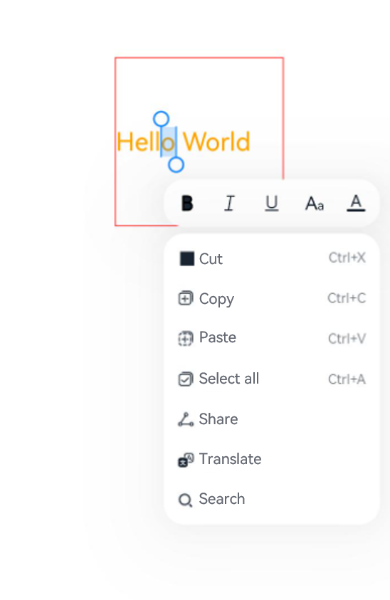

# RichEditor

The **\<RichEditor>** is a component that supports interactive text editing and mixture of text and imagery.

>  **NOTE**
>
>  This component is supported since API version 10. Updates will be marked with a superscript to indicate their earliest API version.
>
>  Drag effects such as floating for the **\<RichEditor>** component can only be implemented through the [onDragStart](ts-universal-events-drag-drop.md) event.


## Child Components

This component can contain the [\<Span>](ts-basic-components-span.md) and [\<ImageSpan>](ts-basic-components-imagespan.md) child components.


## APIs

RichEditor(value: RichEditorOptions)

**Parameters**

| Name| Type| Mandatory| Description|
| -------- | -------- | -------- | -------- |
| value | [RichEditorOptions](#richeditoroptions)  | Yes| Options for initializing the component.|


## Attributes

The [universal attributes](ts-universal-attributes-size.md) are supported.

>  **NOTE**
>
>  The default value of the **clip** attribute is **true**.
>
>  The **align** attribute supports only the start, center, and end options.

| Name                     | Type                                                    | Description                                                        |
| ------------------------- | ------------------------------------------------------------ | ------------------------------------------------------------ |
| customKeyboard | [CustomBuilder](ts-types.md#custombuilder8) | Custom keyboard.<br>**NOTE**<br>When a custom keyboard is set, activating the text box opens the specified custom component, instead of the system input method.<br>The custom keyboard's height can be set through the **height** attribute of the custom component's root node, and its width is fixed at the default value.<br>The custom keyboard is displayed on top of the current page, without compressing or raising the page.<br>The custom keyboard cannot obtain the focus, but it blocks gesture events.<br>By default, the custom keyboard is closed when the input component loses the focus.|
| bindSelectionMenu | {<br>spantype: [RichEditorSpanType](#richeditorspantype),<br>content: [CustomBuilder](ts-types.md#custombuilder8),<br>responseType: [ResponseType](ts-appendix-enums.md#responsetype8),<br>options?: [SelectionMenuOptions](#selectionmenuoptions)<br>} | Custom selection menu.<br> Default value: {<br>  spanType: RichEditorSpanType:TEXT<br>responseType: ResponseType.LongPress<br>Other: null<br>}<br>**NOTE**<br>Currently, the **spanType** parameter setting does not take effect, regardless of the value.|
| copyOptions | [CopyOptions](ts-appendix-enums.md#copyoptions9) | Whether copy and paste is allowed for text content.<br>Default value: **CopyOptions.LocalDevice**<br>**NOTE**<br>If **copyOptions** is set to **CopyOptions.InApp** or **CopyOptions.LocalDevice**, long pressing content in the component will display a shortcut menu, after which you can adjust the content selection scope and perform the desired operation, such as copy and select all.<br>If **copyOptions** is set to **CopyOptions.None**, copy and paste is not allowed. |
## Events

In addition to the [universal events](ts-universal-events-click.md), the following events are supported.

| Name                                                        | Description                                                    |
| ------------------------------------------------------------ | ------------------------------------------------------------ |
| onReady(callback: () =&gt; void) | Triggered when initialization of the component is completed.|
| onSelect(callback: (value: [RichEditorSelection](#richeditorselection)) =&gt; void) | Triggered when selection (by clicking the left mouse button, highlighting the text to select, and releasing the left mouse button) is performed.<br>- **value**: information about all selected spans.|
| aboutToIMEInput(callback: (value: [RichEditorInsertValue](#richeditorinsertvalue)) =&gt; boolean) | Triggered when content is about to be entered in the input method.<br>- **value**: content to be entered in the input method.|
| onIMEInputComplete(callback: (value: [RichEditorTextSpanResult](#richeditortextspanresult)) =&gt; void) | Triggered when text input is completed.<br>- **value**: text span information after text input is completed.|
| aboutToDelete(callback: (value: [RichEditorDeleteValue](#richeditordeletevalue)) =&gt; boolean) | Triggered when content is about to be deleted in the input method.<br>- **value**: information about the text span where the content to be deleted is located.|
| onDeleteComplete(callback: () =&gt; void) | Triggered when deletion in the input method is completed.|

## RichEditorInsertValue

Describes the text to be inserted.

| Name| Type| Mandatory| Description|
| -------- | -------- | -------- | -------- |
| insertOffset | number  | Yes| Offset of the text to be inserted.|
| insertValue | string  | Yes| Content of the text to be inserted.|


## RichEditorDeleteValue

| Name| Type| Mandatory| Description|
| -------- | -------- | -------- | -------- |
| offset | number  | Yes| Offset of the text to be deleted.|
| direction | [RichEditorDeleteDirection](#richeditordeletedirection)  | Yes| Direction of the delete operation.|
| length | number | Yes| Length of the content to be deleted.|
| richEditorDeleteSpans | Array<[RichEditorTextSpanResult](#richeditortextspanresult) \| [RichEditorImageSpanResult](#richeditorimagespanresult)> | Yes| Information about the text or image spans to be deleted.|


## RichEditorDeleteDirection

Enumerates the directions of the delete operation.

| Name   | Description                         |
| -------- | ------------------------------ |
| BACKWARD      | Backward. |
| FORWARD   | Forward.     |


## RichEditorTextSpanResult

Provides the text span information.

| Name| Type| Mandatory| Description|
| -------- | -------- | -------- | -------- |
| spanPosition | [RichEditorSpanPosition](#richeditorspanposition)  | Yes| Span position.|
| value | string | Yes| Text span content.|
| textStyle | [RichEditorTextStyleResult](#richeditortextstyleresult) | Yes| Text span style.|
| offsetInSpan | [number, number] | Yes| Start and end positions of the valid content in the text span.|


## RichEditorSpanPosition

Provides the span position information.

| Name| Type| Mandatory| Description|
| -------- | -------- | -------- | -------- |
| spanIndex | number  | Yes| Span index.|
| spanRange | [number, number]  | Yes| Start and end positions of the span content in the **\<RichEditor>** component.|

## RichEditorSpanType

Provides the span type information.

| Name| Type| Mandatory| Description|
| -------- | -------- | -------- | -------- |
| TEXT | number  | Yes| Text span.|
| IMAGE | number  | Yes| Image span.|
| MIXED | number  | Yes| Mixed span, which contains both text and imagery.|


## RichEditorTextStyleResult

Provides the text span style information returned by the backend.

| Name| Type| Mandatory| Description                              |
| ------ | -------- | ---- | -------------------------------------- |
| fontColor | [ResourceColor](ts-types.md#resourcecolor) | Yes| Font color.|
| fontSize |  number   | Yes| Font size.|
| fontStyle | [FontStyle](ts-appendix-enums.md#fontstyle) | Yes| Font style.|
| fontWeight |  number | Yes| Font weight.|
| fontFamily  |  string | Yes| Font family.|
| decoration  | {<br>type: [TextDecorationType](ts-appendix-enums.md#textdecorationtype),<br>color?: [ResourceColor](ts-types.md#resourcecolor)<br>} | Yes| Style and color of the text decorative line.|


## RichEditorImageSpanResult

Provides the image span style information returned by the backend.

| Name| Type| Mandatory| Description                              |
| ------ | -------- | ---- | -------------------------------------- |
| size | [number, number] | Yes| Width and height of the image.|
| verticalAlign  | [ImageSpanAlignment](ts-basic-components-imagespan.md#imagespanalignment) | Yes | Vertical alignment mode of the image.|
| objectFit  | [ImageFit](ts-appendix-enums.md#imagefit) | Yes| Scale mode of the image.|


## RichEditorOptions

Defines the options for initializing the **\<RichEditor>** component.

| Name| Type| Mandatory| Description|
| -------- | -------- | -------- | -------- |
| controller | [RichEditorController](#richeditorcontroller)  | Yes| Controller for the **\<RichEditor>** component.|


## RichEditorController

Implements the controller for the **\<RichEditor>** component.

### Objects to Import

```
controller: RichEditorController = new RichEditorController()
```

### getCaretOffset

getCaretOffset(): number

Obtains the current cursor position.

**Return value**

| Type                     | Description              |
| ----------------------- | ---------------- |
| number | Cursor position.|

### setCaretOffset

setCaretOffset(offset: number): boolean

Sets the cursor position.

**Parameters**

| Name| Type| Mandatory| Description                              |
| ------ | -------- | ---- | -------------------------------------- |
| offset | number | Yes| Offset of the cursor. If the value is out of the text range, the setting fails.|

**Return value**

| Type                     | Description              |
| ----------------------- | ---------------- |
| boolean | Whether the cursor position is set successfully.|

### addTextSpan

addTextSpan(value: string, options?: RichEditorTextSpanOptions): number

Adds a text span.

**Parameters**

| Name| Type| Mandatory| Description                              |
| ------ | -------- | ---- | -------------------------------------- |
| value  | string   | Yes  | Text content.|
| options  | [RichEditorTextSpanOptions](#richeditortextspanoptions)   | No  | Text options.|

**Return value**

| Type                     | Description              |
| ----------------------- | ---------------- |
| number | Position of the added text span.|

### addImageSpan

addImageSpan(value: PixelMap | ResourceStr, options?: RichEditorImageSpanOptions): number

Adds an image span.

**Parameters**

| Name| Type| Mandatory| Description                              |
| ------ | -------- | ---- | -------------------------------------- |
| value  | [PixelMap](../apis/js-apis-image.md#pixelmap7)\|[ResourceStr](ts-types.md#ResourceStr)   | Yes  | Image content.|
| options  | [RichEditorImageSpanOptions](#richeditorimagespanoptions)   | No  | Image options.|

**Return value**

| Type                     | Description              |
| ----------------------- | ---------------- |
| number | Position of the added image span.|


### updateSpanStyle

updateSpanStyle(value: RichEditorUpdateTextSpanStyleOptions | RichEditorUpdateImageSpanStyleOptions): void

Updates the text or image span style. <br>If only part of a span is updated, the span is split into multiple spans based on the updated part and the non-updated part.

**Parameters**

| Name| Type| Mandatory| Description                              |
| ------ | -------- | ---- | -------------------------------------- |
| value | [RichEditorUpdateTextSpanStyleOptions](#richeditorupdatetextspanstyleoptions) \| [RichEditorUpdateImageSpanStyleOptions](#richeditorupdatetextspanstyleoptions) | Yes| Text or image span style options.|


### getSpans

getSpans(value?: RichEditorRange): Array<RichEditorTextSpanResult| RichEditorImageSpanResult>

Obtains span information.

**Parameters**

| Name| Type                           | Mandatory| Description        |
| ------ | ----------------------------------- | ---- | ---------------- |
| value  | [RichEditorRange](#richeditorrange) | No  | Range of the target span.|

**Return value**

| Type                     | Description              |
| ----------------------- | ---------------- |
| Array<[RichEditorTextSpanResult](#richeditortextspanresult) \| [RichEditorImageSpanResult](#richeditorimagespanresult)> | Text and image span information.|

### deleteSpans

deleteSpans(value?: RichEditorRange): void

Deletes the text and image spans in a specified range.

**Parameters**

| Name| Type| Mandatory| Description                              |
| ------ | -------- | ---- | -------------------------------------- |
| value | [RichEditorRange](#richeditorrange) | No| Range of the target spans. If this parameter is omitted, all text and image spans will be deleted.|

### closeSelectionMenu

closeSelectionMenu(): void

Closes the custom or default selection menu.

## RichEditorSelection

Provides information about the selected content.

| Name     | Type                                                        | Mandatory| Description      |
| --------- | ------------------------------------------------------------ | ---- | ---------- |
| selection | [number, number]                                             | Yes  | Range of the selected.|
| spans     | Array<[RichEditorTextSpanResult](#richeditortextspanresult)\| [RichEditorImageSpanResult](#richeditorimagespanresult)> | Yes  | Span information.  |


## RichEditorUpdateTextSpanStyleOptions

Defines the text span style options.

| Name| Type| Mandatory| Description                              |
| ------ | -------- | ---- | -------------------------------------- |
| start | number   | No| Start position of the text span whose style needs to be updated. If this parameter is omitted or set to a negative value, the value **0** will be used.|
| end | number | No| End position of the text span whose style needs to be updated. If this parameter is omitted or set to a value beyond the text range, it indicates the end of the text span.|
| textStyle | [RichEditorTextStyle](#richeditortextstyle) | Yes| Text style.|


## RichEditorUpdateImageSpanStyleOptions

Defines the image span style options.

| Name| Type| Mandatory| Description                              |
| ------ | -------- | ---- | -------------------------------------- |
| start | number   | No| Start position of the image span whose style needs to be updated. If this parameter is omitted or set to a negative value, the value **0** will be used.|
| end | number | No| End position of the image span whose style needs to be updated. If this parameter is omitted or set to a value beyond the text range, it indicates the end of the image span.|
| imageStyle | [RichEditorImageSpanStyle](#richeditorimagespanstyle) | Yes| Image style.|


## RichEditorTextSpanOptions

Describes the options for adding a text span.

| Name| Type| Mandatory| Description                              |
| ------ | -------- | ---- | -------------------------------------- |
| offset  | number   | No  | Position of the text span to be added. If this parameter is omitted, the text span will be added to the end of all text strings.|
| style  | [RichEditorTextStyle](#richeditortextstyle)   | No  | Style of the text span to be added. If this parameter is omitted, the default text style will be used.|

## RichEditorTextStyle

Provides the text style information.

| Name| Type| Mandatory| Description                              |
| ------ | -------- | ---- | -------------------------------------- |
| fontColor | [ResourceColor](ts-types.md#resourcecolor) | No| Font color.<br> Default value: **Color.Black**|
| fontSize | [Length](ts-types.md#length) | No| Font size. If **Length** is of the number type, the unit fp is used. The default value is **16**. The value cannot be a percentage.<br>Since API version 9, this API is supported in ArkTS widgets.|
| fontStyle | [FontStyle](ts-appendix-enums.md#fontstyle) | No| Font style.<br>Default value: **FontStyle.Normal**|
| fontWeight | [FontWeight](ts-appendix-enums.md#fontweight) \| number \| string | No| Font weight.<br>For the number type, the value ranges from 100 to 900, at an interval of 100. A larger value indicates a heavier font weight. The default value is **400**.<br>For the string type, only strings of the number type are supported, for example, **"400"**, **"bold"**, **"bolder"**, **"lighter"**, **"regular"**, and **"medium"**, which correspond to the enumerated values in **FontWeight**.<br>Default value: **FontWeight.Normal**|
| fontFamily  | [ResourceStr](ts-types.md#resourcestr) \| number \| string | No| Font family. The HarmonyOS Sans font and [register custom fonts](../apis/js-apis-font.md) are supported.<br>Default font: **'HarmonyOS Sans'**|
| decoration  | {<br>type: [TextDecorationType](ts-appendix-enums.md#textdecorationtype),<br>color?: [ResourceColor](ts-types.md#resourcecolor)<br>} | No| Style and color of the text decorative line.<br>Default value: {<br>type: TextDecorationType.None,<br>color: Color.Black<br>}|


## RichEditorImageSpanOptions

Defines the options for adding an image span.

| Name| Type| Mandatory| Description                              |
| ------ | -------- | ---- | -------------------------------------- |
| offset  | number   | No  | Position of the image span to be added. If this parameter is omitted, the image span will be added to the end of all text strings.|
| imageStyle  | [RichEditorImageSpanStyle](#richeditorimagespanstyle)   | No  | Image style. If this parameter is omitted, the default image style will be used.|

## RichEditorImageSpanStyle

Provides the image span style information.

| Name| Type| Mandatory| Description                              |
| ------ | -------- | ---- | -------------------------------------- |
| size  | [[Dimension](ts-types.md#dimension10), [Dimension](ts-types.md#dimension10)]  | No| Width and height of the image.|
| verticalAlign  | [ImageSpanAlignment](ts-basic-components-imagespan.md#imagespanalignment) | No  | Vertical alignment mode of the image.<br>Default value: **ImageSpanAlignment.BASELINE**|
| objectFit  | [ImageFit](ts-appendix-enums.md#imagefit) | No| Scale mode of the image.<br> Default value: **ImageFit.Cover**|

## RichEditorRange

Provides the span range information.

| Name| Type| Mandatory| Description                              |
| ------ | -------- | ---- | -------------------------------------- |
| start | number   | No| Start position. If this parameter is omitted or set to a negative value, the value **0** will be used.|
| end | number | No| End position of the image span whose style needs to be updated. If this parameter is omitted or set to a value beyond the text range, it indicates the very end.|

## SelectionMenuOptions

Provides the span range information.

| Name| Type| Mandatory| Description                              |
| ------ | -------- | ---- | -------------------------------------- |
| onAppear | ?(() => void) | No| Callback invoked when the custom selection menu is displayed.|
| onDisappear | ?(() => void) | No| Callback invoked when the custom selection menu is closed.|


## Example

### Example 1

```ts
// xxx.ets
@Entry
@Component
struct Index {
  controller: RichEditorController = new RichEditorController();
  options: RichEditorOptions = { controller: this.controller };
  private start: number = -1;
  private end: number = -1;
  @State message: string = "[-1, -1]"
  @State content: string = ""

  build() {
    Column() {
      Column() {
        Text("selection range:").width("100%")
        Text() {
          Span(this.message)
        }.width("100%")
        Text("selection content:").width("100%")
        Text() {
          Span(this.content)
        }.width("100%")
      }
      .borderWidth(1)
      .borderColor(Color.Red)
      .width("100%")
      .height("20%")

      Row() {
        Button ("Update Style: Bold").onClick(() => {
          this.controller.updateSpanStyle({
            start: this.start,
            end: this.end,
            textStyle:
            {
              fontWeight: FontWeight.Bolder
            }
          })
        })
        Button("Obtain Selection").onClick(() => {
          this.content = "";
          this.controller.getSpans({
            start: this.start,
            end: this.end
          }).forEach(item => {
            if(typeof(item as RichEditorImageSpanResult)['imageStyle'] != 'undefined'){
              this.content += (item as RichEditorImageSpanResult).valueResourceStr;
              this.content += "\n"
            } else {
              this.content += (item as RichEditorTextSpanResult).value;
              this.content += "\n"
            }
          })
        })
        Button("Delete Selection").onClick(() => {
          this.controller.deleteSpans({
            start: this.start,
            end: this.end
          })
          this.start = -1;
          this.end = -1;
          this.message = "[" + this.start + ", " + this.end + "]"
        })
      }
      .borderWidth(1)
      .borderColor(Color.Red)
      .width("100%")
      .height("10%")

      Column() {
        RichEditor(this.options)
          .onReady(() => {
            this.controller.addTextSpan("0123456789",
              {
                style:
                {
                  fontColor: Color.Orange,
                  fontSize: 30
                }
              })
            this.controller.addImageSpan($r("app.media.icon"),
              {
                imageStyle:
                {
                  size: ["57px", "57px"]
                }
              })
            this.controller.addTextSpan("0123456789",
              {
                style:
                {
                  fontColor: Color.Black,
                  fontSize: 30
                }
              })
          })
          .onSelect((value: RichEditorSelection) => {
            this.start = value.selection[0];
            this.end = value.selection[1];
            this.message = "[" + this.start + ", " + this.end + "]"
          })
          .aboutToIMEInput((value: RichEditorInsertValue) => {
            console.log("---------------------- aboutToIMEInput ----------------------")
            console.log("insertOffset:" + value.insertOffset)
            console.log("insertValue:" + value.insertValue)
            return true;
          })
          .onIMEInputComplete((value: RichEditorTextSpanResult) => {
            console.log("---------------------- onIMEInputComplete ---------------------")
            console.log("spanIndex:" + value.spanPosition.spanIndex)
            console.log("spanRange:[" + value.spanPosition.spanRange[0] + "," + value.spanPosition.spanRange[1] + "]")
            console.log("offsetInSpan:[" + value.offsetInSpan[0] + "," + value.offsetInSpan[1] + "]")
            console.log("value:" + value.value)
          })
          .aboutToDelete((value: RichEditorDeleteValue) => {
            console.log("---------------------- aboutToDelete --------------------------")
            console.log("offset:" + value.offset)
            console.log("direction:" + value.direction)
            console.log("length:" + value.length)
            value.richEditorDeleteSpans.forEach(item => {
              console.log("---------------------- item --------------------------")
              console.log("spanIndex:" + item.spanPosition.spanIndex)
              console.log("spanRange:[" + item.spanPosition.spanRange[0] + "," + item.spanPosition.spanRange[1] + "]")
              console.log("offsetInSpan:[" + item.offsetInSpan[0] + "," + item.offsetInSpan[1] + "]")
              if (typeof(item as RichEditorImageSpanResult)['imageStyle'] != 'undefined') {
                console.log("image:" + (item as RichEditorImageSpanResult).valueResourceStr)
              } else {
                console.log("text:" + (item as RichEditorTextSpanResult).value)
              }
            })
            return true;
          })
          .onDeleteComplete(() => {
            console.log("---------------------- onDeleteComplete ------------------------")
          })
          .borderWidth(1)
          .borderColor(Color.Green)
          .width("100%")
          .height("30%")
      }
      .borderWidth(1)
      .borderColor(Color.Red)
      .width("100%")
      .height("70%")
    }
  }
}
```


### Example 2

```ts
// xxx.ets
@Entry
@Component
struct RichEditorExample {
  controller: RichEditorController = new RichEditorController()

  // Create a custom keyboard component.
  @Builder CustomKeyboardBuilder() {
    Column() {
      Grid() {
        ForEach([1, 2, 3, 4, 5, 6, 7, 8, 9, '*', 0, '#'], (item: number | string) => {
          GridItem() {
            Button(item + "")
              .width(110).onClick(() => {
              this.controller.addTextSpan(item + '', {
                offset: this.controller.getCaretOffset(),
                style:
                {
                  fontColor: Color.Orange,
                  fontSize: 30
                }
              })
              this.controller.setCaretOffset(this.controller.getCaretOffset() + item.toString().length)
            })
          }
        })
      }.maxCount(3).columnsGap(10).rowsGap(10).padding(5)
    }.backgroundColor(Color.Gray)
  }

  build() {
    Column() {
      RichEditor({ controller: this.controller })
        // Bind the custom keyboard.
        .customKeyboard(this.CustomKeyboardBuilder()).margin(10).border({ width: 1 })
        .height(200)
        .borderWidth(1)
        .borderColor(Color.Red)
        .width("100%")
    }
  }
}
```


### Example 3

```ts
// xxx.ets
import pasteboard from '@ohos.pasteboard'
import { BusinessError } from '@ohos.base';
class info{
  imageSrc: Resource=$r('sys.media.ohos_ic_public_cut')
  id: string=''
  label: string=''
}
@Entry
@Component
struct SelectionMenu {
  @State message: string = 'Hello World'
  @State textSize: number = 40
  @State sliderShow: boolean = false
  @State start: number = -1
  @State end: number = -1
  @State colorTransparent: Color = Color.Transparent
  controller: RichEditorController = new RichEditorController();
  options: RichEditorOptions = { controller: this.controller }
  private iconArr: Array<Resource> =
    [$r('app.media.icon'), $r("app.media.icon"), $r('app.media.icon'),
    $r("app.media.icon"), $r('app.media.icon')]
  private listArr: Array<Object> =
    [{ imageSrc: $r('sys.media.ohos_ic_public_cut'), id: 'Cut', label: "Ctrl+X" } as info,
      { imageSrc: $r('sys.media.ohos_ic_public_copy'), id: 'Copy', label: "Ctrl+C" } as info,
      { imageSrc: $r('sys.media.ohos_ic_public_paste'), id: 'Paste', label: "Ctrl+V" } as info,
      { imageSrc: $r('sys.media.ohos_ic_public_select_all'), id: 'Select all', label: "Ctrl+A" } as info,
      { imageSrc: $r('sys.media.ohos_ic_public_share'), id: 'Share', label: "" } as info,
      { imageSrc: $r('sys.media.ohos_ic_public_translate_c2e'), id: 'Translate', label: "" } as info,
      { imageSrc: $r('sys.media.ohos_ic_public_search_filled'), id: 'Search', label: "" } as info]
  @State iconBgColor: ResourceColor[] = new Array(this.iconArr.length).fill(this.colorTransparent)
  @State listBgColor: ResourceColor[] = new Array(this.listArr.length).fill(this.colorTransparent)
  @State iconIsFocus: boolean[] = new Array(this.iconArr.length).fill(false)
  @State listIsFocus: boolean[] = new Array(this.iconArr.length).fill(false)
  @State clickWeightNum: number = 0
  @State clickNum: number[] = [0, 0, 0]

  build() {
    Column() {
      Column() {
        RichEditor(this.options)
          .onReady(() => {
            this.controller.addTextSpan(this.message, { style: { fontColor: Color.Orange, fontSize: 30 } })
          })
          .onSelect((value: RichEditorSelection) => {
            this.start = value.selection[0]
            this.end = value.selection[1]
          })
          .bindSelectionMenu(RichEditorSpanType.TEXT, this.panel(), ResponseType.LongPress, { onDisappear: () => {
            this.sliderShow = false
          }})
          .borderWidth(1)
          .borderColor(Color.Red)
          .width(200)
          .height(200)
          .position({ x: 150, y: 100 })
      }.width('100').backgroundColor(Color.White)
    }.height('100')
  }

  @Builder
  panel() {
    Column() {
      Menu() {
        MenuItem({ builder: this.iconPanel() })
      }.shadow(ShadowStyle.OUTER_DEFAULT_MD).margin({ bottom: 8 }).height(56).width(256)

      Menu() {
        if (!this.sliderShow) {
          MenuItem({ builder: this.listPanel() })
        } else {
          MenuItem({ builder: this.sliderPanel() })
        }
      }.width(256).shadow(ShadowStyle.OUTER_DEFAULT_MD)
    }.width(256).backgroundColor(Color.Transparent)
  }

  @Builder iconPanel() {
    Column() {
      Row({ space: 2 }) {
        ForEach(this.iconArr, (item:Resource, index ?: number) => {
          Flex({ justifyContent: FlexAlign.Center, alignItems: ItemAlign.Center }) {
            Image(item).fillColor($r('sys.color.ohos_id_color_primary')).width(24).height(24).focusable(true)
          }
          .border({ width: this.iconIsFocus[index as number] ? 2 : 0, color: $r('sys.color.ohos_id_color_focused_outline') })
          .borderRadius($r('sys.float.ohos_id_corner_radius_default_m'))
          .width(48)
          .height(48)
          .focusable(true)
          .focusOnTouch(true)
          .onClick(() => {
            if (index as number == 0) {
              this.clickNum[0]++
              this.sliderShow = false
              this.controller.updateSpanStyle({ start: this.start, end: this.end, textStyle: {
                fontWeight: this.clickNum[0] % 2 !== 0 ? FontWeight.Bolder : FontWeight.Normal
              } })
            } else if (index as number == 1) {
              this.clickNum[1]++
              this.sliderShow = false
              this.controller.updateSpanStyle({ start: this.start, end: this.end, textStyle: {
                fontStyle: this.clickNum[1] % 2 !== 0 ? FontStyle.Italic : FontStyle.Normal
              } })
            } else if (index as number == 2) {
              this.clickNum[2]++
              this.sliderShow = false
              this.controller.updateSpanStyle({ start: this.start, end: this.end, textStyle: {
                decoration: {
                  type: this.clickNum[2] % 2 !== 0 ? TextDecorationType.Underline : TextDecorationType.None
                } } })
            } else if (index as number == 3) {
              this.sliderShow = !this.sliderShow
            } else if (index as number == 4) {
              this.sliderShow = false
            }
          })
          .onTouch((event?: TouchEvent | undefined) => {
            if(event != undefined){
              if (event.type === TouchType.Down) {
                this.iconBgColor[index as number] = $r('sys.color.ohos_id_color_click_effect')
              }
              if (event.type === TouchType.Up) {
                this.iconBgColor[index as number] = this.colorTransparent
              }
            }
          })
          .onHover((isHover?: boolean, event?: HoverEvent) => {
            this.iconBgColor.forEach((icon:ResourceColor, index1) => {
              this.iconBgColor[index1] = this.colorTransparent
            })
            if(isHover != undefined) {
              this.iconBgColor[index as number] = $r('sys.color.ohos_id_color_hover')
            }else{
                this.listBgColor[index as number] = this.colorTransparent
            }
          })
          .onFocus(() => {
            this.iconIsFocus[index as number] = true
          })
          .onBlur(() => {
            this.iconIsFocus[index as number] = false
          })
          .backgroundColor(this.iconBgColor[index as number])
        })
      }
    }
    .backgroundColor(this.colorTransparent)
    .borderRadius($r('sys.float.ohos_id_corner_radius_card'))
    .width(248)
    .height(48)
  }

  @Builder listPanel() {
    Column() {
      List({ space: 0, initialIndex: 0 }) {
        ForEach(this.listArr, (item:info, index:number | undefined) => {
          ListItem() {
            listChild({
              item,
              index,
              listBgColor: $listBgColor,
              colorTransparent: $colorTransparent
            })
              .onClick(() => {
                let sysBoard = pasteboard.getSystemPasteboard()
                this.controller.closeSelectionMenu()
                let pasteData = pasteboard.createData(pasteboard.MIMETYPE_TEXT_PLAIN, '')
                this.controller.getSpans({ start: this.start, end: this.end })
                  .forEach((item, i) => {
                    if(typeof(item as RichEditorImageSpanResult)['imageStyle'] != 'undefined'){
                      let style = (item as RichEditorImageSpanResult).imageStyle
                      if((item as RichEditorImageSpanResult).valuePixelMap != undefined) {
                        let data = pasteboard.createRecord(pasteboard.MIMETYPE_PIXELMAP, ((item as RichEditorImageSpanResult).valuePixelMap as PixelMap));
                        let prop = pasteData.getProperty()
                        let temp:Record<string, Object> = { 'width': style.size[0], 'height': style.size[1], 'fit': style.objectFit }
                        prop.additions[i] = temp;
                        pasteData.addRecord(data)
                        pasteData.setProperty(prop)
                      }
                    } else {
                      let style = (item as RichEditorTextSpanResult).textStyle
                      let data = pasteboard.createRecord(pasteboard.MIMETYPE_TEXT_PLAIN, (item as RichEditorTextSpanResult).value)
                      let prop = pasteData.getProperty()
                      let temp:Record<string, Object> = { 'color': style.fontColor, 'size': style.fontSize, 'style': style.fontStyle,
                        'weight': style.fontWeight }
                      prop.additions[i] = temp;
                      pasteData.addRecord(data)
                      pasteData.setProperty(prop)
                    }
                  })
                if(index == undefined){ return }
                switch (index) {
                  case 0:
                    this.controller.deleteSpans({ start: this.start, end: this.end })
                  case 1:
                    sysBoard.clearData()
                    sysBoard.setData(pasteData).then(() => {
                      console.info('Succeeded in setting PasteData.');
                    }).catch((err: BusinessError) => {
                      console.error('Failed to set PasteData. Cause: ' + err.message);
                    })
                    break
                  case 2:
                    sysBoard.getData((err, data) => {
                      if (err) {
                        return
                      }
                      let count = data.getRecordCount()
                      for (let m = 0; m < count; m++) {
                        const element = data.getRecord(m);
                        let tex: RichEditorTextStyle = {
                          fontSize: 30,
                          fontColor: Color.Orange,
                          fontWeight: FontWeight.Normal
                        }
                        let im: RichEditorImageSpanStyle = { objectFit: ImageFit.Contain, size: [50, 50] }
                        if(im.size == undefined){ break }
                        if (data.getProperty().additions[m]) {
                          const tmp = data.getProperty().additions[m] as Record<string, Object | undefined>;
                          if (tmp['width'] != undefined) {
                            im.size[0] = tmp['width'] as Dimension;
                          }
                          if (tmp['height'] != undefined){
                            im.size[1] = tmp['height'] as Dimension;
                          }
                          if (tmp['fit'] != undefined){
                            im.objectFit = tmp['fit'] as ImageFit;
                          }
                          if (tmp['color'] != undefined){
                            tex.fontColor = tmp['color'] as ResourceColor;
                          }
                          if (tmp['size'] != undefined){
                            tex.fontSize = tmp['size'] as number;
                          }
                          if (tmp['style'] != undefined){
                            tex.fontStyle = tmp['style'] as FontStyle;
                          }
                          if (tmp['weight'] != undefined){
                            tex.fontWeight = tmp['weight'] as number;
                          }
                        }

                        if (element.mimeType == pasteboard.MIMETYPE_TEXT_PLAIN) {
                          this.controller.addTextSpan(element.plainText,
                            {
                              style: tex,
                              offset: this.controller.getCaretOffset()
                            })
                        }
                        if (element.mimeType == pasteboard.MIMETYPE_PIXELMAP) {
                          this.controller.addImageSpan(element.pixelMap,
                            {
                              imageStyle: im,
                              offset: this.controller.getCaretOffset()
                            })
                        }
                      }
                    })
                    break
                }
              })
          }
          .height(48)
          .borderRadius($r('sys.float.ohos_id_corner_radius_card'))
          .focusable(true)
          .focusOnTouch(true)
          .border({ width: this.listIsFocus[index as number] ? 2 : 0, color: $r('sys.color.ohos_id_color_focused_outline') })
          .onFocus(() => {
            this.listIsFocus[index as number] = true
          })
          .onBlur(() => {
            this.listIsFocus[index as number] = false
          })
        }, (item:number) => item.toString())
      }
    }
    .focusable(true)
    .width(248)
    .backgroundColor(this.colorTransparent)
    .borderRadius($r('sys.float.ohos_id_corner_radius_card'))
  }

  @Builder sliderPanel() {
    Column() {
      Flex({ justifyContent: FlexAlign.SpaceBetween, alignItems: ItemAlign.Center }) {
        Text('A').fontSize(15)
        Slider({ value: this.textSize, step: 10, style: SliderStyle.InSet })
          .width(210)
          .onChange((value: number, mode: SliderChangeMode) => {
            this.textSize = value
            this.controller.updateSpanStyle({ start: this.start, end: this.end, textStyle: { fontSize: this.textSize }
            })
          })
        Text('A').fontSize(20).fontWeight(FontWeight.Medium)
      }.borderRadius($r('sys.float.ohos_id_corner_radius_card'))
    }
    .backgroundColor(this.colorTransparent)
    .borderRadius($r('sys.float.ohos_id_corner_radius_card'))
    .padding(15)
    .width(248)
    .height(48)
  }
}

@Component
struct listChild {
  item:info = new info()
  index: number = 0
  @Link listBgColor: (Resource | Color)[]
  @Link colorTransparent: Resource

  build() {
    Column() {
      Flex({
        direction: FlexDirection.Row, justifyContent: FlexAlign.SpaceBetween, alignItems: ItemAlign.Center
      }) {
        Row() {
          Image(this.item.imageSrc)
            .width(20)
            .height(20)
            .margin({ right: 8 })
            .fillColor($r('sys.color.ohos_id_color_primary'))
            .focusable(true)
          Text('' + this.item.id)
            .textAlign(TextAlign.Center)
            .borderRadius(10)
            .focusable(true)
            .fontColor($r('sys.color.ohos_id_color_primary'))
            .fontSize($r('sys.float.ohos_id_text_size_body1'))
        }

        Row() {
          Text('' + this.item.label)
            .fontColor($r('sys.color.ohos_id_color_text_secondary')).fontSize($r('sys.float.ohos_id_text_size_body1'))
        }
      }
      .onTouch((event?: TouchEvent) => {
        if (event != undefined && event.type === TouchType.Down) {
          this.listBgColor[this.index] = $r('sys.color.ohos_id_color_click_effect')
        }
        if (event != undefined && event.type === TouchType.Up) {
          this.listBgColor[this.index] = this.colorTransparent
        }
      })
      .onHover((isHover?: boolean) => {
        this.listBgColor[this.index] = isHover ? $r('sys.color.ohos_id_color_hover') : this.colorTransparent
      })
      .backgroundColor(this.listBgColor[this.index])
      .padding({ right: 12, left: 12 })
      .height('48')
      .focusable(true)
      .borderRadius($r('sys.float.ohos_id_corner_radius_default_m'))
    }
  }
}
```


