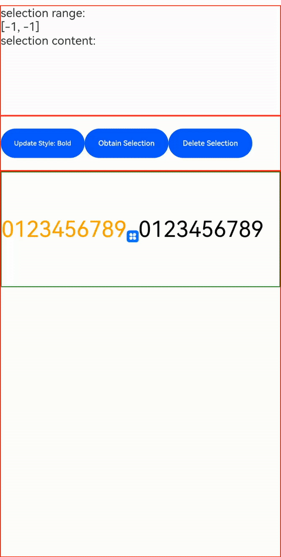

# RichEditor

The **\<RichEditor>** is a component that supports interactive text editing and mixture of text and imagery.

>  **NOTE**
>
>  This component is supported since API version 10. Updates will be marked with a superscript to indicate their earliest API version.
>
>  Drag effects such as floating for the **\<RichEditor>** component can only be implemented through the [onDragStart](ts-universal-events-drag-drop.md) event.


## Child Components

This component can contain the [\<Span>](ts-basic-components-span.md) and [\<ImageSpan>](ts-basic-components-imagespan.md) child components.


## APIs

RichEditor(value: RichEditorOptions)

**Parameters**

| Name| Type| Mandatory| Description|
| -------- | -------- | -------- | -------- |
| value | [RichEditorOptions](#richeditoroptions)  | Yes| Options for initializing the component.|


## Attributes

The [universal attributes](ts-universal-attributes-size.md) are supported.

>  **NOTE**
>
>  The default value of the **clip** attribute is **true**.
>
>  The **align** attribute supports only the start, center, and end options.

| Name                     | Type                                                    | Description                                                        |
| ------------------------- | ------------------------------------------------------------ | ------------------------------------------------------------ |
| customKeyboard | [CustomBuilder](ts-types.md#custombuilder8) | Custom keyboard.<br>**NOTE**<br>When a custom keyboard is set, activating the text box opens the specified custom component, instead of the system input method.<br>The custom keyboard's height can be set through the **height** attribute of the custom component's root node, and its width is fixed at the default value.<br>The custom keyboard is displayed on top of the current page, without compressing or raising the page.<br>The custom keyboard cannot obtain the focus, but it blocks gesture events.<br>By default, the custom keyboard is closed when the input component loses the focus.|
| copyOptions | [CopyOptions](ts-appendix-enums.md#copyoptions9) | Whether copy and paste is allowed for text content.<br>Default value: **CopyOptions.LocalDevice**<br>**NOTE**<br>If **copyOptions** is set to **CopyOptions.InApp** or **CopyOptions.LocalDevice**, long pressing content in the component will display a shortcut menu, after which you can adjust the content selection scope and perform the desired operation, such as copy and select all.<br>If **copyOptions** is set to **CopyOptions.None**, copy and paste is not allowed. |
## Events

In addition to the [universal events](ts-universal-events-click.md), the following events are supported.

| Name                                                        | Description                                                    |
| ------------------------------------------------------------ | ------------------------------------------------------------ |
| onReady(callback: () =&gt; void) | Triggered when initialization of the component is completed.|
| onSelect(callback: (value: [RichEditorSelection](#richeditorselection)) =&gt; void) | Triggered when selection (by clicking the left mouse button, highlighting the text to select, and releasing the left mouse button) is performed.<br>- **value**: information about all selected spans.|
| aboutToIMEInput(callback: (value: [RichEditorInsertValue](#richeditorinsertvalue)) =&gt; boolean) | Triggered when content is about to be entered in the input method.<br>- **value**: content to be entered in the input method.|
| onIMEInputComplete(callback: (value: [RichEditorTextSpanResult](#richeditortextspanresult)) =&gt; void) | Triggered when text input is completed.<br>- **value**: text span information after text input is completed.|
| aboutToDelete(callback: (value: [RichEditorDeleteValue](#richeditordeletevalue)) =&gt; boolean) | Triggered when content is about to be deleted in the input method.<br>- **value**: information about the text span where the content to be deleted is located.|
| onDeleteComplete(callback: () =&gt; void) | Triggered when deletion in the input method is completed.|

## RichEditorInsertValue

Describes the text to be inserted.

| Name| Type| Mandatory| Description|
| -------- | -------- | -------- | -------- |
| insertOffset | number  | Yes| Offset of the text to be inserted.|
| insertValue | string  | Yes| Content of the text to be inserted.|


## RichEditorDeleteValue

| Name| Type| Mandatory| Description|
| -------- | -------- | -------- | -------- |
| offset | number  | Yes| Offset of the text to be deleted.|
| direction | [RichEditorDeleteDirection](#richeditordeletedirection)  | Yes| Direction of the delete operation.|
| length | number | Yes| Length of the content to be deleted.|
| richEditorDeleteSpans | Array<[RichEditorTextSpanResult](#richeditortextspanresult) \| [RichEditorImageSpanResult](#richeditorimagespanresult)> | Yes| Information about the text or image spans to be deleted.|


## RichEditorDeleteDirection

Enumerates the directions of the delete operation.

| Name   | Description                         |
| -------- | ------------------------------ |
| BACKWARD      | Backward. |
| FORWARD   | Forward.     |


## RichEditorTextSpanResult

Provides the text span information.

| Name| Type| Mandatory| Description|
| -------- | -------- | -------- | -------- |
| spanPosition | [RichEditorSpanPosition](#richeditorspanposition)  | Yes| Span position.|
| value | string | Yes| Text span content.|
| textStyle | [RichEditorTextStyleResult](#richeditortextstyleresult) | Yes| Text span style.|
| offsetInSpan | [number, number] | Yes| Start and end positions of the valid content in the text span.|


## RichEditorSpanPosition

Provides the span position information.

| Name| Type| Mandatory| Description|
| -------- | -------- | -------- | -------- |
| spanIndex | number  | Yes| Span index.|
| spanRange | [number, number]  | Yes| Start and end positions of the span content in the **\<RichEditor>** component.|


## RichEditorTextStyleResult

Provides the text span style information returned by the backend.

| Name| Type| Mandatory| Description                              |
| ------ | -------- | ---- | -------------------------------------- |
| fontColor | [ResourceColor](ts-types.md#resourcecolor) | Yes| Font color.|
| fontSize |  number   | Yes| Font size.|
| fontStyle | [FontStyle](ts-appendix-enums.md#fontstyle) | Yes| Font style.|
| fontWeight |  number | Yes| Font weight.|
| fontFamily  |  string | Yes| Font family.|
| decoration  | {<br>type: [TextDecorationType](ts-appendix-enums.md#textdecorationtype),<br>color?: [ResourceColor](ts-types.md#resourcecolor)<br>} | Yes| Style and color of the text decorative line.|


## RichEditorImageSpanResult

Provides the image span style information returned by the backend.

| Name| Type| Mandatory| Description                              |
| ------ | -------- | ---- | -------------------------------------- |
| size | [number, number] | Yes| Width and height of the image.|
| verticalAlign  | [ImageSpanAlignment](ts-basic-components-imagespan.md#imagespanalignment) | Yes | Vertical alignment mode of the image.|
| objectFit  | [ImageFit](ts-appendix-enums.md#imagefit) | Yes| Scale mode of the image.|


## RichEditorOptions

Defines the options for initializing the **\<RichEditor>** component.

| Name| Type| Mandatory| Description|
| -------- | -------- | -------- | -------- |
| controller | [RichEditorController](#richeditorcontroller)  | Yes| Controller for the **\<RichEditor>** component.|


## RichEditorController

Implements the controller for the **\<RichEditor>** component.

### Objects to Import

```
controller: RichEditorController = new RichEditorController()
```

### getCaretOffset

getCaretOffset(): number

Obtains the current cursor position.

**Return value**

| Type                     | Description              |
| ----------------------- | ---------------- |
| number | Cursor position.|

### setCaretOffset

setCaretOffset(offset: number): boolean

Sets the cursor position.

**Parameters**

| Name| Type| Mandatory| Description                              |
| ------ | -------- | ---- | -------------------------------------- |
| offset | number | Yes| Offset of the cursor. If the value is out of the text range, the setting fails.|

**Return value**

| Type                     | Description              |
| ----------------------- | ---------------- |
| boolean | Whether the cursor position is set successfully.|

### addTextSpan

addTextSpan(value: string, options?: RichEditorTextSpanOptions): number

Adds a text span.

**Parameters**

| Name| Type| Mandatory| Description                              |
| ------ | -------- | ---- | -------------------------------------- |
| value  | string   | Yes  | Text content.|
| options  | [RichEditorTextSpanOptions](#richeditortextspanoptions)   | No  | Text options.|

**Return value**

| Type                     | Description              |
| ----------------------- | ---------------- |
| number | Position of the added text span.|

### addImageSpan

addImageSpan(value: PixelMap | ResourceStr, options?: RichEditorImageSpanOptions): number

Adds an image span.

**Parameters**

| Name| Type| Mandatory| Description                              |
| ------ | -------- | ---- | -------------------------------------- |
| value  | [PixelMap](../apis/js-apis-image.md#pixelmap7)\|[ResourceStr](ts-types.md#ResourceStr)   | Yes  | Image content.|
| options  | [RichEditorImageSpanOptions](#richeditorimagespanoptions)   | No  | Image options.|

**Return value**

| Type                     | Description              |
| ----------------------- | ---------------- |
| number | Position of the added image span.|


### updateSpanStyle

updateSpanStyle(value: RichEditorUpdateTextSpanStyleOptions | RichEditorUpdateImageSpanStyleOptions): void

Updates the text or image span style. <br>If only part of a span is updated, the span is split into multiple spans based on the updated part and the non-updated part.

**Parameters**

| Name| Type| Mandatory| Description                              |
| ------ | -------- | ---- | -------------------------------------- |
| value | [RichEditorUpdateTextSpanStyleOptions](#richeditorupdatetextspanstyleoptions) \| [RichEditorUpdateImageSpanStyleOptions](#richeditorupdatetextspanstyleoptions) | Yes| Text or image span style options.|


### getSpans

getSpans(value?: RichEditorRange): Array<RichEditorTextSpanResult| RichEditorImageSpanResult>

Obtains span information.

**Parameters**

| Name| Type                           | Mandatory| Description        |
| ------ | ----------------------------------- | ---- | ---------------- |
| value  | [RichEditorRange](#richeditorrange) | No  | Range of the target span.|

**Return value**

| Type                     | Description              |
| ----------------------- | ---------------- |
| Array<[RichEditorTextSpanResult](#richeditortextspanresult) \| [RichEditorImageSpanResult](#richeditorimagespanresult)> | Text and image span information.|

### deleteSpans

deleteSpans(value?: RichEditorRange): void

Deletes the text and image spans in a specified range.

**Parameters**

| Name| Type| Mandatory| Description                              |
| ------ | -------- | ---- | -------------------------------------- |
| value | [RichEditorRange](#richeditorrange) | No| Range of the target spans. If this parameter is omitted, all text and image spans will be deleted.|


## RichEditorSelection

Provides information about the selected content.

| Name     | Type                                                        | Mandatory| Description      |
| --------- | ------------------------------------------------------------ | ---- | ---------- |
| selection | [number, number]                                             | Yes  | Range of the selected.|
| spans     | Array<[RichEditorTextSpanResult](#richeditortextspanresult)\| [RichEditorImageSpanResult](#richeditorimagespanresult)> | Yes  | Span information.  |


## RichEditorUpdateTextSpanStyleOptions

Defines the text span style options.

| Name| Type| Mandatory| Description                              |
| ------ | -------- | ---- | -------------------------------------- |
| start | number   | No| Start position of the text span whose style needs to be updated. If this parameter is omitted or set to a negative value, the value **0** will be used.|
| end | number | No| End position of the text span whose style needs to be updated. If this parameter is omitted or set to a value beyond the text range, it indicates the end of the text span.|
| textStyle | [RichEditorTextStyle](#richeditortextstyle) | Yes| Text style.|


## RichEditorUpdateImageSpanStyleOptions

Defines the image span style options.

| Name| Type| Mandatory| Description                              |
| ------ | -------- | ---- | -------------------------------------- |
| start | number   | No| Start position of the image span whose style needs to be updated. If this parameter is omitted or set to a negative value, the value **0** will be used.|
| end | number | No| End position of the image span whose style needs to be updated. If this parameter is omitted or set to a value beyond the text range, it indicates the end of the image span.|
| imageStyle | [RichEditorImageSpanStyle](#richeditorimagespanstyle) | Yes| Image style.|


## RichEditorTextSpanOptions

Describes the options for adding a text span.

| Name| Type| Mandatory| Description                              |
| ------ | -------- | ---- | -------------------------------------- |
| offset  | number   | No  | Position of the text span to be added. If this parameter is omitted, the text span will be added to the end of all text strings.|
| style  | [RichEditorTextStyle](#richeditortextstyle)   | No  | Style of the text span to be added. If this parameter is omitted, the default text style will be used.|

## RichEditorTextStyle

Provides the text style information.

| Name| Type| Mandatory| Description                              |
| ------ | -------- | ---- | -------------------------------------- |
| fontColor | [ResourceColor](ts-types.md#resourcecolor) | No| Font color.<br> Default value: **Color.Black**|
| fontSize | [Length](ts-types.md#length) \| number   | No| Font size.<br>Default value: **16fp**|
| fontStyle | [FontStyle](ts-appendix-enums.md#fontstyle) | No| Font style.<br>Default value: **FontStyle.Normal**|
| fontWeight | [FontWeight](ts-appendix-enums.md#fontweight) \| number \| string | No| Font weight.<br>For the number type, the value ranges from 100 to 900, at an interval of 100. A larger value indicates a heavier font weight. The default value is **400**.<br>For the string type, only strings of the number type are supported, for example, **"400"**, **"bold"**, **"bolder"**, **"lighter"**, **"regular"**, and **"medium"**, which correspond to the enumerated values in **FontWeight**.<br>Default value: **FontWeight.Normal**|
| fontFamily  | [ResourceStr](ts-types.md#resourcestr) \| number \| string | No| Font family. The HarmonyOS Sans font and [register custom fonts](../apis/js-apis-font.md) are supported.<br>Default font: **'HarmonyOS Sans'**|
| decoration  | {<br>type: [TextDecorationType](ts-appendix-enums.md#textdecorationtype),<br>color?: [ResourceColor](ts-types.md#resourcecolor)<br>} | No| Style and color of the text decorative line.<br>Default value: {<br>type: TextDecorationType.None,<br>color: Color.Black<br>}|


## RichEditorImageSpanOptions

Defines the options for adding an image span.

| Name| Type| Mandatory| Description                              |
| ------ | -------- | ---- | -------------------------------------- |
| offset  | number   | No  | Position of the image span to be added. If this parameter is omitted, the image span will be added to the end of all text strings.|
| imageStyle  | [RichEditorImageSpanStyle](#richeditorimagespanstyle)   | No  | Image style. If this parameter is omitted, the default image style will be used.|

## RichEditorImageSpanStyle

Provides the image span style information.

| Name| Type| Mandatory| Description                              |
| ------ | -------- | ---- | -------------------------------------- |
| size  | [[Dimension](ts-types.md#dimension10), [Dimension](ts-types.md#dimension10)]  | No| Width and height of the image.|
| verticalAlign  | [ImageSpanAlignment](ts-basic-components-imagespan.md#imagespanalignment) | No  | Vertical alignment mode of the image.<br>Default value: **ImageSpanAlignment.BASELINE**|
| objectFit  | [ImageFit](ts-appendix-enums.md#imagefit) | No| Scale mode of the image.<br> Default value: **ImageFit.Cover**|

## RichEditorRange

Provides the span range information.

| Name| Type| Mandatory| Description                              |
| ------ | -------- | ---- | -------------------------------------- |
| start | number   | No| Start position. If this parameter is omitted or set to a negative value, the value **0** will be used.|
| end | number | No| End position of the image span whose style needs to be updated. If this parameter is omitted or set to a value beyond the text range, it indicates the very end.|


## Example

### Example 1

```ts
// xxx.ets
@Entry
@Component
struct Index {
  controller: RichEditorController = new RichEditorController();
  options: RichEditorOptions = { controller: this.controller };
  private start: number = -1;
  private end: number = -1;
  @State message: string = "[-1, -1]"
  @State content: string = ""

  build() {
    Column() {
      Column() {
        Text("selection range:").width("100%")
        Text() {
          Span(this.message)
        }.width("100%")
        Text("selection content:").width("100%")
        Text() {
          Span(this.content)
        }.width("100%")
      }
      .borderWidth(1)
      .borderColor(Color.Red)
      .width("100%")
      .height("20%")

      Row() {
        Button ("Update Style: Bold").onClick(() => {
          this.controller.updateSpanStyle({
            start: this.start,
            end: this.end,
            textStyle:
            {
              fontWeight: FontWeight.Bolder
            }
          })
        })
        Button("Obtain Selection").onClick(() => {
          this.content = "";
          this.controller.getSpans({
            start: this.start,
            end: this.end
          }).forEach(item => {
            if(typeof(item as RichEditorImageSpanResult)['imageStyle'] != 'undefined'){
              this.content += (item as RichEditorImageSpanResult).valueResourceStr;
              this.content += "\n"
            } else {
              this.content += (item as RichEditorTextSpanResult).value;
              this.content += "\n"
            }
          })
        })
        Button("Delete Selection").onClick(() => {
          this.controller.deleteSpans({
            start: this.start,
            end: this.end
          })
          this.start = -1;
          this.end = -1;
          this.message = "[" + this.start + ", " + this.end + "]"
        })
      }
      .borderWidth(1)
      .borderColor(Color.Red)
      .width("100%")
      .height("10%")

      Column() {
        RichEditor(this.options)
          .onReady(() => {
            this.controller.addTextSpan("0123456789",
              {
                style:
                {
                  fontColor: Color.Orange,
                  fontSize: 30
                }
              })
            this.controller.addImageSpan($r("app.media.icon"),
              {
                imageStyle:
                {
                  size: ["57px", "57px"]
                }
              })
            this.controller.addTextSpan("0123456789",
              {
                style:
                {
                  fontColor: Color.Black,
                  fontSize: 30
                }
              })
          })
          .onSelect((value: RichEditorSelection) => {
            this.start = value.selection[0];
            this.end = value.selection[1];
            this.message = "[" + this.start + ", " + this.end + "]"
          })
          .aboutToIMEInput((value: RichEditorInsertValue) => {
            console.log("---------------------- aboutToIMEInput ----------------------")
            console.log("insertOffset:" + value.insertOffset)
            console.log("insertValue:" + value.insertValue)
            return true;
          })
          .onIMEInputComplete((value: RichEditorTextSpanResult) => {
            console.log("---------------------- onIMEInputComplete ---------------------")
            console.log("spanIndex:" + value.spanPosition.spanIndex)
            console.log("spanRange:[" + value.spanPosition.spanRange[0] + "," + value.spanPosition.spanRange[1] + "]")
            console.log("offsetInSpan:[" + value.offsetInSpan[0] + "," + value.offsetInSpan[1] + "]")
            console.log("value:" + value.value)
          })
          .aboutToDelete((value: RichEditorDeleteValue) => {
            console.log("---------------------- aboutToDelete --------------------------")
            console.log("offset:" + value.offset)
            console.log("direction:" + value.direction)
            console.log("length:" + value.length)
            value.richEditorDeleteSpans.forEach(item => {
              console.log("---------------------- item --------------------------")
              console.log("spanIndex:" + item.spanPosition.spanIndex)
              console.log("spanRange:[" + item.spanPosition.spanRange[0] + "," + item.spanPosition.spanRange[1] + "]")
              console.log("offsetInSpan:[" + item.offsetInSpan[0] + "," + item.offsetInSpan[1] + "]")
              if (typeof(item as RichEditorImageSpanResult)['imageStyle'] != 'undefined') {
                console.log("image:" + (item as RichEditorImageSpanResult).valueResourceStr)
              } else {
                console.log("text:" + (item as RichEditorTextSpanResult).value)
              }
            })
            return true;
          })
          .onDeleteComplete(() => {
            console.log("---------------------- onDeleteComplete ------------------------")
          })
          .borderWidth(1)
          .borderColor(Color.Green)
          .width("100%")
          .height("30%")
      }
      .borderWidth(1)
      .borderColor(Color.Red)
      .width("100%")
      .height("70%")
    }
  }
}
```


### Example 2

```ts
// xxx.ets
@Entry
@Component
struct RichEditorExample {
  controller: RichEditorController = new RichEditorController()

  // Create a custom keyboard component.
  @Builder CustomKeyboardBuilder() {
    Column() {
      Grid() {
        ForEach([1, 2, 3, 4, 5, 6, 7, 8, 9, '*', 0, '#'], (item: number | string) => {
          GridItem() {
            Button(item + "")
              .width(110).onClick(() => {
              this.controller.addTextSpan(item + '', {
                offset: this.controller.getCaretOffset(),
                style:
                {
                  fontColor: Color.Orange,
                  fontSize: 30
                }
              })
              this.controller.setCaretOffset(this.controller.getCaretOffset() + item.toString().length)
            })
          }
        })
      }.maxCount(3).columnsGap(10).rowsGap(10).padding(5)
    }.backgroundColor(Color.Gray)
  }

  build() {
    Column() {
      RichEditor({ controller: this.controller })
        // Bind the custom keyboard.
        .customKeyboard(this.CustomKeyboardBuilder()).margin(10).border({ width: 1 })
        .height(200)
        .borderWidth(1)
        .borderColor(Color.Red)
        .width("100%")
    }
  }
}
```


