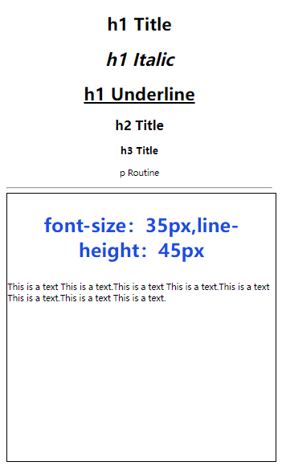

# RichText

The **\<RichText>** component parses and displays HTML text.

> **NOTE**
>
> This component is supported since API version 8. Updates will be marked with a superscript to indicate their earliest API version.

## Child Components

Not supported

## APIs

RichText(content:string)

**Parameters**

| Name| Type| Mandatory | Description|
| ------- | -------- | ------------- | -------- |
| content | string | Yes  | String in HTML format.|


## Events


| Name| Description|
| -------- | -------- |
| onStart(callback: () => void)    | Triggered when web page loading starts.  |
| onComplete(callback: () => void) | Triggered when web page loading is completed.|

## Supported Tags

| Name| Description| Example|
| -------- | -------- | -------- |
| \<h1>--\<h6> | Defines six levels of headings in the HTML document. \<h1> defines the most important heading, and \<h6> defines the least important heading.| \<h1>This is an H1 heading\</h1> \<h2>This is an H2 heading\</h2>|
| \<p>\</p> | Defines a paragraph.| \<p>This is a paragraph\</p>|
| \<br/> | Inserts a newline character.| \<p>This is a paragraph\<br/>This is a new paragraph\</p>|
| \<hr/> | Defines a thematic break (such as a shift of topic) on an HTML page and creates a horizontal line.| \<p>This is a paragraph\</p>\<hr/>\<p>This is a paragraph\</p> |
| \<div>\</div> | Defines a generic container that is generally used to group block-level elements. It allows you to apply CSS styles to multiple elements at the same time.| \<div style='color:#0000FF'>\<h3>This is the heading in a div element\</h3>\</div> |
| \<i>\</i> | Displays text in italic style.| \<i>This is in italic style\</i>|
| \<u>\</u> | Defines text that should be styled differently or have a non-textual annotation, such as misspelt words or a proper name in Chinese text. It is recommended that you avoid using the \<u> tag where it could be confused with a hyperlink.| \<p>\<u>This is an underlined paragraph\</u>\</p> |
| \<style>\</style> | Used to embed CSS within an HTML document.| \<style>h1{color:red;}p{color:blue;}\</style> |
| style | Defines the inline style of an element and is placed inside the tag. Use quotation marks (') to separate the styling text and use semicolons (;) to separate styles, for example, **style='width: 500px;height: 500px;border: 1px solid;margin: 0 auto;'**.| \<h1 style='color:blue;text-align:center'>This is a heading\</h1>\<p style='color:green'>This is a paragraph\</p> |
| \<script>\</script> | Used to embed or reference a client-side script, such as JavaScript.| \<script>document.write("Hello World!")\</script> |

## Example

You can preview how this component looks on a real device. The preview is not yet available in the DevEco Studio Previewer.

```ts
// xxx.ets
@Entry
@Component
struct RichTextExample {
  @State data: string = '<h1 style="text-align: center;">h1 heading</h1>' +
  '<h1 style="text-align: center;"><i>h1 italic</i></h1>' +
  '<h1 style="text-align: center;"><u>h1 underlined</u></h1>' +
  '<h2 style="text-align: center;">h2 heading</h2>' +
  '<h3 style="text-align: center;">h3 heading</h3>' +
  '<p style="text-align: center;">Regular paragraph</p><hr/>' +
  '<div style="width: 500px;height: 500px;border: 1px solid;margin: 0auto;">' +
  '<p style="font-size: 35px;text-align: center;font-weight: bold; color: rgb(24,78,228)">Font size: 35px; line height: 45px</p>' +
  '<p style="background-color: #e5e5e5;line-height: 45px;font-size: 35px;text-indent: 2em;">' +
  '<p>This is a paragraph. This is a paragraph. This is a paragraph. This is a paragraph. This is a paragraph. This is a paragraph. This is a paragraph. This is a paragraph. This is a paragraph.</p>';

  build() {
    Flex({ direction: FlexDirection.Column, alignItems: ItemAlign.Center,
      justifyContent: FlexAlign.Center }) {
      RichText(this.data)
        .onStart(() => {
          console.info('RichText onStart');
        })
        .onComplete(() => {
          console.info('RichText onComplete');
        })
    }
  }
}
```

  
