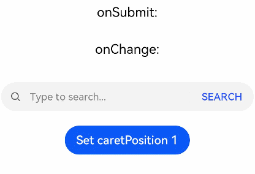
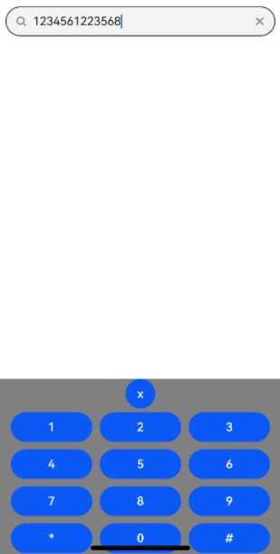

#  Search

The **\<Search>** component provides an area for users to enter search queries.

> **NOTE**
>
> This component is supported since API version 8. Updates will be marked with a superscript to indicate their earliest API version.

## Child Components

Not supported

## APIs

Search(options?: { value?: string, placeholder?: ResourceStr, icon?: string, controller?: SearchController })

**Parameters**

| Name     | Type                                            | Mandatory| Description                                                    |
| ----------- | ---------------------------------------------------- | ---- | ------------------------------------------------------------ |
| value       | string                                               | No  | Text input in the search text box.<br>Since API version 10, this parameter supports two-way binding through [$$](../../quick-start/arkts-two-way-sync.md).|
| placeholder | [ResourceStr](ts-types.md#resourcestr)<sup>10+</sup> | No  | Text displayed when there is no input.                                    |
| icon        | string                                               | No  | Path to the search icon. By default, the system search icon is used.<br>**NOTE**<br>The icon data source can be a local or online image.<br>- The supported formats include PNG, JPG, BMP, SVG, GIF, and pixelmap.<br>- The Base64 string is supported in the following format: data:image/[png\|jpeg\|bmp\|webp];base64,[base64 data], where [base64 data] is a Base64 string.<br>If this attribute and the **searchIcon** attribute are both set, the **searchIcon** attribute takes precedence.|
| controller  | SearchController                                     | No  | Controller of the **\<Search>** component.                                      |

## Attributes

In addition to the [universal attributes](ts-universal-attributes-size.md), the following attributes are supported.

| Name                   | Type                                        | Description                                          |
| ----------------------- | ------------------------------------------------ | ---------------------------------------------- |
| searchButton<sup>10+</sup> | value: string,<br>option?: [SearchButtonOptions](#searchbuttonoptions10)            | Text on the search button located next to the search text box. By default, there is no search button.              |
| placeholderColor        | [ResourceColor](ts-types.md#resourcecolor)       | Placeholder text color.<br>Default value: **'#99182431'**  |
| placeholderFont         | [Font](ts-types.md#font)                         | Placeholder text style, including the font size, font width, font family, and font style. Currently, only the default font family is supported.                        |
| textFont                | [Font](ts-types.md#font)                         | Style of the text entered in the search box, including the font size, font width, font family, and font style. Currently, only the default font family is supported.                          |
| textAlign               | [TextAlign](ts-appendix-enums.md#textalign)      | Text alignment mode in the search text box. Currently, the following alignment modes are supported: **Start**, **Center**, and **End**.<br>Default value: **TextAlign.Start**   |
| copyOption<sup>9+</sup> | [CopyOptions](ts-appendix-enums.md#copyoptions9) | Whether copy and paste is allowed.<br>Default value: **CopyOptions.LocalDevice**<br>If this attribute is set to **CopyOptions.None**, the text can be pasted, but copy or cut is not allowed. |
| searchIcon<sup>10+</sup>   | [IconOptions](#iconoptions10)                                                  | Style of the search icon on the left.                                      |
| cancelButton<sup>10+</sup> | {<br>style? : [CancelButtonStyle](#cancelbuttonstyle10)<br>icon?: [IconOptions](#iconoptions10) <br>} | Style of the Cancel button on the right.<br>Default value:<br>{<br>style: CancelButtonStyle.INPUT<br>} |
| fontColor<sup>10+</sup>    | [ResourceColor](ts-types.md#resourcecolor)                   | Font color of the input text.<br>Default value: **'#FF182431'**<br>**NOTE**<br>[Universal text attributes](ts-universal-attributes-text-style.md) **fontSize**, **fontStyle**, **fontWeight**, and **fontFamily** are set in the **textFont** attribute.|
| caretStyle<sup>10+</sup>  | [CaretStyle](#caretstyle10)                                                  | Caret style.<br>Default value:<br>{<br>width: 1.5vp<br>color: '#007DFF'<br>} |
| enableKeyboardOnFocus<sup>10+</sup> | boolean | Whether to enable the input method when the component obtains focus.<br>Default value: **true**  |
| selectionMenuHidden<sup>10+</sup> | boolean | Whether to display the text selection menu when the text box is long-pressed or right-clicked.<br>Default value: **false**|
| customKeyboard<sup>10+</sup> | [CustomBuilder](ts-types.md#custombuilder8) | Custom keyboard.<br>**NOTE**<br>When a custom keyboard is set, activating the text box opens the specified custom component, instead of the system input method.<br>The custom keyboard's height can be set through the **height** attribute of the custom component's root node, and its width is fixed at the default value.<br>The custom keyboard is displayed on top of the current page, without compressing or raising the page.<br>The custom keyboard cannot obtain the focus, but it blocks gesture events.<br>By default, the custom keyboard is closed when the input component loses the focus. You can also use the [stopEditing](#stopediting10) API to close the keyboard.|

## IconOptions<sup>10+</sup>

| Name| Type                                  | Mandatory| Description   |
| ------ | ------------------------------------------ | ---- | ----------- |
| size   | [Length](ts-types.md#length)               | No  | Icon size. It cannot be set in percentage.   |
| color  | [ResourceColor](ts-types.md#resourcecolor) | No  | Icon color.   |
| src    | [ResourceStr](ts-types.md#resourcestr)     | No  | Image source of the icon.|

## CaretStyle<sup>10+</sup>

| Name| Type                                  | Mandatory| Description|
| ------ | ------------------------------------------ | ---- | -------- |
| width  | [Length](ts-types.md#length)               | No  | Caret size. It cannot be set in percentage.|
| color  | [ResourceColor](ts-types.md#resourcecolor) | No  | Caret color.|

## SearchButtonOptions<sup>10+</sup>

| Name   | Type                                  | Mandatory| Description        |
| --------- | ------------------------------------------ | ---- | ---------------- |
| fontSize  | [Length](ts-types.md#length)               | No  | Font size of the button. It cannot be set in percentage.|
| fontColor | [ResourceColor](ts-types.md#resourcecolor) | No  | Font color of the button.|

## CancelButtonStyle<sup>10+</sup>

| Name                   | Description            |
| ----------------------- | ---------------- |
| CONSTANT  | The Cancel button is always displayed.|
| INVISIBLE | The Cancel button is always hidden.|
| INPUT     | The Cancel button is displayed when there is text input.|

## Events

In addition to the [universal events](ts-universal-events-click.md), the following events are supported.

| Name                                                        | Description                                                    |
| ------------------------------------------------------------ | ------------------------------------------------------------ |
| onSubmit(callback: (value: string) => void)                  | Triggered when users click the search icon or the search button, or touch the search button on a soft keyboard.<br> - **value**: current text input.|
| onChange(callback: (value: string) => void)                  | Triggered when the input in the text box changes.<br> - **value**: current text input.|
| onCopy(callback: (value: string) => void)                    | Triggered when data is copied to the pasteboard, which is displayed when the search text box is long pressed.<br> - **value**: text copied.|
| onCut(callback: (value: string) => void)                     | Triggered when data is cut from the pasteboard, which is displayed when the search text box is long pressed.<br> - **value**: text cut.|
| onPaste(callback: (value: string) => void)                   | Triggered when data is pasted from the pasteboard, which is displayed when the search text box is long pressed.<br> -**value**: text pasted.|
| onTextSelectionChange(callback: (selectionStart: number, selectionEnd: number) => void)<sup>10+</sup> | Triggered when the text selection position changes.<br>**selectionStart**: start position of the text selection area. The start position of text in the text box is **0**.<br>**selectionEnd**: end position of the text selection area.|
| onContentScroll(callback: (totalOffsetX: number, totalOffsetY: number) => void)<sup>10+</sup> | Triggered when the text content is scrolled.<br>**totalOffsetX**: X coordinate offset of the text in the content area.<br>**totalOffsetY**: Y coordinate offset of the text in the content area.|

## SearchController

Implements the controller of the **\<Search>** component. Currently, the controller can be used to control the caret position.

### Objects to Import
```
controller: SearchController = new SearchController()
```
### caretPosition

caretPosition(value: number): void

Sets the position of the caret.

**Parameters**

| Name| Type| Mandatory| Description                          |
| ------ | -------- | ---- | ---------------------------------- |
| value  | number   | Yes  | Length from the start of the character string to the position where the caret is located.|

### stopEditing<sup>10+</sup>

stopEditing(): void

Exits the editing state.

### getTextContentRect<sup>10+</sup>

getTextContentRect(): [RectResult](#rectresult10)

Obtains the position of the edited text area relative to the component and its size. The unit of the return value is pixel.

**Return value**

| Type      | Description      |
| -------------------  | -------- |
| [RectResult](#rectresult10) | Position of the edited text area relative to the component and its size.|

> **NOTE**
>
> - The returned position information is the offset of the first character relative to the search icon in the **\<Search>** component.
> - If no text is entered, the return value contains the position information, but the size is 0.

### RectResult<sup>10+</sup>

Describes the position and size.

| Parameter     | Type    | Description|
| ------- | ------ | ----------------------- |
| x     | number | X coordinate.|
| y     | number | Y coordinate.|
| width | number | Content width.|
| height | number | Content height.|


### getTextContentLineCount<sup>10+</sup>

getTextContentLineCount(): number

Obtains the number of lines of the edited text.

**Return value**

| Type | Description      |
| ----- | -------- |
| number| Number of lines of the edited text.|

##  Example

### Example 1

```ts
// xxx.ets
@Entry
@Component
struct SearchExample {
  @State changeValue: string = ''
  @State submitValue: string = ''
  controller: SearchController = new SearchController()

  build() {
    Column() {
      Text('onSubmit:' + this.submitValue).fontSize(18).margin(15)
      Text('onChange:' + this.changeValue).fontSize(18).margin(15)
      Search({ value: this.changeValue, placeholder: 'Type to search...', controller: this.controller })
        .searchButton('SEARCH')
        .width('95%')
        .height(40)
        .backgroundColor('#F5F5F5')
        .placeholderColor(Color.Grey)
        .placeholderFont({ size: 14, weight: 400 })
        .textFont({ size: 14, weight: 400 })
        .onSubmit((value: string) => {
          this.submitValue = value
        })
        .onChange((value: string) => {
          this.changeValue = value
        })
        .margin(20)
      Button('Set caretPosition 1')
        .onClick(() => {
          // Move the caret to after the first entered character.
          this.controller.caretPosition(1)
        })
    }.width('100%')
  }
}
```



### Example 2

```ts
// xxx.ets
@Entry
@Component
struct SearchButtoonExample {
  @State submitValue: string = ''

  build() {
    Column() {
      Text('onSubmit:' + this.submitValue).fontSize(18).margin(15)
      Search({ placeholder: 'Type to search...' })
        .searchButton('SEARCH')
        .searchIcon({
          src: $r('app.media.search')
        })
        .cancelButton({
          style: CancelButtonStyle.CONSTANT,
          icon: {
            src: $r('app.media.cancel')
          }
        })
        .width('90%')
        .height(40)
        .backgroundColor('#F5F5F5')
        .placeholderColor(Color.Grey)
        .placeholderFont({ size: 14, weight: 400 })
        .textFont({ size: 14, weight: 400 })
        .onSubmit((value: string) => {
          this.submitValue = value
        })
        .margin(20)
    }.width('100%')
  }
}
```


### Example 3

```ts
// xxx.ets
@Entry
@Component
struct SearchExample {
  controller: SearchController = new SearchController()
  @State inputValue: string = ""

  // Create a custom keyboard component.
  @Builder CustomKeyboardBuilder() {
    Column() {
      Button('x').onClick(() => {
        // Disable the custom keyboard.
        this.controller.stopEditing()
      })
      Grid() {
        ForEach([1, 2, 3, 4, 5, 6, 7, 8, 9, '*', 0, '#'], (item: number | string) => {
          GridItem() {
            Button(item + "")
              .width(110).onClick(() => {
              this.inputValue += item
            })
          }
        })
      }.maxCount(3).columnsGap(10).rowsGap(10).padding(5)
    }.backgroundColor(Color.Gray)
  }

  build() {
    Column() {
      Search({ controller: this.controller, value: this.inputValue})
        // Bind the custom keyboard.
        .customKeyboard(this.CustomKeyboardBuilder()).margin(10).border({ width: 1 })
    }
  }
}
````


