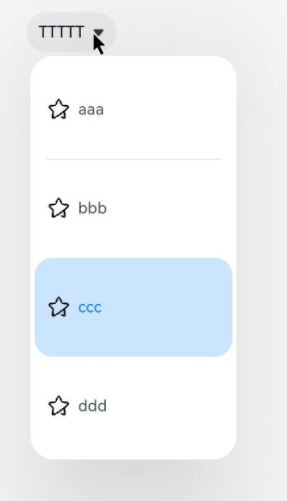

#  Select

The **<Select\>** component provides a drop-down list box that allows users to select among multiple options.

>  **NOTE**
>
>  This component is supported since API version 8. Updates will be marked with a superscript to indicate their earliest API version.

## Child Components

Not supported

## APIs

Select(options: Array\<[SelectOption](#selectoption)\>)

## SelectOption

| Name| Type                           | Mandatory| Description      |
| ------ | ----------------------------------- | ---- | -------------- |
| value  | [ResourceStr](ts-types.md#resourcestr) | Yes  | Value of an option in the drop-down list box.|
| icon   | [ResourceStr](ts-types.md#resourcestr) | No  | Icon of an option in the drop-down list box.|

## Attributes

In addition to the [universal attributes](ts-universal-attributes-size.md), the following attributes are supported.

| Name                   | Type                             | Description                                         |
| ----------------------- | ------------------------------------- | --------------------------------------------- |
| selected                | number \| [Resource](ts-types.md#resource)<sup>11+</sup>    | Index of the initial selected option in the drop-down list box. The index of the first option is **0**.<br>If this attribute is set to an invalid value or is not set, the default value **-1** will be used, which means that no option will be selected. If this attribute is set to **undefined** or **null**, the first option will be selected.<br>Since API version 10, this attribute supports [$$](../../quick-start/arkts-two-way-sync.md) for two-way binding of variables.|
| value                   | string \| [Resource](ts-types.md#resource)<sup>11+</sup>  | Text of the drop-down button. By default, it will be replaced by the content of the selected option.<br>Since API version 10, this attribute supports [$$](../../quick-start/arkts-two-way-sync.md) for two-way binding of variables.|
| font                    | [Font](ts-types.md#font)          | Text font of the drop-down button.<br>Default value:<br>{<br>size: '16fp',<br>weight: FontWeight.Medium<br>} |
| fontColor               | [ResourceColor](ts-types.md#resourcecolor) | Text color of the drop-down button.<br>Default value: **'\#E5182431'**|
| selectedOptionBgColor   | [ResourceColor](ts-types.md#resourcecolor) | Background color of the selected option in the drop-down list box.<br>Default value: **'\#33007DFF'**|
| selectedOptionFont      | [Font](ts-types.md#font)          | Text font of the selected option in the drop-down list box.<br>Default value:<br>{<br>size: '16fp',<br>weight: FontWeight.Regular<br>} |
| selectedOptionFontColor | [ResourceColor](ts-types.md#resourcecolor) | Text color of the selected option in the drop-down list box.<br>Default value: **'\#ff007dff'**|
| optionBgColor           | [ResourceColor](ts-types.md#resourcecolor) | Background color of an option in the drop-down list box.<br>Default value: **'\#ffffffff'**|
| optionFont              | [Font](ts-types.md#font)          | Text font of an option in the drop-down list box.<br>Default value:<br>{<br>size: '16fp',<br>weight: FontWeight.Regular<br>} |
| optionFontColor         | [ResourceColor](ts-types.md#resourcecolor) | Text color of an option in the drop-down list box.<br>Default value: **'\#ff182431'**|
| space<sup>10+</sup>         | [Length](ts-types.md#length)               | Spacing between the text and arrow of an option.<br>**NOTE**<br>This attribute cannot be set in percentage.|
| arrowPosition<sup>10+</sup> | [ArrowPosition](#arrowposition10)                  | Alignment between the text and arrow of an option.<br>Default value: **ArrowPosition.END**|
| menuAlign<sup>10+</sup> | alignType: [MenuAlignType](#menualigntype10),<br> offset?: [Offset](ts-types.md#offset)    | Alignment between the drop-down button and the drop-down menu.<br> - **alignType**: alignment type. Mandatory.<br>Default value: **MenuAlignType.START**<br> - **offset**: offset of the drop-down menu relative to the drop-down button after alignment based on the specified alignment type.<br> Default value: **{dx: 0, dy: 0}**|
| optionWidth<sup>11+</sup> | [Dimension](ts-types.md#dimension10) \| [OptionWidthMode](#optionwidthmode11) | Width of the option in the drop-down list box. **OptionWidthMode** specifies whether to inherit the width of the drop-down list button. If set to **undefined**, **null**, or a negative number, this attribute does not take effect.<br>**NOTE**<br>This attribute cannot be set in percentage.|
| optionHeight<sup>11+</sup> | [Dimension](ts-types.md#dimension10) | Height of the option in the drop-down list box. The maximum height is 80% of the available height of the screen. If set to **undefined**, **null**, or a negative number, this attribute does not take effect.<br>**NOTE**<br>This attribute cannot be set in percentage.|

## OptionWidthMode<sup>11+</sup>

| Name       | Description                          |
| ----------- | ------------------------------ |
| FIT_CONTENT | Adapts the width to the content.              |
| FIT_TRIGGER | Inherits the width of the drop-down list button.|

## ArrowPosition<sup>10+</sup>

| Name               | Description              |
| ------------------- | ------------------ |
| END<sup>10+</sup>   | The text is in front of the arrow.|
| START<sup>10+</sup> | The arrow is in front of the text.|


## MenuAlignType<sup>10+</sup>

| Name               | Description              |
| ------------------- | ------------------ |
| START               | Aligned with the start edge in the same direction as the language in use.|
| CENTER              | Aligned with the center.|
| END                 | Aligned with the end edge in the same direction as the language in use.|

## Events

| Name                                                        | Description                                                    |
| ------------------------------------------------------------ | ------------------------------------------------------------ |
| onSelect(callback: (index: number, value?: string) => void) | Invoked when an option in the drop-down list box is selected.<br>**index**: index of the selected option.<br>**value**: value of the selected option.|

##  Example

```ts
// xxx.ets
@Entry
@Component
struct SelectExample {
  @State text: string = "TTTTT"
  @State index: number = 2
  @State space: number = 8
  @State arrowPosition: ArrowPosition = ArrowPosition.END
  build() {
    Column() {
      Select([{ value: 'aaa', icon: $r("app.media.selecticon") },
        { value: 'bbb', icon: $r("app.media.selecticon") },
        { value: 'ccc', icon: $r("app.media.selecticon") },
        { value: 'ddd', icon: $r("app.media.selecticon") }])
        .selected(this.index)
        .value(this.text)
        .font({ size: 16, weight: 500 })
        .fontColor('#182431')
        .selectedOptionFont({ size: 16, weight: 400 })
        .optionFont({ size: 16, weight: 400 })
        .space(this.space)
        .arrowPosition(this.arrowPosition)
        .menuAlign(MenuAlignType.START, {dx:0, dy:0})
        .optionWidth(200)
        .optionHeight(100)
        .onSelect((index:number, text?: string | undefined)=>{
          console.info('Select:' + index)
          this.index = index;
          if(text){
            this.text = text;
          }
        })
    }.width('100%')
  }
}
```


