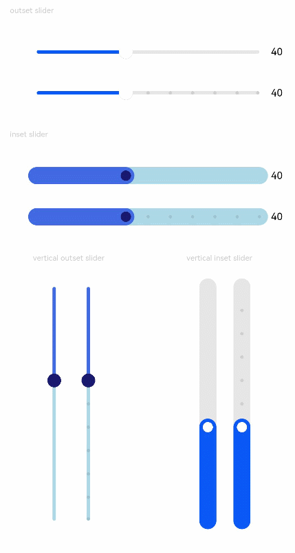

# Slider

The **\<Slider>** component is used to quickly adjust settings, such as the volume and brightness.

>  **NOTE**
>
>  This component is supported since API version 7. Updates will be marked with a superscript to indicate their earliest API version.


## Child Components

Not supported


## APIs

Slider(options?: {value?: number, min?: number, max?: number, step?: number, style?: SliderStyle, direction?: Axis, reverse?: boolean})

Since API version 9, this API is supported in ArkTS widgets.

**Parameters**

| Name| Type| Mandatory| Description|
| -------- | -------- | -------- | -------- |
| value | number | No| Current progress.<br>Default value: min|
| min | number | No| Minimum value.<br>Default value: **0**|
| max | number | No| Maximum value.<br>Default value: **100**<br>**NOTE**<br>If the value of **min** is greater than or equal to the value of **max**, the default value **0** is used for **min** and the default value **100** is used for **max**.<br>If the value is not within the [min, max] range, the value of **min** or **max**, whichever is closer.|
| step | number | No| Step of the slider.<br>Default value: **1**<br>Value range: [0.01, max]<br>**NOTE**<br>If this parameter is set to a value less than 0 or a percentage, the default value is used.|
| style | [SliderStyle](#sliderstyle) | No| Style of the slider thumb and track.<br>Default value: **SliderStyle.OutSet**|
| direction<sup>8+</sup> | [Axis](ts-appendix-enums.md#axis) | No| Whether the slider moves horizontally or vertically.<br>Default value: **Axis.Horizontal**|
| reverse<sup>8+</sup> | boolean | No| Whether the slider values are reversed. By default, the values increase from left to right for a horizontal slider and from top to bottom for a vertical slider.<br>Default value: **false**|

## SliderStyle

Since API version 9, this API is supported in ArkTS widgets.

| Name| Description|
| -------- | -------- |
| OutSet | The slider is on the slider track.|
| InSet | The slider is in the slider track.|

Except touch target attributes, the universal attributes are supported.

| Name| Type| Description|
| -------- | -------- | -------- |
| blockColor | [ResourceColor](ts-types.md#resourcecolor) | Color of the slider.<br>Since API version 9, this API is supported in ArkTS widgets.|
| trackColor | [ResourceColor](ts-types.md#resourcecolor) | Background color of the slider.<br>Since API version 9, this API is supported in ArkTS widgets.|
| selectedColor | [ResourceColor](ts-types.md#resourcecolor) | Color of the selected part of the slider track.<br>Since API version 9, this API is supported in ArkTS widgets.|
| showSteps | boolean | Whether to display the current step.<br>Default value: **false**<br>Since API version 9, this API is supported in ArkTS widgets.|
| showTips | boolean | Whether to display a bubble to indicate the percentage when the user drags the slider.<br>Default value: **false**<br>Since API version 9, this API is supported in ArkTS widgets.<br>**NOTE**<br>When **direction** is set to **Axis.Horizontal**, the bubble is displayed right above the slider. When **direction** is set to **Axis.Vertical**, the bubble is displayed on the left of the slider.<br>The drawing area of the bubble is the overlay of the slider.<br>If no margin is set for the slider or the margin is not large enough, the bubble will be clipped.|
| trackThickness      | [Length](ts-types.md#length) | Track thickness of the slider.<br>Default value: **4.0vp** when **style** is set to **[SliderStyle](#sliderstyle).OutSet**; **20.0vp** when **style** is set to **[SliderStyle](#sliderstyle).InSet**<br>Since API version 9, this API is supported in ArkTS widgets.<br>**NOTE**<br>A value less than 0 evaluates to the default value.|


## Events

In addition to the **OnAppear** and **OnDisAppear** universal events, the following events are supported.

| Name| Description|
| -------- | -------- |
| onChange(callback: (value: number, mode: SliderChangeMode) =&gt; void) | Invoked when the slider is dragged or clicked.<br>**value**: current slider value. If the return value contains decimals, you can use the **number.toFixed()** API to process the data to the expected precision.<br>**mode**: state triggered by the event.<br>Since API version 9, this API is supported in ArkTS widgets.<br>**NOTE**<br>The **Begin** and **End** states are triggered when the slider is clicked with a gesture. The **Moving** and **Click** states are triggered when the value of **value** changes.<br>If the coherent action is a drag action, the **Click** state will not be triggered.<br>The value range of **value** is the **steps** value array.|

## SliderChangeMode

Since API version 9, this API is supported in ArkTS widgets.

| Name| Value| Description|
| -------- | -------- | -------- |
| Begin | 0 | The user touches or presses the slider with a gesture or mouse.|
| Moving | 1 | The user is dragging the slider.|
| End | 2 | The user stops dragging the slider by lifting their finger or releasing the mouse.|
| Click    | 3    | The user moves the slider by touching the slider track.|


## Example

```ts
// xxx.ets
@Entry
@Component
struct SliderExample {
  @State outSetValueOne: number = 40
  @State inSetValueOne: number = 40
  @State outSetValueTwo: number = 40
  @State inSetValueTwo: number = 40
  @State vOutSetValueOne: number = 40
  @State vInSetValueOne: number = 40
  @State vOutSetValueTwo: number = 40
  @State vInSetValueTwo: number = 40

  build() {
    Column({ space: 8 }) {
      Text('outset slider').fontSize(9).fontColor(0xCCCCCC).width('90%').margin(15)
      Row() {
        Slider({
          value: this.outSetValueOne,
          min: 0,
          max: 100,
          style: SliderStyle.OutSet
        })
          .showTips(true)
          .onChange((value: number, mode: SliderChangeMode) => {
            this.outSetValueOne = value
            console.info('value:' + value + 'mode:' + mode.toString())
          })
        // toFixed(0) converts the return value of the slider to an integer.
        Text(this.outSetValueOne.toFixed(0)).fontSize(12)
      }
      .width('80%')
      Row() {
        Slider({
          value: this.outSetValueTwo,
          step: 10,
          style: SliderStyle.OutSet
        })
          .showSteps(true)
          .onChange((value: number, mode: SliderChangeMode) => {
            this.outSetValueTwo = value
            console.info('value:' + value + 'mode:' + mode.toString())
          })
        Text(this.outSetValueTwo.toFixed(0)).fontSize(12)
      }
      .width('80%')

      Text('inset slider').fontSize(9).fontColor(0xCCCCCC).width('90%').margin(15)
      Row() {
        Slider({
          value: this.inSetValueOne,
          min: 0,
          max: 100,
          style: SliderStyle.InSet
        })
          .blockColor('#191970')
          .trackColor('#ADD8E6')
          .selectedColor('#4169E1')
          .showTips(true)
          .onChange((value: number, mode: SliderChangeMode) => {
            this.inSetValueOne = value
            console.info('value:' + value + 'mode:' + mode.toString())
          })
        Text(this.inSetValueOne.toFixed(0)).fontSize(12)
      }
      .width('80%')
      Row() {
        Slider({
          value: this.inSetValueTwo,
          step: 10,
          style: SliderStyle.InSet
        })
          .blockColor('#191970')
          .trackColor('#ADD8E6')
          .selectedColor('#4169E1')
          .showSteps(true)
          .onChange((value: number, mode: SliderChangeMode) => {
            this.inSetValueTwo = value
            console.info('value:' + value + 'mode:' + mode.toString())
          })
        Text(this.inSetValueTwo.toFixed(0)).fontSize(12)
      }
      .width('80%')

      Row() {
        Column() {
          Text('vertical outset slider').fontSize(9).fontColor(0xCCCCCC).width('50%').margin(15)
          Row() {
            Slider({
              value: this.vOutSetValueOne,
              style: SliderStyle.OutSet,
              direction: Axis.Vertical
            })
              .blockColor('#191970')
              .trackColor('#ADD8E6')
              .selectedColor('#4169E1')
              .showTips(true)
              .onChange((value: number, mode: SliderChangeMode) => {
                this.vOutSetValueOne = value
                console.info('value:' + value + 'mode:' + mode.toString())
              })
            Slider({
              value: this.vOutSetValueTwo,
              step: 10,
              style: SliderStyle.OutSet,
              direction: Axis.Vertical
            })
              .blockColor('#191970')
              .trackColor('#ADD8E6')
              .selectedColor('#4169E1')
              .showSteps(true)
              .onChange((value: number, mode: SliderChangeMode) => {
                this.vOutSetValueTwo = value
                console.info('value:' + value + 'mode:' + mode.toString())
              })
          }
        }.width('50%').height(300)

        Column() {
          Text('vertical inset slider').fontSize(9).fontColor(0xCCCCCC).width('50%').margin(15)
          Row() {
            Slider({
              value: this.vInSetValueOne,
              style: SliderStyle.InSet,
              direction: Axis.Vertical,
              reverse: true // By default, at the top of the vertical slider is the min value and at the bottom is the max value. Therefore, if you want to slide from bottom to top, set reverse to true.
            })
              .showTips(true)
              .onChange((value: number, mode: SliderChangeMode) => {
                this.vInSetValueOne = value
                console.info('value:' + value + 'mode:' + mode.toString())
              })
            Slider({
              value: this.vInSetValueTwo,
              step: 10,
              style: SliderStyle.InSet,
              direction: Axis.Vertical,
              reverse: true
            })
              .showSteps(true)
              .onChange((value: number, mode: SliderChangeMode) => {
                this.vInSetValueTwo = value
                console.info('value:' + value + 'mode:' + mode.toString())
              })
          }
        }.width('50%').height(300)
      }
    }.width('100%')
  }
}
```


