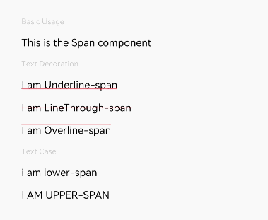

# Span

The **\<Span>** component is used to display inline text in the **\<Text>** component.

>  **NOTE**
>
>  This component is supported since API version 7. Updates will be marked with a superscript to indicate their earliest API version.


## Child Components

Not supported


## APIs

Span(value: string | Resource)

**Parameters**

| Name| Type| Mandatory| Description|
| -------- | -------- | -------- | -------- |
| value | string \| [Resource](ts-types.md#resource) | Yes| Plain text.|


## Attributes

In addition to the [universal text style](ts-universal-attributes-text-style.md) attributes, the following attributes are supported.

| Name| Type| Description|
| -------- | -------- | -------- |
| decoration | {<br>type: [TextDecorationType](ts-appendix-enums.md#textdecorationtype),<br>color?: [ResourceColor](ts-types.md#resourcecolor)<br>} | Style and color of the text decorative line.<br>Default value: {<br>type: TextDecorationType.None<br>color: Color.Black<br>} |
| letterSpacing       | number \| string  | Letter spacing.                                |
| textCase | [TextCase](ts-appendix-enums.md#textcase) | Text case.<br>Default value: **TextCase.Normal**|


## Events

Among all the [universal events](ts-universal-attributes-click.md), only the click event is supported.

>  **NOTE**
>
>  As the **\<Span>** component does not include size information, the **target** attribute of the **ClickEvent** object returned by the click event is invalid.


## Example

```ts
// xxx.ets
@Entry
@Component
struct SpanExample {
  build() {
    Flex({ direction: FlexDirection.Column, alignItems: ItemAlign.Start, justifyContent: FlexAlign.SpaceBetween }) {
      Text('Basic Usage').fontSize(9).fontColor(0xCCCCCC)
      Text() {
        Span('This is the Span component').fontSize(12).textCase(TextCase.Normal)
          .decoration({ type: TextDecorationType.None, color: Color.Red })
      }

      Text('Text Decoration').fontSize(9).fontColor(0xCCCCCC)
      Text() {
        Span('I am Underline-span').decoration({ type: TextDecorationType.Underline, color: Color.Red }).fontSize(12)
      }
      Text() {
        Span('I am LineThrough-span').decoration({ type: TextDecorationType.LineThrough, color: Color.Red }).fontSize(12)
      }
      Text() {
        Span('I am Overline-span').decoration({ type: TextDecorationType.Overline, color: Color.Red }).fontSize(12)
      }

      Text('Text Case').fontSize(9).fontColor(0xCCCCCC)
      Text() {
        Span('I am Lower-span').textCase(TextCase.LowerCase).fontSize(12)
          .decoration({ type: TextDecorationType.None, color: Color.Red })
      }
      Text() {
        Span('I am Upper-span').textCase(TextCase.UpperCase).fontSize(12)
          .decoration({ type: TextDecorationType.None, color: Color.Red })
      }
    }.width('100%').height(250).padding({ left: 35, right: 35, top: 35 })
  }
}
```


