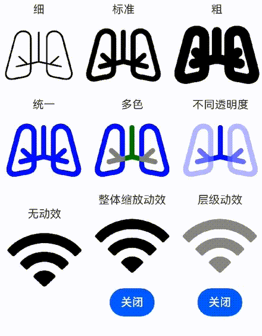

# SymbolSpan

As a child component of the **\<Text>** component, the  **\<SymbolSpan>** component is used to display small icons.

>  **NOTE**
>
>  This component is supported since API version 11. Updates will be marked with a superscript to indicate their earliest API version.

## Child Components

Not supported

## APIs

SymbolSpan(value: Resource)

**Parameters**

| Name| Type| Mandatory| Description|
| -------- | -------- | -------- | -------- |
| value | [Resource](../arkui-ts/ts-types.md#resource)| Yes| Resource of the **\<SymbolSpan>** component, for example, **$r('sys.symbol.ohos_wifi')**.|

>  **NOTE**
>
>  The resources referenced in **$r('sys.symbol.ohos_wifi')** are preset in the system. The **\<SymbolSpan>** component supports only the preset symbol resources. If unsupported resources are referenced, an exception occurs.

## Attributes

The [universal attributes](ts-universal-attributes-size.md) are not supported. Only the following attributes are supported.

| Name| Type| Mandatory| Description                              |
| ------ | -------- | ---- | -------------------------------------- |
| fontColor | Array\<[ResourceColor](ts-types.md#resourcecolor)\> | No| Color of the symbol span.<br> Default value: depending on the rendering strategy.|
| fontSize | number \| string \| [Resource](../arkui-ts/ts-types.md#resource) | No| Size of the symbol span.<br>Default value: system default value|
| fontWeight | [FontWeight](ts-appendix-enums.md#fontweight) \| number \| string | No| Weight of symbol span.<br>For the number type, the value ranges from 100 to 900, at an interval of 100. A larger value indicates a heavier font weight. The default value is **400**.<br>For the string type, only strings of the number type are supported, for example, **"400"**, **"bold"**, **"bolder"**, **"lighter"**, **"regular"**, and **"medium"**, which correspond to the enumerated values in **FontWeight**.<br>Default value: **FontWeight.Normal**|
| renderingStrategy | [SymbolRenderingStrategy](ts-appendix-enums.md#symbolrenderingstrategy11)	| No| Rendering strategy of symbol span.<br>Default value: **SymbolRenderingStrategy.SINGLE**<br>**NOTE**<br>For the resources referenced in **$r('sys.symbol.ohos_*')**, only **ohos_trash_circle**, **ohos_folder_badge_plus**, and **ohos_lungs** support the **MULTIPLE_COLOR** modes.|
| effectStrategy | [SymbolEffectStrategy](ts-appendix-enums.md#symboleffectstrategy11)	| No| Symbol effect of symbol span.<br>Default value: **SymbolEffectStrategy.NONE**<br>**NOTE**<br>For the resources referenced in **$r('sys.symbol.ohos_*')**, only **ohos_wifi** supports the hierarchical effect.|

The figure shows the default color and number of layers of each component in multi-color mode.


## Events

The [universal events](ts-universal-events-click.md) are not supported.

## Example

```ts
// xxx.ets
@Entry
@Component
struct Index {
  @State scaleplay:boolean = false
  @State hieraplay:boolean = false
  build() {
    Column() {
      Row() {
        Column(){
          Text ("Lighter")
          Text(){
            SymbolSpan($r('sys.symbol.ohos_lungs'))
              .fontWeight(FontWeight.Lighter)
              .fontSize(96)
          }
        }
        Column(){
          Text ("Normal")
          Text(){
            SymbolSpan($r('sys.symbol.ohos_lungs'))
              .fontWeight(FontWeight.Normal)
              .fontSize(96)
          }
        }
        Column(){
          Text ("Bold")
          Text(){
            SymbolSpan($r('sys.symbol.ohos_lungs'))
              .fontWeight(FontWeight.Bold)
              .fontSize(96)
          }
        }
      }

      Row() {
        Column(){
          Text ("Monochrome")
          Text(){
            SymbolSpan($r('sys.symbol.ohos_lungs'))
              .fontSize(96)
              .renderingStrategy(SymbolRenderingStrategy.SINGLE)
              .fontColor([Color.Blue,Color.Grey,Color.Green])
          }
        }
        Column(){
          Text ("Multicolor")
          Text(){
            SymbolSpan($r('sys.symbol.ohos_lungs'))
              .fontSize(96)
              .renderingStrategy(SymbolRenderingStrategy.MULTIPLE_COLOR)
              .fontColor([Color.Blue,Color.Grey,Color.Green])
          }
        }
        Column(){
          Text ("Multi-opacity")
          Text(){
            SymbolSpan($r('sys.symbol.ohos_lungs'))
              .fontSize(96)
              .renderingStrategy(SymbolRenderingStrategy.MULTIPLE_OPACITY)
              .fontColor([Color.Blue,Color.Grey,Color.Green])
          }
        }
      }
      Row() {
        Column(){
          Text ("No effect")
          Text() {
            SymbolSpan($r('sys.symbol.ohos_wifi'))
              .fontSize(96)
              .effectStrategy(SymbolEffectStrategy.NONE)
          }
        }
        Column(){
          Text ("Overall scale effect")
          Text(){
            SymbolSpan($r('sys.symbol.ohos_wifi'))
              .fontSize(96)
              .effectStrategy(this.scaleplay ? 1 : 0)
          }
          Button(this.scaleplay? 'Off':'Play').onClick(()=>{this.scaleplay = !this.scaleplay})
        }
        Column(){
          Text ("Hierarchical effect")
          Text(){
            SymbolSpan($r('sys.symbol.ohos_wifi'))
              .fontSize(96)
              .effectStrategy(this.hieraplay ? 2 : 0)
          }
          Button(this.hieraplay? 'Off':'Play').onClick(()=>{this.hieraplay = !this.hieraplay})
        }
      }
    }
  }
}
```

