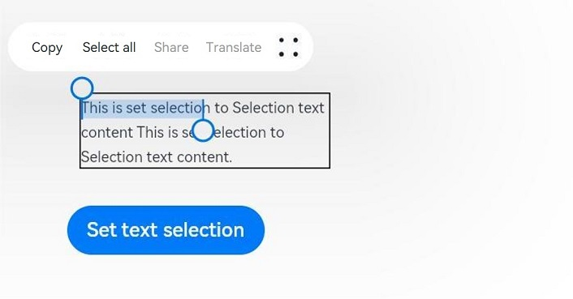
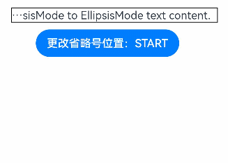

# Text

The **\<Text>** component is used to display a piece of textual information.

>  **NOTE**
>
>  This component is supported since API version 7. Updates will be marked with a superscript to indicate their earliest API version.


## Child Components

This component can contain the \<[Span](ts-basic-components-span.md)> and \<[ImageSpan](ts-basic-components-imagespan.md)> child components.


## APIs

Text(content?: string | Resource)

Since API version 9, this API is supported in ArkTS widgets.

**Parameters**

| Name| Type| Mandatory| Description|
| -------- | -------- | -------- | -------- |
| content | string \| [Resource](ts-types.md#resource) | No| Text content. The content and style set for the **\<Text>** component do not take effect when it contains the **\<Span>** child component.<br>Default value: **' '**|

## Attributes

In addition to the [universal attributes](ts-universal-attributes-size.md) and [universal text attributes](ts-universal-attributes-text-style.md), the following attributes are supported.

| Name                      | Type                           | Description                                              |
| ----------------------- | ----------------------------------- | ------------------------------------------- |
| textAlign               | [TextAlign](ts-appendix-enums.md#textalign) | Horizontal alignment mode of the text.<br>Default value: **TextAlign.Start**<br>**NOTE**<br>The text takes up the full width of the **\<Text>** component. To set vertical alignment for the text, use the [align](ts-universal-attributes-location.md) attribute. The **align** attribute alone does not control the horizontal position of the text. In other words, **Alignment.TopStart**, **Alignment.Top**, and **Alignment.TopEnd** produce the same effect, top-aligning the text; **Alignment.Start**, **Alignment.Center**, and **Alignment.End** produce the same effect, centered-aligning the text vertically; **Alignment.BottomStart**, **Alignment.Bottom**, and **Alignment.BottomEnd** produce the same effect, bottom-aligning the text. Yet, it can work with the **textAlign** attribute to jointly determine the horizontal position of the text.<br>Since API version 9, this API is supported in ArkTS widgets.|
| textOverflow            | {overflow: [TextOverflow](ts-appendix-enums.md#textoverflow)} | Display mode when the text is too long.<br>Default value: **{overflow: TextOverflow.Clip}**<br>**NOTE**<br>Text is clipped at the transition between words. To clip text in the middle of a word, add **\u200B** between characters. Since API version 11, you are advised to use this attribute with the **wordBreak** attribute set to **WordBreak.BREAK_ALL** so that word breaks can occur between any two characters when overflow occurs. For details, see [Example](#example-4).<br>If **overflow** is set to **TextOverflow.None**, **TextOverflow.Clip**, or **TextOverflow.Ellipsis**, this attribute must be used with **maxLines** for the settings to take effect. **TextOverflow.None** produces the same effect as **TextOverflow.Clip**. If **overflow** is set to **TextOverflow.Marquee**, the text scrolls in a line, and neither **maxLines** nor **copyOption** takes effect.<br>Since API version 9, this API is supported in ArkTS widgets.|
| maxLines                | number | Maximum number of lines in the text.<br>**NOTE**<br>By default, text is automatically folded. If this attribute is specified, the text will not exceed the specified number of lines. If there is extra text, you can use **textOverflow** to specify how it is displayed.<br>Since API version 9, this API is supported in ArkTS widgets.|
| lineHeight              | string \| number \| [Resource](ts-types.md#resource)  | Text line height. If the value is less than or equal to **0**, the line height is not limited and the font size is adaptive. If the value of the number type, the unit fp is used.<br>Since API version 9, this API is supported in ArkTS widgets.|
| decoration              | {<br>type: [TextDecorationType](ts-appendix-enums.md#textdecorationtype),<br>color?: [ResourceColor](ts-types.md#resourcecolor)<br>} | Style and color of the text decorative line.<br>Default value: {<br>type: TextDecorationType.None,<br>color: Color.Black<br>} <br>Since API version 9, this API is supported in ArkTS widgets.|
| baselineOffset          | number \| string | Baseline offset of the text. The default value is **0**.<br>Since API version 9, this API is supported in ArkTS widgets.<br>**NOTE**<br>If this attribute is set to a percentage, the default value is used. |
| letterSpacing           | number \| string | Letter spacing.<br>Since API version 9, this API is supported in ArkTS widgets.<br>**NOTE**<br>If this attribute is set to a percentage, the default value is used.<br> If this attribute is set to a negative value, the letters will overlap each other. |
| minFontSize             | number \| string \| [Resource](ts-types.md#resource)      | Minimum font size.<br>For the setting to take effect, this attribute must be used together with **maxFontSize**, **maxLines**, or layout constraint settings.<br>Since API version 9, this API is supported in ArkTS widgets.                              |
| maxFontSize             | number \| string \| [Resource](ts-types.md#resource)      | Maximum font size.<br>For the setting to take effect, this attribute must be used together with **minFontSize**, **maxLines**, or layout constraint settings.<br>Since API version 9, this API is supported in ArkTS widgets.                               |
| textCase                | [TextCase](ts-appendix-enums.md#textcase) | Text case.<br>Default value: **TextCase.Normal**<br>Since API version 9, this API is supported in ArkTS widgets.|
| copyOption<sup>9+</sup> | [CopyOptions](ts-appendix-enums.md#copyoptions9) | Whether copy and paste is allowed.<br>Default value: **CopyOptions.None**<br>This API is supported in ArkTS widgets.<br>**NOTE**<br>When this attribute is set to **CopyOptions.InApp** or **CopyOptions.LocalDevice**, a long press on the text will display a context menu that offers the copy and select-all options. |
| draggable  | boolean | Drag effect of the selected text.<br>This attribute cannot be used with the [onDragStart](ts-universal-events-drag-drop.md) event.<br>It must be used together with **copyOption**. When it is set to **true** and **copyOptions** is set to **CopyOptions.InApp** or **CopyOptions.LocalDevice**, the selected text can be dragged and copied to the text box.<br>Default value: **false**<br>**NOTE**<br>This API is supported since API version 9. |
| textShadow<sup>10+</sup> | [ShadowOptions](ts-universal-attributes-image-effect.md#shadowoptions) \| Array&lt;[ShadowOptions](ts-universal-attributes-image-effect.md#shadowoptions)&gt;<sup>11+</sup>  | Text shadow.<br>**NOTE**<br>This API does not work with the **fill** attribute or coloring strategy.<br>If the **\<Text>** component's **clip** attribute is set to true (default), the content (for example, text shadow) outside of the component's content area is clipped. Therefore, to fully show the text shadow when the content exceeds the component's content area, set the **clip** attribute to **false**.<br>Since API version 11, this API supports input parameters in an array to implement multiple text shadows.|
| heightAdaptivePolicy<sup>10+</sup> | [TextHeightAdaptivePolicy](ts-appendix-enums.md#textheightadaptivepolicy10) | How the adaptive height is determined for the text.<br>Default value: **TextHeightAdaptivePolicy.MAX_LINES_FIRST**<br>**NOTE**<br>When this attribute is set to **TextHeightAdaptivePolicy.MAX_LINES_FIRST**, the **maxLines** attribute takes precedence for adjusting the text height. If the **maxLines** setting results in a layout beyond the layout constraints, the text will shrink to a font size between `minFontSize` and `maxFontSize` to allow for more content to be shown.<br>When this attribute is set to **TextHeightAdaptivePolicy.MIN_FONT_SIZE_FIRST**, the **minFontSize** attribute takes precedence for adjusting the text height. If the text can fit in one line with the **minFontSize** setting, the text will enlarge to the largest possible font size between **minFontSize** and **maxFontSize**.<br>When this attribute is set to **TextHeightAdaptivePolicy.LAYOUT_CONSTRAINT_FIRST**, the layout constraints take precedence for adjusting the text height. If the resultant layout is beyond the layout constraints, the text will shrink to a font size between **minFontSize** and **maxFontSize** to respect the layout constraints. If the layout still exceeds the layout constraints after the font size is reduced to **minFontSize**, the lines that exceed the layout constraints are deleted. |
| textIndent<sup>10+</sup> | number \| string | Indentation of the first line.<br>Default value: **0**|
| font<sup>10+</sup> | [Font](ts-types.md#font) | Text style, covering the font size, font width, Font family, and font style.|
| wordBreak<sup>11+</sup> | [WordBreak](ts-appendix-enums.md#wordbreak11) | Line break rule.<br>Default value: **WordBreak.BREAK_WORD**<br>**NOTE**<br>Since API version 11, this API is supported in ArkTS widgets.<br>When used with **{overflow: TextOverflow.Ellipsis}** and **maxLines**, **WordBreak.BREAK_ALL** can insert line breaks between letters when overflow occurs and display excess content with an ellipsis (...). |
| selection<sup>11+</sup> |(selectionStart: number, selectionEnd: number)| Text selection. The selected text is highlighted, and a selection handle is displayed together with a menu of available actions.<br>Default value: (-1, -1)<br>**NOTE**<br>Since API version 11, this API is supported in ArkTS widgets.<br>When **copyOption** is set to **CopyOptions.None**, the **selection** attribute is not effective.<br>When **overflow** is set to **TextOverflow.Marquee**, the **selection** attribute is not effective.<br>If the value of **selectionStart** is greater than or equal to that of **selectionEnd**, no text will be selected. The value range is [0, textSize], where **textSize** indicates the maximum number of characters in the text content. If the value is less than 0, the value **0** will be used. If the value is greater than **textSize**, **textSize** will be used.<br>If value of **selectionStart** or **selectionEnd** falls within the invisible area, no text will be selected. If clipping is disabled, the text selection outside of the parent component takes effect. |
| ellipsisMode<sup>11+</sup> |[EllipsisMode](ts-appendix-enums.md#ellipsismode11)| Ellipsis position.<br>Default value: **EllipsisMode.END**<br>**NOTE**<br>Since API version 11, this API is supported in ArkTS widgets.<br>When **ellipsisMode** is set to **EllipsisMode.END**, **overflow** must be set to **TextOverflow.Ellipsis** and **maxLines** must be specified. Setting **ellipsisMode** alone does not take effect.<br>**EllipsisMode.START** and **EllipsisMode.CENTER** take effect only when text overflows in a single line. |
| enableDataDetector<sup>11+</sup> |boolean| Whether to enable text recognition.<br>Default value: **false**<br>**NOTE**<br>For this API to work, the target device must provide the text recognition capability .<br>When **copyOption** is set to **CopyOptions.None**, this API does not take effect.|
| dataDetectorConfig<sup>11+</sup> |{<br>types: [TextDataDetectorType](ts-appendix-enums.md#textdatadetectortype11),<br>onDetectResultUpdate: (callback:(result: string) =&gt; void)<br>} | AI-based text recognition.<br>Default value: {<br>types: [ ],<br>onDetectResultUpdate: null<br>} <br>**NOTE**<br>This API must be used together with **enableDataDetector**. It takes effect only when **enableDataDetector** is set to **true**.<br>**types**: types of entities that can be recognized from text. Values **null** and **[]** indicate that all types of entities can be recognized.<br> **onDetectResultUpdate**: callback invoked when text recognition succeeds.<br>**result**: text recognition result, in JSON format. |

>  **NOTE**
>
>  The **\<Text>** component cannot contain both text and the child component **\<Span>** or **\<ImageSpan>**. If both of them exist, only the content in **\<Span>** or **\<ImageSpan>** is displayed.
>
>  For the **\<Text>** component, the default value of the universal attribute [clip](ts-universal-attributes-sharp-clipping.md) is **true**, which means that the content outside of the component's content area is clipped. To display the content in full, set **clip** to **false**.

## Events

In addition to the [universal events](ts-universal-events-click.md), the following events are supported.

| Name                                                      | Description                                                  |
| --------------------------------------------------------- | ------------------------------------------------------------ |
| onCopy(callback:(value: string) =&gt; void)<sup>11+</sup> | Triggered when data is copied to the pasteboard, which is displayed when the text box is long pressed.<br>**value**: text to be copied.<br>**NOTE**<br>Since API version 11, this API is supported in ArkTS widgets.<br>Currently, only text can be copied. |

## Example

### Example 1

```ts
// xxx.ets
@Entry
@Component
struct TextExample1 {
  build() {
    Flex({ direction: FlexDirection.Column, alignItems: ItemAlign.Start, justifyContent: FlexAlign.SpaceBetween }) {
      // Set the horizontal alignment mode for the text.
      // Single-line text
      Text('textAlign').fontSize(9).fontColor(0xCCCCCC)
      Text('TextAlign set to Center.')
        .textAlign(TextAlign.Center)
        .fontSize(12)
        .border({ width: 1 })
        .padding(10)
        .width('100%')
      Text('TextAlign set to Start.')
        .textAlign(TextAlign.Start)
        .fontSize(12)
        .border({ width: 1 })
        .padding(10)
        .width('100%')
      Text('TextAlign set to End.')
        .textAlign(TextAlign.End)
        .fontSize(12)
        .border({ width: 1 })
        .padding(10)
        .width('100%')

      // Multi-line text
      Text('This is the text content with textAlign set to Center.')
        .textAlign(TextAlign.Center)
        .fontSize(12)
        .border({ width: 1 })
        .padding(10)
        .width('100%')
      Text('This is the text content with textAlign set to Start.')
        .textAlign(TextAlign.Start)
        .fontSize(12)
        .border({ width: 1 })
        .padding(10)
        .width('100%')
      Text('This is the text content with textAlign set to End.')
        .textAlign(TextAlign.End)
        .fontSize(12)
        .border({ width: 1 })
        .padding(10)
        .width('100%')


      // Set the display mode when the text is too long.
      Text('TextOverflow+maxLines').fontSize(9).fontColor(0xCCCCCC)
      // Clip the text when the value of maxLines is exceeded.
      Text('This is the setting of textOverflow to Clip text content This is the setting of textOverflow to None text content. This is the setting of textOverflow to Clip text content This is the setting of textOverflow to None text content.')
        .textOverflow({ overflow: TextOverflow.Clip })
        .maxLines(1)
        .fontSize(12)
        .border({ width: 1 })
        .padding(10)

      // Show an ellipsis (...) when the value of maxLines is exceeded.
      Text('This is set textOverflow to Ellipsis text content This is set textOverflow to Ellipsis text content.'.split('')
        .join('\u200B'))
        .textOverflow({ overflow: TextOverflow.Ellipsis })
        .maxLines(1)
        .fontSize(12)
        .border({ width: 1 })
        .padding(10)

      Text('lineHeight').fontSize(9).fontColor(0xCCCCCC)
      Text('This is the text with the line height set. This is the text with the line height set.')
        .fontSize(12).border({ width: 1 }).padding(10)
      Text('This is the text with the line height set. This is the text with the line height set.')
        .fontSize(12).border({ width: 1 }).padding(10)
        .lineHeight(20)
    }.height(600).width(350).padding({ left: 35, right: 35, top: 35 })
  }
}
```


### Example 2

```ts
@Entry
@Component
struct TextExample2 {
  build() {
    Flex({ direction: FlexDirection.Column, alignItems: ItemAlign.Start, justifyContent: FlexAlign.SpaceBetween }) {
      Text('decoration').fontSize(9).fontColor(0xCCCCCC)
      Text('This is the text content with the decoration set to LineThrough and the color set to Red.')
        .decoration({
          type: TextDecorationType.LineThrough,
          color: Color.Red
        })
        .fontSize(12)
        .border({ width: 1 })
        .padding(10)
        .width('100%')


      Text('This is the text content with the decoration set to Overline and the color set to Red.')
        .decoration({
          type: TextDecorationType.Overline,
          color: Color.Red
        })
        .fontSize(12)
        .border({ width: 1 })
        .padding(10)
        .width('100%')


      Text('This is the text content with the decoration set to Underline and the color set to Red.')
        .decoration({
          type: TextDecorationType.Underline,
          color: Color.Red
        })
        .fontSize(12)
        .border({ width: 1 })
        .padding(10)
        .width('100%')

      // Set the text baseline offset.
      Text('baselineOffset').fontSize(9).fontColor(0xCCCCCC)
      Text('This is the text content with baselineOffset 0.')
        .baselineOffset(0)
        .fontSize(12)
        .border({ width: 1 })
        .padding(10)
        .width('100%')
      Text('This is the text content with baselineOffset 30.')
        .baselineOffset(30)
        .fontSize(12)
        .border({ width: 1 })
        .padding(10)
        .width('100%')
      Text('This is the text content with baselineOffset -20.')
        .baselineOffset(-20)
        .fontSize(12)
        .border({ width: 1 })
        .padding(10)
        .width('100%')

      // Set the letter spacing.
      Text('letterSpacing').fontSize(9).fontColor(0xCCCCCC)
      Text('This is the text content with letterSpacing 0.')
        .letterSpacing(0)
        .fontSize(12)
        .border({ width: 1 })
        .padding(10)
        .width('100%')
      Text('This is the text content with letterSpacing 3.')
        .letterSpacing(3)
        .fontSize(12)
        .border({ width: 1 })
        .padding(10)
        .width('100%')
      Text('This is the text content with letterSpacing -1.')
        .letterSpacing(-1)
        .fontSize(12)
        .border({ width: 1 })
        .padding(10)
        .width('100%')

      Text('textCase').fontSize(9).fontColor(0xCCCCCC)
      Text('This is the text content with textCase set to Normal.')
        .textCase(TextCase.Normal)
        .fontSize(12)
        .border({ width: 1 })
        .padding(10)
        .width('100%')
      // Display the text in lowercase.
      Text('This is the text content with textCase set to LowerCase.')
        .textCase(TextCase.LowerCase)
        .fontSize(12)
        .border({ width: 1 })
        .padding(10)
        .width('100%')
      // Display the text in uppercase.
      Text('This is the text content with textCase set to UpperCase.')
        .textCase(TextCase.UpperCase)
        .fontSize(12).border({ width: 1 }).padding(10)

    }.height(700).width(350).padding({ left: 35, right: 35, top: 35 })
  }
}
```


### Example 3

Example of using **textShadow**, **heightAdaptivePolicy**, and **TextOverflow.MARQUEE**:

```ts
@Entry
@Component
struct TextExample {
  build() {
    Column({ space: 8 }) {
      Text('textShadow').fontSize(9).fontColor(0xCCCCCC).margin(15).width('90%')
      // Set the text shadow.
      Text('textShadow')
        .width('80%')
        .height(55)
        .fontSize(40)
        .lineHeight(55)
        .textAlign(TextAlign.Center)
        .textShadow({ radius: 10, color: Color.Black, offsetX: 0, offsetY: 0 })
        .borderWidth(1)
      Divider()
      // Set how the adaptive height is determined for the text.
      Text('heightAdaptivePolicy').fontSize(9).fontColor(0xCCCCCC).margin(15).width('90%')
      Text('This is the text with the height adaptive policy set')
        .width('80%')
        .height(90)
        .borderWidth(1)
        .minFontSize(10)
        .maxFontSize(30)
        .maxLines(3)
        .textOverflow({ overflow: TextOverflow.Ellipsis })
        .heightAdaptivePolicy(TextHeightAdaptivePolicy.MAX_LINES_FIRST)
      Text('This is the text with the height adaptive policy set')
        .width('80%')
        .height(90)
        .borderWidth(1)
        .minFontSize(10)
        .maxFontSize(30)
        .maxLines(3)
        .textOverflow({ overflow: TextOverflow.Ellipsis })
        .heightAdaptivePolicy(TextHeightAdaptivePolicy.MIN_FONT_SIZE_FIRST)
      Text('This is the text with the height adaptive policy set')
        .width('80%')
        .height(90)
        .borderWidth(1)
        .minFontSize(10)
        .maxFontSize(30)
        .maxLines(3)
        .textOverflow({ overflow: TextOverflow.Ellipsis })
        .heightAdaptivePolicy(TextHeightAdaptivePolicy.LAYOUT_CONSTRAINT_FIRST)
      Divider()
      Text('marquee').fontSize(9).fontColor(0xCCCCCC).margin(15).width('90%')
      // Set the text to continuously scroll when text overflow occurs.
      Text('This is the text with the text overflow set marquee')
        .width(300)
        .borderWidth(1)
        .textOverflow({ overflow: TextOverflow.MARQUEE })
    }
  }
}
```


### Example 4
Example of using **WordBreak**:

```ts
@Entry
@Component
struct TextExample4 {
  @State type: string = 'WordBreakType:Normal with clip set to true'
  @State text: string = 'This is set wordBreak to WordBreak text content This is set wordBreak to WordBreak text content.'

  build() {
    Flex({ direction: FlexDirection.Column, alignItems: ItemAlign.Start, justifyContent: FlexAlign.SpaceBetween }) {
      Text(this.type).fontSize(9).fontColor(0xCCCCCC)
      Text('This is set wordBreak to WordBreak text Taumatawhakatangihangakoauauotamateaturipukakapikimaungahoronukupokaiwhenuakitanatahu.')
        .fontSize(12)
        .border({ width: 1 })
        .wordBreak(WordBreak.NORMAL)
        .lineHeight(20)
        .maxLines(2)
      Text('WordBreakType:Normal with clip set to false').fontSize(9).fontColor(0xCCCCCC)
      Text('This is set wordBreak to WordBreak text Taumatawhakatangihangakoauauotamateaturipukakapikimaungahoronukupokaiwhenuakitanatahu.')
        .fontSize(12)
        .border({ width: 1 })
        .wordBreak(WordBreak.NORMAL)
        .lineHeight(20)
        .maxLines(2)
        .clip(false)
      Text("WordBreakType:BreakAll").fontSize(9).fontColor(0xCCCCCC)
      Text(this.text)
        .fontSize(12)
        .border({ width: 1 })
        .maxLines(2)
        .textOverflow({ overflow: TextOverflow.Ellipsis })
        .wordBreak(WordBreak.BREAK_ALL)
        .lineHeight(20)
      Text("WordBreakType:BreakWord").fontSize(9).fontColor(0xCCCCCC)
      Text(this.text)
        .fontSize(12)
        .border({ width: 1 })
        .maxLines(2)
        .textOverflow({ overflow: TextOverflow.Ellipsis })
        .wordBreak(WordBreak.BREAK_WORD)
        .lineHeight(20)
    }.height(300).width(335).padding({ left: 35, right: 35, top: 35 })
  }
}
```


### Example 5
Example of using **selection** and **onCopy**:

```ts
@Entry
@Component
struct TextExample5 {
  @State onCopy: string = ''
  @State text: string = 'This is set selection to Selection text content This is set selection to Selection text content.'
  @State start: number = 0
  @State end: number = 20

  build() {
    Flex({ direction: FlexDirection.Column, alignItems: ItemAlign.Start, justifyContent: FlexAlign.Start }) {
      Text(this.text)
        .fontSize(12)
        .border({ width: 1 })
        .lineHeight(20)
        .margin(30)
        .copyOption(CopyOptions.InApp)
        .selection(this.start, this.end)
        .onCopy((value: string) => {
          this.onCopy = value
        })
      Button('Set text selection')
        .margin({left:20})
        .onClick(() => {
          // Change the start point and end point of the text selection.
          this.start = 10
          this.end = 30
        })
      Text(this.onCopy).fontSize(12).margin(10).key('copy')
    }.height(600).width(335).padding({ left: 35, right: 35, top: 35 })
  }
}
```


### Example 6
Example of using **ellipsisMode**:

```ts
@Entry
@Component
struct TextExample6 {
  @State text: string = 'This is set ellipsisMode to EllipsisMode text content This is set ellipsisMode to EllipsisMode text content.'
  @State ellipsisModeIndex: number = 0;
  @State ellipsisMode: EllipsisMode[] = [EllipsisMode.START, EllipsisMode.CENTER, EllipsisMode.END]
  @State ellipsisModeStr: string[] = ['START', 'CENTER', 'END']
  build() {
    Column() {
      Text(this.text)
        .fontSize(16)
        .border({ width: 1 })
        .lineHeight(20)
        .maxLines(1)
        .textOverflow({overflow:TextOverflow.Ellipsis})
        .ellipsisMode(this.ellipsisMode[this.ellipsisModeIndex])
        .width(300)
        .margin({ left: 20, top: 20 })

      Row() {
        Button ('Change Ellipsis Position:' + this.ellipsisModeStr[this.ellipsisModeIndex]).onClick (() => {
          this.ellipsisModeIndex++
          if(this.ellipsisModeIndex > (this.ellipsisModeStr.length - 1)) {
            this.ellipsisModeIndex = 0
          }
        })
      }.margin({ top: 10 })
    }
  }
}
```


### Example 7
Example of using **enableDataDetector** and **dataDetectorConfig**

```ts
@Entry
@Component
struct TextExample7 {
  @State phoneNumber: string = '(86) (755) ********';
  @State url: string = 'Hello World';
  @State email: string = '***@openharmony.cn';
  @State address: string = 'XX (province) XX (city) XX (county) XXXX';
  @State enableDataDetector: boolean = true;
  @State types: TextDataDetectorType[] = [];

  build() {
    Row() {
      Column() {
        Text(
          'Phone number' + this.phoneNumber + '\n' +
          'URL' + this.url + '\n' +
          'Email' + this.email + '\n' +
          'Address' + this.address
        )
          .fontSize(16)
          .copyOption(CopyOptions.InApp)
          .dataDetectorConfig({types : this.types, onDetectResultUpdate: (result: string)=>{}})
          .textAlign(TextAlign.Center)
          .borderWidth(1)
          .padding(10)
          .width('100%')
      }
      .width('100%')
    }
    .height('100%')
  }
}
```
