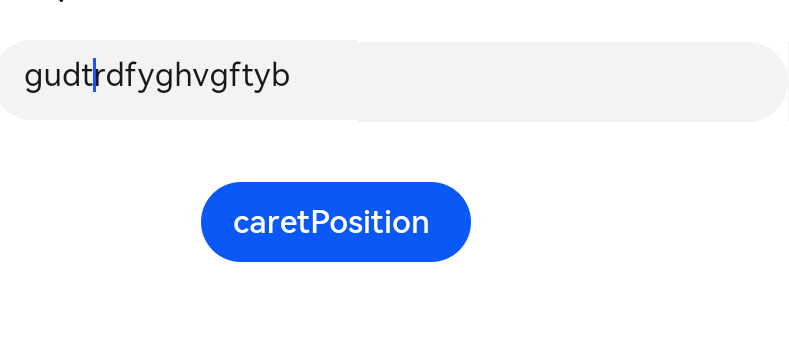

# TextArea

The **\<TextArea>** component provides multi-line text input.

>  **NOTE**
>
>  This component is supported since API version 7. Updates will be marked with a superscript to indicate their earliest API version.


## Child Components

Not supported


## APIs

TextArea(value?:{placeholder?: ResourceStr, text?: ResourceStr, controller?: TextAreaController})

**Parameters**

| Name                    | Type                                    | Mandatory  | Description          |
| ----------------------- | ---------------------------------------- | ---- | -------------- |
| placeholder      | [ResourceStr](ts-types.md#resourcestr8) | No   | Text displayed when there is no input.    |
| text             | [ResourceStr](ts-types.md#resourcestr8) | No   | Current text input.    |
| controller<sup>8+</sup> | [TextAreaController](#textareacontroller8) | No   | Text area controller.|


## Attributes

In addition to the [universal attributes](ts-universal-attributes-size.md), the following attributes are supported.

| Name                      | Type                                    | Description                                      |
| ------------------------ | ---------------------------------------- | ---------------------------------------- |
| placeholderColor         | [ResourceColor](ts-types.md#resourcecolor8) | Placeholder text color.                      |
| placeholderFont          | [Font](ts-types.md#font) | Placeholder text style.                                   |
| textAlign                | [TextAlign](ts-appendix-enums.md#textalign) | Horizontal alignment of the text.<br>Default value: **TextAlign.Start**|
| caretColor               | [ResourceColor](ts-types.md#resourcecolor8) | Color of the caret in the text box.                              |
| inputFilter<sup>8+</sup> | {<br>value: [ResourceStr](ts-types.md#resourcestr8)<sup>8+</sup>,<br>error?: (value: string) => void<br>} | Regular expression for input filtering. Only inputs that comply with the regular expression can be displayed. Other inputs are ignored. The specified regular expression can match single characters, but not strings. Example: ^(?=.\*\d)(?=.\*[a-z])(?=.\*[A-Z]).{8,10}$. Strong passwords containing 8 to 10 characters cannot be filtered.<br>- **value**: regular expression to set.<br>- **error**: ignored content to return when regular expression matching fails.|

## Events

| Name                                                        | Description                                                    |
| ------------------------------------------------------------ | ------------------------------------------------------------ |
| onChange(callback: (value: string) =&gt; void) | Triggered when the input changes.                                  |
| onCopy<sup>8+</sup>(callback:(value: string) =&gt; void) | Triggered when the copy button on the pasteboard, which displays when the text box is long pressed, is clicked.<br>- **value**: text to be copied.|
| onCut<sup>8+</sup>(callback:(value: string) =&gt; void) | Triggered when the cut button on the pasteboard, which displays when the text box is long pressed, is clicked.<br>- **value**: text to be cut.|
| onPaste<sup>8+</sup>(callback:(value: string) =&gt; void) | Triggered when the paste button on the pasteboard, which displays when the text box is long pressed, is clicked.<br>- **value**: text to be pasted.|

## TextAreaController<sup>8+</sup>

Defines the controller for controlling the **\<TextArea>** component.

### Objects to Import

```
controller: TextAreaController = new TextAreaController()
```

### caretPosition<sup>8+</sup>

caretPosition(value: number): void

Sets the position of the caret.

**Parameters**

| Name| Type| Mandatory| Description                              |
| ------ | -------- | ---- | -------------------------------------- |
| value  | number   | Yes  | Length from the start of the string to the position where the caret is located.|


## Example


### Multi-line Text Input

```ts
// xxx.ets
@Entry
@Component
struct TextAreaExample1 {
  controller: TextAreaController = new TextAreaController()
  @State text: string = ''
  build() {
    Column() {
      TextArea({ placeholder: 'input your word', controller: this.controller})
        .placeholderColor("rgb(0,0,225)")
        .placeholderFont({ size: 30, weight: 100, family: 'cursive', style: FontStyle.Italic })
        .textAlign(TextAlign.Center)
        .caretColor(Color.Blue)
        .height(50)
        .fontSize(30)
        .fontWeight(FontWeight.Bold)
        .fontFamily("sans-serif")
        .fontStyle(FontStyle.Normal)
        .fontColor(Color.Red)
        .inputFilter('^[\u4E00-\u9FA5A-Za-z0-9_]+$',(value: string) => {
          console.info("hyb"+value)
        })
        .onChange((value: string) => {
          this.text = value
          this.controller.caretPosition(-1)
        })
      Text(this.text).width('90%')
    }
  }
}
```


### Setting the Caret

```ts
// xxx.ets
@Entry
@Component
struct TextAreaExample2 {
    controller: TextAreaController = new TextAreaController()
    build() {
        Column() {
            TextArea({ placeholder: 'input your word',controller:this.controller })
            Button('caretPosition')
                .onClick(() => {
                    this.controller.caretPosition(4)
                })
          }
    }
}
```


