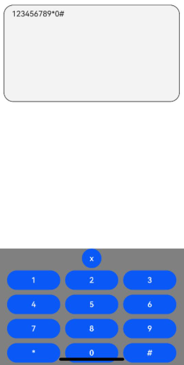

# TextArea

The **\<TextArea>** component provides multi-line text input and automatically wraps text so that each line does not have more than the width of the component.

If the component does not have its height set, it adapts its height to the content. If the component does not have its width set, it takes the maximum available width.

>  **NOTE**
>
>  This component is supported since API version 7. Updates will be marked with a superscript to indicate their earliest API version.


## Child Components

Not supported


## APIs

TextArea(value?:{placeholder?: ResourceStr, text?: ResourceStr, controller?: TextAreaController})

**Parameters**

| Name                    | Type                                    | Mandatory  | Description          |
| ----------------------- | ---------------------------------------- | ---- | -------------- |
| placeholder      | [ResourceStr](ts-types.md#resourcestr)  | No   | Text displayed when there is no input.<br>When only the **placeholder** attribute is set, the text selection handle is still available; the caret stays at the beginning of the placeholder text when the handle is released.    |
| text             | [ResourceStr](ts-types.md#resourcestr)  | No   | Current text input.<br>If the component has [stateStyles](ts-universal-attributes-polymorphic-style.md) or any other attribute that may trigger updating configured, you are advised to bind the state variable to the text in real time through the **onChange** event,<br>so as to prevent display errors when the component is updated.<br>Since API version 10, this parameter supports two-way binding through [$$](../../quick-start/arkts-two-way-sync.md).|
| controller<sup>8+</sup> | [TextAreaController](#textareacontroller8) | No   | Text area controller.|


## Attributes

Among the [universal attributes](ts-universal-attributes-size.md) and [universal text attributes](ts-universal-attributes-text-style.md), **fontColor**, **fontSize**, **fontStyle**, **fontWeight**, and **fontFamily** are supported. In addition, the following attributes are supported.

| Name                     | Type                                                    | Description                                                        |
| ------------------------- | ------------------------------------------------------------ | ------------------------------------------------------------ |
| placeholderColor          | [ResourceColor](ts-types.md#resourcecolor)                   | Placeholder text color.<br>The default value follows the theme.              |
| placeholderFont           | [Font](ts-types.md#font)                                     | Placeholder text style, including the font size, font width, font family, and font style. Currently, only the default font family is supported.|
| textAlign                 | [TextAlign](ts-appendix-enums.md#textalign)                  | Horizontal alignment of the text.<br>Default value: **TextAlign.Start**<br>**NOTE**<br>Available options are **TextAlign.Start**, **TextAlign.Center**, and **TextAlign.End**.<br>To set vertical alignment for the text, use the [align](ts-universal-attributes-location.md) attribute. The **align** attribute alone does not control the horizontal position of the text. In other words, **Alignment.TopStart**, **Alignment.Top**, and **Alignment.TopEnd** produce the same effect, top-aligning the text; **Alignment.Start**, **Alignment.Center**, and **Alignment.End** produce the same effect, centered-aligning the text vertically; **Alignment.BottomStart**, **Alignment.Bottom**, and **Alignment.BottomEnd** produce the same effect, bottom-aligning the text.<br>Since API version 11, **textAlign** can be set to **TextAlign.JUSTIFY**.|
| caretColor                | [ResourceColor](ts-types.md#resourcecolor)                   | Color of the caret in the text box.<br>Default value: **'#007DFF'**                |
| inputFilter<sup>8+</sup>  | {<br>value: [ResourceStr](ts-types.md#resourcestr),<br>error?: (value: string) => void<br>} | Regular expression for input filtering. Only inputs that comply with the regular expression can be displayed. Other inputs are filtered out. The specified regular expression can match single characters, but not strings.<br>- **value**: regular expression to set.<br>- **error**: filtered-out content to return when regular expression matching fails.|
| copyOption<sup>9+</sup>   | [CopyOptions](ts-appendix-enums.md#copyoptions9)             | Whether copy and paste is allowed.<br>Default value: **CopyOptions.LocalDevice**<br>If this attribute is set to **CopyOptions.None**, the paste operation is allowed, but the copy and cut operations are not.<br>|
| maxLength<sup>10+</sup>   | number                                                       | Maximum number of characters in the text input.<br>By default, there is no maximum number of characters.<br>When the maximum number of characters is reached, no more characters can be entered, and the border turns red.|
| showCounter<sup>10+</sup> | value: boolean, options<sup>11+</sup>?: [InputCounterOptions](ts-basic-components-textinput.md#inputcounteroptions11) | Counter settings. **options** can be set only when **value** is set to **true**, in which case a character counter is displayed below the text box. This attribute must be used together with **maxlength**. The character counter is displayed in this format: Number of characters that have been entered/Maximum number of characters allowed. It is visible when the number of characters that have been entered is greater than the maximum number of characters multiplied by the threshold percentage value.|
| style<sup>10+</sup>       | [TextContentStyle](ts-appendix-enums.md#textcontentstyle10)  | Style of the component.<br>Default value: **TextContentStyle.DEFAULT**|
| enableKeyboardOnFocus<sup>10+</sup> | boolean | Whether to enable the input method when the component obtains focus.<br>Default value: **true**  |
| selectionMenuHidden<sup>10+</sup> | boolean                                                      | Whether to display the text selection menu when the text box is long-pressed or right-clicked.<br>Default value: **false**|
| barState<sup>10+</sup> | [BarState](ts-appendix-enums.md#BarState) | Scrollbar state when the inline input style is used.<br>Default value: **BarState.Auto**|
| maxLines<sup>10+</sup> | number | Maximum number of lines that can be displayed when the inline input style is used.<br>Default value: **3**<br>**NOTE**<br>Value range: (0, +∞)|
| customKeyboard<sup>10+</sup> | [CustomBuilder](ts-types.md#custombuilder8) | Custom keyboard.<br>**NOTE**<br>When a custom keyboard is set, activating the text box opens the specified custom component, instead of the system input method.<br>The custom keyboard's height can be set through the **height** attribute of the custom component's root node, and its width is fixed at the default value.<br>The custom keyboard is displayed on top of the current page, without compressing or raising the page.<br>The custom keyboard cannot obtain the focus, but it blocks gesture events.<br>By default, the custom keyboard is closed when the input component loses the focus. You can also use the [TextAreaController](#textareacontroller8).[stopEditing](#stopediting10) API to close the keyboard.|
| type<sup>11+</sup>                     | [TextAreaType](#textareatype11)     | Text box type.<br>Default value: **TextAreaType.Normal**       |
| selectAll<sup>11+</sup> | boolean | Whether to select all text in the initial state.<br>Default value: **false**  |
>  **NOTE**
>
>  The default value of the universal attribute [padding](ts-universal-attributes-size.md) is as follows:<br>{<br> top: 8 vp,<br> right: 16 vp,<br> bottom: 8 vp,<br> left: 16 vp<br> }  <br>Since API version 11, **.width('auto')** can be set for the **\<TextArea>** component. Under this setting, the component auto-adapts its width to the text width, while respecting the **constraintSize** configuration and the maximum and minimum width restrictions received by the parent container. For details, see [Size](ts-universal-attributes-size.md#attributes).

## Events

In addition to the [universal events](ts-universal-events-click.md), the following events are supported.

| Name                                                        | Description                                                    |
| ------------------------------------------------------------ | ------------------------------------------------------------ |
| onChange(callback: (value: string) =&gt; void) | Triggered when the input in the text box changes.<br>- **value**: text entered.|
| onEditChange(callback: (isEditing: boolean) =&gt; void)<sup>10+</sup> | Triggered when the input status changes. When the cursor is placed in the text box, it is in the editing state. Otherwise, it is in the non-editing state. If the value of **isEditing** is **true**, text input is in progress.|
| onCopy<sup>8+</sup>(callback:(value: string) =&gt; void) | Triggered when the copy button on the pasteboard, which displays when the text box is long pressed, is clicked.<br>- **value**: text to be copied.|
| onCut<sup>8+</sup>(callback:(value: string) =&gt; void) | Triggered when the cut button on the pasteboard, which displays when the text box is long pressed, is clicked.<br>- **value**: text to be cut.|
| onPaste<sup>8+</sup>(callback:(value: string) =&gt; void) | Triggered when the paste button on the pasteboard, which displays when the text box is long pressed, is clicked.<br>- **value**: text to be pasted.|
| onTextSelectionChange(callback: (selectionStart: number, selectionEnd: number) => void)<sup>10+</sup> | Triggered when the text selection position changes.<br>**selectionStart**: start position of the text selection area. The start position of text in the text box is **0**.<br>**selectionEnd**: end position of the text selection area.|
| onContentScroll(callback: (totalOffsetX: number, totalOffsetY: number) => void)<sup>10+</sup> | Triggered when the text content is scrolled.<br>**totalOffsetX**: X coordinate offset of the text in the content area.<br>**totalOffsetY**: Y coordinate offset of the text in the content area.|

## TextAreaController<sup>8+</sup>

Defines the controller for controlling the **\<TextArea>** component. Currently, the controller can be used to control the caret position.

### Objects to Import

```
controller: TextAreaController = new TextAreaController()
```

### caretPosition<sup>8+</sup>

caretPosition(value: number): void

Sets the position of the caret.

**Parameters**

| Name| Type| Mandatory| Description                              |
| ------ | -------- | ---- | -------------------------------------- |
| value  | number   | Yes  | Length from the start of the string to the position where the caret is located.|

### setTextSelection<sup>10+</sup>

setTextSelection(selectionStart: number, selectionEnd: number): void

Sets the text selection range and highlights the selected text when the component is focused. This API works only when the value of **selectionStart** is less than that of **selectionEnd**.

**Parameters**

| Name        | Type| Mandatory| Description                                                    |
| -------------- | -------- | ---- | ------------------------------------------------------------ |
| selectionStart | number   | Yes  | Start position of the text selection range. The start position of text in the text box is 0.<br>A value less than 0 evaluates to the value **0**. A value greater than the maximum text length evaluates to the maximum text length.<br>|
| selectionEnd   | number   | Yes  | End position of the text selection range.<br>A value less than 0 evaluates to the value **0**. A value greater than the maximum text length evaluates to the maximum text length.<br>|

### stopEditing<sup>10+</sup>

stopEditing(): void

Exits the editing state.

### getTextContentRect<sup>10+</sup>

getTextContentRect(): [RectResult](#rectresult10)

Obtains the position of the edited text area relative to the component and its size. The unit of the return value is pixel.

**Return value**

| Type      | Description      |
| -------------------  | -------- |
| [RectResult](#rectresult10) | Position of the edited text area relative to the component and its size.|

> **NOTE**
>
> - If no text is entered, the return value contains the position information, but the size is 0.
> - The position information is the offset of the first character relative to the editable area.
> - If there is input, the width in the return value is the fixed width of the editable area.

### RectResult<sup>10+</sup>

Describes the position and size.

| Parameter     | Type    | Description|
| ------- | ------ | ----------------------- |
| x     | number | X coordinate.|
| y     | number | Y coordinate.|
| width | number | Content width.|
| height | number | Content height.|


### getTextContentLineCount<sup>10+</sup>

getTextContentLineCount(): number

Obtains the number of lines of the edited text.

**Return value**

| Type | Description      |
| ----- | -------- |
| number| Number of lines of the edited text.|

## TextAreaType<sup>11+</sup>

| Name                | Description           |
| ------------------ | ------------- |
| Normal   | Normal input mode.<br>The value can contain digits, letters, underscores (_), spaces, and special characters.|
| Email    | Email address input mode. The value can contain digits, letters, underscores (_), and at signs (@). Only one at sign (@) is allowed.|
| Number   | Digit input mode.     |
| PhoneNumber | Phone number input mode.<br>The value can contain digits, plus signs (+), hyphens (-), asterisks (*), and number signs (#). The length is not limited.|

### getCaretOffset<sup>11+</sup>

getCaretOffset(): CaretOffset

Returns the position information of the caret.

**Return value**

| Type                     | Description              |
| ----------------------- | ---------------- |
| [CaretOffset](ts-basic-components-textinput.md#caretoffset11) | Position of the caret relative to the text box.|

> **NOTE**
>
> If this API is called when the caret position is updated in the current frame, it will not take effect.

## Example

### Example 1

```ts
// xxx.ets
@Entry
@Component
struct TextAreaExample {
  @State text: string = ''
  @State positionInfo: CaretOffset = { index: 0, x: 0, y: 0 }
  controller: TextAreaController = new TextAreaController()

  build() {
    Column() {
      TextArea({
        text: this.text,
        placeholder: 'The text area can hold an unlimited amount of text. input your word...',
        controller: this.controller
      })
        .placeholderFont({ size: 16, weight: 400 })
        .width(336)
        .height(56)
        .margin(20)
        .fontSize(16)
        .fontColor('#182431')
        .backgroundColor('#FFFFFF')
        .onChange((value: string) => {
          this.text = value
        })
      Text(this.text)
      Button('Set caretPosition 1')
        .backgroundColor('#007DFF')
        .margin(15)
        .onClick(() => {
          // Move the caret to after the first entered character.
          this.controller.caretPosition(1)
        })
      Button('Get CaretOffset')
        .backgroundColor('#007DFF')
        .margin(15)
        .onClick(() => {
          this.positionInfo = this.controller.getCaretOffset()
        })
    }.width('100%').height('100%').backgroundColor('#F1F3F5')
  }
}
```


### Example 2

```ts
// xxx.ets
@Entry
@Component
struct TextAreaExample {
  @State text: string = 'test'
  @State counterVisible: boolean = false
  @State maxNumber: number = -1
  controller: TextAreaController = new TextAreaController()

  build() {
    Column() {
      TextArea({
        text: this.text,
        placeholder: 'The text area can hold an unlimited amount of text. input your word...',
        controller: this.controller
      })
        .placeholderFont({ size: 16, weight: 400 })
        .width(336)
        .height(56)
        .margin(20)
        .fontSize(16)
        .fontColor('#182431')
        .maxLength(4)
        .showCounter(true)
        .backgroundColor('#FFFFFF')
        .onChange((value: string) => {
          this.text = value
        })
    }.width('100%').height('100%').backgroundColor('#F1F3F5')
  }
}
```


### Example 3

```ts
// xxx.ets
@Entry
@Component
struct TextAreaExample {
  controller: TextAreaController = new TextAreaController()
  @State inputValue: string = ""

  // Create a custom keyboard component.
  @Builder CustomKeyboardBuilder() {
    Column() {
      Button('x').onClick(() => {
        // Disable the custom keyboard.
        this.controller.stopEditing()
      })
      Grid() {
        ForEach([1, 2, 3, 4, 5, 6, 7, 8, 9, '*', 0, '#'], (item: number | string) => {
          GridItem() {
            Button(item + "")
              .width(110).onClick(() => {
              this.inputValue += item
            })
          }
        })
      }.maxCount(3).columnsGap(10).rowsGap(10).padding(5)
    }.backgroundColor(Color.Gray)
  }

  build() {
    Column() {
      TextArea({ controller: this.controller, text: this.inputValue})
        // Bind the custom keyboard.
        .customKeyboard(this.CustomKeyboardBuilder()).margin(10).border({ width: 1 })
        .height(200)
    }
  }
}
```



### Example 4

```ts
// xxx.ets
@Entry
@Component
struct TextAreaExample {
  @State text: string = ''
  controller: TextAreaController = new TextAreaController()

  build() {
    Column() {
      TextArea({ text: this.text, controller: this.controller })
        .placeholderFont({ size: 16, weight: 400 })
        .width(336)
        .height(56)
        .maxLength(6)
        .showCounter(true, { thresholdPercentage: 50 })
		// The character counter is in this format: Number of characters that have been entered/Maximum number of characters allowed, which is specified by maxLength().
        // The character counter is displayed when the number of characters that have been entered is greater than the maximum number of characters multiplied by 50% (threshold percentage).
    }.width('100%').height('100%').backgroundColor('#F1F3F5')
  }
}
```


