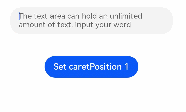

# TextArea

The **\<TextArea>** component provides multi-line text input and automatically wraps text so that each line does not have more than the width of the component.

>  **NOTE**
>
>  This component is supported since API version 7. Updates will be marked with a superscript to indicate their earliest API version.


## Child Components

Not supported


## APIs

TextArea(value?:{placeholder?: ResourceStr, text?: ResourceStr, controller?: TextAreaController})

**Parameters**

| Name                    | Type                                    | Mandatory  | Description          |
| ----------------------- | ---------------------------------------- | ---- | -------------- |
| placeholder      | [ResourceStr](ts-types.md#resourcestr)  | No   | Placeholder text displayed when there is no input.    |
| text             | [ResourceStr](ts-types.md#resourcestr)  | No   | Current text input.    |
| controller<sup>8+</sup> | [TextAreaController](#textareacontroller8) | No   | Text area controller.|


## Attributes

In addition to the [universal attributes](ts-universal-attributes-size.md), the following attributes are supported.

| Name                      | Type                                    | Description                                      |
| ------------------------ | ---------------------------------------- | ---------------------------------------- |
| placeholderColor         | [ResourceColor](ts-types.md#resourcecolor) | Placeholder text color.                      |
| placeholderFont          | [Font](ts-types.md#font) | Placeholder text style.                                   |
| textAlign                | [TextAlign](ts-appendix-enums.md#textalign) | Horizontal alignment of the text.<br>Default value: **TextAlign.Start**|
| caretColor               | [ResourceColor](ts-types.md#resourcecolor) | Color of the caret in the text box.                              |
| inputFilter<sup>8+</sup> | {<br>value: [ResourceStr](ts-types.md#resourcestr),<br>error?: (value: string) => void<br>} | Regular expression for input filtering. Only inputs that comply with the regular expression can be displayed. Other inputs are filtered out. The specified regular expression can match single characters, but not strings.<br>- **value**: regular expression to set.<br>- **error**: filtered-out content to return when regular expression matching fails.|
| copyOption<sup>9+</sup>  | [CopyOptions](ts-appendix-enums.md#copyoptions9) | Whether copy and paste is allowed.|


## Events

In addition to the [universal events](ts-universal-events-click.md), the following events are supported.

| Name                                                        | Description                                                    |
| ------------------------------------------------------------ | ------------------------------------------------------------ |
| onChange(callback: (value: string) =&gt; void) | Triggered when the input in the text box changes.<br>- **value**: text entered.   |
| onCopy<sup>8+</sup>(callback:(value: string) =&gt; void) | Triggered when the copy button on the pasteboard, which displays when the text box is long pressed, is clicked.<br>- **value**: text to be copied.|
| onCut<sup>8+</sup>(callback:(value: string) =&gt; void) | Triggered when the cut button on the pasteboard, which displays when the text box is long pressed, is clicked.<br>- **value**: text to be cut.|
| onPaste<sup>8+</sup>(callback:(value: string) =&gt; void) | Triggered when the paste button on the pasteboard, which displays when the text box is long pressed, is clicked.<br>- **value**: text to be pasted.|

## TextAreaController<sup>8+</sup>

Defines the controller for controlling the **\<TextArea>** component. Currently, the controller can be used to control the caret position.

### Objects to Import

```
controller: TextAreaController = new TextAreaController()
```

### caretPosition<sup>8+</sup>

caretPosition(value: number): void

Sets the position of the caret.

**Parameters**

| Name| Type| Mandatory| Description                              |
| ------ | -------- | ---- | -------------------------------------- |
| value  | number   | Yes  | Length from the start of the string to the position where the caret is located.|


## Example

```ts
// xxx.ets
@Entry
@Component
struct TextAreaExample {
  @State text: string = ''
  controller: TextAreaController = new TextAreaController()

  build() {
    Column() {
      TextArea({
        placeholder: 'The text area can hold an unlimited amount of text. input your word...',
        controller: this.controller
      })
        .placeholderFont({ size: 16, weight: 400 })
        .width(336)
        .height(56)
        .margin(20)
        .fontSize(16)
        .fontColor('#182431')
        .backgroundColor('#FFFFFF')
        .onChange((value: string) => {
          this.text = value
        })
      Text(this.text)
      Button('Set caretPosition 1')
        .backgroundColor('#007DFF')
        .margin(15)
        .onClick(() => {
          // Move the caret to after the first entered character.
          this.controller.caretPosition(1)
        })
    }.width('100%').height('100%').backgroundColor('#F1F3F5')
  }
}
```


