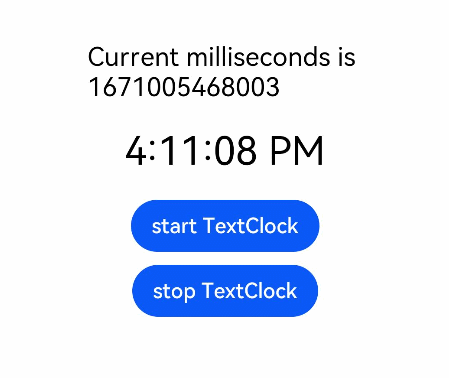

# TextClock

The **\<TextClock>** component displays the current system time in text format for different time zones. The time is accurate to seconds.

>**NOTE**
>
>This component is supported since API version 8. Updates will be marked with a superscript to indicate their earliest API version.

## Child Components

Not supported

## APIs

TextClock(options?: { timeZoneOffset?: number, controller?: TextClockController })

**Parameters**

| Name           | Type     | Mandatory    | Description                                                    |
| -------------- | -------- | ------ | --------------------------------------------------------------------------- |
| timeZoneOffset | number   | No    | Time zone offset.<br>The value range is [-14, 12], indicating UTC+12 to UTC-12. A negative value indicates Eastern Standard Time, and a positive value indicates Western Standard Time. For example, **-8** indicates UTC+8.<br>For countries or regions crossing the International Date Line, use -13 (UTC+13) and -14 (UTC+14) to ensure consistent time within the entire country or region. If the set value is not within the valid range, the time zone offset of the current system will be used.<br>Default value: time zone offset of the current system|
| controller     | [TextClockController](#textclockcontroller) | No     | Controller to control the status of the **<TextClock\>** component.|

## Attributes

In addition to the [universal attributes](ts-universal-attributes-size.md), the following attributes are supported.

| Name  | Type   | Description                                                        |
| ------ | --------------- | ------------------------------------------------------------ |
| format | string    | Time format.<br>The date separator is a slash (/), and the time separator is a colon (:).<br>For example, yyyyMMdd and yyyy-MM-dd are displayed as yyyy/MM/dd,<br>and hhmmss is displayed as hh:mm:ss.<br>Only one digit is required for the time format. This means that **"hhmmss"** is equivalent to **"hms"**.<br>Supported time format strings:<br>- YYYY/yyyy: four-digit year<br>- YY/yy: last two digits of year<br>- M: one-digit month (MM for two-digit month, for example, 01)<br>- d: one-digit day (dd for two-digit day, for example, 01)<br>- D: number of days that have elapsed in the year<br>- H: 24-hour format<br>- h: 12-hour format<br>- m: minute<br>- s: second<br>- SSS: millisecond<br>If the specified format does not match the supported formats, the default value is used.<br>Default value: **'hms'**|

## Events

In addition to the [universal events](ts-universal-events-click.md), the following events are supported.

| Name                                        | Description                                                    |
| -------------------------------------------- | ------------------------------------------------------------ |
| onDateChange(event: (value: number) => void) | Called when the time changes in seconds at minimum.<br>- **value**: Unix time stamp, which is the number of milliseconds that have elapsed since the Unix epoch.|

## TextClockController

Implements the controller of the **\<TextClock>** component. You can bind the controller to the component to control its start and stop. A **\<TextClock>** component can be bound to only one controller.

### Objects to Import

```ts
controller: TextClockController = new TextClockController();
```

### start

start()

Starts the **<TextClock\>** component.

### stop

stop()

Stops the **<TextClock\>** component.

## Example

```ts
@Entry
@Component
struct Second {
  @State accumulateTime: number = 0
  // Objects to import
  controller: TextClockController = new TextClockController()
  build() {
    Flex({ direction: FlexDirection.Column, alignItems: ItemAlign.Center, justifyContent: FlexAlign.Center }) {
      Text('Current milliseconds is ' + this.accumulateTime)
        .fontSize(20)
      // Display the system time in 12-hour format for the UTC+8 time zone, accurate to seconds.
      TextClock({ timeZoneOffset: -8, controller: this.controller })
        .format('hms')
        .onDateChange((value: number) => {
          this.accumulateTime = value
        })
        .margin(20)
        .fontSize(30)
      Button("start TextClock")
        .margin({ bottom: 10 })
        .onClick(() => {
          // Start the text clock.
          this.controller.start()
        })
      Button("stop TextClock")
        .onClick(() => {
          // Stop the text clock.
          this.controller.stop()
        })
    }
    .width('100%')
    .height('100%')
  }
}
```

