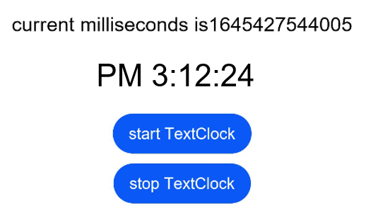

# TextClock

> **NOTE**<br>
> This component is supported since API version 8. Updates will be marked with a superscript to indicate their earliest API version.

The **<TextClock\>** component displays the current system time in text format for different time zones. The time is accurate to seconds.

## Required Permissions

None

## Child Components

None

## APIs

TextClock(options?: {timeZoneOffset?: number, contorller?: TextClockController})

- Parameters

  | Name  | Type | Mandatory | Default Value          | Description                                                |
  | -------- | -------- | ---- | ------------------ | ------------------------------------------------------------ |
  | timeZoneOffset | number   | No  | Time zone offset| Sets the time zone offset. The value range is [-14, 12], indicating UTC+12 to UTC-12. A negative value indicates Eastern Standard Time, and a positive value indicates Western Standard Time. For example, **-8** indicates UTC+8. For countries or regions crossing the International Date Line, use -13 (UTC+13) and -14 (UTC+14) to ensure consistent time within the entire country or region. |
  | contorller | [TextClockContorller](#TextClockController) | No| null | Binds a controller to control the status of the **<TextClock\>** component. |

## Attributes

| Name  | Type| Default Value  | Description                                                        |
| ------ | -------- | -------- | ------------------------------------------------------------ |
| format | string   | 'hhmmss' | Time format, for example, **yyyy/mm/dd** or **yyyy-mm-dd**. Supported time format strings: <ul><li>yyyy (year)</li> <li>mm (two-letter abbreviated month name)</li> <li>mmm (three-letter abbreviated month name)</li> <li>mmmm (full month name)</li> <li>dd (two-letter abbreviated day of the week)</li> <li>ddd (three-letter abbreviated day of the week)</li> <li>dddd (full day of the week)</li> <li>HH (24-hour format)</li> <li>hh (12-hour format)</li> <li>MM/mm (minute)</li> <li>SS/ss (second)</li></ul>|

## Events

| Name                                         | Description                                                  |
| -------------------------------------------- | ------------------------------------------------------------ |
| onDateChange(event: (value: number) => void) | Triggered when the time changes in seconds at minimum.<br> **value**: Unix time stamp, which is the number of milliseconds that have elapsed since the Unix epoch. |

## TextClockController

Controller of the **<TextClock\>** component, which can be bound to the component for status control.

### Objects to Import

```
controller: TextClockController = new TextClockController()

```

### start

start()

Starts the **<TextClock\>** component.

### stop

stop()

Stops the **<TextClock\>** component.


## Example

```
@Entry
@Component
struct Second {
  @State accumulateTime: number = 0
  controller: TextClockController = new TextClockController()

  build() {
      Flex({ direction: FlexDirection.Column, alignItems: ItemAlign.Center, justifyContent: FlexAlign.Center}) {
        Text('current milliseconds is' + this.accumulateTime)
          .fontSize(20)
        TextClock({timeZoneOffset: -8, controller: this.controller})
          .format('hhmmss')
          .onDateChange((value: number) => {
            this.accumulateTime = value
          })
          .margin(20)
          .fontSize(30)
        Button("start TextClock")
          .margin({ bottom: 10 })
          .onClick(()=>{
            this.controller.start()
          })
        Button("stop TextClock")
          .onClick(()=>{
            this.controller.stop()
          })
      }
    .width('100%')
    .height('100%')
  }
}
```

