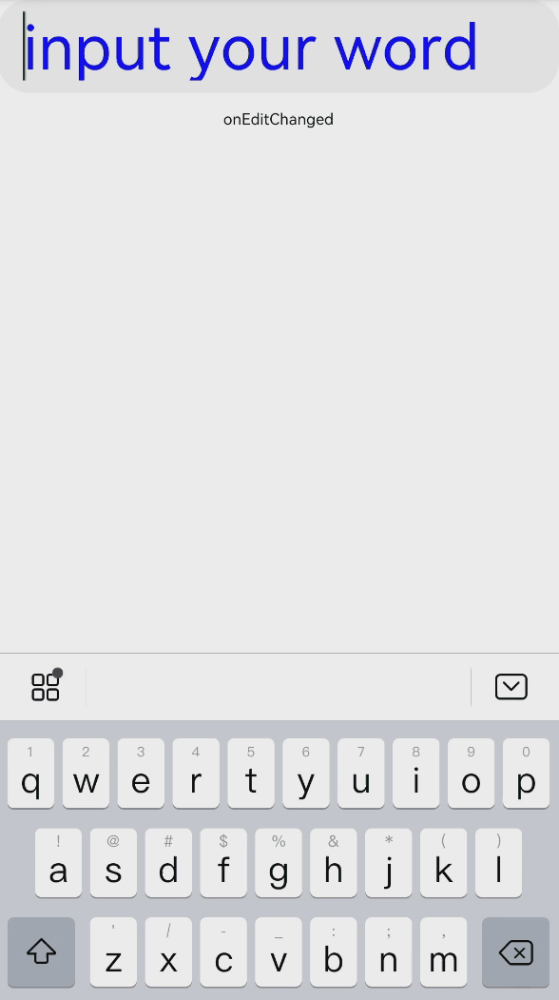
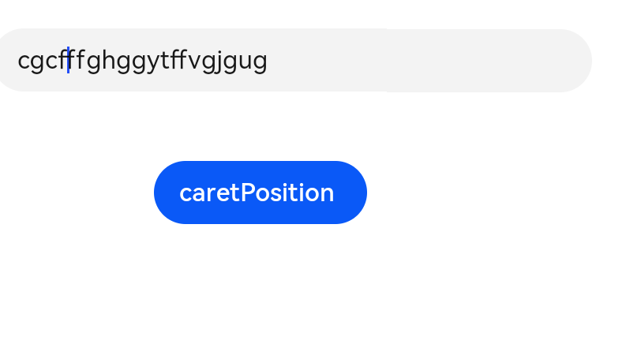

# TextInput

The **\<TextInput>** component provides single-line text input.

>  **NOTE**
>
>  This component is supported since API version 7. Updates will be marked with a superscript to indicate their earliest API version.


## Child Components

Not supported


## APIs

TextInput(value?:{placeholder?: [ResourceStr](ts-types.md#resourcestr8), text?: [ResourceStr](ts-types.md#resourcestr8), controller?: TextInputController})

**Parameters**

| Name                    | Type                                    | Mandatory  | Description           |
| ----------------------- | ---------------------------------------- | ---- | --------------- |
| placeholder   | [ResourceStr](ts-types.md#resourcestr8)      | No   | Text displayed when there is no input.     |
| text          | [ResourceStr](ts-types.md#resourcestr8)      | No   | Current text input.    |
| controller<sup>8+</sup> | [TextInputController](#textinputcontroller8) | No   | Text input controller.|


## Attributes

In addition to the universal attributes, the following attributes are supported.

| Name                      | Type                                    | Description                                      |
| ------------------------ | ---------------------------------------- | ---------------------------------------- |
| type                     | InputType                                | Input box type.<br>Default value: **InputType.Normal**       |
| placeholderColor         | [ResourceColor](ts-types.md#resourcecolor8)    | Placeholder text color.|
| placeholderFont          | [Font](ts-types.md#font) | Placeholder text style.|
| enterKeyType             | EnterKeyType                             | How the Enter key is labeled.<br>Default value: **EnterKeyType.Done**   |
| caretColor               | [ResourceColor](ts-types.md#resourcecolor8)   | Color of the caret in the text box.                              |
| maxLength                | number                                   | Maximum number of characters in the text input.                           |
| inputFilter<sup>8+</sup>      | {<br>value: value:&nbsp;[ResourceStr](ts-types.md#resourcestr8)<sup>8+</sup>,<br>error?: (value: string) =&gt; void<br>} | Regular expression for input filtering. Only inputs that comply with the regular expression can be displayed. Other inputs are ignored. The specified regular expression can match single characters, but not strings. Example: ^(?=.\*\d)(?=.\*[a-z])(?=.\*[A-Z]).{8,10}$. Strong passwords containing 8 to 10 characters cannot be filtered.<br>- **value**: regular expression to set.<br>- **error**: ignored content to return when regular expression matching fails.|

## EnterKeyType

| Name                 | Description       |
| ------------------- | --------- |
| Go     | The Enter key is labeled "Go."  |
| Search | The Enter key is labeled "Search." |
| Send   | The Enter key is labeled "Send." |
| Next   | The Enter key is labeled "Next."|
| Done   | The Enter key is labeled "Done."    |

## InputType enums

| Name                | Description           |
| ------------------ | ------------- |
| Normal   | Normal input mode. |
| Password | Password input mode.      |
| Email    | Email address input mode.|
| Number   | Digit input mode.     |

## Event

| Name                                      | Description                                    |
| ---------------------------------------- | ---------------------------------------- |
| onChange(callback: (value: string) =&gt; void) | Triggered when the input changes.             |
| onSubmit(callback: (enterKey: EnterKeyType) =&gt; void) | Triggered when the Enter key on the physical or soft keyboard is pressed.         |
| onEditChanged(callback: (isEditing: boolean) =&gt; void)<sup>(deprecated) </sup> | Triggered when the input status changes.                           |
| onEditChange(callback: (isEditing: boolean) =&gt; void) <sup>8+</sup> | Triggered when the input status changes.                           |
| onCopy<sup>8+</sup>(callback:(value: string) =&gt; void) | Triggered when the copy button on the pasteboard, which displays when the text box is long pressed, is clicked.<br>**value**: text to be copied.|
| onCut<sup>8+</sup>(callback:(value: string) =&gt; void) | Triggered when the cut button on the pasteboard, which displays when the text box is long pressed, is clicked.<br>**value**: text to be cut.|
| onPaste<sup>8+</sup>(callback:(value: string) =&gt; void) | Triggered when the paste button on the pasteboard, which displays when the text box is long pressed, is clicked.<br>**value**: text to be pasted.|

## TextInputController<sup>8+</sup>

Implements the controller of the **\<TextInput>** component.

### Objects to Import
```
controller: TextInputController = new TextInputController()
```
### caretPosition

caretPosition(value: number): void

Sets the position of the caret.

**Parameters**

| Name| Type| Mandatory| Description                              |
| ------ | -------- | ---- | -------------------------------------- |
| value  | number   | Yes  | Length from the start of the string to the position where the caret is located.|


## Example


### Single-line Text Input

```ts
// xxx.ets
@Entry
@Component
struct TextInputExample1 {
  @State text: string = ''

  build() {
    Column() {
      TextInput({ placeholder: 'input your word' })
        .placeholderColor("rgb(0,0,225)")
        .placeholderFont({ size: 30, weight: 100, family: 'cursive', style: FontStyle.Italic })
        .caretColor(Color.Blue)
        .height(50)
        .fontSize(30)
        .fontWeight(FontWeight.Bold)
        .fontFamily("sans-serif")
        .fontStyle(FontStyle.Normal)
        .fontColor(Color.Red)
        .onChange((value: string) => {
          this.text = value
        })
      Text(this.text).width('90%')
    }
  }
}
```





### Setting the Caret

```ts
// xxx.ets
@Entry
@Component
struct TextInputExample2 {
    @State text: string = ''
    controller: TextInputController = new TextInputController()
    build() {
        Column() {
            TextInput({ placeholder: 'Please input your words.', controller:this.controller})
            Button('caretPosition')
                .onClick(() => {
                this.controller.caretPosition(4)
            })
        }
    }
}
```


