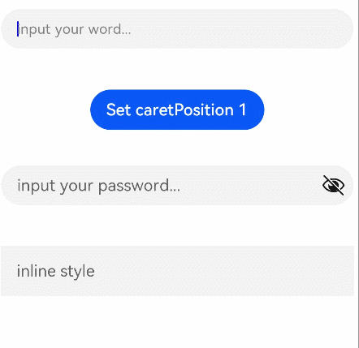

# TextInput

The **\<TextInput>** component provides single-line text input.

>  **NOTE**
>
>  This component is supported since API version 7. Updates will be marked with a superscript to indicate their earliest API version.


## Child Components

Not supported


## APIs

TextInput(value?:{placeholder?: ResourceStr, text?: ResourceStr, controller?: TextInputController})

**Parameters**

| Name                    | Type                                    | Mandatory  | Description           |
| ----------------------- | ---------------------------------------- | ---- | --------------- |
| placeholder   | [ResourceStr](ts-types.md#resourcestr)       | No   | Placeholder text displayed when there is no input.     |
| text          | [ResourceStr](ts-types.md#resourcestr)       | No   | Current text input.    |
| controller<sup>8+</sup> | [TextInputController](#textinputcontroller8) | No   | Text input controller.|


## Attributes

In addition to the [universal attributes](ts-universal-attributes-size.md), the following attributes are supported.

| Name                      | Type                                    | Description                                      |
| ------------------------ | ---------------------------------------- | ---------------------------------------- |
| type                     | InputType                                | Input box type.<br>Default value: **InputType.Normal**       |
| placeholderColor         | [ResourceColor](ts-types.md#resourcecolor)     | Placeholder text color.|
| placeholderFont          | [Font](ts-types.md#font) | Placeholder text font.|
| enterKeyType             | EnterKeyType                             | Type of the Enter key. Currently, only the default value is supported.<br>Default value: **EnterKeyType.Done**|
| caretColor               | [ResourceColor](ts-types.md#resourcecolor)    | Color of the caret in the text box.                              |
| maxLength                | number                                   | Maximum number of characters in the text input.                           |
| inputFilter<sup>8+</sup> | {<br>value: [ResourceStr](ts-types.md#resourcestr),<br>error?: (value: string) =&gt; void<br>} | Regular expression for input filtering. Only inputs that comply with the regular expression can be displayed. Other inputs are filtered out. The specified regular expression can match single characters, but not strings.<br>- **value**: regular expression to set.<br>- **error**: filtered-out content to return when regular expression matching fails.|
| copyOption<sup>9+</sup>  | [CopyOptions](ts-appendix-enums.md#copyoptions9) | Whether copy and paste is allowed.|
| showPasswordIcon<sup>9+</sup> | boolean | Whether to display the show password icon at the end of the password text box.<br>Default value: **true**|
| style<sup>9+</sup> | TextInputStyle | Text input style.<br>Default value: **TextInputStyle.Default**|
| textAlign<sup>9+</sup>   | [TextAlign](ts-appendix-enums.md#textalign) | Alignment mode of the text in the text box.<br>Default value: **TextAlign.Start** |

## EnterKeyType

| Name                 | Description       |
| ------------------- | --------- |
| Go     | The Enter key is labeled "Go."  |
| Search | The Enter key is labeled "Search." |
| Send   | The Enter key is labeled "Send." |
| Next   | The Enter key is labeled "Next."|
| Done   | The Enter key is labeled "Done."    |

## InputType enums

| Name                | Description           |
| ------------------ | ------------- |
| Normal   | Normal input mode.<br>The value can contain digits, letters, underscores (_), spaces, and special characters.|
| Password | Password input mode.      |
| Email    | Email address input mode.|
| Number   | Digit input mode.     |
| PhoneNumber<sup>9+</sup> | Phone number input mode.<br>The value can contain digits, plus signs (+), hyphens (-), asterisks (*), and number signs (#). The length is not limited.|

## TextInputStyle<sup>9+</sup>

| Name                | Description           |
| ------------------ | ------------- |
| Default   | Default style. The caret width is fixed at 1.5 vp, and the caret height is subject to the background height and font size of the selected text.  |
| Inline    | Inline input style. The background height of the selected text is the same as the height of the text box.     |

## Event

In addition to the [universal events](ts-universal-events-click.md), the following events are supported.

| Name                                      | Description                                    |
| ---------------------------------------- | ---------------------------------------- |
| onChange(callback: (value: string) =&gt; void) | Triggered when the input changes.             |
| onSubmit(callback: (enterKey: EnterKeyType) =&gt; void) | Triggered when the Enter key on the keyboard is pressed. The return value is the current type of the Enter key.         |
| onEditChanged(callback: (isEditing: boolean) =&gt; void)<sup>(deprecated)</sup> | Triggered when the input status changes. Sicne API version 8, **onEditChange** is recommended.         |
| onEditChange(callback: (isEditing: boolean) =&gt; void)<sup>8+</sup> | Triggered when the input status changes. If the value of **isEditing** is **true**, text input is in progress.       |
| onCopy(callback:(value: string) =&gt; void)<sup>8+</sup> | Triggered when the copy button on the pasteboard, which displays when the text box is long pressed, is clicked.<br>**value**: text to be copied.|
| onCut(callback:(value: string) =&gt; void)<sup>8+</sup> | Triggered when the cut button on the pasteboard, which displays when the text box is long pressed, is clicked.<br>**value**: text to be cut.|
| onPaste(callback:(value: string) =&gt; void)<sup>8+</sup> | Triggered when the paste button on the pasteboard, which displays when the text box is long pressed, is clicked.<br>**value**: text to be pasted.|

## TextInputController<sup>8+</sup>

Implements the controller of the **\<TextInput>** component.

### Objects to Import
```
controller: TextInputController = new TextInputController()
```
### caretPosition

caretPosition(value: number): void

Sets the position of the caret.

**Parameters**

| Name| Type| Mandatory| Description                              |
| ------ | -------- | ---- | -------------------------------------- |
| value  | number   | Yes  | Length from the start of the string to the position where the caret is located.|


## Example

```ts
// xxx.ets
@Entry
@Component
struct TextInputExample {
  @State text: string = ''
  controller: TextInputController = new TextInputController()

  build() {
    Column() {
      TextInput({ placeholder: 'input your word...', controller: this.controller })
        .placeholderColor(Color.Grey)
        .placeholderFont({ size: 14, weight: 400 })
        .caretColor(Color.Blue)
        .width(400)
        .height(40)
        .margin(20)
        .fontSize(14)
        .fontColor(Color.Black)
        .onChange((value: string) => {
          this.text = value
        })
      Text(this.text)
      Button('Set caretPosition 1')
        .margin(15)
        .onClick(() => {
          // Move the caret to after the first entered character.
          this.controller.caretPosition(1)
        })
      // Password text box.
      TextInput({ placeholder: 'input your password...' })
        .width(400)
        .height(40)
        .margin(20)
        .type(InputType.Password)
        .maxLength(9)
        .showPasswordIcon(true)
      // Inline-style text box.
      TextInput({ placeholder: 'inline style' })
        .width(400)
        .height(50)
        .margin(20)
        .borderRadius(0)
        .style(TextInputStyle.Inline)
    }.width('100%')
  }
}
```


