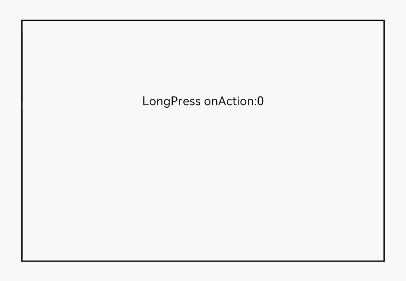

# LongPressGesture

**LongPressGesture** is used to trigger a long press gesture, which requires one or more fingers with a minimum 500 ms hold-down time.

>  **NOTE**
>
>  This gesture is supported since API version 7. Updates will be marked with a superscript to indicate their earliest API version.


## APIs

LongPressGesture(value?: { fingers?: number, repeat?: boolean, duration?: number })

**Parameters**

| Name| Type| Mandatory| Description|
| -------- | -------- | -------- | -------- |
| fingers | number | No| Minimum number of fingers to trigger a long press gesture. The value ranges from 1 to 10.<br>Default value: **1**|
| repeat | boolean | No| Whether to continuously trigger the event callback.<br>Default value: **false**|
| duration | number | No| Minimum hold-down time, in ms.<br>Default value: **500**|


## Events

| Name| Description|
| -------- | -------- |
| onAction(event:(event?: [GestureEvent](ts-gesture-settings.md#gestureevent)) =&gt; void) | Invoked when a long press gesture is recognized.|
| onActionEnd(event:(event?: [GestureEvent](ts-gesture-settings.md#gestureevent)) =&gt; void) | Invoked when the finger used for a long press gesture is lift.|
| onActionCancel(event: () =&gt; void) | Invoked when a tap cancellation event is received after a long press gesture is recognized.|


## Example

```ts
// xxx.ets
@Entry
@Component
struct LongPressGestureExample {
  @State count: number = 0

  build() {
    Column() {
      Text('LongPress onAction:' + this.count).fontSize(28)
        // Touch and hold the text with one finger to trigger the gesture event.
        .gesture(
        LongPressGesture({ repeat: true })
          // When repeat is set to true, the event callback is triggered continuously when the gesture is detected. The triggering interval is specified by duration (500 ms by default).
          .onAction((event: GestureEvent) => {
            if (event.repeat) {
              this.count++
            }
          })
            // Triggered when the long press gesture ends.
          .onActionEnd(() => {
            this.count = 0
          })
        )
    }
    .height(200)
    .width(300)
    .padding(20)
    .border({ width: 3 })
    .margin(30)
  }
}
```


