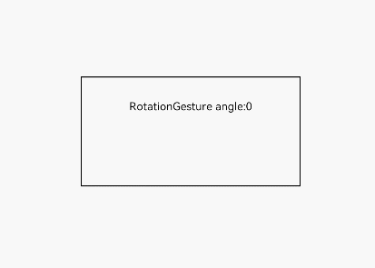

# RotationGesture<a name="EN-US_TOPIC_0000001159258801"></a>

## APIs<a name="section46581530142116"></a>

RotationGesture\(options?: \{ fingers?: number, angle?: number \}\)

-   Parameters

    <a name="table932781715123"></a>
    <table><thead align="left"><tr id="row1333463916149"><th class="cellrowborder" valign="top" width="13.639999999999999%" id="mcps1.1.6.1.1"><p id="p43281617131211"><a name="p43281617131211"></a><a name="p43281617131211"></a>Name</p>
    </th>
    <th class="cellrowborder" valign="top" width="13.11%" id="mcps1.1.6.1.2"><p id="p10329101721217"><a name="p10329101721217"></a><a name="p10329101721217"></a>Type</p>
    </th>
    <th class="cellrowborder" valign="top" width="10.27%" id="mcps1.1.6.1.3"><p id="p16330171731218"><a name="p16330171731218"></a><a name="p16330171731218"></a>Mandatory</p>
    </th>
    <th class="cellrowborder" valign="top" width="9.64%" id="mcps1.1.6.1.4"><p id="p143311717141217"><a name="p143311717141217"></a><a name="p143311717141217"></a>Default Value</p>
    </th>
    <th class="cellrowborder" valign="top" width="53.339999999999996%" id="mcps1.1.6.1.5"><p id="p93324175121"><a name="p93324175121"></a><a name="p93324175121"></a>Description</p>
    </th>
    </tr>
    </thead>
    <tbody><tr id="row1433516398146"><td class="cellrowborder" valign="top" width="13.639999999999999%" headers="mcps1.1.6.1.1 "><p id="p4332191717121"><a name="p4332191717121"></a><a name="p4332191717121"></a>fingers</p>
    </td>
    <td class="cellrowborder" valign="top" width="13.11%" headers="mcps1.1.6.1.2 "><p id="p1433318173127"><a name="p1433318173127"></a><a name="p1433318173127"></a>number</p>
    </td>
    <td class="cellrowborder" valign="top" width="10.27%" headers="mcps1.1.6.1.3 "><p id="p193349174125"><a name="p193349174125"></a><a name="p193349174125"></a>No</p>
    </td>
    <td class="cellrowborder" valign="top" width="9.64%" headers="mcps1.1.6.1.4 "><p id="p113355171122"><a name="p113355171122"></a><a name="p113355171122"></a>2</p>
    </td>
    <td class="cellrowborder" valign="top" width="53.339999999999996%" headers="mcps1.1.6.1.5 "><p id="p833614175126"><a name="p833614175126"></a><a name="p833614175126"></a>Minimum number of fingers to trigger a rotation. The value ranges from 2 to 5.</p>
    </td>
    </tr>
    <tr id="row8335239171414"><td class="cellrowborder" valign="top" width="13.639999999999999%" headers="mcps1.1.6.1.1 "><p id="p183371017151212"><a name="p183371017151212"></a><a name="p183371017151212"></a>angle</p>
    </td>
    <td class="cellrowborder" valign="top" width="13.11%" headers="mcps1.1.6.1.2 "><p id="p1533851710127"><a name="p1533851710127"></a><a name="p1533851710127"></a>number</p>
    </td>
    <td class="cellrowborder" valign="top" width="10.27%" headers="mcps1.1.6.1.3 "><p id="p17339517201212"><a name="p17339517201212"></a><a name="p17339517201212"></a>No</p>
    </td>
    <td class="cellrowborder" valign="top" width="9.64%" headers="mcps1.1.6.1.4 "><p id="p8340171711125"><a name="p8340171711125"></a><a name="p8340171711125"></a>1.0</p>
    </td>
    <td class="cellrowborder" valign="top" width="53.339999999999996%" headers="mcps1.1.6.1.5 "><p id="p934101751214"><a name="p934101751214"></a><a name="p934101751214"></a>Minimum degree that can trigger the rotation gesture.</p>
    </td>
    </tr>
    </tbody>
    </table>


## Events<a name="section171844635610"></a>

<a name="table135406579437"></a>
<table><thead align="left"><tr id="row1154015719436"><th class="cellrowborder" colspan="2" valign="top" id="mcps1.1.4.1.1"><p id="p85411457184316"><a name="p85411457184316"></a><a name="p85411457184316"></a>Name</p>
</th>
<th class="cellrowborder" valign="top" id="mcps1.1.4.1.2"><p id="p5541457194319"><a name="p5541457194319"></a><a name="p5541457194319"></a>Description</p>
</th>
</tr>
</thead>
<tbody><tr id="row4541257114319"><td class="cellrowborder" colspan="2" valign="top" headers="mcps1.1.4.1.1 "><p id="p5541357194313"><a name="p5541357194313"></a><a name="p5541357194313"></a>onActionStart((event?: <a href="ts-gesture-settings.md#table290mcpsimp">GestureEvent</a>) =&gt; void)</p>
</td>
<td class="cellrowborder" valign="top" headers="mcps1.1.4.1.2 "><p id="p11541155710434"><a name="p11541155710434"></a><a name="p11541155710434"></a>Callback invoked when a rotation gesture is recognized.</p>
</td>
</tr>
<tr id="row54544191113"><td class="cellrowborder" colspan="2" valign="top" headers="mcps1.1.4.1.1 "><p id="p145591931117"><a name="p145591931117"></a><a name="p145591931117"></a>onActionUpdate((event?: <a href="ts-gesture-settings.md#table290mcpsimp">GestureEvent</a>) =&gt; void)</p>
</td>
<td class="cellrowborder" valign="top" headers="mcps1.1.4.1.2 "><p id="p1455111961111"><a name="p1455111961111"></a><a name="p1455111961111"></a>Callback invoked during the movement of the rotation gesture.</p>
</td>
</tr>
<tr id="row2899841162916"><td class="cellrowborder" colspan="2" valign="top" headers="mcps1.1.4.1.1 "><p id="p15900174162916"><a name="p15900174162916"></a><a name="p15900174162916"></a>onActionEnd((event?: <a href="ts-gesture-settings.md#table290mcpsimp">GestureEvent</a>) =&gt; void)</p>
</td>
<td class="cellrowborder" valign="top" headers="mcps1.1.4.1.2 "><p id="p69001041172920"><a name="p69001041172920"></a><a name="p69001041172920"></a>Callback invoked when the finger used for the rotation gesture is lift.</p>
</td>
</tr>
<tr id="row13598134672914"><td class="cellrowborder" colspan="2" valign="top" headers="mcps1.1.4.1.1 "><p id="p85999460299"><a name="p85999460299"></a><a name="p85999460299"></a>onActionCancel(event: () =&gt; void)</p>
</td>
<td class="cellrowborder" valign="top" headers="mcps1.1.4.1.2 "><p id="p1459954652916"><a name="p1459954652916"></a><a name="p1459954652916"></a>Callback invoked when a tap cancellation event is received after the rotation gesture is recognized.</p>
</td>
</tr>
</tbody>
</table>

## Example<a name="section16900453182718"></a>

```
@Entry
@Component
struct RotationGestureExample {
  @State angle: number = 0

  build() {
    Flex({ direction: FlexDirection.Column, alignItems: ItemAlign.Center, justifyContent: FlexAlign.SpaceBetween }) {
      Text('RotationGesture angle:' + this.angle)
    }
    .height(100).width(200).padding(20).border({ width:1 })
    .margin(80).rotate({ x:1, y:2, z:3, angle: this.angle })
    .gesture(
      RotationGesture()
        .onActionStart((event: GestureEvent) => {
          console.log('Rotation start')
        })
        .onActionUpdate((event: GestureEvent) => {
          this.angle = event.angle
        })
        .onActionEnd(() => {
          console.log('Rotation end')
        })
    )
  }
}
```



