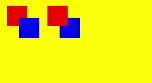
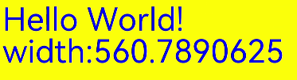
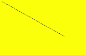
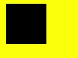
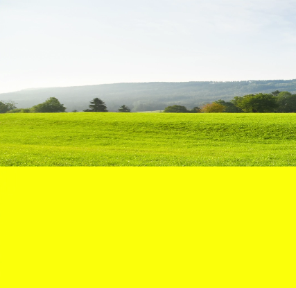
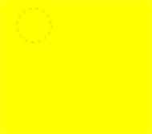

# CanvasRenderingContext2D

Use **RenderingContext** to draw rectangles, text, images, and other objects on a canvas.

> **NOTE**
>
> The APIs of this module are supported since API version 8. Updates will be marked with a superscript to indicate their earliest API version.


## APIs

CanvasRenderingContext2D(setting: RenderingContextSetting)

**Parameters**

| Name    | Type                                    | Mandatory  | Description                                    |
| ------- | ---------------------------------------- | ---- | ---------------------------------------- |
| setting | [RenderingContextSettings](#renderingcontextsettings) | Yes   | See [RenderingContextSettings](#renderingcontextsettings).|


### RenderingContextSettings

RenderingContextSettings(antialias?: boolean)

Configures the settings of a **CanvasRenderingContext2D** object, including whether to enable antialiasing.

**Parameters**

| Name      | Type   | Mandatory  | Description                         |
| --------- | ------- | ---- | ----------------------------- |
| antialias | boolean | No   | Whether antialiasing is enabled.<br>Default value: **false**|


## Attributes

| Name                                      | Type                                      | Description                                      |
| ---------------------------------------- | ---------------------------------------- | ---------------------------------------- |
| [fillStyle](#fillstyle)                  | string \| [CanvasGradient](ts-components-canvas-canvasgradient.md) \| [CanvasPattern](#canvaspattern) | Style to fill an area.<br>- When the type is string, this attribute indicates the color of the fill area.<br>- When the type is **CanvasGradient**, this attribute indicates a gradient object, which is created using the **[createLinearGradient](#createlineargradient)** API.<br>- When the type is **CanvasPattern**, this attribute indicates a pattern, which is created using the **[createPattern](#createpattern)** API.|
| [lineWidth](#linewidth)                  | number                                   | Line width.                              |
| [strokeStyle](#strokestyle)              | string \| [CanvasGradient](ts-components-canvas-canvasgradient.md) \| [CanvasPattern](#canvaspattern) | Stroke style.<br>- When the type is string, this attribute indicates the stroke color.<br>- When the type is **CanvasGradient**, this attribute indicates a gradient object, which is created using the **[createLinearGradient](#createlineargradient)** API.<br>- When the type is **CanvasPattern**, this attribute indicates a pattern, which is created using the **[createPattern](#createpattern)** API.|
| [lineCap](#linecap)                      | CanvasLineCap                            | Style of the line endpoints. The options are as follows:<br>- **'butt'**: The endpoints of the line are squared off.<br>- **'round'**: The endpoints of the line are rounded.<br>- **'square'**: The endpoints of the line are squared off by adding a box with an equal width and half the height of the line's thickness.<br>Default value: **'butt'**|
| [lineJoin](#linejoin)                    | CanvasLineJoin                           | Style of the shape used to join line segments. The options are as follows:<br>- **'round'**: The shape used to join line segments is a sector, whose radius at the rounded corner is equal to the line width.<br>- **'bevel'**: The shape used to join line segments is a triangle. The rectangular corner of each line is independent.<br>- **'miter'**: The shape used to join line segments has a mitered corner by extending the outside edges of the lines until they meet. You can view the effect of this attribute in **miterLimit**.<br>Default value: **'miter'**|
| [miterLimit](#miterlimit)                | number                                   | Maximum miter length. The miter length is the distance between the inner corner and the outer corner where two lines meet.<br>Default value: **10**|
| [font](#font)                            | string                                   | Font style.<br>Syntax: ctx.font='font-size font-family'<br>- (Optional) **font-size**: font size and row height. The unit can only be pixels.<br>- (Optional) **font-family**: font family.<br>Syntax: ctx.font='font-style font-weight font-size font-family'<br>- (Optional) **font-style**: font style. Available values are **'normal'** and **'italic'**.<br>- (Optional) **font-weight**: font weight. Available values are as follows: **'normal'**, **'bold'**, **'bolder'**, **'lighter'**, **'100'**, **'200'**, **'300'**, **'400'**, **'500'**, **'600'**, **'700'**, **'800'**, **'900'**.<br>- (Optional) **font-size**: font size and row height. The unit can only be pixels.<br>- (Optional) **font-family**: font family. Available values are **'sans-serif'**, **'serif'**, and **'monospace'**.<br>Default value: **'normal normal 14px sans-serif'**|
| [textAlign](#textalign)                  | CanvasTextAlign                          | Text alignment mode. Available values are as follows:<br>- **'left'**: The text is left-aligned.<br>- **'right'**: The text is right-aligned.<br>- **'center'**: The text is center-aligned.<br>- **'start'**: The text is aligned with the start bound.<br>- **'end'**: The text is aligned with the end bound.<br>In the **ltr** layout mode, the value **'start'** equals **'left'**. In the **rtl** layout mode, the value **'start'** equals **'right'**.<br>Default value: **'left'**|
| [textBaseline](#textbaseline)            | CanvasTextBaseline                       | Horizontal alignment mode of text. Available values are as follows:<br>- **'alphabetic'**: The text baseline is the normal alphabetic baseline.<br>- **'top'**: The text baseline is on the top of the text bounding box.<br>- **'hanging'**: The text baseline is a hanging baseline over the text.<br>- **'middle'**: The text baseline is in the middle of the text bounding box.<br>**'ideographic'**: The text baseline is the ideographic baseline. If a character exceeds the alphabetic baseline, the ideographic baseline is located at the bottom of the excess character.<br>- **'bottom'**: The text baseline is at the bottom of the text bounding box. Its difference from the ideographic baseline is that the ideographic baseline does not consider letters in the next line.<br>Default value: **'alphabetic'**|
| [globalAlpha](#globalalpha)              | number                                   | Opacity.<br>**0.0**: completely transparent.<br>**1.0**: completely opaque.               |
| [lineDashOffset](#linedashoffset)        | number                                   | Offset of the dashed line. The precision is float.<br>Default value: **0.0**   |
| [globalCompositeOperation](#globalcompositeoperation) | string                                   | Composition operation type. Available values are as follows: **'source-over'**, **'source-atop'**, **'source-in'**, **'source-out'**, **'destination-over'**, **'destination-atop'**, **'destination-in'**, **'destination-out'**, **'lighter'**, **'copy'**, and **'xor'**.<br>Default value: **'source-over'**|
| [shadowBlur](#shadowblur)                | number                                   | Blur level during shadow drawing. A larger value indicates a more blurred effect. The precision is float.<br>Default value: **0.0**|
| [shadowColor](#shadowcolor)              | string                                   | Shadow color.                           |
| [shadowOffsetX](#shadowoffsetx)          | number                                   | X-axis shadow offset relative to the original object.                     |
| [shadowOffsetY](#shadowoffsety)          | number                                   | Y-axis shadow offset relative to the original object.                     |
| [imageSmoothingEnabled](#imagesmoothingenabled) | boolean                                  | Whether to adjust the image smoothness during image drawing. The value **true** means to enable this feature, and **false** means the opposite.<br>Default value: **true**|

> **NOTE**
>
> The string-type value of **fillStyle**, **shadowColor**, and **strokeStyle** can be in 'rgb(255, 255, 255)', 'rgba(255, 255, 255, 1.0)', or '\#FFFFFF' format.


### fillStyle

```ts
// xxx.ets
@Entry
@Component
struct FillStyleExample {
  private settings: RenderingContextSettings = new RenderingContextSettings(true);
  private context: CanvasRenderingContext2D = new CanvasRenderingContext2D(this.settings);

  build() {
    Flex({ direction: FlexDirection.Column, alignItems: ItemAlign.Center, justifyContent: FlexAlign.Center }) {
      Canvas(this.context)
        .width('100%')
        .height('100%')
        .backgroundColor('#ffff00')
        .onReady(() =>{
          this.context.fillStyle = '#0000ff'
          this.context.fillRect(20, 160, 150, 100)
        })
    }
    .width('100%')
    .height('100%')
  }
}
```


### lineWidth

```ts
// xxx.ets
@Entry
@Component
struct LineWidthExample {
  private settings: RenderingContextSettings = new RenderingContextSettings(true);
  private context: CanvasRenderingContext2D = new CanvasRenderingContext2D(this.settings);

  build() {
    Flex({ direction: FlexDirection.Column, alignItems: ItemAlign.Center, justifyContent: FlexAlign.Center }) {
      Canvas(this.context)
        .width('100%')
        .height('100%')
        .backgroundColor('#ffff00')
        .onReady(() =>{
        this.context.lineWidth = 5
        this.context.strokeRect(25, 25, 85, 105)
      })
    }
    .width('100%')
    .height('100%')
  }
}
```


### strokeStyle

```ts
// xxx.ets
@Entry
@Component
struct StrokeStyleExample {
  private settings: RenderingContextSettings = new RenderingContextSettings(true);
  private context: CanvasRenderingContext2D = new CanvasRenderingContext2D(this.settings);

  build() {
    Flex({ direction: FlexDirection.Column, alignItems: ItemAlign.Center, justifyContent: FlexAlign.Center }) {
      Canvas(this.context)
        .width('100%')
        .height('100%')
        .backgroundColor('#ffff00')
        .onReady(() =>{
          this.context.lineWidth = 10
          this.context.strokeStyle = '#0000ff'
          this.context.strokeRect(25, 25, 155, 105)
        })
    }
    .width('100%')
    .height('100%')
  }
}
```


### lineCap

```ts
// xxx.ets
@Entry
@Component
struct LineCapExample {
  private settings: RenderingContextSettings = new RenderingContextSettings(true);
  private context: CanvasRenderingContext2D = new CanvasRenderingContext2D(this.settings);

  build() {
    Flex({ direction: FlexDirection.Column, alignItems: ItemAlign.Center, justifyContent: FlexAlign.Center }) {
      Canvas(this.context)
        .width('100%')
        .height('100%')
        .backgroundColor('#ffff00')
        .onReady(() =>{
          this.context.lineWidth = 8
          this.context.beginPath()
          this.context.lineCap = 'round'
          this.context.moveTo(30, 50)
          this.context.lineTo(220, 50)
          this.context.stroke()
        })
    }
    .width('100%')
    .height('100%')
  }
}
```


### lineJoin

```ts
// xxx.ets
@Entry
@Component
struct LineJoinExample {
  private settings: RenderingContextSettings = new RenderingContextSettings(true);
  private context: CanvasRenderingContext2D = new CanvasRenderingContext2D(this.settings);

  build() {
    Flex({ direction: FlexDirection.Column, alignItems: ItemAlign.Center, justifyContent: FlexAlign.Center }) {
      Canvas(this.context)
        .width('100%')
        .height('100%')
        .backgroundColor('#ffff00')
        .onReady(() =>{
        this.context.beginPath()
        this.context.lineWidth = 8
        this.context.lineJoin = 'miter'
        this.context.moveTo(30, 30)
        this.context.lineTo(120, 60)
        this.context.lineTo(30, 110)
        this.context.stroke()
      })
    }
    .width('100%')
    .height('100%')
  }
}
```


### miterLimit

```ts
// xxx.ets
@Entry
@Component
struct MiterLimit {
  private settings: RenderingContextSettings = new RenderingContextSettings(true);
  private context: CanvasRenderingContext2D = new CanvasRenderingContext2D(this.settings);
  
  build() {
    Flex({ direction: FlexDirection.Column, alignItems: ItemAlign.Center, justifyContent: FlexAlign.Center }) {
      Canvas(this.context)
        .width('100%')
        .height('100%')
        .backgroundColor('#ffff00')
        .onReady(() =>{
          this.context.lineWidth = 8
          this.context.lineJoin = 'miter'
          this.context.miterLimit = 3
          this.context.moveTo(30, 30)
          this.context.lineTo(60, 35)
          this.context.lineTo(30, 37)
          this.context.stroke()
      })
    }
    .width('100%')
    .height('100%')
  }
}
```


### font

```ts
// xxx.ets
@Entry
@Component
struct Fonts {
  private settings: RenderingContextSettings = new RenderingContextSettings(true);
  private context: CanvasRenderingContext2D = new CanvasRenderingContext2D(this.settings);
  
  build() {
    Flex({ direction: FlexDirection.Column, alignItems: ItemAlign.Center, justifyContent: FlexAlign.Center }) {
      Canvas(this.context)
        .width('100%')
        .height('100%')
        .backgroundColor('#ffff00')
        .onReady(() =>{
          this.context.font = '30px sans-serif'
          this.context.fillText("Hello World", 20, 60)
      })
    }
    .width('100%')
    .height('100%')
  }
}
```


### textAlign

```ts
// xxx.ets
@Entry
@Component
struct CanvasExample {
  private settings: RenderingContextSettings = new RenderingContextSettings(true);
  private context: CanvasRenderingContext2D = new CanvasRenderingContext2D(this.settings);
  
  build() {
    Flex({ direction: FlexDirection.Column, alignItems: ItemAlign.Center, justifyContent: FlexAlign.Center }) {
      Canvas(this.context)
        .width('100%')
        .height('100%')
        .backgroundColor('#ffff00')
        .onReady(() =>{
        this.context.strokeStyle = '#0000ff'
        this.context.moveTo(140, 10)
        this.context.lineTo(140, 160)
        this.context.stroke()

        this.context.font = '18px sans-serif'

        this.context.textAlign = 'start'
        this.context.fillText('textAlign=start', 140, 60)
        this.context.textAlign = 'end'
        this.context.fillText('textAlign=end', 140, 80)
        this.context.textAlign = 'left'
        this.context.fillText('textAlign=left', 140, 100)
        this.context.textAlign = 'center'
        this.context.fillText('textAlign=center',140, 120)
        this.context.textAlign = 'right'
        this.context.fillText('textAlign=right',140, 140)
      })
    }
    .width('100%')
    .height('100%')
  }
}
```


### textBaseline

```ts
// xxx.ets
@Entry
@Component
struct TextBaseline {
  private settings: RenderingContextSettings = new RenderingContextSettings(true);
  private context: CanvasRenderingContext2D = new CanvasRenderingContext2D(this.settings);
  
  build() {
    Flex({ direction: FlexDirection.Column, alignItems: ItemAlign.Center, justifyContent: FlexAlign.Center }) {
      Canvas(this.context)
        .width('100%')
        .height('100%')
        .backgroundColor('#ffff00')
        .onReady(() =>{
          this.context.strokeStyle = '#0000ff'
          this.context.moveTo(0, 120)
          this.context.lineTo(400, 120)
          this.context.stroke()

          this.context.font = '20px sans-serif'

          this.context.textBaseline = 'top'
          this.context.fillText('Top', 10, 120)
          this.context.textBaseline = 'bottom'
          this.context.fillText('Bottom', 55, 120)
          this.context.textBaseline = 'middle'
          this.context.fillText('Middle', 125, 120)
          this.context.textBaseline = 'alphabetic'
          this.context.fillText('Alphabetic', 195, 120)
          this.context.textBaseline = 'hanging'
          this.context.fillText('Hanging', 295, 120)
      })
    }
    .width('100%')
    .height('100%')
  }
}
```


### globalAlpha

```ts
// xxx.ets
@Entry
@Component
struct GlobalAlpha {
  private settings: RenderingContextSettings = new RenderingContextSettings(true);
  private context: CanvasRenderingContext2D = new CanvasRenderingContext2D(this.settings);
  
  build() {
    Flex({ direction: FlexDirection.Column, alignItems: ItemAlign.Center, justifyContent: FlexAlign.Center }) {
      Canvas(this.context)
        .width('100%')
        .height('100%')
        .backgroundColor('#ffff00')
        .onReady(() =>{
        this.context.fillStyle = 'rgb(255,0,0)'
        this.context.fillRect(0, 0, 50, 50)
        this.context.globalAlpha = 0.4
        this.context.fillStyle = 'rgb(0,0,255)'
        this.context.fillRect(50, 50, 50, 50)
      })
    }
    .width('100%')
    .height('100%')
  }
}
```


### lineDashOffset

```ts
// xxx.ets
@Entry
@Component
struct LineDashOffset {
  private settings: RenderingContextSettings = new RenderingContextSettings(true);
  private context: CanvasRenderingContext2D = new CanvasRenderingContext2D(this.settings);
  
  build() {
    Flex({ direction: FlexDirection.Column, alignItems: ItemAlign.Center, justifyContent: FlexAlign.Center }) {
      Canvas(this.context)
        .width('100%')
        .height('100%')
        .backgroundColor('#ffff00')
        .onReady(() =>{
          this.context.arc(100, 75, 50, 0, 6.28)
          this.context.setLineDash([10,20])
          this.context.lineDashOffset = 10.0;
          this.context.stroke();
      })
    }
    .width('100%')
    .height('100%')
  }
}
```


### globalCompositeOperation

| Name              | Description                      |
| ---------------- | ------------------------ |
| source-over      | Displays the new drawing above the existing drawing. This attribute is used by default.  |
| source-atop      | Displays the new drawing on the top of the existing drawing.       |
| source-in        | Displays the new drawing inside the existing drawing.        |
| source-out       | Displays part of the new drawing that is outside of the existing drawing.       |
| destination-over | Displays the existing drawing above the new drawing.       |
| destination-atop | Displays the existing drawing on the top of the new drawing.       |
| destination-in   | Displays the existing drawing inside the new drawing.        |
| destination-out  | Displays the existing drawing outside the new drawing.        |
| lighter          | Displays both the new and existing drawing.         |
| copy             | Displays the new drawing and neglects the existing drawing.       |
| xor              | Combines the new drawing and existing drawing using the XOR operation.|

```ts
// xxx.ets
@Entry
@Component
struct GlobalCompositeOperation {
  private settings: RenderingContextSettings = new RenderingContextSettings(true);
  private context: CanvasRenderingContext2D = new CanvasRenderingContext2D(this.settings);
  
  build() {
    Flex({ direction: FlexDirection.Column, alignItems: ItemAlign.Center, justifyContent: FlexAlign.Center }) {
      Canvas(this.context)
        .width('100%')
        .height('100%')
        .backgroundColor('#ffff00')
        .onReady(() =>{
          this.context.fillStyle = 'rgb(255,0,0)'
          this.context.fillRect(20, 20, 50, 50)
          this.context.globalCompositeOperation = 'source-over'
          this.context.fillStyle = 'rgb(0,0,255)'
          this.context.fillRect(50, 50, 50, 50)
          this.context.fillStyle = 'rgb(255,0,0)'
          this.context.fillRect(120, 20, 50, 50)
          this.context.globalCompositeOperation = 'destination-over'
          this.context.fillStyle = 'rgb(0,0,255)'
          this.context.fillRect(150, 50, 50, 50)
      })
    }
    .width('100%')
    .height('100%')
  }
}
```




### shadowBlur

```ts
// xxx.ets
@Entry
@Component
struct ShadowBlur {
  private settings: RenderingContextSettings = new RenderingContextSettings(true);
  private context: CanvasRenderingContext2D = new CanvasRenderingContext2D(this.settings);
  
  build() {
    Flex({ direction: FlexDirection.Column, alignItems: ItemAlign.Center, justifyContent: FlexAlign.Center }) {
      Canvas(this.context)
        .width('100%')
        .height('100%')
        .backgroundColor('#ffff00')
        .onReady(() =>{
          this.context.shadowBlur = 30
          this.context.shadowColor = 'rgb(0,0,0)'
          this.context.fillStyle = 'rgb(255,0,0)'
          this.context.fillRect(20, 20, 100, 80)
      })
    }
    .width('100%')
    .height('100%')
  }
}
```


### shadowColor

```ts
// xxx.ets
@Entry
@Component
struct ShadowColor {
  private settings: RenderingContextSettings = new RenderingContextSettings(true);
  private context: CanvasRenderingContext2D = new CanvasRenderingContext2D(this.settings);
  
  build() {
    Flex({ direction: FlexDirection.Column, alignItems: ItemAlign.Center, justifyContent: FlexAlign.Center }) {
      Canvas(this.context)
        .width('100%')
        .height('100%')
        .backgroundColor('#ffff00')
        .onReady(() =>{
          this.context.shadowBlur = 30
          this.context.shadowColor = 'rgb(0,0,255)'
          this.context.fillStyle = 'rgb(255,0,0)'
          this.context.fillRect(30, 30, 100, 100)
      })
    }
    .width('100%')
    .height('100%')
  }
}
```


### shadowOffsetX

```ts
// xxx.ets
@Entry
@Component
struct ShadowOffsetX {
  private settings: RenderingContextSettings = new RenderingContextSettings(true);
  private context: CanvasRenderingContext2D = new CanvasRenderingContext2D(this.settings);
  
  build() {
    Flex({ direction: FlexDirection.Column, alignItems: ItemAlign.Center, justifyContent: FlexAlign.Center }) {
      Canvas(this.context)
        .width('100%')
        .height('100%')
        .backgroundColor('#ffff00')
        .onReady(() =>{
          this.context.shadowBlur = 10
          this.context.shadowOffsetX = 20
          this.context.shadowColor = 'rgb(0,0,0)'
          this.context.fillStyle = 'rgb(255,0,0)'
          this.context.fillRect(20, 20, 100, 80)
      })
    }
    .width('100%')
    .height('100%')
  }
}
```


### shadowOffsetY

```ts
// xxx.ets
@Entry
@Component
struct ShadowOffsetY {
  private settings: RenderingContextSettings = new RenderingContextSettings(true);
  private context: CanvasRenderingContext2D = new CanvasRenderingContext2D(this.settings);
  build() {
    Flex({ direction: FlexDirection.Column, alignItems: ItemAlign.Center, justifyContent: FlexAlign.Center }) {
      Canvas(this.context)
        .width('100%')
        .height('100%')
        .backgroundColor('#ffff00')
        .onReady(() =>{
          this.context.shadowBlur = 10
          this.context.shadowOffsetY = 20
          this.context.shadowColor = 'rgb(0,0,0)'
          this.context.fillStyle = 'rgb(255,0,0)'
          this.context.fillRect(30, 30, 100, 100)
      })
    }
    .width('100%')
    .height('100%')
  }
}
```


### imageSmoothingEnabled

```ts
// xxx.ets
@Entry
@Component
struct ImageSmoothingEnabled {
  private settings: RenderingContextSettings = new RenderingContextSettings(true);
  private context: CanvasRenderingContext2D = new CanvasRenderingContext2D(this.settings);
  private img:ImageBitmap = new ImageBitmap("common/images/icon.jpg");
  
  build() {
    Flex({ direction: FlexDirection.Column, alignItems: ItemAlign.Center, justifyContent: FlexAlign.Center }) {
      Canvas(this.context)
        .width('100%')
        .height('100%')
        .backgroundColor('#ffff00')
        .onReady(() =>{
          this.context.imageSmoothingEnabled = false
          this.context.drawImage( this.img,0,0,400,200)
      })
    }
    .width('100%')
    .height('100%')
  }
}
```


## Methods


### fillRect

fillRect(x: number, y: number, w: number, h: number): void

Fills a rectangle on the canvas.

**Parameters**

| Name    | Type    | Mandatory  | Default Value | Description           |
| ------ | ------ | ---- | ---- | ------------- |
| x      | number | Yes   | 0    | X-coordinate of the upper left corner of the rectangle.|
| y      | number | Yes   | 0    | Y-coordinate of the upper left corner of the rectangle.|
| width  | number | Yes   | 0    | Width of the rectangle.     |
| height | number | Yes   | 0    | Height of the rectangle.     |

**Example**

  ```ts
  // xxx.ets
  @Entry
  @Component
  struct FillRect {
    private settings: RenderingContextSettings = new RenderingContextSettings(true);
    private context: CanvasRenderingContext2D = new CanvasRenderingContext2D(this.settings);
    
    build() {
      Flex({ direction: FlexDirection.Column, alignItems: ItemAlign.Center, justifyContent: FlexAlign.Center }) {
        Canvas(this.context)
          .width('100%')
          .height('100%')
          .backgroundColor('#ffff00')
          .onReady(() =>{
            this.context.fillRect(0,30,100,100)
         })
        }
      .width('100%')
      .height('100%')
    }
  }
  ```

  


### strokeRect

strokeRect(x: number, y: number, w: number, h: number): void

Draws an outlined rectangle on the canvas.

**Parameters**

| Name  | Type    | Mandatory  | Default Value | Description          |
| ---- | ------ | ---- | ---- | ------------ |
| x    | number | Yes   | 0    | X-coordinate of the upper left corner of the rectangle.|
| y    | number | Yes   | 0    | Y-coordinate of the upper left corner of the rectangle.|
| w    | number | Yes   | 0    | Width of the rectangle.    |
| h    | number | Yes   | 0    | Height of the rectangle.    |

**Example**

  ```ts
  // xxx.ets
  @Entry
  @Component
  struct StrokeRect {
    private settings: RenderingContextSettings = new RenderingContextSettings(true);
    private context: CanvasRenderingContext2D = new CanvasRenderingContext2D(this.settings);

    build() {
      Flex({ direction: FlexDirection.Column, alignItems: ItemAlign.Center, justifyContent: FlexAlign.Center }) {
        Canvas(this.context)
          .width('100%')
          .height('100%')
          .backgroundColor('#ffff00')
          .onReady(() =>{
            this.context.strokeRect(30, 30, 200, 150)
        })
      }
      .width('100%')
      .height('100%')
    }
  }
  ```

  


### clearRect

clearRect(x: number, y: number, w: number, h: number): void

Clears the content in a rectangle on the canvas.

**Parameters**

| Name  | Type    | Mandatory  | Default Value | Description           |
| ---- | ------ | ---- | ---- | ------------- |
| x    | number | Yes   | 0    | X-coordinate of the upper left corner of the rectangle.|
| y    | number | Yes   | 0    | Y-coordinate of the upper left corner of the rectangle.|
| w    | number | Yes   | 0    | Width of the rectangle.     |
| h    | number | Yes   | 0    | Height of the rectangle.     |

**Example**

  ```ts
  // xxx.ets
  @Entry
  @Component
  struct ClearRect {
    private settings: RenderingContextSettings = new RenderingContextSettings(true);
    private context: CanvasRenderingContext2D = new CanvasRenderingContext2D(this.settings);

    build() {
      Flex({ direction: FlexDirection.Column, alignItems: ItemAlign.Center, justifyContent: FlexAlign.Center }) {
        Canvas(this.context)
          .width('100%')
          .height('100%')
          .backgroundColor('#ffffff')
          .onReady(() =>{
            this.context.fillStyle = 'rgb(0,0,255)'
            this.context.fillRect(20,20,200,200)
            this.context.clearRect(30,30,150,100)
        })
      }
      .width('100%')
      .height('100%')
    }
  }
  ```

  


### fillText

fillText(text: string, x: number, y: number, maxWidth?: number): void

Draws filled text on the canvas.

**Parameters**

| Name      | Type    | Mandatory  | Default Value | Description             |
| -------- | ------ | ---- | ---- | --------------- |
| text     | string | Yes   | ""   | Text to draw.     |
| x        | number | Yes   | 0    | X-coordinate of the lower left corner of the text.|
| y        | number | Yes   | 0    | Y-coordinate of the lower left corner of the text.|
| maxWidth | number | No   | -    | Maximum width allowed for the text.   |

**Example**

  ```ts
  // xxx.ets
  @Entry
  @Component
  struct FillText {
    private settings: RenderingContextSettings = new RenderingContextSettings(true);
    private context: CanvasRenderingContext2D = new CanvasRenderingContext2D(this.settings);

    build() {
      Flex({ direction: FlexDirection.Column, alignItems: ItemAlign.Center, justifyContent: FlexAlign.Center }) {
        Canvas(this.context)
          .width('100%')
          .height('100%')
          .backgroundColor('#ffff00')
          .onReady(() =>{
            this.context.font = '30px sans-serif'
            this.context.fillText("Hello World!", 20, 100)
        })
      }
      .width('100%')
      .height('100%')
    }
  }
  ```

  


### strokeText

strokeText(text: string, x: number, y: number, maxWidth?:number): void

Draws a text stroke on the canvas.

**Parameters**

| Name      | Type    | Mandatory  | Default Value | Description             |
| -------- | ------ | ---- | ---- | --------------- |
| text     | string | Yes   | ""  | Text to draw.     |
| x        | number | Yes   | 0    | X-coordinate of the lower left corner of the text.|
| y        | number | Yes   | 0    | Y-coordinate of the lower left corner of the text.|
| maxWidth | number | No   | -    | Maximum width of the text to be drawn. |

**Example**

  ```ts
  // xxx.ets
  @Entry
  @Component
  struct StrokeText {
    private settings: RenderingContextSettings = new RenderingContextSettings(true);
    private context: CanvasRenderingContext2D = new CanvasRenderingContext2D(this.settings);

    build() {
      Flex({ direction: FlexDirection.Column, alignItems: ItemAlign.Center, justifyContent: FlexAlign.Center }) {
        Canvas(this.context)
          .width('100%')
          .height('100%')
          .backgroundColor('#ffff00')
          .onReady(() =>{
            this.context.font = '55px sans-serif'
            this.context.strokeText("Hello World!", 20, 60)
        })
      }
      .width('100%')
      .height('100%')
    }
  }
  ```

  


### measureText

measureText(text: string): TextMetrics

Measures the specified text to obtain its width. This API returns a **TextMetrics** object.

**Parameters**

| Name  | Type    | Mandatory  | Default Value | Description        |
| ---- | ------ | ---- | ---- | ---------- |
| text | string | Yes   | ""   | Text to be measured.|

**Return value**

| Type         | Description     |
| ----------- | ------- |
| TextMetrics | **TextMetrics** object.|

**TextMetrics**

| Attribute                      | Type    | Description                                      |
| ------------------------ | ------ | ---------------------------------------- |
| width                    | number | Width of the text.                                 |
| height                   | number | Height of the text.                                 |
| actualBoundingBoxAscent  | number | Distance from the horizontal line specified by the **CanvasRenderingContext2D.textBaseline** attribute to the top of the bounding rectangle used to render the text. The current value is **0**.|
| actualBoundingBoxDescent | number | Distance from the horizontal line specified by the **CanvasRenderingContext2D.textBaseline** attribute to the bottom of the bounding rectangle used to render the text. The current value is **0**.|
| actualBoundingBoxLeft    | number | Distance parallel to the baseline from the alignment point determined by the **CanvasRenderingContext2D.textAlign** attribute to the left side of the bounding rectangle of the text. The current value is **0**.|
| actualBoundingBoxRight   | number | Distance parallel to the baseline from the alignment point determined by the **CanvasRenderingContext2D.textAlign** attribute to the right side of the bounding rectangle of the text. The current value is **0**.|
| alphabeticBaseline       | number | Distance from the horizontal line specified by the **CanvasRenderingContext2D.textBaseline** attribute to the alphabetic baseline of the line box. The current value is **0**.|
| emHeightAscent           | number | Distance from the horizontal line specified by the **CanvasRenderingContext2D.textBaseline** attribute to the top of the em square in the line box. The current value is **0**.|
| emHeightDescent          | number | Distance from the horizontal line specified by the **CanvasRenderingContext2D.textBaseline** attribute to the bottom of the em square in the line box. The current value is **0**.|
| fontBoundingBoxAscent    | number | Distance from the horizontal line specified by the **CanvasRenderingContext2D.textBaseline** attribute to the top of the highest bounding rectangle of all the fonts used to render the text. The current value is **0**.|
| fontBoundingBoxDescent   | number | Distance from the horizontal line specified by the **CanvasRenderingContext2D.textBaseline** attribute to the bottom of the bounding rectangle of all the fonts used to render the text. The current value is **0**.|
| hangingBaseline          | number | Distance from the horizontal line specified by the **CanvasRenderingContext2D.textBaseline** attribute to the hanging baseline of the line box. The current value is **0**.|
| ideographicBaseline      | number | Distance from the horizontal line indicated by the **CanvasRenderingContext2D.textBaseline** attribute to the ideographic baseline of the line box. The current value is **0**.|

  


**Example**

  ```ts
  // xxx.ets
  @Entry
  @Component
  struct MeasureText {
    private settings: RenderingContextSettings = new RenderingContextSettings(true);
    private context: CanvasRenderingContext2D = new CanvasRenderingContext2D(this.settings);

    build() {
      Flex({ direction: FlexDirection.Column, alignItems: ItemAlign.Center, justifyContent: FlexAlign.Center }) {
        Canvas(this.context)
          .width('100%')
          .height('100%')
          .backgroundColor('#ffff00')
          .onReady(() =>{
            this.context.font = '50px sans-serif'
            this.context.fillText("Hello World!", 20, 100)
            this.context.fillText("width:" + this.context.measureText("Hello World!").width, 20, 200)
        })
      }
      .width('100%')
      .height('100%')
    }
  }
  ```

  


### stroke

stroke(path?: Path2D): void

Strokes a path.

**Parameters**

| Name  | Type                                      | Mandatory  | Default Value | Description          |
| ---- | ---------------------------------------- | ---- | ---- | ------------ |
| path | [Path2D](ts-components-canvas-path2d.md) | No   | null | A **Path2D** path to draw.|

**Example**

  ```ts
  // xxx.ets
  @Entry
  @Component
  struct Stroke {
    private settings: RenderingContextSettings = new RenderingContextSettings(true);
    private context: CanvasRenderingContext2D = new CanvasRenderingContext2D(this.settings);

    build() {
      Flex({ direction: FlexDirection.Column, alignItems: ItemAlign.Center, justifyContent: FlexAlign.Center }) {
        Canvas(this.context)
          .width('100%')
          .height('100%')
          .backgroundColor('#ffff00')
          .onReady(() =>{
            this.context.moveTo(25, 25)
            this.context.lineTo(25, 105)
            this.context.lineTo(75, 105)
            this.context.lineTo(75, 25)
            this.context.strokeStyle = 'rgb(0,0,255)'
            this.context.stroke()
          })
      }
      .width('100%')
      .height('100%')
    }
  }
  ```

  


### beginPath

beginPath(): void

Creates a drawing path.

**Example**

  ```ts
  // xxx.ets
  @Entry
  @Component
  struct BeginPath {
    private settings: RenderingContextSettings = new RenderingContextSettings(true);
    private context: CanvasRenderingContext2D = new CanvasRenderingContext2D(this.settings);

    build() {
      Flex({ direction: FlexDirection.Column, alignItems: ItemAlign.Center, justifyContent: FlexAlign.Center }) {
        Canvas(this.context)
          .width('100%')
          .height('100%')
          .backgroundColor('#ffff00')
          .onReady(() =>{
            this.context.beginPath()
            this.context.lineWidth = 6
            this.context.strokeStyle = '#0000ff'
            this.context.moveTo(15, 80)
            this.context.lineTo(280, 160)
            this.context.stroke()
          })
      }
      .width('100%')
      .height('100%')
    }
  }
  ```

  


### moveTo

moveTo(x: number, y: number): void

Moves a drawing path to a target position on the canvas.

**Parameters**

| Name  | Type    | Mandatory  | Default Value | Description       |
| ---- | ------ | ---- | ---- | --------- |
| x    | number | Yes   | 0    | X-coordinate of the target position.|
| y    | number | Yes   | 0    | Y-coordinate of the target position.|

**Example**

  ```ts
  // xxx.ets
  @Entry
  @Component
  struct MoveTo {
    private settings: RenderingContextSettings = new RenderingContextSettings(true);
    private context: CanvasRenderingContext2D = new CanvasRenderingContext2D(this.settings);

    build() {
      Flex({ direction: FlexDirection.Column, alignItems: ItemAlign.Center, justifyContent: FlexAlign.Center }) {
        Canvas(this.context)
          .width('100%')
          .height('100%')
          .backgroundColor('#ffff00')
          .onReady(() =>{
            this.context.beginPath()
            this.context.moveTo(10, 10)
            this.context.lineTo(280, 160)
            this.context.stroke()
          })
      }
      .width('100%')
      .height('100%')
    }
  }
  ```

  


### lineTo

lineTo(x: number, y: number): void

Connects the current point to a target position using a straight line.

**Parameters**

| Name  | Type    | Mandatory  | Default Value | Description       |
| ---- | ------ | ---- | ---- | --------- |
| x    | number | Yes   | 0    | X-coordinate of the target position.|
| y    | number | Yes   | 0    | Y-coordinate of the target position.|

**Example**

  ```ts
  // xxx.ets
  @Entry
  @Component
  struct LineTo {
    private settings: RenderingContextSettings = new RenderingContextSettings(true);
    private context: CanvasRenderingContext2D = new CanvasRenderingContext2D(this.settings);

    build() {
      Flex({ direction: FlexDirection.Column, alignItems: ItemAlign.Center, justifyContent: FlexAlign.Center }) {
        Canvas(this.context)
          .width('100%')
          .height('100%')
          .backgroundColor('#ffff00')
          .onReady(() =>{
            this.context.beginPath()
            this.context.moveTo(10, 10)
            this.context.lineTo(280, 160)
            this.context.stroke()
          })
      }
      .width('100%')
      .height('100%')
    }
  }
  ```

  


### closePath

closePath(): void

Draws a closed path.

**Example**

  ```ts
  // xxx.ets
  @Entry
  @Component
  struct ClosePath {
    private settings: RenderingContextSettings = new RenderingContextSettings(true);
    private context: CanvasRenderingContext2D = new CanvasRenderingContext2D(this.settings);

    build() {
      Flex({ direction: FlexDirection.Column, alignItems: ItemAlign.Center, justifyContent: FlexAlign.Center }) {
        Canvas(this.context)
          .width('100%')
          .height('100%')
          .backgroundColor('#ffff00')
          .onReady(() =>{
              this.context.beginPath()
              this.context.moveTo(30, 30)
              this.context.lineTo(110, 30)
              this.context.lineTo(70, 90)
              this.context.closePath()
              this.context.stroke()
          })
      }
      .width('100%')
      .height('100%')
    }
  }
  ```

  


### createPattern

createPattern(image: ImageBitmap, repetition: string | null): CanvasPattern | null

Creates a pattern for image filling based on a specified source image and repetition mode.

**Parameters**

| Name        | Type                                      | Mandatory  | Default Value | Description                                      |
| ---------- | ---------------------------------------- | ---- | ---- | ---------------------------------------- |
| image      | [ImageBitmap](ts-components-canvas-imagebitmap.md) | Yes   | null | Source image. For details, see **ImageBitmap**.                 |
| repetition | string                                   | Yes   | ""  | Repetition mode. The value can be **"repeat"**, **"repeat-x"**, **"repeat-y"**, or **"no-repeat"**.|

**Return value**

| Type                             | Description                     |
| ------------------------------- | ----------------------- |
| [CanvasPattern](#canvaspattern) | Created pattern for image filling based on a specified source image and repetition mode.|

**Example**

  ```ts
  // xxx.ets
  @Entry
  @Component
  struct CreatePattern {
    private settings: RenderingContextSettings = new RenderingContextSettings(true);
    private context: CanvasRenderingContext2D = new CanvasRenderingContext2D(this.settings);
    private img:ImageBitmap = new ImageBitmap("common/images/icon.jpg");

    build() {
      Flex({ direction: FlexDirection.Column, alignItems: ItemAlign.Center, justifyContent: FlexAlign.Center }) {
        Canvas(this.context)
          .width('100%')
          .height('100%')
          .backgroundColor('#ffff00')
          .onReady(() =>{
            var pattern = this.context.createPattern(this.img, 'repeat')
            this.context.fillStyle = pattern
            this.context.fillRect(0, 0, 200, 200)
          })
      }
      .width('100%')
      .height('100%')
    }
  }
  ```

  


### bezierCurveTo

bezierCurveTo(cp1x: number, cp1y: number, cp2x: number, cp2y: number, x: number, y: number): void

Draws a cubic bezier curve on the canvas.

**Parameters**

| Name  | Type    | Mandatory  | Default Value | Description            |
| ---- | ------ | ---- | ---- | -------------- |
| cp1x | number | Yes   | 0    | X-coordinate of the first parameter of the bezier curve.|
| cp1y | number | Yes   | 0    | Y-coordinate of the first parameter of the bezier curve.|
| cp2x | number | Yes   | 0    | X-coordinate of the second parameter of the bezier curve.|
| cp2y | number | Yes   | 0    | Y-coordinate of the second parameter of the bezier curve.|
| x    | number | Yes   | 0    | X-coordinate of the end point on the bezier curve.   |
| y    | number | Yes   | 0    | Y-coordinate of the end point on the bezier curve.   |

**Example**

  ```ts
  // xxx.ets
  @Entry
  @Component
  struct BezierCurveTo {
    private settings: RenderingContextSettings = new RenderingContextSettings(true);
    private context: CanvasRenderingContext2D = new CanvasRenderingContext2D(this.settings);

    build() {
      Flex({ direction: FlexDirection.Column, alignItems: ItemAlign.Center, justifyContent: FlexAlign.Center }) {
        Canvas(this.context)
          .width('100%')
          .height('100%')
          .backgroundColor('#ffff00')
          .onReady(() =>{
            this.context.beginPath()
            this.context.moveTo(10, 10)
            this.context.bezierCurveTo(20, 100, 200, 100, 200, 20)
            this.context.stroke()
          })
      }
      .width('100%')
      .height('100%')
    }
  }
  ```

  


### quadraticCurveTo

quadraticCurveTo(cpx: number, cpy: number, x: number, y: number): void

Draws a quadratic curve on the canvas.

**Parameters**

| Name  | Type    | Mandatory  | Default Value | Description         |
| ---- | ------ | ---- | ---- | ----------- |
| cpx  | number | Yes   | 0    | X-coordinate of the bezier curve parameter.|
| cpy  | number | Yes   | 0    | Y-coordinate of the bezier curve parameter.|
| x    | number | Yes   | 0    | X-coordinate of the end point on the bezier curve.|
| y    | number | Yes   | 0    | Y-coordinate of the end point on the bezier curve.|

**Example**

  ```ts
  // xxx.ets
  @Entry
  @Component
  struct QuadraticCurveTo {
    private settings: RenderingContextSettings = new RenderingContextSettings(true);
    private context: CanvasRenderingContext2D = new CanvasRenderingContext2D(this.settings);

    build() {
      Flex({ direction: FlexDirection.Column, alignItems: ItemAlign.Center, justifyContent: FlexAlign.Center }) {
        Canvas(this.context)
          .width('100%')
          .height('100%')
          .backgroundColor('#ffff00')
          .onReady(() =>{
            this.context.beginPath();
            this.context.moveTo(20, 20);
            this.context.quadraticCurveTo(100, 100, 200, 20);
            this.context.stroke();
        })
      }
      .width('100%')
      .height('100%')
    }
  }
  ```

  


### arc

arc(x: number, y: number, radius: number, startAngle: number, endAngle: number, counterclockwise?: boolean): void

Draws an arc on the canvas.

**Parameters**

| Name              | Type     | Mandatory  | Default Value  | Description        |
| ---------------- | ------- | ---- | ----- | ---------- |
| x                | number  | Yes   | 0     | X-coordinate of the center point of the arc.|
| y                | number  | Yes   | 0     | Y-coordinate of the center point of the arc.|
| radius           | number  | Yes   | 0     | Radius of the arc.   |
| startAngle       | number  | Yes   | 0     | Start radian of the arc.  |
| endAngle         | number  | Yes   | 0     | End radian of the arc.  |
| counterclockwise | boolean | No   | false | Whether to draw the arc counterclockwise.|

**Example**

  ```ts
  // xxx.ets
  @Entry
  @Component
  struct Arc {
    private settings: RenderingContextSettings = new RenderingContextSettings(true);
    private context: CanvasRenderingContext2D = new CanvasRenderingContext2D(this.settings);

    build() {
      Flex({ direction: FlexDirection.Column, alignItems: ItemAlign.Center, justifyContent: FlexAlign.Center }) {
        Canvas(this.context)
          .width('100%')
          .height('100%')
          .backgroundColor('#ffff00')
          .onReady(() =>{
            this.context.beginPath()
            this.context.arc(100, 75, 50, 0, 6.28)
            this.context.stroke()
          })
      }
      .width('100%')
      .height('100%')
    }
  }
  ```

  


### arcTo

arcTo(x1: number, y1: number, x2: number, y2: number, radius: number): void

Draws an arc based on the radius and points on the arc.

**Parameters**

| Name    | Type    | Mandatory  | Default Value | Description             |
| ------ | ------ | ---- | ---- | --------------- |
| x1     | number | Yes   | 0    | X-coordinate of the first point on the arc.|
| y1     | number | Yes   | 0    | Y-coordinate of the first point on the arc.|
| x2     | number | Yes   | 0    | X-coordinate of the second point on the arc.|
| y2     | number | Yes   | 0    | Y-coordinate of the second point on the arc.|
| radius | number | Yes   | 0    | Radius of the arc.       |

**Example**

  ```ts
  // xxx.ets
  @Entry
  @Component
  struct ArcTo {
    private settings: RenderingContextSettings = new RenderingContextSettings(true);
    private context: CanvasRenderingContext2D = new CanvasRenderingContext2D(this.settings);

    build() {
      Flex({ direction: FlexDirection.Column, alignItems: ItemAlign.Center, justifyContent: FlexAlign.Center }) {
        Canvas(this.context)
          .width('100%')
          .height('100%')
          .backgroundColor('#ffff00')
          .onReady(() =>{
            this.context.moveTo(100, 20);
            this.context.arcTo(150, 20, 150, 70, 50);
            this.context.stroke();
          })
      }
      .width('100%')
      .height('100%')
    }
  }
  ```

  


### ellipse

ellipse(x: number, y: number, radiusX: number, radiusY: number, rotation: number, startAngle: number, endAngle: number, counterclockwise?: boolean): void

Draws an ellipse in the specified rectangular region on the canvas.

**Parameters**

| Name              | Type     | Mandatory  | Default Value  | Description               |
| ---------------- | ------- | ---- | ----- | ----------------- |
| x                | number  | Yes   | 0     | X-coordinate of the ellipse center.       |
| y                | number  | Yes   | 0     | Y-coordinate of the ellipse center.       |
| radiusX          | number  | Yes   | 0     | Ellipse radius on the x-axis.       |
| radiusY          | number  | Yes   | 0     | Ellipse radius on the y-axis.       |
| rotation         | number  | Yes   | 0     | Rotation angle of the ellipse. The unit is radian.   |
| startAngle       | number  | Yes   | 0     | Angle of the start point for drawing the ellipse. The unit is radian.|
| endAngle         | number  | Yes   | 0     | Angle of the end point for drawing the ellipse. The unit is radian.|
| counterclockwise | boolean | No   | false | Whether to draw the ellipse in the counterclockwise direction.    |

**Example**

  ```ts
  // xxx.ets
  @Entry
  @Component
  struct CanvasExample {
    private settings: RenderingContextSettings = new RenderingContextSettings(true);
    private context: CanvasRenderingContext2D = new CanvasRenderingContext2D(this.settings);

    build() {
      Flex({ direction: FlexDirection.Column, alignItems: ItemAlign.Center, justifyContent: FlexAlign.Center }) {
        Canvas(this.context)
          .width('100%')
          .height('100%')
          .backgroundColor('#ffff00')
          .onReady(() =>{
            this.context.beginPath()
            this.context.ellipse(200, 200, 50, 100, Math.PI * 0.25, Math.PI * 0.5, Math.PI * 2)
            this.context.stroke()
          })
      }
      .width('100%')
      .height('100%')
    }
  }
  ```

  


### rect

rect(x: number, y: number, w: number, h: number): void

Creates a rectangle on the canvas.

**Parameters**

| Name  | Type    | Mandatory  | Default Value | Description           |
| ---- | ------ | ---- | ---- | ------------- |
| x    | number | Yes   | 0    | X-coordinate of the upper left corner of the rectangle.|
| y    | number | Yes   | 0    | Y-coordinate of the upper left corner of the rectangle.|
| w    | number | Yes   | 0    | Width of the rectangle.     |
| h    | number | Yes   | 0    | Height of the rectangle.     |

**Example**

  ```ts
  // xxx.ets
  @Entry
  @Component
  struct CanvasExample {
    private settings: RenderingContextSettings = new RenderingContextSettings(true);
    private context: CanvasRenderingContext2D = new CanvasRenderingContext2D(this.settings);

    build() {
      Flex({ direction: FlexDirection.Column, alignItems: ItemAlign.Center, justifyContent: FlexAlign.Center }) {
        Canvas(this.context)
          .width('100%')
          .height('100%')
          .backgroundColor('#ffff00')
          .onReady(() =>{
            this.context.rect(20, 20, 100, 100) // Create a 100*100 rectangle at (20, 20)
            this.context.stroke()
          })
      }
      .width('100%')
      .height('100%')
    }
  }
  ```

  


### fill

fill(fillRule?: CanvasFillRule): void

Fills the area inside a closed path on the canvas.

**Parameters**

| Name      | Type            | Mandatory  | Default Value      | Description                                      |
| -------- | -------------- | ---- | --------- | ---------------------------------------- |
| fillRule | CanvasFillRule | No   | "nonzero" | Rule by which to determine whether a point is inside or outside the area to fill.<br>The options are **"nonzero"** and **"evenodd"**.|


**Example**  

  ```ts
  // xxx.ets
  @Entry
  @Component
  struct Fill {
    private settings: RenderingContextSettings = new RenderingContextSettings(true);
    private context: CanvasRenderingContext2D = new CanvasRenderingContext2D(this.settings);

    build() {
      Flex({ direction: FlexDirection.Column, alignItems: ItemAlign.Center, justifyContent: FlexAlign.Center }) {
        Canvas(this.context)
          .width('100%')
          .height('100%')
          .backgroundColor('#ffff00')
          .onReady(() =>{
            this.context.rect(20, 20, 100, 100) // Create a 100*100 rectangle at (20, 20)
            this.context.fill()
          })
      }
      .width('100%')
      .height('100%')
    }
  }
  ```

  


fill(path: Path2D, fillRule?: CanvasFillRule): void

Fills the area inside a closed path on the canvas.

**Parameters**

| Name      | Type            | Mandatory  | Default Value      | Description                                      |
| -------- | -------------- | ---- | --------- | ---------------------------------------- |
| path     | Path2D         | Yes   |           | A **Path2D** path to fill.                             |
| fillRule | CanvasFillRule | No   | "nonzero" | Rule by which to determine whether a point is inside or outside the area to fill.<br>The options are **"nonzero"** and **"evenodd"**.|


**Example**  

```ts
// xxx.ets
@Entry
@Component
struct Fill {
  private settings: RenderingContextSettings = new RenderingContextSettings(true)
  private context: CanvasRenderingContext2D = new CanvasRenderingContext2D(this.settings)

  build() {
    Flex({ direction: FlexDirection.Column, alignItems: ItemAlign.Center, justifyContent: FlexAlign.Center }) {
      Canvas(this.context)
        .width('100%')
        .height('100%')
        .backgroundColor('#ffff00')
        .onReady(() =>{
          let region = new Path2D();
          region.moveTo(30, 90);
          region.lineTo(110, 20);
          region.lineTo(240, 130);
          region.lineTo(60, 130);
          region.lineTo(190, 20);
          region.lineTo(270, 90);
          region.closePath();
          // Fill path
          this.context.fillStyle = 'green';
          this.context.fill(region, "evenodd");
        })
    }
    .width('100%')
    .height('100%')
  }
}
```

 


### clip

clip(fillRule?: CanvasFillRule): void

Sets the current path to a clipping area.

**Parameters**

| Name      | Type            | Mandatory  | Default Value      | Description                                      |
| -------- | -------------- | ---- | --------- | ---------------------------------------- |
| fillRule | CanvasFillRule | No   | "nonzero" | Rule by which to determine whether a point is inside or outside the area to clip.<br>The options are **"nonzero"** and **"evenodd"**.|

**Example**

  ```ts
  // xxx.ets
  @Entry
  @Component
  struct Clip {
    private settings: RenderingContextSettings = new RenderingContextSettings(true);
    private context: CanvasRenderingContext2D = new CanvasRenderingContext2D(this.settings);

    build() {
      Flex({ direction: FlexDirection.Column, alignItems: ItemAlign.Center, justifyContent: FlexAlign.Center }) {
        Canvas(this.context)
          .width('100%')
          .height('100%')
          .backgroundColor('#ffff00')
          .onReady(() =>{
            this.context.rect(0, 0, 100, 200)
            this.context.stroke()
            this.context.clip()
            this.context.fillStyle = "rgb(255,0,0)"
            this.context.fillRect(0, 0, 200, 200)
          })
      }
      .width('100%')
      .height('100%')
    }
  }
  ```

  


clip(path: Path2D, fillRule?: CanvasFillRule): void

Sets the current path to a clipping path.

**Parameters**

| Name      | Type            | Mandatory  | Default Value      | Description                                      |
| -------- | -------------- | ---- | --------- | ---------------------------------------- |
| path     | Path2D         | Yes   | -         | A **Path2D** path to use as a clipping area.                             |
| fillRule | CanvasFillRule | No   | "nonzero" | Rule by which to determine whether a point is inside or outside the area to clip.<br>The options are **"nonzero"** and **"evenodd"**.|


**Example**

  ```ts
  // xxx.ets
@Entry
@Component
struct Clip {
  private settings: RenderingContextSettings = new RenderingContextSettings(true)
  private context: CanvasRenderingContext2D = new CanvasRenderingContext2D(this.settings)
  build() {
    Flex({ direction: FlexDirection.Column, alignItems: ItemAlign.Center, justifyContent: FlexAlign.Center }) {
      Canvas(this.context)
        .width('100%')
        .height('100%')
        .backgroundColor('#ffff00')
        .onReady(() =>{
          let region = new Path2D();
          region.rect(80,10,20,130);
          region.rect(40,50,100,50);
          this.context.clip(region,"evenodd")
          this.context.fillStyle = "rgb(255,0,0)"
          this.context.fillRect(0, 0, this.context.width, this.context.height)
        })
    }
    .width('100%')
    .height('100%')
  }
}
  ```

  


### filter

filter(filter: string): void

Provides filter effects. This API is a void API.

**Parameters**

| Name    | Type    | Mandatory  | Default Value | Description          |
| ------ | ------ | ---- | ---- | ------------ |
| filter | string | Yes   | -    | Filter functions.|


### getTransform

getTransform(): Matrix2D

Obtains the current transformation matrix being applied to the context. This API is a void API.


### resetTransform

resetTransform(): void

Resets the current transform to the identity matrix. This API is a void API.


### direction

direction(direction: CanvasDirection): void

Sets the current text direction used to draw text. This API is a void API.


### rotate

rotate(angle: number): void

Rotates a canvas clockwise around its coordinate axes.

**Parameters**

| Name   | Type    | Mandatory  | Default Value | Description                                      |
| ----- | ------ | ---- | ---- | ---------------------------------------- |
| angle | number | Yes   | 0    | Clockwise rotation angle. You can use **Math.PI / 180** to convert the angle to a radian.|

**Example**

  ```ts
  // xxx.ets
  @Entry
  @Component
  struct Rotate {
    private settings: RenderingContextSettings = new RenderingContextSettings(true);
    private context: CanvasRenderingContext2D = new CanvasRenderingContext2D(this.settings);

    build() {
      Flex({ direction: FlexDirection.Column, alignItems: ItemAlign.Center, justifyContent: FlexAlign.Center }) {
        Canvas(this.context)
          .width('100%')
          .height('100%')
          .backgroundColor('#ffff00')
          .onReady(() =>{
            this.context.rotate(45 * Math.PI / 180) // Rotate the rectangle 45 degrees
            this.context.fillRect(70, 20, 50, 50)
          })
      }
      .width('100%')
      .height('100%')
    }
  }
  ```

  


### scale

scale(x: number, y: number): void

Scales the canvas based on the given scale factors.

**Parameters**

| Name  | Type    | Mandatory  | Default Value | Description         |
| ---- | ------ | ---- | ---- | ----------- |
| x    | number | Yes   | 0    | Horizontal scale factor.|
| y    | number | Yes   | 0    | Vertical scale factor.|

**Example**

  ```ts
  // xxx.ets
  @Entry
  @Component
  struct Scale {
    private settings: RenderingContextSettings = new RenderingContextSettings(true);
    private context: CanvasRenderingContext2D = new CanvasRenderingContext2D(this.settings);

    build() {
      Flex({ direction: FlexDirection.Column, alignItems: ItemAlign.Center, justifyContent: FlexAlign.Center }) {
        Canvas(this.context)
          .width('100%')
          .height('100%')
          .backgroundColor('#ffff00')
          .onReady(() =>{
            this.context.lineWidth = 3
            this.context.strokeRect(30, 30, 50, 50)
            this.context.scale(2, 2) // Scale to 200%
            this.context.strokeRect(30, 30, 50, 50)
          })
      }
      .width('100%')
      .height('100%')
    }
  }
  ```

  


### transform

transform(a: number, b: number, c: number, d: number, e: number, f: number): void

Defines a transformation matrix. To transform a graph, you only need to set parameters of the matrix. The coordinates of the graph are multiplied by the matrix values to obtain new coordinates of the transformed graph. You can use the matrix to implement multiple transform effects.

> **NOTE**
> 
> The following formulas calculate coordinates of the transformed graph. **x** and **y** represent coordinates before transformation, and **x'** and **y'** represent coordinates after transformation.
>
> - x' = scaleX \* x + skewY \* y + translateX
>
> - y' = skewX \* x + scaleY \* y + translateY

**Parameters**

| Name  | Type    | Mandatory  | Default Value | Description                  |
| ---- | ------ | ---- | ---- | -------------------- |
| a    | number | Yes   | 0    | X-axis scale.    |
| b    | number | Yes   | 0    | X-axis skew.     |
| c    | number | Yes   | 0    | Y-axis skew.     |
| d    | number | Yes   | 0    | Y-axis scale.    |
| e    | number | Yes   | 0    | X-axis translation.|
| f    | number | Yes   | 0    | Y-axis translation.|

**Example**

  ```ts
  // xxx.ets
  @Entry
  @Component
  struct Transform {
    private settings: RenderingContextSettings = new RenderingContextSettings(true);
    private context: CanvasRenderingContext2D = new CanvasRenderingContext2D(this.settings);

    build() {
      Flex({ direction: FlexDirection.Column, alignItems: ItemAlign.Center, justifyContent: FlexAlign.Center }) {
        Canvas(this.context)
          .width('100%')
          .height('100%')
          .backgroundColor('#ffff00')
          .onReady(() =>{
            this.context.fillStyle = 'rgb(0,0,0)'
            this.context.fillRect(0, 0, 100, 100)
            this.context.transform(1, 0.5, -0.5, 1, 10, 10)
            this.context.fillStyle = 'rgb(255,0,0)'
            this.context.fillRect(0, 0, 100, 100)
            this.context.transform(1, 0.5, -0.5, 1, 10, 10)
            this.context.fillStyle = 'rgb(0,0,255)'
            this.context.fillRect(0, 0, 100, 100)
          })
      }
      .width('100%')
      .height('100%')
    }
  }
  ```

  


### setTransform

setTransform(a: number, b: number, c: number, d: number, e: number, f: number): void

Resets the existing transformation matrix and creates a new transformation matrix by using the same parameters as the **transform()** API.

**Parameters**

| Name  | Type    | Mandatory  | Default Value | Description                  |
| ---- | ------ | ---- | ---- | -------------------- |
| a    | number | Yes   | 0    | X-axis scale.    |
| b    | number | Yes   | 0    | X-axis skew.     |
| c    | number | Yes   | 0    | Y-axis skew.     |
| d    | number | Yes   | 0    | Y-axis scale.    |
| e    | number | Yes   | 0    | X-axis translation.|
| f    | number | Yes   | 0    | Y-axis translation.|

**Example**

  ```ts
  // xxx.ets
  @Entry
  @Component
  struct SetTransform {
    private settings: RenderingContextSettings = new RenderingContextSettings(true);
    private context: CanvasRenderingContext2D = new CanvasRenderingContext2D(this.settings);

    build() {
      Flex({ direction: FlexDirection.Column, alignItems: ItemAlign.Center, justifyContent: FlexAlign.Center }) {
        Canvas(this.context)
          .width('100%')
          .height('100%')
          .backgroundColor('#ffff00')
          .onReady(() =>{
            this.context.fillStyle = 'rgb(255,0,0)'
            this.context.fillRect(0, 0, 100, 100)
            this.context.setTransform(1,0.5, -0.5, 1, 10, 10)
            this.context.fillStyle = 'rgb(0,0,255)'
            this.context.fillRect(0, 0, 100, 100)
          })
      }
      .width('100%')
      .height('100%')
    }
  }
  ```

  


setTransform(transform?: Matrix2D): void

Resets the current transformation to the identity matrix, and then creates a new transformation matrix based on the specified **Matrix2D** object. This API is a void API.


### translate

translate(x: number, y: number): void

Moves the origin of the coordinate system.

**Parameters**

| Name  | Type    | Mandatory  | Default Value | Description      |
| ---- | ------ | ---- | ---- | -------- |
| x    | number | Yes   | 0    | X-axis translation.|
| y    | number | Yes   | 0    | Y-axis translation.|

**Example**

  ```ts
  // xxx.ets
  @Entry
  @Component
  struct Translate {
    private settings: RenderingContextSettings = new RenderingContextSettings(true);
    private context: CanvasRenderingContext2D = new CanvasRenderingContext2D(this.settings);

    build() {
      Flex({ direction: FlexDirection.Column, alignItems: ItemAlign.Center, justifyContent: FlexAlign.Center }) {
        Canvas(this.context)
          .width('100%')
          .height('100%')
          .backgroundColor('#ffff00')
          .onReady(() =>{
            this.context.fillRect(10, 10, 50, 50)
            this.context.translate(70, 70)
            this.context.fillRect(10, 10, 50, 50)
          })
      }
      .width('100%')
      .height('100%')
    }
  }
  ```

  


### drawImage

drawImage(image: ImageBitmap | PixelMap, dx: number, dy: number): void

drawImage(image: ImageBitmap | PixelMap, dx: number, dy: number, dw: number, dh: number): void

drawImage(image: ImageBitmap | PixelMap, sx: number, sy: number, sw: number, sh: number, dx: number, dy: number, dw: number, dh: number):void

Draws an image on the canvas.

**Parameters**

| Name   | Type                                      | Mandatory  | Default Value | Description                                      |
| ----- | ---------------------------------------- | ---- | ---- | ---------------------------------------- |
| image | [ImageBitmap](ts-components-canvas-imagebitmap.md) or [PixelMap](../apis/js-apis-image.md#pixelmap7)| Yes   | null | Image resource. For details, see **ImageBitmap** or PixelMap.           |
| sx    | number                                   | No   | 0    | X-coordinate of the upper left corner of the rectangle used to crop the source image.                    |
| sy    | number                                   | No   | 0    | Y-coordinate of the upper left corner of the rectangle used to crop the source image.                    |
| sw    | number                                   | No   | 0    | Target width to crop the source image.                          |
| sh    | number                                   | No   | 0    | Target height to crop the source image.                          |
| dx    | number                                   | Yes   | 0    | X-coordinate of the upper left corner of the drawing area on the canvas.                          |
| dy    | number                                   | Yes   | 0    | Y-coordinate of the upper left corner of the drawing area on the canvas.                    |
| dw    | number                                   | No   | 0    | Width of the drawing area. If the width of the drawing area is different from that of the cropped image, the latter will be stretched or compressed to the former.|
| dh    | number                                   | No   | 0    | Height of the drawing area. If the height of the drawing area is different from that of the cropped image, the latter will be stretched or compressed to the former.|


**Example**

  ```ts
  // xxx.ets
  @Entry
  @Component
  struct ImageExample {
    private settings: RenderingContextSettings = new RenderingContextSettings(true);
    private context: CanvasRenderingContext2D = new CanvasRenderingContext2D(this.settings);
    private img:ImageBitmap = new ImageBitmap("common/images/example.jpg");

    build() {
      Flex({ direction: FlexDirection.Column, alignItems: ItemAlign.Center, justifyContent: FlexAlign.Center }) {
        Canvas(this.context)
          .width('100%')
          .height('100%')
          .backgroundColor('#ffff00')
          .onReady(() =>{
            this.context.drawImage( this.img,0,0,500,500,0,0,400,200);
        })
      }
      .width('100%')
      .height('100%')
    }
  }
  ```

  


### createImageData

createImageData(sw: number, sh: number): ImageData

Creates an **[ImageData](ts-components-canvas-imagedata.md)** object with the specified dimensions.

**Parameters**

| Name  | Type    | Mandatory  | Default Value  | Description           |
| ---- | ------ | ---- | ---- | ------------- |
| sw   | number | Yes   | 0    | Width of the **ImageData** object.|
| sh   | number | Yes   | 0    | Height of the **ImageData** object.|


createImageData(imageData: ImageData): ImageData

Creates an **[ImageData](ts-components-canvas-imagedata.md)** object.

**Parameters**

| Name       | Type                                      | Mandatory  | Default Value  | Description               |
| --------- | ---------------------------------------- | ---- | ---- | ----------------- |
| imagedata | [ImageData](ts-components-canvas-imagedata.md) | Yes   | null | **ImageData** object with the same width and height copied from the original **ImageData** object.|

  **Return value**

| Type                                      | Description            |
| ---------------------------------------- | -------------- |
| [ImageData](ts-components-canvas-imagedata.md) | New **ImageData** object.|


### getPixelMap

getPixelMap(sx: number, sy: number, sw: number, sh: number): PixelMap

Obtains the **[PixelMap](../apis/js-apis-image.md#pixelmap7)** object created with the pixels within the specified area on the canvas.

**Parameters**

| Name  | Type    | Mandatory  | Default Value | Description             |
| ---- | ------ | ---- | ---- | --------------- |
| sx   | number | Yes   | 0    | X-coordinate of the upper left corner of the output area.|
| sy   | number | Yes   | 0    | Y-coordinate of the upper left corner of the output area.|
| sw   | number | Yes   | 0    | Width of the output area.    |
| sh   | number | Yes   | 0    | Height of the output area.    |

**Return value**

| Type                                      | Description           |
| ---------------------------------------- | ------------- |
| [PixelMap](../apis/js-apis-image.md#pixelmap7) | **PixelMap** object.|

### getImageData

getImageData(sx: number, sy: number, sw: number, sh: number): ImageData

Obtains the **[ImageData](ts-components-canvas-imagedata.md)** object created with the pixels within the specified area on the canvas.

**Parameters**

| Name  | Type    | Mandatory  | Default Value | Description             |
| ---- | ------ | ---- | ---- | --------------- |
| sx   | number | Yes   | 0    | X-coordinate of the upper left corner of the output area.|
| sy   | number | Yes   | 0    | Y-coordinate of the upper left corner of the output area.|
| sw   | number | Yes   | 0    | Width of the output area.    |
| sh   | number | Yes   | 0    | Height of the output area.    |

  **Return value**

| Type                                      | Description            |
| ---------------------------------------- | -------------- |
| [ImageData](ts-components-canvas-imagedata.md) | New **ImageData** object.|


**Example**

  ```ts
  // xxx.ets
@Entry
@Component
struct GetImageData {
  private settings: RenderingContextSettings = new RenderingContextSettings(true);
  private context: CanvasRenderingContext2D = new CanvasRenderingContext2D(this.settings);
  private img:ImageBitmap = new ImageBitmap("/common/images/1234.png")

  build() {
    Flex({ direction: FlexDirection.Column, alignItems: ItemAlign.Center, justifyContent: FlexAlign.Center }) {
      Canvas(this.context)
        .width('100%')
        .height('100%')
        .backgroundColor('#ffff00')
        .onReady(() =>{
          this.context.drawImage(this.img,0,0,130,130);
          var imagedata = this.context.getImageData(50,50,130,130);
          this.context.putImageData(imagedata,150,150);
        })
    }
    .width('100%')
    .height('100%')
  }
}
  ```

  


### putImageData

putImageData(imageData: ImageData, dx: number, dy: number): void

putImageData(imageData: ImageData, dx: number, dy: number, dirtyX: number, dirtyY: number, dirtyWidth: number, dirtyHeight: number): void

Puts an **[ImageData](ts-components-canvas-imagedata.md)** object onto a rectangular area on the canvas.

**Parameters**

| Name         | Type                                      | Mandatory  | Default Value         | Description                           |
| ----------- | ---------------------------------------- | ---- | ------------ | ----------------------------- |
| imagedata   | [ImageData](ts-components-canvas-imagedata.md) | Yes   | null         | **ImageData** object with pixels to put onto the canvas.           |
| dx          | number                                   | Yes   | 0            | X-axis offset of the rectangular area on the canvas.               |
| dy          | number                                   | Yes   | 0            | Y-axis offset of the rectangular area on the canvas.               |
| dirtyX      | number                                   | No   | 0            | X-axis offset of the upper left corner of the rectangular area relative to that of the source image.|
| dirtyY      | number                                   | No   | 0            | Y-axis offset of the upper left corner of the rectangular area relative to that of the source image.|
| dirtyWidth  | number                                   | No   | Width of the **ImageData** object| Width of the rectangular area to crop the source image.              |
| dirtyHeight | number                                   | No   | Height of the **ImageData** object| Height of the rectangular area to crop the source image.              |

**Example**

  ```ts
  // xxx.ets
  @Entry
  @Component
  struct PutImageData {
    private settings: RenderingContextSettings = new RenderingContextSettings(true);
    private context: CanvasRenderingContext2D = new CanvasRenderingContext2D(this.settings);

    build() {
      Flex({ direction: FlexDirection.Column, alignItems: ItemAlign.Center, justifyContent: FlexAlign.Center }) {
        Canvas(this.context)
          .width('100%')
          .height('100%')
          .backgroundColor('#ffff00')
          .onReady(() =>{
            var imageData = this.context.createImageData(100, 100)
            for (var i = 0; i < imageData.data.length; i += 4) {
              imageData.data[i + 0] = 255
              imageData.data[i + 1] = 0
              imageData.data[i + 2] = 255
              imageData.data[i + 3] = 255
            }
            this.context.putImageData(imageData, 10, 10)
          })
      }
      .width('100%')
      .height('100%')
    }
  }
  ```

  


### setLineDash

setLineDash(segments: number[]): void

Sets the dash line style.

**Parameters**

| Name      | Type      | Description                 |
| -------- | -------- | ------------------- |
| segments | number[] | An array of numbers that specify distances to alternately draw a line and a gap.|

**Example**

  ```ts
  // xxx.ets
  @Entry
  @Component
  struct SetLineDash {
    private settings: RenderingContextSettings = new RenderingContextSettings(true)
    private context: CanvasRenderingContext2D = new CanvasRenderingContext2D(this.settings)
    
    build() {
      Flex({ direction: FlexDirection.Column, alignItems: ItemAlign.Center, justifyContent: FlexAlign.Center }) {
        Canvas(this.context)
          .width('100%')
          .height('100%')
          .backgroundColor('#ffff00')
          .onReady(() =>{
            this.context.arc(100, 75, 50, 0, 6.28)
            this.context.setLineDash([10,20])
            this.context.stroke()
          })
      }
      .width('100%')
      .height('100%')
    }
  }
  ```

  


### getLineDash

getLineDash(): number[]

Obtains the dash line style.

**Return value**

| Type      | Description                      |
| -------- | ------------------------ |
| number[] | An array of numbers that specify distances to alternately draw a line and a gap.|


**Example**

  ```ts
  // xxx.ets
@Entry
@Component
struct CanvasGetLineDash {
  @State message: string = 'Hello World'
  private settings: RenderingContextSettings = new RenderingContextSettings(true)
  private context: CanvasRenderingContext2D = new CanvasRenderingContext2D(this.settings)

  build() {
    Row() {
      Column() {
        Text(this.message)
          .fontSize(50)
          .fontWeight(FontWeight.Bold)
          .onClick(()=>{
            console.error('before getlinedash clicked')
            let res = this.context.getLineDash()
            console.error(JSON.stringify(res))
          })
        Canvas(this.context)
          .width('100%')
          .height('100%')
          .backgroundColor('#ffff00')
          .onReady(() => {
            this.context.arc(100, 75, 50, 0, 6.28)
            this.context.setLineDash([10,20])
            this.context.stroke();
            let res = this.context.getLineDash()
          })
      }
      .width('100%')
    }
    .height('100%')
  }
}
  ```
 


### imageSmoothingQuality

imageSmoothingQuality(quality: imageSmoothingQuality)

Sets the quality of image smoothing. This API is a void API.

 **Parameters**

| Name     | Type                   | Description                                      |
| ------- | --------------------- | ---------------------------------------- |
| quality | imageSmoothingQuality | The options are as follows: '**low'**, **'medium'**, and **'high'**.|


### transferFromImageBitmap

transferFromImageBitmap(bitmap: ImageBitmap): void

Displays the specified **ImageBitmap** object.

**Parameters**

| Name    | Type                                      | Description                |
| ------ | ---------------------------------------- | ------------------ |
| bitmap | [ImageBitmap](ts-components-canvas-imagebitmap.md) | **ImageBitmap** object to display.|

**Example**

  ```ts
  // xxx.ets
  @Entry
  @Component
  struct TransferFromImageBitmap {
    private settings: RenderingContextSettings = new RenderingContextSettings(true)
    private context: CanvasRenderingContext2D = new CanvasRenderingContext2D(this.settings)
    private offContext: OffscreenCanvasRenderingContext2D = new OffscreenCanvasRenderingContext2D(600, 600, this.settings)

    build() {
      Flex({ direction: FlexDirection.Column, alignItems: ItemAlign.Center, justifyContent: FlexAlign.Center }) {
        Canvas(this.context)
          .width('100%')
          .height('100%')
          .backgroundColor('#ffff00')
          .onReady(() =>{
            var imageData = this.offContext.createImageData(100, 100)
            for (var i = 0; i < imageData.data.length; i += 4) {
              imageData.data[i + 0] = 255
              imageData.data[i + 1] = 0
              imageData.data[i + 2] = 255
              imageData.data[i + 3] = 255
            }
            this.offContext.putImageData(imageData, 10, 10)
            var image = this.offContext.transferToImageBitmap()
            this.context.transferFromImageBitmap(image)
          })
      }
      .width('100%')
      .height('100%')
    }
  }
  ```
    


### toDataURL

toDataURL(type?: string, quality?: number): string

Generates a URL containing image display information.

**Parameters**

| Name    | Type  | Mandatory  | Description                                      |
| ------- | ------ | ---- | ---------------------------------------- |
| type    | string | No   | Image format. The default value is **image/png**.           |
| quality | number | No   | Image quality, which ranges from 0 to 1, when the image format is **image/jpeg** or **image/webp**. If the set value is beyond the value range, the default value **0.92** is used.|

**Return value**

| Type    | Description       |
| ------ | --------- |
| string | Image URL.|

**Example**

  ```ts
  // xxx.ets
@Entry
@Component
struct ToDataURL {
  private settings: RenderingContextSettings = new RenderingContextSettings(true)
  private context: CanvasRenderingContext2D = new CanvasRenderingContext2D(this.settings)

  build() {
    Flex({ direction: FlexDirection.Column, alignItems: ItemAlign.Center, justifyContent: FlexAlign.Center }) {
      Canvas(this.context)
        .width('100%')
        .height('100%')
        .backgroundColor('#ffff00')
        .onReady(() =>{
          var dataURL = this.context.toDataURL();
        })
    }
    .width('100%')
    .height('100%')
  }
}
  ```


### restore

restore(): void

Restores the saved drawing context.

**Example**

  ```ts
  // xxx.ets
  @Entry
  @Component
  struct CanvasExample {
    private settings: RenderingContextSettings = new RenderingContextSettings(true);
    private context: CanvasRenderingContext2D = new CanvasRenderingContext2D(this.settings);

    build() {
      Flex({ direction: FlexDirection.Column, alignItems: ItemAlign.Center, justifyContent: FlexAlign.Center }) {
        Canvas(this.context)
          .width('100%')
          .height('100%')
          .backgroundColor('#ffff00')
          .onReady(() =>{
            this.context.save(); // save the default state
            this.context.fillStyle = "green";
            this.context.fillRect(20, 20, 100, 100);
            this.context.restore(); // restore to the default state
            this.context.fillRect(150, 75, 100, 100);
          })
      }
      .width('100%')
      .height('100%')
    }
  }
  ```
  


### save

save(): void

Saves all states of the canvas in the stack. This API is usually called when the drawing state needs to be saved.

**Example**

  ```ts
  // xxx.ets
  @Entry
  @Component
  struct CanvasExample {
    private settings: RenderingContextSettings = new RenderingContextSettings(true);
    private context: CanvasRenderingContext2D = new CanvasRenderingContext2D(this.settings);

    build() {
      Flex({ direction: FlexDirection.Column, alignItems: ItemAlign.Center, justifyContent: FlexAlign.Center }) {
        Canvas(this.context)
          .width('100%')
          .height('100%')
          .backgroundColor('#ffff00')
          .onReady(() =>{
            this.context.save(); // save the default state
            this.context.fillStyle = "green";
            this.context.fillRect(20, 20, 100, 100);
            this.context.restore(); // restore to the default state
            this.context.fillRect(150, 75, 100, 100);
          })
      }
      .width('100%')
      .height('100%')
    }
  }
  ```
  


### createLinearGradient

createLinearGradient(x0: number, y0: number, x1: number, y1: number): void

Creates a linear gradient.

**Parameters**

| Name  | Type    | Mandatory  | Default Value | Description      |
| ---- | ------ | ---- | ---- | -------- |
| x0   | number | Yes   | 0    | X-coordinate of the start point.|
| y0   | number | Yes   | 0    | Y-coordinate of the start point.|
| x1   | number | Yes   | 0    | X-coordinate of the end point.|
| y1   | number | Yes   | 0    | Y-coordinate of the end point.|

**Example**

  ```ts
  // xxx.ets
  @Entry
  @Component
  struct CreateLinearGradient {
    private settings: RenderingContextSettings = new RenderingContextSettings(true);
    private context: CanvasRenderingContext2D = new CanvasRenderingContext2D(this.settings);
    
    build() {
      Flex({ direction: FlexDirection.Column, alignItems: ItemAlign.Center, justifyContent: FlexAlign.Center }) {
        Canvas(this.context)
          .width('100%')
          .height('100%')
          .backgroundColor('#ffff00')
          .onReady(() =>{
            var grad = this.context.createLinearGradient(50,0, 300,100)
            grad.addColorStop(0.0, 'red')
            grad.addColorStop(0.5, 'white')
            grad.addColorStop(1.0, 'green')
            this.context.fillStyle = grad
            this.context.fillRect(0, 0, 500, 500)
          })
      }
      .width('100%')
      .height('100%')
    }
  }
  ```

  


### createRadialGradient

createRadialGradient(x0: number, y0: number, r0: number, x1: number, y1: number, r1: number): void

Creates a linear gradient.

**Parameters**

| Name  | Type    | Mandatory  | Default Value | Description               |
| ---- | ------ | ---- | ---- | ----------------- |
| x0   | number | Yes   | 0    | X-coordinate of the center of the start circle.        |
| y0   | number | Yes   | 0    | Y-coordinate of the center of the start circle.        |
| r0   | number | Yes   | 0    | Radius of the start circle, which must be a non-negative finite number.|
| x1   | number | Yes   | 0    | X-coordinate of the center of the end circle.        |
| y1   | number | Yes   | 0    | Y-coordinate of the center of the end circle.        |
| r1   | number | Yes   | 0    | Radius of the end circle, which must be a non-negative finite number.|

**Example**

  ```ts
  // xxx.ets
  @Entry
  @Component
  struct CreateRadialGradient {
    private settings: RenderingContextSettings = new RenderingContextSettings(true);
    private context: CanvasRenderingContext2D = new CanvasRenderingContext2D(this.settings);
    
    build() {
      Flex({ direction: FlexDirection.Column, alignItems: ItemAlign.Center, justifyContent: FlexAlign.Center }) {
        Canvas(this.context)
          .width('100%')
          .height('100%')
          .backgroundColor('#ffff00')
          .onReady(() =>{
            var grad = this.context.createRadialGradient(200,200,50, 200,200,200)
            grad.addColorStop(0.0, 'red')
            grad.addColorStop(0.5, 'white')
            grad.addColorStop(1.0, 'green')
            this.context.fillStyle = grad
            this.context.fillRect(0, 0, 500, 500)
          })
      }
      .width('100%')
      .height('100%')
    }
  }
  ```

  


## CanvasPattern

Defines an object created using the **[createPattern](#createpattern)** API.
