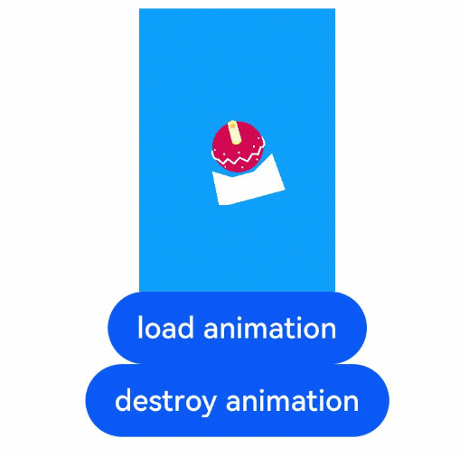

# Lottie

**Lottie** allows you to implement animation-specific operations.

> **NOTE**
> 
> The APIs of this module are supported since API version 8. Updates will be marked with a superscript to indicate their earliest API version.


## Modules to Import

```
import lottie from '@ohos/lottieETS'
```

> **NOTE**
>
> In the **Terminal** window, run the `npm install @ohos/lottieETS` command to download Lottie. The download requires the related permission.
>
> To install an OpenHarmony npm third-party package, run the `npm config set @ohos:registry=https://repo.harmonyos.com/npm/` command to set the repository address.


## lottie.loadAnimation

loadAnimation(

path: string, container: object, render: string, loop: boolean, autoplay: boolean, name: string ): AnimationItem

Loads an animation. Before calling this API, declare the **Animator('__lottie_ets')** object and check that the canvas layout is complete. This method can be used together with a lifecycle callback of the **Canvas** component, for example, **onAppear()** and **onPageShow()**.

**Parameters**

| Name            | Type                         | Mandatory  | Description                                      |
| -------------- | --------------------------- | ---- | ---------------------------------------- |
| path           | string                      | Yes   | Path of the animation resource file in the HAP file. The resource file must be in JSON format. Example: **path: "common/lottie/data.json"**|
| container      | object                      | Yes   | Canvas drawing context. A **CanvasRenderingContext2D** object must be declared in advance.|
| render         | string                      | Yes   | Rendering type. The value can only be **"canvas"**.                       |
| loop           | boolean \| number | No   | If the value is of the Boolean type, this parameter indicates whether to repeat the animation cyclically after the animation ends; the default value is **true**. If the value is of the number type and is greater than or equal to 1, this parameter indicates the number of times the animation plays.|
| autoplay       | boolean                     | No   | Whether to automatically play the animation.<br/>Default value: **true**                  |
| name           | string                      | No   | Custom animation name. In later versions, the name can be used to reference and control the animation.<br/>Default value: null |
| initialSegment | [number, number]       | No   | Start frame and end frame of the animation, respectively.                |


## lottie.destroy

destroy(name: string): void

Destroys the animation. This method must be called when a page exits. This method can be used together with a lifecycle callback of the **Canvas** component, for example, **onDisappear()** and **onPageHide()**.

**Parameters**

| Name  | Type    | Mandatory  | Description                                      |
| ---- | ------ | ---- | ---------------------------------------- |
| name | string | Yes   | Name of the animation to destroy, which is the same as the **name** in the **loadAnimation** interface. By default, all animations are destroyed.|

**Example** 
  ```ts
  // xxx.ets
  import lottie from '@ohos/lottieETS'

  @Entry
  @Component
  struct Index {
    private controller: CanvasRenderingContext2D = new CanvasRenderingContext2D()
    private animateName: string = "animate"
    private animatePath: string = "common/lottie/data.json"
    private animateItem: any = null

    onPageHide(): void {
      console.log('onPageHide')
      lottie.destroy()
    }

    build() {
      Flex({ direction: FlexDirection.Column, alignItems: ItemAlign.Center, justifyContent: FlexAlign.Center }) {
        Canvas(this.controller)
        .width('30%')
        .height('20%')
        .backgroundColor('#0D9FFB')
        .onReady(() => {
          console.log('canvas onAppear');
          this.animateItem = lottie.loadAnimation({
            container: this.controller,
            renderer: 'canvas',
            loop: true,
            autoplay: true,
            name: this.animateName,
            path: this.animatePath,
          })
        })

        Animator('__lottie_ets') // declare Animator('__lottie_ets') when use lottie
        Button('load animation')
          .onClick(() => {
          if (this.animateItem != null) {
            this.animateItem.destroy()
            this.animateItem = null
          }
          this.animateItem = lottie.loadAnimation({
            container: this.controller,
            renderer: 'canvas',
            loop: true,
            autoplay: true,
            name: this.animateName,
            path: this.animatePath,
            initialSegment: [10, 50],
          })
        })

        Button('destroy animation')
          .onClick(() => {
            lottie.destroy(this.animateName)
            this.animateItem = null
          })
      }
      .width('100%')
      .height('100%')
    }
  }
  ```

  


## lottie.play

play(name: string): void

Plays a specified animation.

**Parameters**

| Name  | Type    | Mandatory  | Description                                      |
| ---- | ------ | ---- | ---------------------------------------- |
| name | string | Yes   | Name of the animation to play, which is the same as the **name** in the **loadAnimation** interface. By default, all animations are played.|

**Example**

  ```ts
  lottie.play(this.animateName)
  ```


## lottie.pause

pause(name: string): void

Pauses a specified animation. The next time **lottie.play()** is called, the animation starts from the current frame.

**Parameters**

| Name  | Type    | Mandatory  | Description                                      |
| ---- | ------ | ---- | ---------------------------------------- |
| name | string | Yes   | Name of the animation to pause, which is the same as the **name** in the **loadAnimation** interface. By default, all animations are paused.|

**Example**

  ```ts
  lottie.pause(this.animateName)
  ```


## lottie.togglePause

togglePause(name: string): void

Pauses or plays a specified animation. This method is equivalent to the switching between **lottie.play()** and **lottie.pause()**.

**Parameters**

| Name  | Type    | Mandatory  | Description                                      |
| ---- | ------ | ---- | ---------------------------------------- |
| name | string | Yes   | Name of the target animation, which is the same as the **name** in the **loadAnimation** interface. By default, all animations are paused.|

**Example**

  ```ts
  lottie.togglePause(this.animateName)
  ```


## lottie.stop

stop(name: string): void

Stops the specified animation. The next time **lottie.play()** is called, the animation starts from the first frame.

**Parameters**

| Name  | Type    | Mandatory  | Description                                      |
| ---- | ------ | ---- | ---------------------------------------- |
| name | string | Yes   | Name of the target animation, which is the same as the **name** in the **loadAnimation** interface. By default, all animations are paused.|

**Example**

  ```ts
  lottie.stop(this.animateName)
  ```


## lottie.setSpeed

setSpeed(speed: number, name: string): void

Sets the playback speed of the specified animation.

**Parameters**

| Name   | Type    | Mandatory  | Description                                      |
| ----- | ------ | ---- | ---------------------------------------- |
| speed | number | Yes   | Playback speed. The value is a floating-point number. If the value is greater than 0, the animation plays in forward direction. If the value is less than 0, the animation plays in reversed direction. If the value is 0, the animation is paused. If the value is 1.0 or -1.0, the animation plays at the normal speed.|
| name  | string | Yes   | Name of the target animation, which is the same as the **name** in the **loadAnimation** interface. By default, all animations are stopped.|

**Example**

  ```ts
  lottie.setSpeed(5, this.animateName)
  ```


## lottie.setDirection

setDirection(direction: AnimationDirection, name: string): void

Sets the direction in which the specified animation plays.

**Parameters**

| Name       | Type                | Mandatory  | Description                                      |
| --------- | ------------------ | ---- | ---------------------------------------- |
| direction | AnimationDirection | Yes   | Direction in which the animation plays. **1**: forwards; **-1**: backwards. When set to play backwards, the animation plays from the current playback progress to the first frame. When this setting is combined with **loop** being set to **true**, the animation plays backwards continuously. When the value of **speed** is less than 0, the animation also plays backwards.<br>AnimationDirection: 1 \| -1 |
| name      | string             | Yes   | Name of the target animation, which is the same as the **name** in the **loadAnimation** interface. By default, all animations are set.|

**Example**

  ```ts
  lottie.setDirection(-1, this.animateName)
  ```


## AnimationItem

Defines an **AnimationItem** object, which is returned by the **loadAnimation** interface and has attributes and interfaces. The attributes are described as follows:

| Name             | Type                                    | Description                                    |
| ----------------- | ---------------------------------------- | ---------------------------------------- |
| name              | string                                   | Animation name.                                   |
| isLoaded          | boolean                                  | Whether the animation is loaded.                                |
| currentFrame      | number                                   | Frame that is being played. The default precision is a floating-point number greater than or equal to 0.0. After **setSubframe(false)** is called, the value is a positive integer without decimal points.|
| currentRawFrame   | number                                   | Number of frames that are being played. The precision is a floating point number greater than or equal to 0.0.           |
| firstFrame        | number                                   | First frame of the animation segment that is being played.                           |
| totalFrames       | number                                   | Total number of frames in the animation segment that is being played.                             |
| frameRate         | number                                   | Frame rate (frame/s).                      |
| frameMult         | number                                   | Frame rate (frame/ms).                     |
| playSpeed         | number                                   | Playback speed. The value is a floating-point number. If the value is greater than 0, the animation plays forward. If the value is less than 0, the animation plays backward. If the value is 0, the animation is paused.|If the value is **1.0** or **-1.0**, the animation plays at the normal speed.|
| playDirection     | number                                   | Playback direction. The options are **1** (forward) and **-1** (backward).            |
| playCount         | number                                   | Number of times the animation plays.                              |
| isPaused          | boolean                                  | Whether the current animation is paused. The value **true** means that the animation is paused.            |
| autoplay          | boolean                                  | Whether to automatically play the animation upon completion of the loading. The value **false** means that the **play()** interface needs to be called to start playing.|
| loop              | boolean \| number              | If the value is of the Boolean type, this parameter indicates whether to repeat the animation cyclically after the animation ends. If the value is of the number type and is greater than or equal to 1, this parameter indicates the number of times the animation plays. |
| renderer          | any                                      | Animation rendering object, which depends on the rendering type.                  |
| animationID       | string                                   | Animation ID.                                   |
| timeCompleted     | number                                   | Number of frames that are played for an animation sequence. The value is affected by the setting of **AnimationSegment** and is the same as the value of **totalFrames**.|
| segmentPos        | number                                   | ID of the current animation segment. The value is a positive integer greater than or equal to 0.            |
| isSubframeEnabled | boolean                                  | Whether the precision of **currentFrame** is a floating point number.               |
| segments          | AnimationSegment \| AnimationSegment[] | Current segment of the animation.                              |


## AnimationItem.play

play(name?: string): void

Plays an animation.

**Parameters**

| Name  | Type    | Mandatory  | Description             |
| ---- | ------ | ---- | --------------- |
| name | string | No   | Name of the target animation. By default, the value is null.|

**Example**

  ```ts
  this.animateItem.play()
  ```


## AnimationItem.destroy

destroy(name?: string): void

Destroys an animation.

**Parameters**

| Name  | Type    | Mandatory  | Description             |
| ---- | ------ | ---- | --------------- |
| name | string | No   | Name of the target animation. By default, the value is null.|

**Example**

  ```ts
  this.animateItem.destroy()
  ```


## AnimationItem.pause

pause(name?: string): void

Pauses an animation. When the **play** interface is called next time, the animation is played from the current frame.

**Parameters**

| Name  | Type    | Mandatory  | Description             |
| ---- | ------ | ---- | --------------- |
| name | string | No   | Name of the target animation. By default, the value is null.|

**Example**

  ```ts
  this.animateItem.pause()
  ```


## AnimationItem.togglePause

togglePause(name?: string): void

Pauses or plays an animation. This method is equivalent to the switching between **play** and **pause**.

**Parameters**

| Name  | Type    | Mandatory  | Description             |
| ---- | ------ | ---- | --------------- |
| name | string | No   | Name of the target animation. By default, the value is null.|

**Example**

  ```ts
  this.animateItem.togglePause()
  ```


## AnimationItem.stop

stop(name?: string): void

Stops an animation. When the **play** interface is called next time, the animation is played from the first frame.

**Parameters**

| Name  | Type    | Mandatory  | Description             |
| ---- | ------ | ---- | --------------- |
| name | string | No   | Name of the target animation. By default, the value is null.|

**Example**

  ```ts
  this.animateItem.stop()
  ```


## AnimationItem.setSpeed

setSpeed(speed: number): void

Sets the playback speed of an animation.

**Parameters**

| Name   | Type    | Mandatory  | Description                                      |
| ----- | ------ | ---- | ---------------------------------------- |
| speed | number | Yes   | Playback speed. The value is a floating-point number. If the value is greater than 0, the animation plays forward. If the value is less than 0, the animation plays backward. If the value is 0, the animation is paused.|If the value is **1.0** or **-1.0**, the animation plays at the normal speed.|

**Example**

  ```ts
  this.animateItem.setSpeed(5);
  ```


## AnimationItem.setDirection

setDirection(direction: AnimationDirection): void

Sets the playback direction of an animation.

**Parameters**

| Name       | Type                | Mandatory  | Description                                      |
| --------- | ------------------ | ---- | ---------------------------------------- |
| direction | AnimationDirection | Yes   | Direction in which the animation plays. **1**: forwards; **-1**: backwards. When set to play backwards, the animation plays from the current playback progress to the first frame. When this setting is combined with **loop** being set to **true**, the animation plays backwards continuously. When the value of **speed** is less than 0, the animation also plays backwards.<br>AnimationDirection: 1 \| -1.|

**Example**

  ```ts
  this.animateItem.setDirection(-1)
  ```


## AnimationItem.goToAndStop

goToAndStop(value: number, isFrame?: boolean): void

Sets the animation to stop at the specified frame or time.

**Parameters**

| Name     | Type     | Mandatory  | Description                                      |
| ------- | ------- | ---- | ---------------------------------------- |
| value   | number  | Yes   | Frame ID (greater than or equal to 0) or time progress (ms) at which the animation will stop.                    |
| isFrame | boolean | No   | Whether to set the animation to stop at the specified frame. The value **true** means to set the animation to stop at the specified frame, and **false** means to set the animation to stop at the specified time progress.<br/>Default value: **false** |
| name    | string  | No   | Name of the target animation. By default, the value is null.                         |

**Example**

  ```ts
  // Set the animation to stop at the specified frame.
  this.animateItem.goToAndStop(25, true)
  // Set the animation to stop at the specified time progress.
  this.animateItem.goToAndStop(300, false, this.animateName)
  ```


## AnimationItem.goToAndPlay

goToAndPlay(value: number, isFrame: boolean, name?: string): void

Sets the animation to start from the specified frame or time progress.

**Parameters**

| Name     | Type     | Mandatory  | Description                                      |
| ------- | ------- | ---- | ---------------------------------------- |
| value   | number  | Yes   | Frame ID (greater than or equal to 0) or time progress (ms) at which the animation will start.                     |
| isFrame | boolean | Yes   | Whether to set the animation to start from the specified frame. The value **true** means to set the animation to start from the specified frame, and **false** means to set the animation to start from the specified time progress.<br>Default value: **false** |
| name    | string  | No   | Name of the target animation. By default, the value is null.                         |

**Example**

  ```ts
  // Set the animation to stop at the specified frame.
  this.animateItem.goToAndPlay(25, true)
  // Set the animation to stop at the specified time progress.
  this.animateItem.goToAndPlay(300, false, this.animateName)
  ```


## AnimationItem.playSegments

playSegments(segments: AnimationSegment | AnimationSegment[], forceFlag: boolean): void

Sets the animation to play only the specified segment.

**Parameters**

| Name       | Type                                      | Mandatory  | Description                                      |
| --------- | ---------------------------------------- | ---- | ---------------------------------------- |
| segments  | AnimationSegment = [number, number] \| AnimationSegment[] | Yes   | Segment or segment list.<br>If all segments in the segment list are played, only the last segment is played in the next cycle.|
| forceFlag | boolean                                  | Yes   | Whether the settings take effect immediately. The value **true** means the settings take effect immediately, and **false** means the settings take effect until the current cycle of playback is completed.          |

**Example**

  ```ts
  // Set the animation to play the specified segment.
  this.animateItem.playSegments([10, 20], false)
  // Set the animation to play the specified segment list.
  this.animateItem.playSegments([[0, 5], [20, 30]], true)
  ```


## AnimationItem.resetSegments

resetSegments(forceFlag: boolean): void

Resets the settings configured by the **playSegments** method to play all the frames.

**Parameters**

| Name       | Type     | Mandatory  | Description                            |
| --------- | ------- | ---- | ------------------------------ |
| forceFlag | boolean | Yes   | Whether the settings take effect immediately. The value **true** means the settings take effect immediately, and **false** means the settings take effect until the current cycle of playback is completed.|

**Example**

  ```ts
  this.animateItem.resetSegments(true)
  ```


## AnimationItem.resize

resize(): void

Resizes the animation layout.

**Example**

  ```ts
  this.animateItem.resize()
  ```


## AnimationItem.setSubframe

setSubframe(useSubFrame: boolean): void

Sets the precision of the **currentFrame** attribute to display floating-point numbers.

**Parameters**

| Name          | Type     | Mandatory  | Description                                      |
| ------------ | ------- | ---- | ---------------------------------------- |
| useSubFrames | boolean | Yes   | Whether the **currentFrame** attribute displays floating-point numbers. By default, the attribute displays floating-point numbers.<br>**true**: The **currentFrame** attribute displays floating-point numbers.<br>**false**: The **currentFrame** attribute displays an integer and does not display floating-point numbers.|

**Example**

  ```ts
  this.animateItem.setSubframe(false)
  ```


## AnimationItem.getDuration

getDuration(inFrames?: boolean): void

Obtains the duration (irrelevant to the playback speed) or number of frames for playing an animation sequence. The settings are related to the input parameter **initialSegment** of the **Lottie.loadAnimation** interface.

**Parameters**

| Name      | Type     | Mandatory  | Description                                      |
| -------- | ------- | ---- | ---------------------------------------- |
| inFrames | boolean | No   | Whether to obtain the duration or number of frames.<br>**true**: number of frames.<br>**false**: duration, in ms.<br/>Default value: **false** |

**Example**

  ```ts
  this.animateItem.getDuration(true)
  ```


## AnimationItem.addEventListener

addEventListener&lt;T = any&gt;(name: AnimationEventName, callback: AnimationEventCallback&lt;T&gt;): () =&gt; void

Adds an event listener. After the event is complete, the specified callback function is triggered. This method returns the function object that can delete the event listener.

**Parameters**

| Name      | Type                             | Mandatory  | Description                                      |
| -------- | ------------------------------- | ---- | ---------------------------------------- |
| name     | AnimationEventName              | Yes   | Animation event type. The available options are as follows:<br>'enterFrame', 'loopComplete', 'complete', 'segmentStart', 'destroy', 'config_ready', 'data_ready', 'DOMLoaded', 'error', 'data_failed', 'loaded_images'|
| callback | AnimationEventCallback&lt;T&gt; | Yes   | Custom callback.                               |

**Example**

  ```ts
  private callbackItem: any = function() {
      console.log("grunt loopComplete")
  }
  let delFunction = this.animateItem.addEventListener('loopComplete', this.animateName)

  // Delete the event listener.
  delFunction()
  ```


## AnimationItem.removeEventListener

removeEventListener&lt;T = any&gt;(name: AnimationEventName, callback?: AnimationEventCallback&lt;T&gt;): void

Removes an event listener.

**Parameters**

| Name      | Type                             | Mandatory  | Description                                      |
| -------- | ------------------------------- | ---- | ---------------------------------------- |
| name     | AnimationEventName              | Yes   | Animation event type. The available options are as follows:<br>'enterFrame', 'loopComplete', 'complete', 'segmentStart', 'destroy', 'config_ready', 'data_ready', 'DOMLoaded', 'error', 'data_failed', 'loaded_images'|
| callback | AnimationEventCallback&lt;T&gt; | No   | Custom callback. By default, the value is null, meaning that all callbacks of the event will be removed.           |

**Example**

  ```ts
  this.animateItem.removeEventListener('loopComplete', this.animateName)
  ```


## AnimationItem.triggerEvent

triggerEvent&lt;T = any&gt;(name: AnimationEventName, args: T): void

Directly triggers all configured callbacks of a specified event.

**Parameters**

| Name  | Type                | Mandatory  | Description       |
| ---- | ------------------ | ---- | --------- |
| name | AnimationEventName | Yes   | Animation event type. |
| args | any                | Yes   | Custom callback parameters.|

**Example**

  ```ts
  private triggerCallBack: any = function(item) {
      console.log("trigger loopComplete, name:" + item.name)
  }

  this.animateItem.addEventListener('loopComplete', this.triggerCallBack)
  this.animateItem.triggerEvent('loopComplete', this.animateItem)
  this.animateItem.removeEventListener('loopComplete', this.triggerCallBack)
  ```
