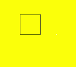
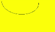
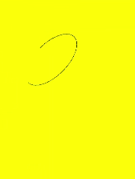

# Path2D


>  **NOTE：**
> This component is supported since API version 8. Updates will be marked with a superscript to indicate their earliest API version.


**Path2D** allows you to describe a path through an existing path. This path can be drawn through the **stroke** API of **Canvas**.


## addPath

addPath(path: Object): void

Adds a path to this path.

- Parameters
    | Name | Type | Mandatory | Default&nbsp;Value | Description | 
  | -------- | -------- | -------- | -------- | -------- |
  | path | Object | Yes | null | Path&nbsp;to&nbsp;be&nbsp;added&nbsp;to&nbsp;this&nbsp;path. | 

- Example
    
  ```
  @Entry
  @Component
  struct AddPath {
    private settings: RenderingContextSettings = new RenderingContextSettings(true)
    private context: CanvasRenderingContext2D = new CanvasRenderingContext2D(this.settings)
  
    private path2Da: Path2D = new Path2D("M250 150 L150 350 L350 350 Z")
    private path2Db: Path2D = new Path2D()
  
    build() {
      Flex({ direction: FlexDirection.Column, alignItems: ItemAlign.Center, justifyContent: FlexAlign.Center }) {
        Canvas(this.context)
          .width('100%')
          .height('100%')
          .backgroundColor('#ffff00')
          .onReady(() =>{
            this.path2Db.addPath(this.path2Da)
            this.context.stroke(this.path2Db)
          })
      }
      .width('100%')
      .height('100%')
    }
  }
  ```

  


## closePath

closePath(): void

Moves the current point of the path back to the start point of the path, and draws a straight line between the current point and the start point. If the shape has already been closed or has only one point, this method does nothing.

- Example
    
  ```
  @Entry
  @Component
  struct ClosePath {
    private settings: RenderingContextSettings = new RenderingContextSettings(true)
    private context: CanvasRenderingContext2D = new CanvasRenderingContext2D(this.settings)
    private path2Db: Path2D = new Path2D()
  
    build() {
      Flex({ direction: FlexDirection.Column, alignItems: ItemAlign.Center, justifyContent: FlexAlign.Center }) {
        Canvas(this.context)
          .width('100%')
          .height('100%')
          .backgroundColor('#ffff00')
          .onReady(() =>{
            this.path2Db.moveTo(200, 100)
            this.path2Db.lineTo(300, 100)
            this.path2Db.lineTo(200, 200)
            this.path2Db.closePath()
            this.context.stroke(this.path2Db)
          })
      }
      .width('100%')
      .height('100%')
    }
  }
  ```

  


## moveTo

moveTo(x: number, y: number): void

Moves the current coordinate point of the path to the target point, without drawing a line during the movement.

- Parameters
    | Name | Type | Mandatory | Default&nbsp;Value | Description | 
  | -------- | -------- | -------- | -------- | -------- |
  | x | number | Yes | 0 | X-coordinate&nbsp;of&nbsp;the&nbsp;target&nbsp;point. | 
  | y | number | Yes | 0 | Y-coordinate&nbsp;of&nbsp;the&nbsp;target&nbsp;point. | 

- Example
    
  ```
  @Entry
  @Component
  struct MoveTo {
    private settings: RenderingContextSettings = new RenderingContextSettings(true)
    private context: CanvasRenderingContext2D = new CanvasRenderingContext2D(this.settings)
    private path2Db: Path2D = new Path2D()
  
    build() {
      Flex({ direction: FlexDirection.Column, alignItems: ItemAlign.Center, justifyContent: FlexAlign.Center }) {
        Canvas(this.context)
          .width('100%')
          .height('100%')
          .backgroundColor('#ffff00')
          .onReady(() =>{
            this.path2Db.moveTo(50, 100)
            this.path2Db.lineTo(250, 100)
            this.path2Db.lineTo(150, 200)
            this.path2Db.closePath()
            this.context.stroke(this.path2Db)
          })
      }
      .width('100%')
      .height('100%')
    }
  }
  ```

  


## lineTo

lineTo(x: number, y: number): void

Draws a straight line from the current point to the target point.

- Parameters
    | Name | Type | Mandatory | Default&nbsp;Value | Description | 
  | -------- | -------- | -------- | -------- | -------- |
  | x | number | Yes | 0 | X-coordinate&nbsp;of&nbsp;the&nbsp;target&nbsp;point. | 
  | y | number | Yes | 0 | Y-coordinate&nbsp;of&nbsp;the&nbsp;target&nbsp;point. | 

- Example
    
  ```
  @Entry
  @Component
  struct LineTo {
    private settings: RenderingContextSettings = new RenderingContextSettings(true)
    private context: CanvasRenderingContext2D = new CanvasRenderingContext2D(this.settings)
    private path2Db: Path2D = new Path2D()
  
    build() {
      Flex({ direction: FlexDirection.Column, alignItems: ItemAlign.Center, justifyContent: FlexAlign.Center }) {
        Canvas(this.context)
          .width('100%')
          .height('100%')
          .backgroundColor('#ffff00')
          .onReady(() =>{
            this.path2Db.moveTo(100, 100)
            this.path2Db.lineTo(100, 200)
            this.path2Db.lineTo(200, 200)
            this.path2Db.lineTo(200, 100)
            this.path2Db.closePath()
            this.context.stroke(this.path2Db)
          })
      }
      .width('100%')
      .height('100%')
    }
  }
  ```

  


## bezierCurveTo

bezierCurveTo(cp1x: number, cp1y: number, cp2x: number, cp2y: number, x: number, y: number): void

Draws a cubic bezier curve on the canvas.

- Parameters
    | Name | Type | Mandatory | Default&nbsp;Value | Description | 
  | -------- | -------- | -------- | -------- | -------- |
  | cp1x | number | Yes | 0 | X-coordinate&nbsp;of&nbsp;the&nbsp;first&nbsp;parameter&nbsp;of&nbsp;the&nbsp;bezier&nbsp;curve. | 
  | cp1y | number | Yes | 0 | Y-coordinate&nbsp;of&nbsp;the&nbsp;first&nbsp;parameter&nbsp;of&nbsp;the&nbsp;bezier&nbsp;curve. | 
  | cp2x | number | Yes | 0 | X-coordinate&nbsp;of&nbsp;the&nbsp;second&nbsp;parameter&nbsp;of&nbsp;the&nbsp;bezier&nbsp;curve. | 
  | cp2y | number | Yes | 0 | Y-coordinate&nbsp;of&nbsp;the&nbsp;second&nbsp;parameter&nbsp;of&nbsp;the&nbsp;bezier&nbsp;curve. | 
  | x | number | Yes | 0 | X-coordinate&nbsp;of&nbsp;the&nbsp;end&nbsp;point&nbsp;on&nbsp;the&nbsp;bezier&nbsp;curve. | 
  | y | number | Yes | 0 | Y-coordinate&nbsp;of&nbsp;the&nbsp;end&nbsp;point&nbsp;on&nbsp;the&nbsp;bezier&nbsp;curve. | 

- Example
    
  ```
  @Entry
  @Component
  struct BezierCurveTo {
    private settings: RenderingContextSettings = new RenderingContextSettings(true)
    private context: CanvasRenderingContext2D = new CanvasRenderingContext2D(this.settings)
    private path2Db: Path2D = new Path2D()
  
    build() {
      Flex({ direction: FlexDirection.Column, alignItems: ItemAlign.Center, justifyContent: FlexAlign.Center }) {
        Canvas(this.context)
          .width('100%')
          .height('100%')
          .backgroundColor('#ffff00')
          .onReady(() =>{
            this.path2Db.moveTo(10, 10)
            this.path2Db.bezierCurveTo(20, 100, 200, 100, 200, 20);this.context.stroke(this.path2Db)
          })
      }
      .width('100%')
      .height('100%')
    }
  }
  ```

  


## quadraticCurveTo

quadraticCurveTo(cpx: number, cpy: number, x: number ,y: number): void

Draws a quadratic curve on the canvas.

- Parameters
    | Name | Type | Mandatory | Default&nbsp;Value | Description | 
  | -------- | -------- | -------- | -------- | -------- |
  | cpx | number | Yes | 0 | X-coordinate&nbsp;of&nbsp;the&nbsp;bezier&nbsp;curve&nbsp;parameter. | 
  | cpy | number | Yes | 0 | Y-coordinate&nbsp;of&nbsp;the&nbsp;bezier&nbsp;curve&nbsp;parameter. | 
  | x | number | Yes | 0 | X-coordinate&nbsp;of&nbsp;the&nbsp;end&nbsp;point&nbsp;on&nbsp;the&nbsp;bezier&nbsp;curve. | 
  | y | number | Yes | 0 | Y-coordinate&nbsp;of&nbsp;the&nbsp;end&nbsp;point&nbsp;on&nbsp;the&nbsp;bezier&nbsp;curve. | 

- Example
    
  ```
  @Entry
  @Component
  struct QuadraticCurveTo {
    private settings: RenderingContextSettings = new RenderingContextSettings(true)
    private context: CanvasRenderingContext2D = new CanvasRenderingContext2D(this.settings)
    private path2Db: Path2D = new Path2D()
  
    build() {
      Flex({ direction: FlexDirection.Column, alignItems: ItemAlign.Center, justifyContent: FlexAlign.Center }) {
        Canvas(this.context)
          .width('100%')
          .height('100%')
          .backgroundColor('#ffff00')
          .onReady(() =>{
            this.path2Db.moveTo(10, 10)
            this.path2Db.quadraticCurveTo(100, 100, 200, 20)
            this.context.stroke(this.path2Db)
        })
      }
      .width('100%')
      .height('100%')
    }
  }
  ```

  


## arc

arc(x: number, y: number, radius: number, startAngle: number, endAngle: number, anticlockwise?: number): void

Draws an arc on the canvas.

- Parameters
    | Name | Type | Mandatory | Default&nbsp;Value | Description | 
  | -------- | -------- | -------- | -------- | -------- |
  | x | number | Yes | 0 | X-coordinate&nbsp;of&nbsp;the&nbsp;center&nbsp;point&nbsp;of&nbsp;the&nbsp;arc. | 
  | y | number | Yes | 0 | Y-coordinate&nbsp;of&nbsp;the&nbsp;center&nbsp;point&nbsp;of&nbsp;the&nbsp;arc. | 
  | radius | number | Yes | 0 | Radius&nbsp;of&nbsp;the&nbsp;arc. | 
  | startAngle | number | Yes | 0 | Start&nbsp;radian&nbsp;of&nbsp;the&nbsp;arc. | 
  | endAngle | number | Yes | 0 | End&nbsp;radian&nbsp;of&nbsp;the&nbsp;arc. | 
  | anticlockwise | boolean | No | false | Whether&nbsp;to&nbsp;draw&nbsp;the&nbsp;arc&nbsp;counterclockwise. | 

- Example
    
  ```
  @Entry
  @Component
  struct Arc {
    private settings: RenderingContextSettings = new RenderingContextSettings(true)
    private context: CanvasRenderingContext2D = new CanvasRenderingContext2D(this.settings)
    private path2Db: Path2D = new Path2D()
  
    build() {
      Flex({ direction: FlexDirection.Column, alignItems: ItemAlign.Center, justifyContent: FlexAlign.Center }) {
        Canvas(this.context)
          .width('100%')
          .height('100%')
          .backgroundColor('#ffff00')
          .onReady(() =>{
            this.path2Db.arc(100, 75, 50, 0, 6.28);this.context.stroke(this.path2Db)
          })
      }
      .width('100%')
      .height('100%')
    }
  }
  ```

  


## arcTo

arcTo(x1: number, y1: number, x2: number, y2: number, radius: number): void

Draws an arc based on the radius and points on the arc.

- Parameters
    | Name | Type | Mandatory | Default&nbsp;Value | Description | 
  | -------- | -------- | -------- | -------- | -------- |
  | x1 | number | Yes | 0 | X-coordinate&nbsp;of&nbsp;the&nbsp;first&nbsp;point&nbsp;on&nbsp;the&nbsp;arc. | 
  | y1 | number | Yes | 0 | Y-coordinate&nbsp;of&nbsp;the&nbsp;first&nbsp;point&nbsp;on&nbsp;the&nbsp;arc. | 
  | x2 | number | Yes | 0 | X-coordinate&nbsp;of&nbsp;the&nbsp;second&nbsp;point&nbsp;on&nbsp;the&nbsp;arc. | 
  | y2 | number | Yes | 0 | Y-coordinate&nbsp;of&nbsp;the&nbsp;second&nbsp;point&nbsp;on&nbsp;the&nbsp;arc. | 
  | radius | number | Yes | 0 | Radius&nbsp;of&nbsp;the&nbsp;arc. | 

- Example
    
  ```
  @Entry
  @Component
  struct ArcTo {
    private settings: RenderingContextSettings = new RenderingContextSettings(true)
    private context: CanvasRenderingContext2D = new CanvasRenderingContext2D(this.settings)
    private path2Db: Path2D = new Path2D()
  
    build() {
      Flex({ direction: FlexDirection.Column, alignItems: ItemAlign.Center, justifyContent: FlexAlign.Center }) {
        Canvas(this.context)
          .width('100%')
          .height('100%')
          .backgroundColor('#ffff00')
          .onReady(() =>{
            this.path2Db.arcTo(150, 20, 150, 70, 50)
            this.context.stroke(this.path2Db)
          })
      }
      .width('100%')
      .height('100%')
    }
  }
  ```

  


## ellipse

ellipse(x: number, y: number, radiusX: number, radiusY: number, rotation: number, startAngle: number, endAngle: number, anticlockwise?: number): void

Draws an ellipse in the specified rectangular region.

- Parameters
    | Name | Type | Mandatory | Default&nbsp;Value | Description | 
  | -------- | -------- | -------- | -------- | -------- |
  | x | number | Yes | 0 | X-coordinate&nbsp;of&nbsp;the&nbsp;ellipse&nbsp;center. | 
  | y | number | Yes | 0 | Y-coordinate&nbsp;of&nbsp;the&nbsp;ellipse&nbsp;center. | 
  | radiusX | number | Yes | 0 | Ellipse&nbsp;radius&nbsp;on&nbsp;the&nbsp;x-axis. | 
  | radiusY | number | Yes | 0 | Ellipse&nbsp;radius&nbsp;on&nbsp;the&nbsp;y-axis. | 
  | rotation | number | Yes | 0 | Rotation&nbsp;angle&nbsp;of&nbsp;the&nbsp;ellipse,&nbsp;in&nbsp;radians. | 
  | startAngle | number | Yes | 0 | Angle&nbsp;of&nbsp;the&nbsp;start&nbsp;point&nbsp;for&nbsp;drawing&nbsp;the&nbsp;ellipse,&nbsp;in&nbsp;radians. | 
  | endAngle | number | Yes | 0 | Angle&nbsp;of&nbsp;the&nbsp;end&nbsp;point&nbsp;for&nbsp;drawing&nbsp;the&nbsp;ellipse,&nbsp;in&nbsp;radians. | 
  | anticlockwise | number | No | 0 | Whether&nbsp;to&nbsp;draw&nbsp;the&nbsp;ellipse&nbsp;in&nbsp;the&nbsp;counterclockwise&nbsp;direction.&nbsp;The&nbsp;value&nbsp;**0**&nbsp;means&nbsp;to&nbsp;draw&nbsp;the&nbsp;ellipse&nbsp;in&nbsp;the&nbsp;clockwise&nbsp;direction,&nbsp;and&nbsp;**1**&nbsp;means&nbsp;to&nbsp;draw&nbsp;the&nbsp;ellipse&nbsp;in&nbsp;the&nbsp;counterclockwise&nbsp;direction.&nbsp;This&nbsp;parameter&nbsp;is&nbsp;optional.&nbsp;The&nbsp;default&nbsp;value&nbsp;is&nbsp;**0**. | 

- Example
    
  ```
  @Entry
  @Component
  struct CanvasExample {
    private settings: RenderingContextSettings = new RenderingContextSettings(true)
    private context: CanvasRenderingContext2D = new CanvasRenderingContext2D(this.settings)
    private path2Db: Path2D = new Path2D()
  
    build() {
      Flex({ direction: FlexDirection.Column, alignItems: ItemAlign.Center, justifyContent: FlexAlign.Center }) {
        Canvas(this.context)
          .width('100%')
          .height('100%')
          .backgroundColor('#ffff00')
          .onReady(() =>{
            this.path2Db.ellipse(200, 200, 50, 100, Math.PI * 0.25, Math.PI * 0.5, Math.PI)
            this.context.stroke(this.path2Db)
          })
      }
      .width('100%')
      .height('100%')
    }
  }
  ```

  


## rect

rect(x: number, y: number, width: number, height: number): void

Creates a rectangle.

- Parameters
    | Name | Type | Mandatory | Default&nbsp;Value | Description | 
  | -------- | -------- | -------- | -------- | -------- |
  | x | number | Yes | 0 | X-coordinate&nbsp;of&nbsp;the&nbsp;upper&nbsp;left&nbsp;corner&nbsp;of&nbsp;the&nbsp;rectangle. | 
  | y | number | Yes | 0 | Y-coordinate&nbsp;of&nbsp;the&nbsp;upper&nbsp;left&nbsp;corner&nbsp;of&nbsp;the&nbsp;rectangle. | 
  | width | number | Yes | 0 | Width&nbsp;of&nbsp;the&nbsp;rectangle. | 
  | height | number | Yes | 0 | Height&nbsp;of&nbsp;the&nbsp;rectangle. | 

- Example
    
  ```
  @Entry
  @Component
  struct CanvasExample {
    private settings: RenderingContextSettings = new RenderingContextSettings(true)
    private context: CanvasRenderingContext2D = new CanvasRenderingContext2D(this.settings)
    private path2Db: Path2D = new Path2D()
  
    build() {
      Flex({ direction: FlexDirection.Column, alignItems: ItemAlign.Center, justifyContent: FlexAlign.Center }) {
        Canvas(this.context)
          .width('100%')
          .height('100%')
          .backgroundColor('#ffff00')
          .onReady(() =>{
            this.path2Db.rect(20, 20, 100, 100);this.context.stroke(this.path2Db)
          })
      }
      .width('100%')
      .height('100%')
    }
  }
  ```

  
