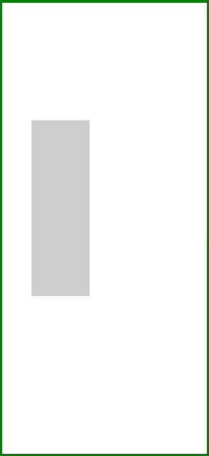

#  OffscreenCanvas

**OffscreenCanvas** provides an offscreen canvas for drawing.

When using [Canvas](ts-components-canvas-canvas.md) or [Canvas API](ts-canvasrenderingcontext2d.md), rendering, animations, and user interactions generally occur on the main thread of an application. The computation relating to canvas animations and rendering may affect application performance. **OffscreenCanvas** allows for rendering off the screen. This means that some tasks can be run in a separate thread to reduce the load on the main thread.

> **NOTE**
>
> The APIs of this module are supported since API version 8. Updates will be marked with a superscript to indicate their earliest API version.

## Child Components

Not supported

## APIs

OffscreenCanvas(width: number, height: number)

Since API version 9, this API is supported in ArkTS widgets.

**Parameters**

| Name| Type| Mandatory| Default Value| Description                             |
| ------ | -------- | ---- | ------ | ------------------------------------- |
| width  | number   | Yes  | 0      | Width of the offscreen canvas, in vp.|
| height | number   | Yes  | 0      | Height of the offscreen canvas, in vp.|

## Attributes

In addition to the [universal attributes](ts-universal-attributes-size.md), the following attributes are supported.

| Name  | Type  | Default Value| Description                                                        |
| ------ | ------ | ------ | ------------------------------------------------------------ |
| width  | number | 0      | Width of the offscreen canvas, in vp. Since API version 9, this API is supported in ArkTS widgets.|
| height | number | 0      | Height of the offscreen canvas, in vp. Since API version 9, this API is supported in ArkTS widgets.|

### width

```ts
// xxx.ets
@Entry
@Component
struct OffscreenCanvasPage {
  private settings: RenderingContextSettings = new RenderingContextSettings(true);
  private context: CanvasRenderingContext2D = new CanvasRenderingContext2D(this.settings);
  private offCanvas: OffscreenCanvas = new OffscreenCanvas(200, 300)

  build() {
    Flex({ direction: FlexDirection.Row, alignItems: ItemAlign.Start, justifyContent: FlexAlign.Start }) {
      Column() {
        Canvas(this.context)
          .width('100%')
          .height('100%')
          .borderWidth(5)
          .borderColor('#00FF00')
          .backgroundColor('#FFFFFF')
          .onReady(() => {
            var offContext = this.offCanvas.getContext("2d", this.settings)
            offContext.fillStyle = '#CDCDCD'
            offContext.fillRect(0, 0, this.offCanvas.width, 150)
            var image = this.offCanvas.transferToImageBitmap()
            this.context.setTransform(1, 0, 0, 1, 50, 200)
            this.context.transferFromImageBitmap(image)
          })
      }
    }.width('100%').height('100%')
  }
}
```


### height

```ts
// xxx.ets
@Entry
@Component
struct OffscreenCanvasPage {
  private settings: RenderingContextSettings = new RenderingContextSettings(true);
  private context: CanvasRenderingContext2D = new CanvasRenderingContext2D(this.settings);
  private offCanvas: OffscreenCanvas = new OffscreenCanvas(200, 300)

  build() {
    Flex({ direction: FlexDirection.Row, alignItems: ItemAlign.Start, justifyContent: FlexAlign.Start }) {
      Column() {
        Canvas(this.context)
          .width('100%')
          .height('100%')
          .borderWidth(5)
          .borderColor('#00FF00')
          .backgroundColor('#FFFFFF')
          .onReady(() => {
            var offContext = this.offCanvas.getContext("2d", this.settings)
            offContext.fillStyle = '#CDCDCD'
            offContext.fillRect(0, 0, 100, this.offCanvas.height)
            var image = this.offCanvas.transferToImageBitmap()
            this.context.setTransform(1, 0, 0, 1, 50, 200)
            this.context.transferFromImageBitmap(image)
          })
      }
    }.width('100%').height('100%')
  }
}
```



## Methods

### transferToImageBitmap

transferToImageBitmap(): ImageBitmap

Creates an **ImageBitmap** object from the most recently rendered image of the offscreen canvas.

Since API version 9, this API is supported in ArkTS widgets.

**Return value**

| Type                                              | Description                   |
| -------------------------------------------------- | ----------------------- |
| [ImageBitmap](ts-components-canvas-imagebitmap.md) | **ImageBitmap** object created.|

**Example**

```ts
// xxx.ets
@Entry
@Component
struct OffscreenCanvasPage {
  private settings: RenderingContextSettings = new RenderingContextSettings(true)
  private context: CanvasRenderingContext2D = new CanvasRenderingContext2D(this.settings)
  private offCanvas: OffscreenCanvas = new OffscreenCanvas(300, 500)

  build() {
    Flex({ direction: FlexDirection.Column, alignItems: ItemAlign.Center, justifyContent: FlexAlign.Center }) {
      Canvas(this.context)
        .width('100%')
        .height('100%')
        .borderWidth(5)
        .borderColor('#00FF00')
        .backgroundColor('#FFFFFF')
        .onReady(() => {
          var offContext = this.offCanvas.getContext("2d", this.settings)
          offContext.fillStyle = '#CDCDCD'
          offContext.fillRect(0, 0, 300, 500)
          offContext.fillStyle = '#000000'
          offContext.font = '70px serif bold'
          offContext.fillText("Offscreen : Hello World!", 20, 60)
          var image = this.offCanvas.transferToImageBitmap()
          this.context.transferFromImageBitmap(image)
        })
    }
    .width('100%')
    .height('100%')
  }
}
```


### getContext<sup>10+</sup>

getContext(contextType: "2d", option?: RenderingContextSettings): OffscreenCanvasRenderingContext2D

Obtains the drawing context of the offscreen canvas.

**Parameters**

| Name       | Type                                                        | Mandatory| Default Value| Description                                                        |
| ----------- | ------------------------------------------------------------ | ---- | ------ | ------------------------------------------------------------ |
| contextType | string                                                       | Yes  | "2d"   | Type of the drawing context of the offscreen canvas. The value can only be **"2d"**.                      |
| option      | [RenderingContextSettings](ts-canvasrenderingcontext2d.md#renderingcontextsettings) | No  | -      | For details, see [RenderingContextSettings](ts-canvasrenderingcontext2d.md#renderingcontextsettings).|

**Return value**

| Type                                                        | Description                             |
| ------------------------------------------------------------ | --------------------------------- |
| [OffscreenCanvasRenderingContext2D](ts-offscreencanvasrenderingcontext2d.md) | Drawing context of the offscreen canvas. If **contextType** in **getContext** is set to a value other than **"2d"** (including **null** and **undefined**), **null** is returned.|

**Example**

```ts
@Entry
@Component
struct OffscreenCanvasExamplePage {
  private settings: RenderingContextSettings = new RenderingContextSettings(true);
  private context: CanvasRenderingContext2D = new CanvasRenderingContext2D(this.settings);
  private offscreenCanvas: OffscreenCanvas = new OffscreenCanvas(600, 800)

  build() {
    Flex({ direction: FlexDirection.Row, alignItems: ItemAlign.Start, justifyContent: FlexAlign.Start }) {
      Column() {
        Canvas(this.context)
          .width('100%')
          .height('100%')
          .backgroundColor('#FFFFFF')
          .onReady(() => {
            var offContext = this.offscreenCanvas.getContext("2d", this.settings)
            offContext.font = '70px sans-serif'
            offContext.fillText("Offscreen : Hello World!", 20, 60)
            offContext.fillStyle = "#0000ff"
            offContext.fillRect(230, 350, 50, 50)
            offContext.fillStyle = "#EE0077"
            offContext.translate(70, 70)
            offContext.fillRect(230, 350, 50, 50)
            offContext.fillStyle = "#77EE0077"
            offContext.translate(-70, -70)
            offContext.fillStyle = "#00ffff"
            offContext.rotate(45 * Math.PI / 180);
            offContext.fillRect(180, 120, 50, 50);
            offContext.rotate(-45 * Math.PI / 180);
            offContext.beginPath()
            offContext.moveTo(10, 150)
            offContext.bezierCurveTo(20, 100, 200, 100, 200, 20)
            offContext.stroke()
            offContext.fillStyle = '#FF00FF'
            offContext.fillRect(100, 100, 60, 60)
            var imageData = this.offscreenCanvas.transferToImageBitmap()
            this.context.transferFromImageBitmap(imageData)
          })
      }.width('100%').height('100%')
    }
    .width('100%')
    .height('100%')
  }
}
```


